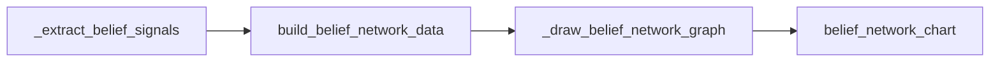

# 分析工具库文档

> **文档状态**: 2026-02-10 创建  
> **关联源码**: `utils/analysis_tools/` 目录（5 个模块 + 注册表）  
> **上级文档**: [系统设计总览](design.md)

---

## 1. 概述

### 1.1 定位

`utils/analysis_tools/` 是阶段 2 的核心执行层，负责对增强后的博文数据进行**统计计算**和**可视化图表生成**。

### 1.2 模块结构

```
utils/analysis_tools/
├── __init__.py              # 统一导出接口
├── tool_registry.py         # 工具注册表（Agent 模式使用）
├── sentiment_tools.py       # 情感趋势分析（936 行，9 个工具）
├── topic_tools.py           # 主题演化分析（905 行，9 个工具）
├── geographic_tools.py      # 地理分布分析（625 行，8 个工具）
├── interaction_tools.py     # 多维交互分析（865 行，10 个工具）
└── belief_tools.py          # 信念系统分析（336 行，1 个工具）
```

### 1.3 输出规范

| 工具类型 | 输出 | 返回结构 |
|:---|:---|:---|
| **Data 类** (`*_stats`, `*_analysis`, `*_series`) | 内存数据 | `{"data": {...}, "summary": "..."}` |
| **Chart 类** (`*_chart`, `*_heatmap`) | PNG 图表文件 | `{"charts": [{id, title, path, type, ...}], "data": {...}}` |

- 所有图表默认输出到 `report/images/`
- 文件名格式：`{tool_name}_{timestamp}.png`（时间戳避免覆盖）
- 可视化使用 matplotlib，中文字体配置为 `SimHei` / `Microsoft YaHei`

### 1.4 使用方式

**直接导入调用**：
```python
from utils.analysis_tools import sentiment_trend_chart
result = sentiment_trend_chart(blog_data, granularity="day")
```

**通过注册表调用**（Agent 模式）：
```python
from utils.analysis_tools import execute_tool
result = execute_tool("sentiment_trend_chart", blog_data, granularity="day")
```

---

## 2. 工具注册表 `tool_registry.py`

### 2.1 注册表结构

`TOOL_REGISTRY` 是一个 `Dict[str, Dict[str, Any]]`，每个工具的注册项包含：

```python
"tool_name": {
    "name": "tool_name",                    # 工具名称
    "category": "情感趋势分析",              # 所属类别
    "description": "...",                    # 功能描述
    "function": tool_function,              # 可调用的函数引用
    "parameters": {                         # 参数定义
        "blog_data": {"type": "list", "description": "...", "required": True},
        "granularity": {"type": "string", "description": "...", "required": False, "default": "hour"}
    },
    "output_type": "chart" | "data",        # 输出类型
    "generates_chart": True | False         # 是否生成图表文件
}
```

### 2.2 注册表 API

| 函数 | 说明 |
|:---|:---|
| `get_all_tools()` | 返回所有注册工具的列表（不含 `function` 引用） |
| `get_tool_by_name(name)` | 按名称查找单个工具定义 |
| `execute_tool(name, *args, **kwargs)` | 按名称执行工具函数 |

### 2.3 在 Agent 模式中的作用

- **`CollectToolsNode`**：通过 MCP Server 获取工具列表（MCP Server 读取 `TOOL_REGISTRY`）
- **`DecisionToolsNode`**：使用工具的 `name`、`category`、`description` 信息辅助 LLM 决策
- **`ExecuteAnalysisScriptNode`**（Workflow 模式）：使用注册表进行工具补齐——执行完预定义列表后，自动调用未执行的注册工具

---

## 3. 公共工具函数

多个模块共享的内部工具函数：

### 3.1 `_normalize_blog_df(blog_data)` — sentiment_tools / topic_tools

将博文列表转为 `pd.DataFrame`，并标准化以下字段：

| 字段 | 处理方式 |
|:---|:---|
| `publish_time` | 解析为 `datetime`，生成 `date` 列 |
| `sentiment_polarity` | 转为整数，生成 `sentiment_bucket`（正面/中性/负面三分类） |
| `topics` | 展开为 `parent_topic` 字段 |
| `sentiment_attribute` | 展开列表字段 |

**三分类桶逻辑**：
- `polarity >= 4` → `"正面"`
- `polarity <= 2` → `"负面"`
- 其他 → `"中性"`

### 3.2 `_detect_focus_window(df, window_days=14)` — sentiment_tools / topic_tools

**焦点窗口检测算法**：
1. 按天统计发帖量
2. 使用滑动窗口（默认 14 天）计算窗口内总发帖量
3. 找到发帖量最大的窗口作为焦点窗口
4. 返回窗口的起止日期

### 3.3 `_detect_turning_points(series, field, min_change, window)` — sentiment_tools

**趋势转折点检测**：
- 基于前后 `window` 个时间点的均值变化
- 当变化超过 `min_change` 阈值时标记为转折点
- 不依赖外部单侧指标

### 3.4 `_tokenize_content(text)` — topic_tools

**轻量分词**：
- 正则匹配：英文 ≥3 字符或中文 ≥2 连续字符
- 过滤 URL、纯数字等噪声

---

## 4. 情感趋势分析工具集 `sentiment_tools.py`

### 4.1 工具列表

| # | 工具名称 | 类型 | 说明 | 关键参数 |
|:---|:---|:---|:---|:---|
| 1 | `sentiment_distribution_stats` | Data | 各极性档位的数量和占比 | — |
| 2 | `sentiment_time_series` | Data | 按时间聚合的情感趋势 + 峰值/拐点 | `granularity` (hour/day) |
| 3 | `sentiment_anomaly_detection` | Data | 情感极性突变和峰值时刻 | `threshold` (默认 2.0) |
| 4 | `sentiment_trend_chart` | Chart | 情感趋势折线/面积图 | `granularity` |
| 5 | `sentiment_pie_chart` | Chart | 情感极性饼图 | — |
| 6 | `sentiment_bucket_trend_chart` | Chart | 正/负/中性堆叠面积图 | `granularity` |
| 7 | `sentiment_attribute_trend_chart` | Chart | Top N 情感属性热度折线 | `granularity`, `top_n` (默认 6) |
| 8 | `sentiment_focus_window_chart` | Chart+Data | 焦点窗口内极性均值 + 三分类趋势 | `window_days` (默认 14) |
| 9 | `sentiment_focus_publisher_chart` | Chart+Data | 焦点窗口内 Top N 发布者情感均值 | `window_days`, `top_n` (默认 5) |

### 4.2 常量定义

```python
POLARITY_LABELS = {1: "极度悲观", 2: "悲观", 3: "中性", 4: "乐观", 5: "极度乐观"}
POLARITY_COLORS = {1: "#d32f2f", 2: "#f57c00", 3: "#9e9e9e", 4: "#4caf50", 5: "#2196f3"}
```

### 4.3 关键实现细节

**`sentiment_time_series`**（最复杂的数据工具，~210 行）：
- 输出包含：`time_series[]`、`peak_periods[]`、`peak_hours[]`、`turning_points[]`、`volume_spikes[]`
- 峰值检测：发帖量超过均值 + 1.5 倍标准差
- 转折点检测：调用 `_detect_turning_points()`
- 量涌检测：相邻时间段增幅超过 200%

**`sentiment_trend_chart`**（~110 行）：
- 双子图：上方折线图（极性均值随时间变化），下方面积图（发帖量）
- 焦点窗口高亮：黄色半透明矩形标注

---

## 5. 主题演化分析工具集 `topic_tools.py`

### 5.1 工具列表

| # | 工具名称 | 类型 | 说明 | 关键参数 |
|:---|:---|:---|:---|:---|
| 1 | `topic_frequency_stats` | Data | 父/子主题频次和占比 | — |
| 2 | `topic_time_evolution` | Data | 主题热度随时间变化趋势 | `granularity`, `top_n` (默认 5) |
| 3 | `topic_cooccurrence_analysis` | Data | 主题间共现关系和强度 | `min_support` (默认 2) |
| 4 | `topic_ranking_chart` | Chart | 主题频次水平柱状图 | `top_n` (默认 10) |
| 5 | `topic_evolution_chart` | Chart | 主题演化时序折线图 | `granularity`, `top_n` (默认 5) |
| 6 | `topic_focus_evolution_chart` | Chart | 带焦点窗口高亮的主题演化 | `granularity`, `top_n` (默认 5) |
| 7 | `topic_focus_distribution_chart` | Chart+Data | 焦点窗口内主题占比趋势 | `window_days`, `top_n` (默认 5) |
| 8 | `topic_keyword_trend_chart` | Chart | 内容关键词热度趋势 | `granularity`, `top_n` (默认 8) |
| 9 | `topic_network_chart` | Chart | 主题共现网络图 | `min_support` (默认 3) |

### 5.2 关键实现细节

**`topic_cooccurrence_analysis`**：
- 对每条博文的多个主题取两两组合
- 统计共现频次，过滤低于 `min_support` 的关系
- 输出共现矩阵和排序后的共现对列表

**`topic_network_chart`**：
- 使用 `networkx` 构建共现网络图
- 节点大小 ∝ 主题频次
- 边粗细 ∝ 共现强度
- 布局算法：`spring_layout`

**`topic_keyword_trend_chart`**：
- 基于 `_tokenize_content()` 从博文正文中提取关键词
- 按时间粒度统计词频变化
- 适用于发现焦点窗口中的热词演化

---

## 6. 地理分布分析工具集 `geographic_tools.py`

### 6.1 工具列表

| # | 工具名称 | 类型 | 说明 | 关键参数 |
|:---|:---|:---|:---|:---|
| 1 | `geographic_distribution_stats` | Data | 地区发帖量分布 | — |
| 2 | `geographic_hotspot_detection` | Data | 高密度热点区域 | `threshold_percentile` (默认 90) |
| 3 | `geographic_sentiment_analysis` | Data | 各地区情感倾向差异 | `min_posts` (默认 5) |
| 4 | `geographic_heatmap` | Chart | 情感×地区交叉热力图 | — |
| 5 | `geographic_bar_chart` | Chart | 地区发帖量柱状图 | `top_n` (默认 15) |
| 6 | `geographic_sentiment_bar_chart` | Chart | 地区正负面占比对比 | `top_n` (默认 12) |
| 7 | `geographic_topic_heatmap` | Chart | 地区×主题热力图 | `top_regions` (10), `top_topics` (8) |
| 8 | `geographic_temporal_heatmap` | Chart | 地区×时间热力图 | `granularity`, `top_regions` (8) |

### 6.2 关键实现细节

**数据来源**：使用博文的 `ip_location` 字段（IP 归属地），非真实地理坐标。

**`geographic_heatmap`**（模拟版本）：
- 由于缺少真实经纬度数据，使用**情感-地区交叉矩阵热力图**代替传统地图热力图
- 使用 `seaborn` 风格的 `imshow` 展示

**`geographic_hotspot_detection`**：
- 将发帖量排序后，以 `threshold_percentile`（默认第 90 百分位）为阈值
- 超过阈值的地区标记为热点区域
- 输出热点列表和详细的发帖量-情感统计

---

## 7. 多维交互分析工具集 `interaction_tools.py`

### 7.1 工具列表

| # | 工具名称 | 类型 | 说明 | 关键参数 |
|:---|:---|:---|:---|:---|
| 1 | `publisher_distribution_stats` | Data | 发布者类型分布和互动量 | — |
| 2 | `cross_dimension_matrix` | Data | 两维度交叉分析矩阵 | `dim1`, `dim2` |
| 3 | `influence_analysis` | Data | 博文互动量和传播力排行 | `top_n` (默认 20) |
| 4 | `correlation_analysis` | Data | 维度间相关性系数 | — |
| 5 | `interaction_heatmap` | Chart | 交叉维度热力图 | `dim1`, `dim2` |
| 6 | `publisher_bar_chart` | Chart | 发布者类型柱状图 | — |
| 7 | `publisher_sentiment_bucket_chart` | Chart | 发布者×情绪桶堆叠图 | `top_n` (默认 10) |
| 8 | `publisher_topic_distribution_chart` | Chart | 发布者×主题堆叠图 | `top_publishers` (8), `top_topics` (8) |
| 9 | `participant_trend_chart` | Chart | 累计参与用户趋势 | `granularity` |
| 10 | `publisher_focus_distribution_chart` | Chart+Data | 焦点窗口发布者类型趋势 | `window_days`, `top_n` (默认 5) |

### 7.2 关键实现细节

**`publisher_distribution_stats`**（~110 行）：
- 每种发布者类型统计：发帖数、占比、平均互动量
- 互动量计算：`_engagement(post) = repost_count + comment_count + like_count`
- 输出包含 Top 活跃发布者、互动量分布

**`cross_dimension_matrix`**：
- 支持 3 种维度组合：`publisher`、`location`、`topic`
- `get_dim_value(post, dim)` 内部函数统一提取维度值
- 输出频次矩阵和百分比矩阵

**`correlation_analysis`**：
- 构建数值化特征矩阵：`sentiment_polarity`、`engagement`、`content_length`、`is_media`
- 计算 Pearson 相关系数矩阵
- 输出包含显著相关对列表

**`participant_trend_chart`**：
- 按时间粒度累计唯一 `user_id`
- 每个时间点的值 = 截至此时刻的累计独立用户数
- 用于评估事件参与规模的演化

---

## 8. 信念系统分析工具集 `belief_tools.py`

### 8.1 工具列表

| # | 工具名称 | 类型 | 说明 | 关键参数 |
|:---|:---|:---|:---|:---|
| 1 | `belief_network_chart` | Chart+Data | 信念子类共现网络图 + 节点/边数据表 | `event_name`, `data_dir` |

### 8.2 实现架构



**`_extract_belief_signals(belief_signals)`**：
- 从博文的 `belief_signals` 字段提取子类列表
- 构建 `subcategory → category` 反向映射

**`build_belief_network_data(blogs_data)`**：
- 对每条博文的信念子类取两两组合（`itertools.combinations`）
- 统计共现频次
- 构建 `networkx.Graph`，节点 = 子类，边 = 共现关系
- 节点属性：`category`（所属大类）、`count`（出现频次）
- 边属性：`weight`（共现频次）
- 保存节点/边数据表为 CSV

**`_draw_belief_network_graph(G, file_path, event_name)`**（~160 行）：
- 布局：`spring_layout`
- 节点颜色：按 `category` 分组着色
- 节点大小 ∝ `count`
- 边粗细 ∝ `weight`
- 标签使用 `patheffects` 添加白色描边
- 自定义图例标注每个大类

---

## 9. 焦点窗口系列工具

焦点窗口是本系统的特色分析维度，分布在多个模块中：

| 工具 | 模块 | 说明 |
|:---|:---|:---|
| `sentiment_focus_window_chart` | sentiment_tools | 窗口内极性均值 + 三分类趋势 |
| `sentiment_focus_publisher_chart` | sentiment_tools | 窗口内 Top N 发布者情感均值 |
| `topic_focus_evolution_chart` | topic_tools | 带窗口高亮的主题演化 |
| `topic_focus_distribution_chart` | topic_tools | 窗口内主题占比趋势 |
| `publisher_focus_distribution_chart` | interaction_tools | 窗口内发布者类型趋势 |

所有焦点窗口工具共享 `_detect_focus_window()` 算法，支持 `window_days` 参数（默认 14 天）。
