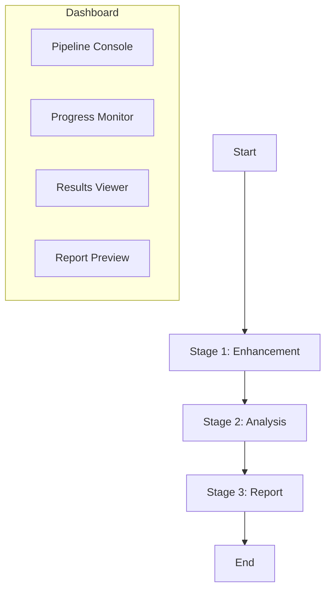

# Design Doc: AnalysisPosts v1.0 (Phase 1–3)

> Please DON'T remove notes for AI
> Last Updated: 2026-02-22

## Requirements

> Notes for AI: Keep it simple and clear. If the requirements are abstract, write concrete user stories.

- As an analyst, I can run a full pipeline (Stage 1–3) and get a report with charts and data-backed insights.
- As an operator, I can configure the pipeline visually and monitor progress in a web dashboard.
- As a developer, I can rely on tests to safely refactor nodes and tools (TDD-first).
- As a data user, I can export reports in Markdown and HTML.
- As a maintainer, I can extend analysis tools without editing core workflow code.

## Flow Design

> Notes for AI:
> 1. Consider the design patterns of agent, map-reduce, rag, and workflow. Apply them if they fit.
> 2. Present a concise, high-level description of the workflow.

### Applicable Design Pattern

1. **Workflow**: Stage 1 → Stage 2 → Stage 3 is a deterministic pipeline.
2. **Agent**: Stage 2 uses an agent loop for tool discovery and execution.

### Flow High-Level Design

1. **Stage 1 (Enhancement)**: Load raw posts → enrich with LLM + local NLP → save enhanced data.
2. **Stage 2 (Analysis)**: Load enhanced data → QuerySearchFlow 外部检索 → DataAgent/SearchAgent 双信源并行 → ForumHost 动态循环（SupplementData / SupplementSearch / VisualAnalysis）→ MergeResults 收敛 → chart gap-fill analysis + insight → save results + trace.
3. **Stage 3 (Report)**: Load analysis results → PlanOutline(layout+hero+budget) → GenerateChaptersBatch(JSON IR blocks) → ReviewChapters(loop, includes component-permission checks) → IRRenderer(JSON IR→Markdown) → InjectTrace + MethodologyAppendix → Format → RenderHTML → save Markdown/HTML/trace.
   - Quality gate: Stage3 prompts must use real insights/chart analyses/search context and explicitly prohibit placeholder text (`[议题A]` etc.).
   - Review gate: chapter revision is controlled by model review + hard checks (placeholder hit / missing `[E#]` / invalid bracket citation / duplicate heading => forced revision); no `min_score` threshold.
   - Evidence policy: each narrative paragraph must include inline evidence citations (`[E1]`, `[E2]`), with appendix index used for audit traceability.
   - Layout policy: SWOT/PEST blocks are outline-authorized components with exclusivity (max one SWOT chapter + max one PEST chapter, never same chapter).
4. **Pipeline Entry**: `pipeline.start_stage` 仅支持 `1/2/3`，从指定阶段进入后按线性主链顺序执行到结束。
   - `config.yaml` is the local system source of truth; saved local API keys and run paths are treated as workstation configuration.
   - `pipeline.start_stage` is never auto-rewritten by existing enhanced data. `data.resume_if_exists` only lets Stage1 reuse a matching enhanced dataset after Stage1 has been explicitly selected.
   - E2E 可观测性：循环状态统一写入 `trace.loop_status`，关键字段包括 `forum` 与 `stage3_chapter_review`。
   - Stage2 Forum 会沉淀 `forum.debate_logs`，并在合并节点写入 `stage2_results.search_context.forum_debate_logs` 供 Stage3 叙事引用。
5. **Dashboard (Streamlit)**: Provide configuration, progress monitor, results viewer, report preview. DataFrame 等全宽展示统一使用 `width="stretch"`（内容宽度用 `width="content"`）。
   - Pipeline Console supports `pipeline.user_analysis_instruction` input and persists it to `config.yaml`.
   - Results Viewer uses source-partitioned tabs (images / tables / forum debate / search summary / evidence chain / JSON files) for full run traceability.
   - Results Viewer reads a fixed JSON set (`analysis_data/chart_analyses/insights/trace/status`) and supports file-level metadata, parse-error tolerance, raw preview, and download.
   - Results Viewer evidence view starts from each insight and backtracks to supporting evidence, matched executions, and matched decisions.
   - Report Preview keeps a single preview panel (HTML-first, markdown fallback) and a single export path (PDF download only).
   - PDF generation is user-triggered (`Generate PDF`) and only then exposes the download button, avoiding page-load failures.
   - Dashboard 调用 `dashboard.utils.pdf_worker` 子进程进行 Playwright 渲染，隔离 Streamlit 主进程事件循环，规避 Windows `NotImplementedError`。
   - PDF runtime diagnostics are exposed by `Run PDF Preflight`; failures are structured and written to `report/pdf_error.log`.
   - For iframe rendering stability, preview inlines local `report/images/*` assets so chart images display correctly in the dashboard.
   - Streamlit page discovery is limited to real pages in `dashboard/pages/`; page helper logic is stored in `dashboard/logic/` to avoid extra sidebar tabs.
   - A shared lock file at `report/.pipeline_running.lock` is used for concurrency control, created/cleared by both CLI and dashboard runs.
   - Status file reliability: reads fall back to an empty status when the file is missing/empty/invalid; writes use atomic replace to avoid partial files.
   - `report/status.json` 使用事件流结构（`version/run_id/events[]`），仅记录节点 `enter/exit`。

### Stage 2 Chart Coverage & MCP Migration

- **Chart coverage policy**: Stage 2 must generate at least one chart per dimension (sentiment/topic/geographic/interaction/NLP).
- **Coverage enforcement**: If the agent decides to finish but any dimension is missing, the system injects a chart tool to close the gap.
- **Coverage fallback**: After the agent loop, a dedicated fallback node attempts to generate missing charts.
- **MCP tool migration**: Every tool in `utils/analysis_tools/tool_registry.py` must be exposed in the MCP server with a canonical name, plus backward-compatible aliases for legacy MCP names.
- **Tool audit**: Mapping table lives in `mcp_tool_audit.md`.
- **Preflight + Fail Fast**: 如果 MCP 工具发现返回空列表，立即报错并输出依赖自检信息，避免进入后续节点产生误导性错误。
- **MCP Auto-Enable + Parsing**: MCP 客户端在 tool_source=mcp 时自动启用；解析优先级为 `content.data` > `content.text`，避免图表结构丢失。
- **Chart Missing Policy**: `stage2.chart_missing_policy` 控制图表覆盖不足时行为（`warn` 继续 / `fail` 终止）。
- **Loop Governance**: `stage2.search_reflection_max_rounds`、`stage2.forum_max_rounds`、`stage2.forum_min_rounds_for_sufficient` + `stage2.agent_max_iterations` 统一收敛 Stage2 自主循环。
- **Report Dir Cleanup Safety**: `ClearReportDirNode` 使用选择性清理，保留 `report/status.json` 与 `report/acceptance/`，避免重跑时丢失状态与验收日志。

### Stage 3 Report Image Fallback

- If the generated report has **zero image references** but analysis charts exist, append a **Chart Appendix** listing all charts with `` paths.
- All image paths are normalized to `./images/` to keep reports portable.



## Utility Functions

> Notes for AI:
> 1. Include only the necessary utility functions, based on nodes in the flow.

1. **LLM Callers** (`utils/call_llm.py`)
   - Input: prompt (str), optional images
   - Output: response (str)
   - Used by Stage 1/2/3 nodes

2. **LLM Retry Decorator** (`utils/llm_retry.py`)
   - Input: function
   - Output: wrapped function with retry logic
   - Used by all LLM call utilities

3. **NLP Pipeline** (`utils/nlp/*`)
   - Input: text (str)
   - Output: tokens/keywords/entities/lexicon sentiment/cluster id
   - Used by Stage 1

4. **Path Manager** (`utils/path_manager.py`)
   - Input: chart id/title
   - Output: normalized file paths
   - Used by chart tools and report formatter

5. **JSON Data Source** (`utils/data_sources/json_source.py`)
   - Input: file path + query
   - Output: list of posts
   - Used by Stage 1 DataLoadNode

6. **MCP Client** (`utils/mcp_client/mcp_client.py`)
   - Input: server script path (and tool name + args for calls)
   - Output: tool list or tool result payload
   - Used by Stage 2 Agent nodes for tool discovery/execution

7. **Trace Manager** (`utils/trace_manager.py`)
   - Input: shared state + decision/execution/insight evidence payload
   - Output: trace mutation + serialized `report/trace.json`
   - Used by Stage 2 nodes and result save node

8. **Web Search Wrapper** (`utils/web_search.py`)
   - Input: query / queries + provider + API key + limits
   - Output: normalized search payload (`title/url/snippet/date/source`)
   - Used by Stage 2 QuerySearchFlow

## Node Design

### Shared Store

```
shared = {
  "pipeline_state": {"start_stage": 1, "current_stage": 0, "completed_stages": []},
  "analysis_context": {"time_range": {...}, "time_range_text": "...", "user_analysis_instruction": "..."},
  "data": {...},
  "config": {...},
  "search": {...},
  "search_results": {...},
  "agent_results": {...},
  "forum": {...},
  "stage1_results": {...},
  "stage2_results": {...},
  "stage3_results": {...},
  "trace": {"decisions": [], "executions": [], "reflections": [], "insight_provenance": {}, "loop_status": {}}
}
```

### Node Steps (High-Level)

1. **NLPEnrichmentNode**
   - Type: Regular
   - prep: read blog_data
   - exec: run text cleaner → tokenizer → keyword/NER/lexicon/similarity
   - post: write NLP fields back to shared

2. **QuerySearchFlow (Stage2)**
   - Type: Regular
   - prep: read `data_summary` and search reflections
   - exec: query extraction → web search → reflection loop
   - post: write structured `search_results`

3. **ParallelAgentFlow (Stage2)**
   - Type: AsyncParallelBatchFlow
   - prep: prepare `data_agent` + `search_agent` branch params
   - exec: run both branches in parallel
   - post: write outputs into `agent_results`

4. **ForumHostNode (Stage2)**
   - Type: Regular
   - prep: collect dual-source results + forum history
   - exec: choose one action (`supplement_data/search/visual/sufficient`) + generate structured host narrative (timeline/synthesis/deep-analysis/guided-questions)
   - post: update forum rounds + loop status + route action

5. **MergeResultsNode (Stage2)**
   - Type: Regular
   - prep: read `agent_results` + `forum`
   - exec: merge to backward-compatible `stage2_results`
   - post: persist merged structure for Stage3 readers

6. **Report Save Node**
   - Type: Regular
   - prep: read final report
   - exec: save Markdown
   - post: record output path
