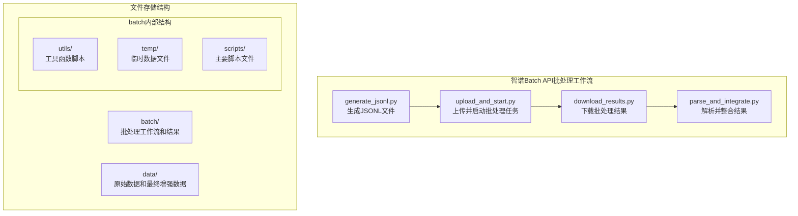
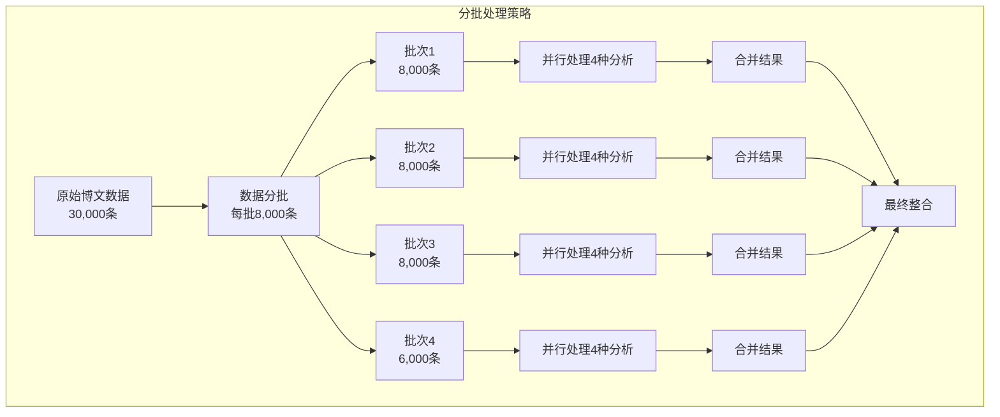

# Design Doc: 智谱Batch API批处理功能

> Please DON'T remove notes for AI

## Requirements

> Notes for AI: Keep it simple and clear.
> If the requirements are abstract, write concrete user stories

### 核心需求
为现有的舆情分析智能体工程增加基于智谱Batch API的批处理功能，使用多个Python脚本组成工作流，替代原始的PocketFlow模型请求框架，实现大规模博文数据的批量情感极性、情感属性、两级主题和发布者对象分析。

### 功能需求
1. **数据准备模块**：从data文件夹获取博文数据及预定义的主题、情感属性和发布者对象
2. **JSONL文件生成模块**：根据智谱batch API规则和现有nodes.py中的提示词设计，创建四个对应的JSONL文件
3. **文件上传模块**：上传JSONL文件到智谱服务器并存储对应的文件ID
4. **任务监控模块**：监控批处理任务的运行状态
5. **结果下载模块**：下载批处理任务结果文件
6. **数据整合模块**：将批处理结果与原始博文结合，生成增强后的博文JSON文件

### 技术需求
- 使用多个Python脚本组成工作流，不使用PocketFlow框架
- 与现有nodes.py中的LLM请求形式保持一致（使用相同的提示词和模型）
- 支持大规模数据处理（3万条博文）
- 提供错误处理和重试机制
- 支持断点续传和进度监控
- 确保数据格式一致性

## 智谱Batch API概述

### API特点
- **异步处理**：提交任务后异步执行，适合大规模数据处理
- **JSONL格式**：输入输出均为JSONL格式，每行一个JSON对象
- **文件管理**：需要先上传文件，然后基于文件ID创建批处理任务
- **状态监控**：提供任务状态查询接口
- **结果下载**：任务完成后下载结果文件
- **多模态支持**：支持文本和图片混合输入（glm-4v-plus模型）

### API限制
- **文件大小**：单个文件最大100MB
- **任务数量**：并发任务数有限制（通常为3-5个）
- **处理时间**：大批量任务可能需要数小时
- **费用计算**：按token使用量计费
- **请求行数限制**：单个JSONL文件最多包含10,000个请求
- **结果保留时间**：结果文件通常保留7天，需及时下载

### API端点
- **文件上传**：`POST /v4/files`
- **创建批处理任务**：`POST /v4/batches`
- **查询任务状态**：`GET /v4/batches/{batch_id}`
- **取消批处理任务**：`POST /v4/batches/{batch_id}/cancel`
- **下载结果文件**：`GET /v4/files/{file_id}/content`

### 智谱Batch API实现要点

#### 1. SDK安装和导入
- 安装zai SDK：`pip install zai`
- 导入必要的模块：`os`, `json`, `time`, `typing`, `zai`

#### 2. 核心功能函数
- **文件上传**：使用`client.files.create()`上传JSONL文件
- **批处理创建**：使用`client.batches.create()`创建批处理任务
- **状态查询**：使用`client.batches.retrieve()`查询任务状态
- **文件下载**：使用`client.files.content()`下载结果文件
- **等待完成**：轮询机制等待任务完成，支持超时控制

#### 3. 并发控制策略
- 最多同时运行3-4个批处理任务
- 实现任务队列管理
- 支持失败重试机制
- 提供进度跟踪功能

#### 4. 错误处理机制
- 网络错误重试
- API限流处理
- 文件格式验证
- 超时异常处理

### 任务状态说明
- `validating`：验证中（文件格式验证）
- `failed`：验证失败
- `in_progress`：处理中
- `completed`：已完成
- `cancelled`：已取消
- `expired`：已过期

### 重要注意事项

#### 1. 文件大小和行数限制
- **单个文件最大100MB**：需要监控JSONL文件大小
- **单个JSONL最多10,000行**：超过需要分批处理
- **图片处理**：包含图片的请求会显著增加文件大小

#### 2. 并发任务管理
- **并发限制**：通常同时只能运行3-5个批处理任务
- **队列策略**：需要实现任务队列，避免超出限制
- **优先级管理**：不同分析类型可以设置不同优先级

#### 3. 错误处理增强
- **文件验证失败**：JSONL格式错误、字段缺失
- **任务执行失败**：部分请求失败，需要重试
- **超时处理**：任务可能因各种原因超时

#### 4. 成本控制
- **Token统计**：需要精确统计输入输出token数量
- **预算控制**：设置每日/每月消费上限
- **成本监控**：实时监控API调用成本

#### 5. 数据安全
- **敏感信息**：避免在JSONL中包含敏感数据
- **临时文件清理**：及时清理包含Base64图片的临时文件
- **访问控制**：确保API密钥安全存储

## 工作流设计

### 整体架构

使用多个Python脚本按顺序执行，每个脚本负责特定的功能模块，批处理工作流独立于项目的其他部分：



### 改进的工作流设计

考虑到智谱Batch API的限制和大规模数据处理需求，建议采用以下改进策略：

#### 1. 分批处理策略


#### 2. 任务队列管理
- **并发控制**：最多同时运行3-4个批处理任务
- **优先级队列**：情感极性分析优先级最高
- **失败重试**：自动重试失败的任务
- **进度跟踪**：实时跟踪每个批次的进度

#### 3. 错误恢复机制
- **断点续传**：记录每个批次的处理状态
- **部分失败处理**：只重新处理失败的请求
- **结果验证**：验证下载结果的完整性
- **数据备份**：定期备份中间结果

### 脚本详细设计

#### 文件1：生成JSONL文件 (generate_jsonl.py)
**功能**：从data文件夹加载博文数据和配置文件，生成四个对应的JSONL文件
**存储位置**：`batch/generate_jsonl.py`
**输入**：data文件夹中的JSON文件
**输出**：batch/temp/目录下的四个JSONL文件
**主要任务**：
- 加载博文数据（data/posts.json）
- 加载主题层次结构（data/topics.json）
- 加载情感属性列表（data/sentiment_attributes.json）
- 加载发布者对象列表（data/publisher_objects.json）
- 验证数据完整性
- 生成四个JSONL文件到batch/temp目录
- 显示生成进度和文件大小

#### 文件2：上传并启动批处理任务 (upload_and_start.py)
**功能**：上传JSONL文件到智谱服务器并创建批处理任务
**存储位置**：`batch/upload_and_start.py`
**输入**：batch/temp/目录下的JSONL文件
**输出**：batch/temp/batch_info.json（批处理任务信息）
**主要任务**：
- 检查JSONL文件是否存在
- 上传JSONL文件到智谱服务器
- 创建批处理任务
- 保存批处理任务信息供后续脚本使用
- 显示任务创建状态和ID

#### 文件3：下载批处理结果 (download_results.py)
**功能**：监控批处理任务状态，完成后下载结果文件
**存储位置**：`batch/download_results.py`
**输入**：batch/temp/batch_info.json
**输出**：batch/temp/download_info.json（下载状态）和结果文件
**主要任务**：
- 读取批处理任务ID列表
- 轮询任务状态直到完成
- 显示实时进度和任务状态
- 处理超时和异常情况
- 下载结果文件和错误文件到batch/temp目录
- 记录任务执行统计信息
- 保存下载状态供后续脚本使用

#### 文件4：解析并整合结果 (parse_and_integrate.py)
**功能**：将批处理结果与原始博文数据整合，保存最终增强数据
**存储位置**：`batch/parse_and_integrate.py`
**输入**：batch/temp/目录下的结果文件
**输出**：batch/enhanced_posts.json（最终增强数据）和batch/integration_report.txt
**主要任务**：
- 读取原始博文数据
- 解析四个结果JSONL文件
- 将分析结果映射回对应的博文
- 处理解析错误和缺失结果
- 生成增强后的博文数据
- 保存到batch目录
- 生成处理报告和统计信息
- 验证数据完整性和质量

### 文件存储结构

#### 目录组织
```
AnalysisPosts/
├── batch/                                    # 批处理工作流目录（独立于项目其他部分）
│   ├── config.json                     # 配置文件
│   ├── README.md                       # 使用说明文档
│   ├── generate_jsonl.py              # 生成JSONL文件脚本
│   ├── upload_and_start.py            # 上传并启动批处理任务脚本
│   ├── download_results.py            # 下载批处理结果脚本
│   ├── parse_and_integrate.py         # 解析并整合结果脚本
│   ├── utils/                           # 工具函数脚本
│   │   ├── __init__.py
│   │   ├── batch_client.py              # 智谱Batch API客户端
│   │   ├── jsonl_generator.py            # JSONL文件生成工具
│   │   ├── result_parser.py              # 结果解析工具
│   │   └── data_integration.py           # 数据整合工具
│   ├── temp/                            # 临时数据文件
│   │   ├── sentiment_polarity_batch.jsonl
│   │   ├── sentiment_attribute_batch.jsonl
│   │   ├── topic_analysis_batch.jsonl
│   │   ├── publisher_analysis_batch.jsonl
│   │   ├── batch_info.json              # 批处理任务信息
│   │   ├── download_info.json           # 下载状态信息
│   │   ├── sentiment_polarity_results.jsonl
│   │   ├── sentiment_attribute_results.jsonl
│   │   ├── topic_analysis_results.jsonl
│   │   └── publisher_analysis_results.jsonl
│   ├── enhanced_posts.json            # 增强后的博文数据（最终输出）
│   └── integration_report.txt         # 数据整合报告
└── data/                                 # 原始数据和最终增强数据
    ├── posts.json                      # 原始博文数据
    ├── topics.json                     # 主题层次结构
    ├── sentiment_attributes.json          # 情感属性列表
    ├── publisher_objects.json           # 发布者对象列表
    └── enhanced_blogs.json             # 最终增强数据（可选备份）
```

#### 工具函数脚本 (batch/utils/)

##### batch_client.py
**功能**：封装智谱Batch API的所有操作
- 文件上传
- 批处理任务创建
- 任务状态查询
- 结果文件下载
- 完整的批处理工作流函数

##### jsonl_generator.py
**功能**：根据nodes.py中的提示词生成JSONL文件
- 情感极性JSONL生成
- 情感属性JSONL生成
- 主题分析JSONL生成
- 发布者对象JSONL生成
- 图片Base64编码处理
- 模型选择策略

##### result_parser.py
**功能**：解析批处理结果文件
- 情感极性结果解析
- 情感属性结果解析
- 主题分析结果解析
- 发布者对象结果解析
- 错误处理和验证
- 结果完整性验证

##### data_integration.py
**功能**：将批处理结果与原始博文数据整合
- 结果映射回原始博文
- 数据格式验证
- 增强数据生成
- 数据质量验证
- 整合报告生成

### 数据交互规则

1. **批处理工作流独立性**：batch目录中的所有脚本和文件除了从data文件夹读取原始数据外，不与项目其他部分交互
2. **数据流向**：
   - 读取：从data文件夹读取原始博文数据和配置文件
   - 临时存储：batch/temp目录存储生成的JSONL文件和中间结果
   - 最终输出：batch/enhanced_posts.json存储最终增强数据
3. **状态管理**：batch/temp/batch_info.json和batch/temp/download_info.json用于跟踪工作流状态

## 与现有nodes.py的一致性设计

### 提示词一致性

JSONL文件生成脚本将使用与nodes.py完全相同的提示词：

#### 情感极性分析提示词
```python
# 与nodes.py中SentimentPolarityAnalysisBatchNode.exec()方法完全一致
prompt = f"""你是一个专业的社交媒体内容分析师。
你的任务是分析以下博文内容（包括文本和图片）的整体情感极性。

情感极性评分标准如下：
1 - 极度悲观 (例如：愤怒、绝望、极度不满)
2 - 悲观 (例如：失望、担忧、轻微不满)
3 - 无明显极性 (例如：事实陈述、客观描述、无明显情感倾向)
4 - 乐观 (例如：开心、满意、期待)
5 - 极度乐观 (例如：兴奋、感激、极度喜悦)

要求：
1. 请仔细阅读文本、观察图片，并结合上述评分标准，对这篇博文的整体情感倾向做出判断
2. 你的最终输出必须只包含一个代表判断结果的阿拉伯数字（1-5）
3. 不要添加任何解释、标题、引言、JSON格式或其他任何文本
4. 如果内容无法判断或超出理解范围，请输出数字0

--- 示例 1：极度悲观 (1分) ---
博文内容：我家被洪水淹了！所有的家具都毁了，一年的积蓄就这样没了！天啊，我该怎么办！
预期输出：1

--- 示例 2：悲观 (2分) ---
博文内容：这场雨下得太大了，出门很不方便，担心会影响明天的上班。
预期输出：2

--- 示例 3：无明显极性 (3分) ---
博文内容：北京市气象台发布暴雨红色预警信号，预计未来3小时内将出现特大暴雨。
预期输出：3

--- 示例 4：乐观 (4分) ---
博文内容：虽然下大雨，但看到邻居们互相帮助，心里很温暖，相信很快就会好起来的。
预期输出：4

--- 示例 5：极度乐观 (5分) ---
博文内容：太棒了！救援队及时赶到，所有人都安全了！感谢所有救援人员，你们是最棒的！
预期输出：5

--- 示例 6：无法判断 (0分) ---
博文内容：asdfghjkl123456789
预期输出：0

现在请分析以下博文内容：

{blog_post.get('content', '')}
"""
```

#### 情感属性分析提示词
```python
# 与nodes.py中SentimentAttributeAnalysisBatchNode.exec()方法完全一致
attributes_str = "、".join(sentiment_attributes)
prompt = f"""你是一个专业的社交媒体内容分析师。
你的任务是分析以下博文内容（包括文本和图片）的整体情感属性。

可选择的情感属性：{attributes_str}

请从上述列表中选择1-3个最贴切的情感属性，严格按照以下JSON格式输出：

["属性1", "属性2"]

请直接输出JSON数组，不要添加任何其他文字

--- 示例 1：愤怒内容 ---
博文内容：这场暴雨太让人愤怒了！政府为什么不提前预警！
预期输出：["生气"]

--- 示例 2：支持赞赏内容 ---
博文内容：感谢救援人员的辛勤付出，你们是最棒的！
预期输出：["支持", "赞赏"]

--- 示例 3：中立客观内容 ---
博文内容：北京市气象台发布暴雨红色预警信号。
预期输出：["中立"]

--- 示例 4：担忧焦虑内容 ---
博文内容：担心这场雨会造成更大的损失，希望大家都平安。
预期输出：["担忧", "焦虑"]

--- 示例 5：希望期待内容 ---
博文内容：希望雨快点停，明天能正常上班。
预期输出：["希望", "期待"]

博文内容：
{blog_post.get('content', '')}
"""
```

#### 两级主题分析提示词
```python
# 与nodes.py中TwoLevelTopicAnalysisBatchNode.exec()方法完全一致
topics_str = ""
for topic_group in topics_hierarchy:
    parent_topic = topic_group.get("parent_topic", "")
    sub_topics = topic_group.get("sub_topics", [])
    topics_str += f"\n父主题：{parent_topic}\n子主题：{'、'.join(sub_topics)}\n"

prompt = f"""你是一个专业的社交媒体内容分析师。
你的任务是分析以下博文内容（包括文本和图片）的主题层次结构。

候选的主题层次结构：{topics_str}

请从上述主题列表中选择1-2个最贴切的父主题和对应的子主题，严格按照以下JSON格式输出，请直接输出JSON数组，不要添加任何其他文字：

[{{"parent_topic": "父主题", "sub_topic": "子主题"}}, ...]

如果没有找到符合的主题，请输出空数组：[]

--- 示例 1：暴雨灾害内容 ---
博文内容：北京遭遇特大暴雨，多地出现严重内涝。
预期输出：[{{"parent_topic": "自然灾害", "sub_topic": "暴雨"}}]

--- 示例 2：地铁运营内容 ---
博文内容：因暴雨影响，地铁部分线路暂停运营。
预期输出：[{{"parent_topic": "交通运输", "sub_topic": "地铁运营"}}]

--- 示例 3：政府预警内容 ---
博文内容：市政府发布暴雨红色预警，请市民注意防范。
预期输出：[{{"parent_topic": "政府工作", "sub_topic": "预警发布"}}]

--- 示例 4：多主题内容 ---
博文内容：暴雨导致地铁停运，政府启动应急响应。
预期输出：[{{"parent_topic": "自然灾害", "sub_topic": "暴雨"}}, {{"parent_topic": "交通运输", "sub_topic": "地铁运营"}}]

--- 示例 5：无相关主题内容 ---
博文内容：今天天气不错，适合出门散步。
预期输出：[]

博文内容：
{blog_post.get('content', '')}
"""
```

#### 发布者对象分析提示词
```python
# 与nodes.py中PublisherObjectAnalysisBatchNode.exec()方法完全一致
publishers_str = "、".join(publisher_objects)
prompt = f"""分析博文发布者类型

你是一个专业的社交媒体内容分析师。
你的任务是分析以下博文内容（包括文本和图片）的博文发布者类型。
可选择的发布者对象：{publishers_str}

请从上述列表中选择1个最贴切的发布者对象，直接输出发布者类型字符串。请直接输出发布者类型字符串，不要添加任何其他文字

--- 示例 1：气象台内容 ---
博文内容：北京市气象台发布暴雨红色预警信号。
预期输出：政府机构

--- 示例 2：媒体内容 ---
博文内容：本报记者现场报道暴雨情况。
预期输出：官方新闻媒体

--- 示例 3：普通用户内容 ---
博文内容：今天雨好大，出门要小心。
预期输出：个人用户

--- 示例 4：事业单位内容 ---
博文内容：北京地铁发布运营调整通知。
预期输出：事业单位

--- 示例 5：应急管理部门内容 ---
博文内容：消防部门提醒市民注意安全。
预期输出：应急管理部门

博文内容：
{blog_post.get('content', '')}
"""
```

### 模型参数一致性

JSONL文件中的模型参数将与nodes.py保持一致：

```python
# 情感极性分析 - 使用多模态模型（如果有图片）
model = "glm-4v-plus" if image_paths else "glm-4-air"
temperature = 0.3
# 注意：nodes.py中不设置max_tokens参数

# 情感属性分析 - 使用纯文本模型
model = "glm-4-air"
temperature = 0.3
# 注意：nodes.py中不设置max_tokens参数

# 两级主题分析 - 使用多模态模型（如果有图片）
model = "glm-4v-plus" if image_paths else "glm-4-air"
temperature = 0.3
# 注意：nodes.py中不设置max_tokens参数

# 发布者对象分析 - 使用纯文本模型
model = "glm-4-air"
temperature = 0.3
# 注意：nodes.py中不设置max_tokens参数
```

### 重要说明

根据nodes.py中的实际实现，所有LLM调用都**不设置max_tokens参数**，让模型根据提示词自然生成回答。这与nodes.py中的call_glm_45_air()和call_glm4v_plus()函数实现保持一致。

## JSONL文件格式设计

### 智谱Batch API请求格式

每个JSONL文件中的每行都是一个独立的API请求，需要区分纯文本请求和包含图片的请求：

#### 纯文本请求格式
```json
{
  "custom_id": "sentiment_attribute_000001",
  "method": "POST",
  "url": "/v4/chat/completions",
  "body": {
    "model": "glm-4-air",
    "messages": [
      {
        "role": "system",
        "content": "你是一个专业的社交媒体内容分析师。"
      },
      {
        "role": "user",
        "content": "分析博文情感属性\n\n可选择的情感属性：生气、支持、担忧、兴奋、失望、希望、恐惧、满意、惊讶、愤怒、焦虑、恐慌、沮丧、欣慰、期待、害怕、高兴、紧张、平静、冷静、激动、忧虑、不满、鼓励、赞赏、同情、无奈、感动、感激、困惑、怀疑、信任、嫉妒、羡慕、自豪、羞愧、尴尬、绝望、乐观、悲观、中立、客观、理性、感性\n\n博文内容：\n朝阳区这边雨下得太大了，小区里已经积水了，车子都泡在水里了，希望相关部门赶紧来处理一下！\n\n请从上述列表中选择1-3个最贴切的情感属性，严格按照以下JSON格式输出：\n\n[\"属性1\", \"属性2\"]\n\n请直接输出JSON数组，不要添加任何其他文字："
      }
    ],
    "temperature": 0.3
  }
}
```

#### 包含图片的请求格式
```json
{
  "custom_id": "sentiment_polarity_000001",
  "method": "POST",
  "url": "/v4/chat/completions",
  "body": {
    "model": "glm-4v-plus",
    "messages": [
      {
        "role": "system",
        "content": "你是一个专业的社交媒体内容分析师。"
      },
      {
        "role": "user",
        "content": [
          {
            "type": "text",
            "text": "你是一个专业的社交媒体内容分析师。\n你的任务是分析以下博文内容（包括文本和图片）的整体情感极性。\n\n情感极性评分标准如下：\n1 - 极度悲观 (例如：愤怒、绝望、极度不满)\n2 - 悲观 (例如：失望、担忧、轻微不满)\n3 - 无明显极性 (例如：事实陈述、客观描述、无明显情感倾向)\n4 - 乐观 (例如：开心、满意、期待)\n5 - 极度乐观 (例如：兴奋、感激、极度喜悦)\n\n要求：\n1. 请仔细阅读文本、观察图片，并结合上述评分标准，对这篇博文的整体情感倾向做出判断\n2. 你的最终输出必须只包含一个代表判断结果的阿拉伯数字（1-5）\n3. 不要添加任何解释、标题、引言、JSON格式或其他任何文本\n4. 如果内容无法判断或超出理解范围，请输出数字0\n\n现在请分析以下博文内容：\n【暴雨红色预警】北京市气象台2024年7月30日06时00分发布暴雨红色预警信号：预计未来3小时内，本市将出现特大暴雨，请注意防范。"
          },
          {
            "type": "image_url",
            "image_url": {
              "url": "data:image/jpeg;base64,/9j/4AAQSkZJRgABAQEAYABgAAD/2wBDAAEBAQEBAQEBAQEBAQEBAQEBAQEBAQEBAQEBAQEBAQEBAQEBAQEBAQEBAQEBAQEBAQEBAQEBAQEBAQEBAQEBAQEBAQEBAQEBAQH/2wBDAQEBAQEBAQEBAQEBAQEBAQEBAQEBAQEBAQEBAQEBAQEBAQEBAQEBAQEBAQEBAQEBAQEBAQEBAQEBAQEBAQEBAQH/wAARCAABAAEDASIAAhEBAxEB/8QAFQABAQAAAAAAAAAAAAAAAAAAAAv/xAAUEAEAAAAAAAAAAAAAAAAAAAAA/8QAFQEBAQAAAAAAAAAAAAAAAAAAAAX/xAAUEQEAAAAAAAAAAAAAAAAAAAAA/9oADAMBAAIRAxEAPwA/8A8A"
            }
          }
        ]
      }
    ],
    "temperature": 0.3
  }
}
```

### 图片处理策略

在JSONL文件生成脚本中，需要：

1. **检查图片存在性**：遍历每条博文的`image_urls`字段
2. **图片文件验证**：检查图片文件是否存在且格式正确
3. **Base64编码**：将图片文件转换为Base64编码
4. **格式选择**：根据是否有图片选择不同的请求格式

#### 图片处理示例代码
```python
import base64
import os
from typing import List, Dict, Any

def encode_image_to_base64(image_path: str) -> str:
    """将图片文件编码为Base64字符串"""
    with open(image_path, "rb") as image_file:
        return base64.b64encode(image_file.read()).decode('utf-8')

def get_image_mime_type(image_path: str) -> str:
    """获取图片的MIME类型"""
    ext = os.path.splitext(image_path)[1].lower()
    mime_types = {
        '.jpg': 'image/jpeg',
        '.jpeg': 'image/jpeg',
        '.png': 'image/png',
        '.gif': 'image/gif',
        '.webp': 'image/webp'
    }
    return mime_types.get(ext, 'image/jpeg')

def process_images_for_batch(blog_post: Dict[str, Any]) -> List[Dict[str, Any]]:
    """为批处理请求处理图片"""
    image_content = []
    image_urls = blog_post.get('image_urls', [])
    
    for img_url in image_urls:
        if not img_url or not img_url.strip():
            continue
            
        # 构建完整的图片路径
        if img_url.startswith('http'):
            # 如果是网络图片，需要先下载（这里暂不处理）
            continue
        else:
            # 本地图片路径
            full_path = os.path.join("data", img_url.lstrip('/'))
            
            if os.path.exists(full_path):
                try:
                    base64_image = encode_image_to_base64(full_path)
                    mime_type = get_image_mime_type(full_path)
                    data_url = f"data:{mime_type};base64,{base64_image}"
                    
                    image_content.append({
                        "type": "image_url",
                        "image_url": {
                            "url": data_url
                        }
                    })
                except Exception as e:
                    print(f"处理图片失败 {full_path}: {e}")
                    continue
    
    return image_content
```

### 文件命名规范

- 情感极性：`temp/sentiment_polarity_batch.jsonl`
- 情感属性：`temp/sentiment_attribute_batch.jsonl`
- 两级主题：`temp/topic_analysis_batch.jsonl`
- 发布者对象：`temp/publisher_analysis_batch.jsonl`

### custom_id设计

custom_id采用以下格式，便于结果映射：
- 情感极性：`sentiment_polarity_{index:06d}`
- 情感属性：`sentiment_attribute_{index:06d}`
- 两级主题：`topic_analysis_{index:06d}`
- 发布者对象：`publisher_analysis_{index:06d}`

### 模型选择策略

根据实际代码实现，在JSONL生成时确定模型：

```python
def select_model_for_analysis(analysis_type: str, has_images: bool) -> str:
    """根据分析类型和是否有图片选择模型"""
    if analysis_type in ["sentiment_polarity", "topic_analysis"]:
        # 情感极性和主题分析任务，无论是否包含图片都使用多模态视觉模型
        return "glm-4v-plus"
    elif analysis_type == "sentiment_attribute":
        return "glm-4-air"
    elif analysis_type == "publisher_analysis":
        return "glm-4-air"
    else:
        return "glm-4-air"

def get_temperature_for_analysis(analysis_type: str) -> float:
    """根据分析类型获取温度参数"""
    return 0.3
```

### 具体模型映射表

| 分析类型 | 有图片时模型 | 无图片时模型 | nodes.py对应函数 | 说明 |
|---------|-------------|-------------|----------------|------|
| 情感极性分析 | glm-4v-plus | glm-4v-plus | call_glm4v_plus / call_glm_45_air | 始终使用多模态模型 |
| 情感属性分析 | glm-4-air | glm-4-air | call_glm_45_air | 始终使用纯文本模型 |
| 两级主题分析 | glm-4v-plus | glm-4v-plus | call_glm4v_plus / call_glm_45_air | 始终使用多模态模型 |
| 发布者对象分析 | glm-4-air | glm-4-air | call_glm_45_air | 始终使用纯文本模型 |

### JSONL请求构建示例

#### 情感极性分析（有图片）
```python
# 对应nodes.py中的SentimentPolarityAnalysisBatchNode.exec()方法
# 始终使用多模态模型
model = "glm-4v-plus"
content = [
    {"type": "text", "text": prompt},
    *[{"type": "image_url", "image_url": {"url": encode_image(img)}} for img in image_paths]
]
```

#### 情感属性分析（始终纯文本）
```python
# 对应nodes.py中的SentimentAttributeAnalysisBatchNode.exec()方法
# 始终使用纯文本模型，对应call_glm_45_air()
model = "glm-4-air"
content = prompt  # 纯文本提示词
```

#### 两级主题分析（有图片）
```python
# 对应nodes.py中的TwoLevelTopicAnalysisBatchNode.exec()方法
# 始终使用多模态模型
model = "glm-4v-plus"
content = [
    {"type": "text", "text": prompt},
    *[{"type": "image_url", "image_url": {"url": encode_image(img)}} for img in image_paths]
]
```

#### 发布者对象分析（始终纯文本）
```python
# 对应nodes.py中的PublisherObjectAnalysisBatchNode.exec()方法
# 始终使用纯文本模型，对应call_glm_45_air()
model = "glm-4-air"
content = prompt  # 纯文本提示词
```

## 批处理结果解析设计

### 智谱Batch API响应格式

批处理结果文件也是JSONL格式，每行包含一个请求的响应：

```json
{
  "custom_id": "sentiment_polarity_000001",
  "response": {
    "status_code": 200,
    "body": {
      "id": "chatcmpl-xxx",
      "object": "chat.completion",
      "created": 1234567890,
      "model": "glm-4-air",
      "choices": [
        {
          "index": 0,
          "message": {
            "role": "assistant",
            "content": "3"
          },
          "finish_reason": "stop"
        }
      ],
      "usage": {
        "prompt_tokens": 150,
        "completion_tokens": 1,
        "total_tokens": 151
      }
    }
  }
}
```

### 结果解析策略

1. **成功响应解析**：提取content字段中的分析结果
2. **错误响应处理**：记录错误信息，设置默认值
3. **格式验证**：验证结果是否符合预期格式（与nodes.py中的验证逻辑一致）
4. **数据映射**：将结果映射回原始博文数据

### 解析示例

```python
def parse_sentiment_polarity_result(result_line):
    """解析情感极性分析结果 - 与nodes.py中验证逻辑一致"""
    data = json.loads(result_line)
    
    if data.get("response", {}).get("status_code") == 200:
        content = data["response"]["body"]["choices"][0]["message"]["content"].strip()
        
        # 验证是否为单一数字
        if not content.isdigit():
            return None
        
        score = int(content)
        if not 1 <= score <= 5:
            return None
        
        return score
    else:
        return None

def parse_sentiment_attribute_result(result_line):
    """解析情感属性分析结果 - 与nodes.py中验证逻辑一致"""
    data = json.loads(result_line)
    
    if data.get("response", {}).get("status_code") == 200:
        content = data["response"]["body"]["choices"][0]["message"]["content"].strip()
        
        try:
            attributes = json.loads(content)
            if not isinstance(attributes, list):
                return None
            
            # 验证结果是否在预定义列表中
            valid_attributes = []
            for attr in attributes:
                if attr in sentiment_attributes:
                    valid_attributes.append(attr)
            
            return valid_attributes
        except json.JSONDecodeError:
            return None
    else:
        return None
```

## 错误处理和重试机制

### 错误类型分类

1. **网络错误**：连接超时、网络中断
2. **API错误**：认证失败、限流、服务不可用
3. **数据错误**：格式错误、内容过长
4. **处理错误**：模型输出异常、解析失败

### 重试策略

1. **指数退避**：重试间隔逐渐增加（30s, 60s, 120s）
2. **最大重试次数**：每个操作最多重试3次
3. **错误分类处理**：不同错误类型采用不同策略
4. **断点续传**：记录处理进度，支持从中断点恢复

### 监控和日志

1. **详细日志**：记录每个步骤的执行情况
2. **进度监控**：实时显示处理进度
3. **错误统计**：统计各类错误的发生频率
4. **性能监控**：记录处理时间和资源使用情况

## 配置管理

### 配置文件结构

实际配置文件 `batch/config.json`：

```json
{
  "api": {
    "base_url": "https://open.bigmodel.cn/api/paas/v4/",
    "api_key": "fecda0f3e009473a88c9bcfe711c3248.D35PCYssGvjLqObH",
    "timeout": 300
  },
  "batch": {
    "model": "glm-4-air",
    "multimodal_model": "glm-4v-plus",
    "max_file_size": 104857600,
    "max_requests_per_file": 10000,
    "poll_interval": 60,
    "task_timeout": 14400,
    "max_retries": 3,
    "retry_delay": 30,
    "max_concurrent_tasks": 3
  },
  "paths": {
    "data_dir": "../data",
    "batch_dir": ".",
    "temp_dir": "./temp",
    "results_dir": "./results",
    "utils_dir": "./utils"
  },
  "files": {
    "blog_data": "../data/posts.json",
    "topics": "../data/topics.json",
    "sentiment_attributes": "../data/sentiment_attributes.json",
    "publisher_objects": "../data/publisher_objects.json",
    "enhanced_output": "./enhanced_posts.json",
    "workflow_status": "./workflow_status.json",
    "downloaded_results": "./downloaded_results.json"
  },
  "analysis_types": [
    "sentiment_polarity",
    "sentiment_attribute", 
    "topic_analysis",
    "publisher_analysis"
  ]
}
```

### 环境变量

- `ZHIPU_API_KEY`：智谱API密钥（实际在配置文件中直接设置）
- `BATCH_LOG_LEVEL`：日志级别（DEBUG, INFO, WARNING, ERROR）
- `BATCH_TEMP_DIR`：临时文件目录（可选）

## 性能优化策略

### 数据处理优化

1. **分批处理**：将大数据集分解为小批次（每批1000条）
2. **并行处理**：四个分析维度并行执行
3. **内存管理**：及时释放不需要的数据
4. **流式处理**：大文件使用流式读写

### API调用优化

1. **请求合并**：合并相似请求减少API调用
2. **限流控制**：避免触发API限流
3. **连接池**：复用HTTP连接
4. **异步IO**：使用异步IO提高并发性能

### 文件操作优化

1. **压缩存储**：临时文件使用压缩格式
2. **清理机制**：及时清理临时文件
3. **并行IO**：并行读写多个文件
4. **缓存机制**：缓存重复使用的数据

## 测试策略

### 单元测试

1. **工具函数测试**：测试每个工具函数的正确性
2. **JSONL生成测试**：测试JSONL文件生成和格式
3. **结果解析测试**：测试结果解析逻辑
4. **错误处理测试**：测试各种错误情况

### 集成测试

1. **脚本流程测试**：测试完整的脚本执行流程
2. **数据一致性测试**：验证结果数据的正确性
3. **性能测试**：测试大数据集处理能力
4. **并发测试**：测试多个任务并行执行

### 端到端测试

1. **真实数据测试**：使用真实博文数据测试
2. **结果验证**：人工验证分析结果质量
3. **性能基准**：建立性能基准线
4. **压力测试**：测试系统极限能力

## 部署和运维

### 脚本执行方式

1. **顺序执行**：按脚本编号顺序执行
2. **批量执行**：使用shell脚本或Python脚本批量执行
3. **定时执行**：支持定时任务调度
4. **手动执行**：支持手动触发单个脚本

### 监控和告警

1. **执行监控**：监控每个脚本的执行状态
2. **进度监控**：实时显示处理进度
3. **错误监控**：监控错误率和异常情况
4. **成本监控**：监控API调用成本

### 日志管理

1. **统一日志格式**：所有脚本使用统一的日志格式
2. **日志轮转**：支持日志文件轮转
3. **日志聚合**：支持日志集中收集和分析
4. **日志查询**：支持日志查询和过滤

## 实现优先级

### 第一阶段：核心功能实现
1. 实现基础配置管理
2. 实现数据准备脚本
3. 实现JSONL文件生成脚本
4. 实现智谱Batch API客户端

### 第二阶段：批处理流程实现
1. 实现文件上传脚本
2. 实现批处理任务创建脚本
3. 实现任务监控脚本
4. 实现结果下载脚本

### 第三阶段：数据整合和优化
1. 实现数据整合脚本
2. 实现保存增强数据脚本
3. 实现清理临时文件脚本
4. 实现错误处理和重试机制

### 第四阶段：完善和部署
1. 完善日志和监控系统
2. 实现完整的测试覆盖
3. 编写使用文档和部署指南
4. 性能优化和压力测试

## 总结

本设计文档详细描述了基于智谱Batch API的批处理功能实现方案，主要特点：

1. **无框架依赖**：使用多个Python脚本组成工作流，不依赖PocketFlow
2. **完全一致性**：与现有nodes.py中的提示词和模型参数完全一致
3. **模块化设计**：每个脚本负责特定功能，便于维护和测试
4. **错误处理完善**：提供完整的错误处理和重试机制
5. **性能优化**：支持大规模数据处理和并行执行
6. **监控完善**：提供详细的进度监控和日志记录

该设计能够有效替代原始的PocketFlow模型请求框架，实现大规模博文数据的批量分析，同时保持与现有系统的完全兼容性。
