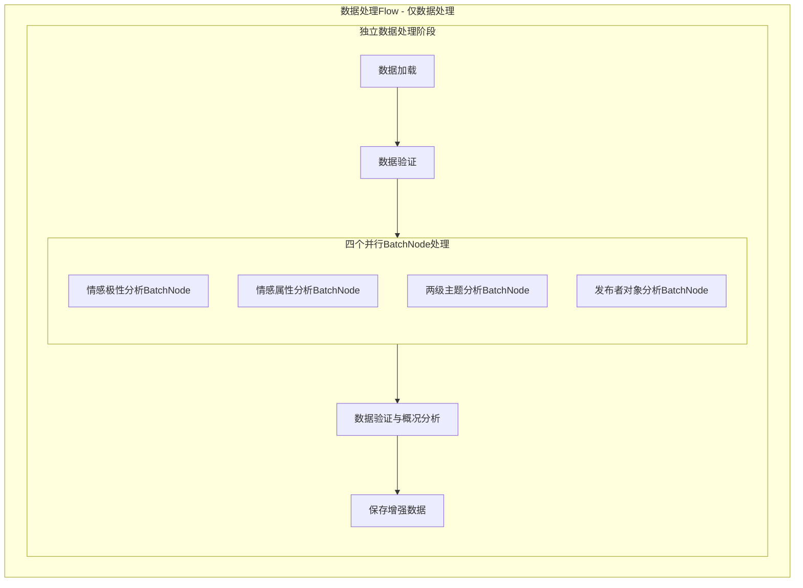
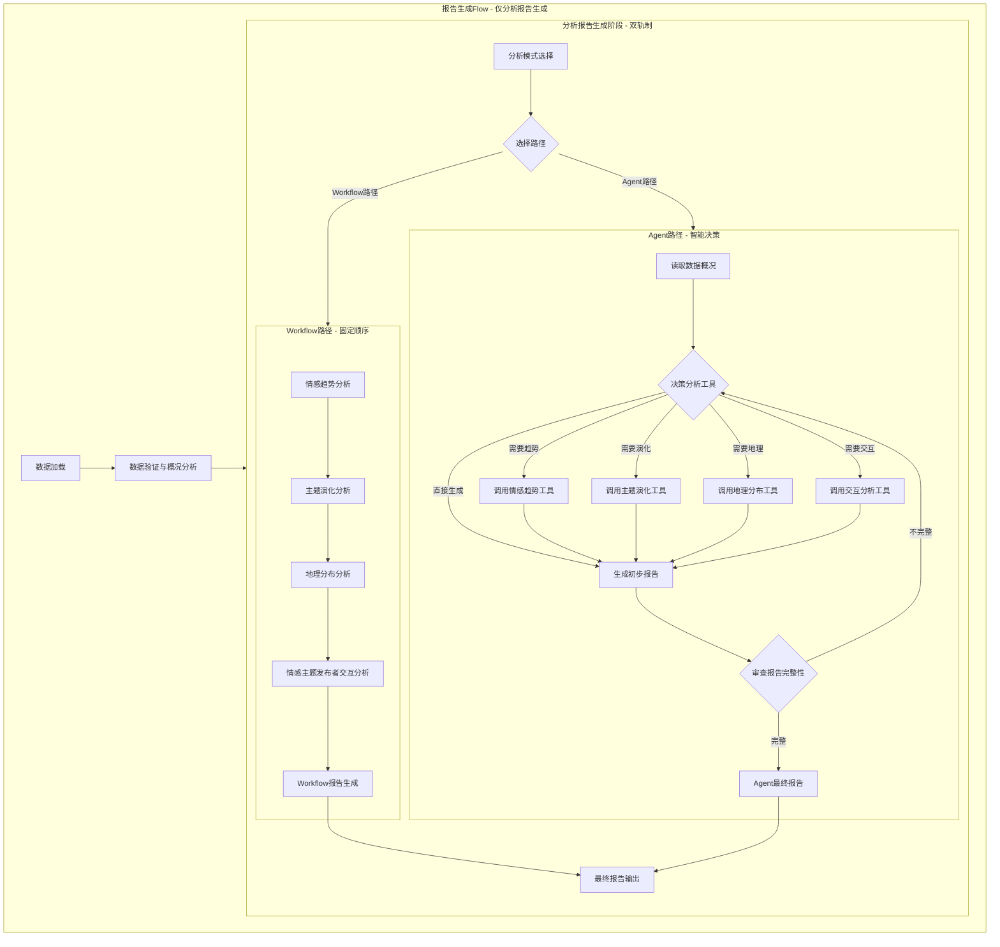

# Design Doc: 舆情分析智能体

> Please DON'T remove notes for AI

## Requirements

> Notes for AI: Keep it simple and clear.
> If the requirements are abstract, write concrete user stories

### 核心需求
1. **原始博文数据处理模块**（可选独立运行）：为每个博文并行添加四个维度的分析信息：
   - **情感极性分析**：1-5档情感分级（1-极度悲观，2-悲观，3-无明显极性，4-乐观，5-极度乐观）
   - **情感属性分析**：具体情感状态识别（生气、支持、担忧、兴奋、失望、希望、恐惧、满意、惊讶等）
   - **两级主题分析**：从预定义的两层嵌套主题列表中选择合适主题
   - **发布者对象分析**：识别发布者类型（政府机构、官方新闻媒体、自媒体、企业账号、个人用户等）

2. **分析报告生成模块**（可独立运行）：双轨制报告生成架构：
   - **Workflow路径**：按预定义工作流顺序运行分析模块
   - **Agent路径**：智能体自主决策调用工具并循环完善报告
   - **数据源兼容**：支持读取原始博文数据或已处理的增强数据

3. **分析工具集**：四个核心分析工具：
   - 情感趋势分析工具
   - 主题演化分析工具
   - 地理分布分析工具
   - 情感主题发布者交互分析工具

4. **解耦合架构**：数据处理与分析报告生成完全独立，通过Flow编排支持多种运行模式：
   - **完整Flow**：数据处理 + 分析报告生成
   - **数据处理Flow**：只运行数据处理模块
   - **报告生成Flow**：跳过数据处理，直接对已有增强数据进行分析报告生成

5. **大规模处理能力**：处理3万条博文数据，通过在原始数据字典中附加新关键词实现信息增强

### 数据格式
- 输入：JSON对象数组结构，一次性加载到内存
- 博文结构：{username: str, user_id: str, content: str, publish_time: str, location: str, repost_count: int, comment_count: int, like_count: int, image_urls: [str]}
- 图片存储：相对链接，存储在images/子文件夹
- 数据量：控制在3万条博文以内
- 处理方式：通过在原始博文对象中附加新的字段实现信息增强
- 增强后结构：{username: str, user_id: str, content: str, publish_time: str, location: str, repost_count: int, comment_count: int, like_count: int, image_urls: [str], sentiment_polarity: dict, sentiment_attribute: dict, topics: dict, publisher: dict}

### 处理规则
- **并行处理**：原始博文数据的四个分析维度完全并行，无先后顺序
- **模型调用**：所有分析通过多模态语言模型API调用进行
- **信息附加**：分析结果直接附加到原始博文数据字典中
- **双轨制**：报告生成支持Workflow和Agent两种路径

## Flow Design

> Notes for AI:
> 1. Consider the design patterns of agent, map-reduce, rag, and workflow. Apply them if they fit.
> 2. Present a concise, high-level description of the workflow.

### Applicable Design Pattern:

1. **Batch Pattern**: 用于原始博文数据处理的四个分析维度
   - 四个分析维度通过Batch节点独立处理，无依赖关系
   - 使用BatchNode实现批量处理，每个维度独立处理所有博文数据

2. **Agent Pattern**: 用于报告生成的智能体路径
   - Context: 结构化数据和统计概况
   - Action: 动态调用分析工具，生成深度洞察

3. **Workflow Pattern**: 用于报告生成的预定义路径
   - 固定顺序调用分析工具，生成标准化分析结果

4. **Dual-Track Architecture**: 报告生成的双轨制设计
   - Workflow路径：可预测、高效的标准化分析
   - Agent路径：灵活、智能的探索性分析

### Flow high-level Design:

#### 1. CompleteFlow（完整流程 - 数据处理+分析报告生成）

```mermaid
flowchart TD
    subgraph CompleteFlow[完整Flow - 数据处理+分析报告生成]
        subgraph data_processing_stage[原始博文数据处理阶段 - 并行信息增强]
            data_load[数据加载] --> data_validation[数据验证]
            data_validation --> parallel_analysis[四个并行BatchNode]
            
            subgraph parallel_analysis[四个并行BatchNode处理]
                sentiment_polarity[情感极性分析BatchNode<br/>原地增强sentiment_polarity字段]
                sentiment_attribute[情感属性分析BatchNode<br/>原地增强sentiment_attribute字段]
                topic_analysis[两级主题分析BatchNode<br/>原地增强topics字段]
                publisher_analysis[发布者对象分析BatchNode<br/>原地增强publisher字段]
            end
            
            parallel_analysis --> final_validation[数据验证节点]
            final_validation --> enhanced_data[增强数据输出]
        end
        
        subgraph report_generation_stage[分析报告生成阶段 - 双轨制]
            analysis_mode_selection[分析模式选择] --> workflow_path{选择路径}
            
            workflow_path -->|Workflow路径| predefined_workflow[预定义工作流]
            workflow_path -->|Agent路径| intelligent_agent[智能体自主分析]
            
            subgraph predefined_workflow[Workflow路径 - 固定顺序]
                trend_analysis[情感趋势分析] --> evolution_analysis[主题演化分析]
                evolution_analysis --> geographic_analysis[地理分布分析]
                geographic_analysis --> interaction_analysis[情感主题发布者交互分析]
                interaction_analysis --> workflow_report[Workflow报告生成]
            end
            
            subgraph intelligent_agent[Agent路径 - 智能决策]
                agent_initial[读取数据概况] --> agent_decision{决策分析工具}
                agent_decision -->|需要趋势| agent_trend[调用情感趋势工具]
                agent_decision -->|需要演化| agent_evolution[调用主题演化工具]
                agent_decision -->|需要地理| agent_geographic[调用地理分布工具]
                agent_decision -->|需要交互| agent_interaction[调用交互分析工具]
                agent_decision -->|直接生成| agent_generate[生成初步报告]
                
                agent_trend --> agent_generate
                agent_evolution --> agent_generate
                agent_geographic --> agent_generate
                agent_interaction --> agent_generate
                
                agent_generate --> agent_review{审查报告完整性}
                agent_review -->|不完整| agent_decision
                agent_review -->|完整| agent_report[Agent最终报告]
            end
            
            workflow_report --> final_output[最终报告输出]
            agent_report --> final_output
        end
        
        enhanced_data --> analysis_mode_selection
    end
```



#### 2. DataProcessingFlow（数据处理Flow - 仅数据处理）



#### 3. ReportGenerationFlow（报告生成Flow - 仅分析报告生成）



### Flow编排架构

#### 1. CompleteFlow（完整流程）
- **组成**: DataProcessingFlow + ReportGenerationFlow
- **用途**: 从原始数据到最终报告的完整处理流程
- **数据流**: 原始博文 → 增强数据 → 分析报告

#### 2. DataProcessingFlow（数据处理流程）
- **组成**: 仅包含数据处理阶段的节点
- **用途**: 独立运行数据处理，生成增强数据
- **数据流**: 原始博文 → 增强数据 → 保存文件

#### 3. ReportGenerationFlow（报告生成流程）
- **组成**: 仅包含报告生成阶段的节点
- **用途**: 对已有增强数据进行分析报告生成
- **数据流**: 增强数据 → 分析报告

#### Flow编排优势
- **模块化**: 每个Flow都是独立的功能模块
- **可复用**: 节点可以在不同Flow中复用
- **灵活性**: 根据需求选择合适的Flow运行
- **易维护**: 独立的Flow便于调试和维护

## Utility Functions

> Notes for AI:
> 1. Understand the utility function definition thoroughly by reviewing the doc.
> 2. Include only the necessary utility functions, based on nodes in the flow.

### 基础工具函数

1. **glm-4.5-air-x纯文本模型调用** (`utils/call_llm.py` → `call_glm_45_air`)
   - *Input*: prompt (str), temperature (float), max_tokens (int)
   - *Output*: response (str)
   - 用于基础文本处理任务，不开启推理模式
   - 适用于情感属性分析和发布者对象分析

2. **glm4v-plus视觉分析模型调用** (`utils/call_llm.py` → `call_glm4v_plus`)
   - *Input*: prompt (str), image_paths (list), image_data (list), temperature (float), max_tokens (int)
   - *Output*: response (str)
   - 用于图像分析任务，不开启推理模式，支持JPEG和PNG格式
   - 适用于情感极性分析和两级主题分析

3. **glm4.5v思考模式模型调用** (`utils/call_llm.py` → `call_glm45v_thinking`)
   - *Input*: prompt (str),image_paths (list) , temperature (float), max_tokens (int), enable_thinking (bool)
   - *Output*: response (str)
   - 用于报告分析智能体的视觉理解任务，开启思考模式
   - 支持图像理解，与glm4.6组合使用

4. **glm4.6智能体推理模型调用** (`utils/call_llm.py` → `call_glm46`)
   - *Input*: prompt (str), temperature (float), max_tokens (int), enable_reasoning (bool)
   - *Output*: response (str)
   - 用于复杂推理任务，纯文本，开启推理模式
   - 与glm4.5v组合使用实现多模态推理

4. **加载博文数据** (`utils/data_loader.py` → `load_blog_data`)
   - *Input*: data_file_path (str)
   - *Output*: blog_data_list (list)
   - 一次性加载JSON格式博文数据到内存，支持3万条博文以内的数据处理

5. **加载主题数据** (`utils/data_loader.py` → `load_topics`)
   - *Input*: topics_file_path (str)
   - *Output*: topics_hierarchy (dict)
   - 从外部JSON文件加载两层嵌套的主题结构（10个父主题，约100个子主题）

6. **加载情感属性数据** (`utils/data_loader.py` → `load_sentiment_attributes`)
   - *Input*: sentiment_attributes_file_path (str)
   - *Output*: sentiment_attributes (dict)
   - 从外部JSON文件加载预定义的情感属性列表和分类

7. **加载发布者对象数据** (`utils/data_loader.py` → `load_publisher_objects`)
   - *Input*: publisher_objects_file_path (str)
   - *Output*: publisher_objects (dict)
   - 从外部JSON文件加载预定义的发布者对象类型和特征

8. **保存增强数据** (`utils/data_loader.py` → `save_enhanced_blog_data`)
   - *Input*: enhanced_blog_data (list), output_path (str)
   - *Output*: success (bool)
   - 将分析结果写入原始博文JSON文件，添加新的字段

9. **加载增强数据** (`utils/data_loader.py` → `load_enhanced_blog_data`)
   - *Input*: enhanced_data_path (str)
   - *Output*: enhanced_blog_data (list)
   - 加载已处理的增强数据，支持跳过数据处理阶段

10. **数据格式验证** (`utils/data_loader.py` → `validate_enhanced_data_format`)
   - *Input*: blog_data (list)
   - *Output*: validation_result (dict)
   - 验证增强数据格式的完整性，检查必需字段是否存在，并生成数据统计概况

### Agent分析工具函数

5. **情感趋势分析工具** (`utils/sentiment_trend_analysis.py`)
   - *Input*: enhanced_blog_data (list), time_range (str)
   - *Output*: trend_analysis_result (dict)
   - 预先设计的固定分析函数，分析情感随时间的变化趋势、拐点、异常模式
   - 返回格式：{"trend": str, "key_points": list, "anomalies": list, "insights": list}

6. **主题演化分析工具** (`utils/topic_evolution_analysis.py`)
   - *Input*: enhanced_blog_data (list), analysis_depth (str)
   - *Output*: evolution_analysis_result (dict)
   - 预先设计的固定分析函数，分析主题热度变化、新兴主题、衰退主题、主题关联
   - 返回格式：{"emerging_topics": list, "declining_topics": list, "topic_correlations": dict, "evolution_patterns": list}

7. **地理分布分析工具** (`utils/geographic_distribution_analysis.py`)
   - *Input*: enhanced_blog_data (list), analysis_type (str)
   - *Output*: geographic_analysis_result (dict)
   - 预先设计的固定分析函数，分析地区差异、热点区域、传播模式、地理聚类
   - 返回格式：{"hotspots": list, "regional_differences": dict, "spread_patterns": list, "geographic_insights": list}

8. **情感主题发布者交互分析工具** (`utils/sentiment_topic_publisher_interaction.py`)
   - *Input*: enhanced_blog_data (list), interaction_type (str)
   - *Output*: interaction_analysis_result (dict)
   - 预先设计的固定分析函数，分析情感、主题、发布者三者之间的交互关系和模式
   - 返回格式：{"interaction_patterns": dict, "correlations": dict, "insights": list, "recommendations": list}

## Node Design

### Shared Store

> Notes for AI: Try to minimize data redundancy

```python
shared = {
    # === 数据管理 ===
    "data": {
        # 博文数据：统一存储，原地增强
        # 原始数据格式：[{username: str, user_id: str, content: str, publish_time: str, location: str, repost_count: int, comment_count: int, like_count: int, image_urls: [str]}, ...]
        # 增强后格式：[{username: str, user_id: str, content: str, publish_time: str, location: str, repost_count: int, comment_count: int, like_count: int, image_urls: [str], sentiment_polarity: int, sentiment_attribute: [str], topics: [dict], publisher: str}, ...]
        "blog_data": [],  # 统一存储所有博文数据，通过原地添加字段实现信息增强
        
        # 主题层次结构：两层嵌套结构，外层数组包含多个字典，每个字典包含父主题和子主题列表
        # 数据格式：[{"parent_topic": str, "sub_topics": [str, str, ...]}, ...]
        # 示例：[{"parent_topic": "自然灾害", "sub_topics": ["暴雨", "洪水", "台风", ...]}, ...]
        "topics_hierarchy": [],  # 从data/topics.json加载，包含10个父主题和约100个子主题
        
        # 情感属性列表：预定义的情感状态词汇列表
        # 数据格式：[str, str, str, ...]
        # 示例：["生气", "支持", "担忧", "兴奋", "失望", "希望", "恐惧", "满意", "惊讶", ...]
        "sentiment_attributes": [],  # 从data/sentiment_attributes.json加载，包含约45个情感属性词汇
        
        # 发布者对象列表：预定义的发布者类型和职业列表
        # 数据格式：[str, str, str, ...]
        # 示例：["政府机构", "官方新闻媒体", "自媒体", "企业账号", "个人用户", "事业单位", ...]
        "publisher_objects": [],  # 从data/publisher_objects.json加载，包含约100个发布者类型
        
        # 数据文件路径配置
        "data_paths": {
            "blog_data_path": "data/beijing_rainstorm_posts.json",  # 原始博文数据文件路径
            "topics_path": "data/topics.json",  # 主题层次结构文件路径
            "sentiment_attributes_path": "data/sentiment_attributes.json",  # 情感属性文件路径
            "publisher_objects_path": "data/publisher_objects.json"  # 发布者对象文件路径
        }
    },
    
    # === 配置管理 ===
    "config": {
        "sentiment_levels": [1, 2, 3, 4, 5],  # 1-极度悲观，2-悲观，3-无明显极性，4-乐观，5-极度乐观
        "batch_size": 100,
        "processing": {
            "max_images_per_blog": 10,
            "retry_attempts": 3,
            "timeout": 30
        },
        "run_mode": "complete",  # 运行模式: complete, data_processing_only, analysis_only
        "data_source": {
            "type": "original",  # 数据源类型: original, enhanced
            "auto_detect": True,  # 自动检测数据源类型
            "enhanced_data_path": "data/enhanced_blogs.json"  # 增强数据文件路径
        },
        "analysis_mode": "workflow",
        "agent_config": {
            "max_iterations": 10,
            "auto_decision": True,
            "exploration_depth": "deep"
        }
    },
    
    # === 分析结果 ===
    "results": {
        "analysis": {
            "sentiment_trend": {},
            "topic_evolution": {},
            "geographic_distribution": {},
            "interaction_analysis": {}
        },
        "report": {
            "final_report": "",
            "preliminary_report": "",
            "analysis_iterations": 0,
            "tools_used": []
        },
        "statistics": {
            "total_blogs": 0,
            "processed_blogs": 0,
            "sentiment_distribution": {},
            "topic_distribution": {},
            "publisher_distribution": {},
            "geographic_distribution": {},
            "engagement_statistics": {
                "total_reposts": 0,
                "total_comments": 0,
                "total_likes": 0,
                "avg_reposts": 0,
                "avg_comments": 0,
                "avg_likes": 0
            },
            "user_statistics": {
                "unique_users": 0,
                "top_active_users": [],
                "user_type_distribution": {}
            },
            "content_statistics": {
                "total_images": 0,
                "blogs_with_images": 0,
                "avg_content_length": 0,
                "time_distribution": {}
            },
            "empty_fields": {
                "sentiment_polarity_empty": 0,
                "sentiment_attribute_empty": 0,
                "topics_empty": 0,
                "publisher_empty": 0
            }
        }
    },

}
```

### Node Steps

> Notes for AI: Carefully decide whether to use Batch/Async Node/Flow.

#### 数据处理模块节点

##### 1. 数据加载节点 (DataLoadNode)
- *Purpose*: 加载原始博文数据或增强数据
- *Type*: Regular Node
- *Steps*:
  - *prep*: 读取数据文件路径和配置参数，根据配置判断加载原始数据还是增强数据
  - *exec*: 加载JSON格式博文数据，验证数据格式完整性
  - *post*: 将数据存储到shared["data"]["blog_data"]中

##### 2. 情感极性分析BatchNode (SentimentPolarityAnalysisBatchNode)
- *Purpose*: 批量分析博文的情感极性（1-5档数字分级）
- *Type*: BatchNode
- *Steps*:
  - *prep*: 返回博文数据列表，每条博文作为独立处理单元
  - *exec*: 对单条博文调用多模态LLM进行情感极性分析，验证结果是否在预定义的1-5档数字列表中
  - *post*: 将分析结果（数字1-5）附加到对应博文对象的sentiment_polarity字段中，如果不在候选列表中则留空

##### 3. 情感属性分析BatchNode (SentimentAttributeAnalysisBatchNode)
- *Purpose*: 批量分析博文的具体情感状态和强度
- *Type*: BatchNode
- *Steps*:
  - *prep*: 返回博文数据列表，每条博文作为独立处理单元
  - *exec*: 对单条博文调用单模态LLM进行情感属性分析，验证结果是否在预定义的情感属性列表中
  - *post*: 将分析结果附加到对应博文对象的sentiment_attribute字段中，如果不在候选列表中则留空

##### 4. 两级主题分析BatchNode (TwoLevelTopicAnalysisBatchNode)
- *Purpose*: 批量从预定义主题列表中选择合适主题
- *Type*: BatchNode
- *Steps*:
  - *prep*: 返回博文数据列表，每条博文作为独立处理单元
  - *exec*: 对单条博文调用多模态LLM进行主题匹配和选择，验证结果是否在预定义的主题层次结构中
  - *post*: 将分析结果附加到对应博文对象的topics字段中，如果不在候选列表中则留空

##### 5. 发布者对象分析BatchNode (PublisherObjectAnalysisBatchNode)
- *Purpose*: 批量识别发布者类型和特征
- *Type*: BatchNode
- *Steps*:
  - *prep*: 返回博文数据列表，每条博文作为独立处理单元
  - *exec*: 对单条博文调用单模态LLM进行发布者类型识别，验证结果是否在预定义的发布者对象列表中
  - *post*: 将分析结果附加到对应博文对象的publisher字段中，如果不在候选列表中则留空

##### 6. 数据验证与概况分析节点 (DataValidationAndOverviewNode)
- *Purpose*: 验证增强数据的完整性并生成数据统计概况
- *Type*: Regular Node
- *Steps*:
  - *prep*: 读取增强后的博文数据
  - *exec*: 验证必需字段（sentiment_polarity, sentiment_attribute, topics, publisher）是否存在，统计留空字段数量，生成数据统计概况，包括：
    - 基础统计：总博文数、处理成功数
    - 参与度统计：总转发数、总评论数、总点赞数、平均转发/评论/点赞数
    - 用户统计：独立用户数、活跃用户排行、用户类型分布
    - 内容统计：总图片数、包含图片的博文数、平均内容长度、时间分布
    - 地理分布统计：各地区博文数量分布
    - 情感分布统计：各情感极性和属性的分布情况
    - 主题分布统计：各主题的分布情况
    - 发布者分布统计：各发布者类型的分布情况
  - *post*: 更新验证结果和统计信息，为后续分析提供数据概况

##### 7. 数据保存节点 (SaveEnhancedDataNode)
- *Purpose*: 将增强后的博文数据保存到指定文件路径
- *Type*: Regular Node
- *Steps*:
  - *prep*: 读取增强后的博文数据和保存路径配置
  - *exec*: 调用数据保存工具函数，将增强数据写入文件
  - *post*: 验证保存结果，更新保存状态信息

#### 报告生成模块节点

##### 7. 分析模式选择节点 (AnalysisModeSelectionNode)
- *Purpose*: 根据配置选择报告生成路径
- *Type*: Regular Node
- *Steps*:
  - *prep*: 读取分析模式配置和增强数据概况
  - *exec*: 根据配置决定使用Workflow还是Agent路径
  - *post*: 根据选择结果跳转到相应路径

##### 8. 预定义工作流 (PredefinedWorkflow)
- *Purpose*: 按固定顺序执行分析工具
- *Type*: Workflow
- *Steps*:
  - *prep*: 读取增强数据和工作流配置
  - *exec*: 按顺序调用四个分析工具
  - *post*: 将所有分析结果传递给报告生成节点

##### 9. 智能体自主分析 (IntelligentAgentAnalysis)
- *Purpose*: 智能体自主决策调用分析工具
- *Type*: Agent Node
- *Steps*:
  - *prep*: 读取增强数据和智能体配置
  - *exec*: 智能体自主决策循环：
    - **上下文描述方式**：在prompt中详细描述当前数据情况、可用工具列表、已执行的分析步骤
    - **决策机制**：让LLM基于上下文自主决定下一步调用哪个分析工具或直接生成报告
    - **工具调用**：通过Action机制动态调用相应的分析节点
    - **自我审查**：生成初步报告后评估完整性，决定是否需要补充分析
    - **循环控制**：最多10次分析-审查循环
  - *post*: 生成智能体路径的最终报告

**Agent设计选择**：
- **采用上下文描述方式**：直接在prompt中描述工具情况和数据状态，让LLM决策下一步
- **优势**：更灵活，无需MCP协议支持，实现简单，适合PocketFlow架构
- **决策流程**：
  1. 描述当前数据概况和统计信息
  2. 列出可用的分析工具及其功能
  3. 说明已执行的分析步骤和结果
  4. 让LLM决定：调用工具A、工具B、工具C、工具D，或直接生成报告

##### 10. 情感趋势分析节点 (SentimentTrendAnalysisNode)
- *Purpose*: 分析情感随时间的变化趋势
- *Type*: Regular Node
- *Steps*:
  - *prep*: 读取增强数据中的情感和时间信息
  - *exec*: 调用情感趋势分析工具
  - *post*: 存储趋势分析结果

##### 11. 主题演化分析节点 (TopicEvolutionAnalysisNode)
- *Purpose*: 分析主题随时间的演化模式
- *Type*: Regular Node
- *Steps*:
  - *prep*: 读取增强数据中的主题和时间信息
  - *exec*: 调用主题演化分析工具
  - *post*: 存储演化分析结果

##### 12. 地理分布分析节点 (GeographicDistributionAnalysisNode)
- *Purpose*: 分析舆情的地理分布特征
- *Type*: Regular Node
- *Steps*:
  - *prep*: 读取增强数据中的地理位置信息
  - *exec*: 调用地理分布分析工具
  - *post*: 存储地理分析结果

##### 13. 情感主题发布者交互分析节点 (SentimentTopicPublisherInteractionAnalysisNode)
- *Purpose*: 分析情感、主题、发布者三者的交互关系
- *Type*: Regular Node
- *Steps*:
  - *prep*: 读取增强数据中的情感、主题、发布者信息
  - *exec*: 调用交互分析工具
  - *post*: 存储交互分析结果

##### 14. 报告生成节点 (ReportGenerationNode)
- *Purpose*: 基于分析结果生成最终报告
- *Type*: Regular Node
- *Steps*:
  - *prep*: 读取所有分析工具的结果
  - *exec*: 调用LLM生成综合分析报告
  - *post*: 生成最终报告并存储到shared中

## 双轨制报告生成设计

### 设计理念
为了平衡灵活性和可靠性，本系统采用双轨制报告生成架构：
- **Workflow路径**：可预测、高效的标准化分析流程
- **Agent路径**：灵活、智能的探索性分析流程

### 路径选择策略

#### Workflow路径适用场景
- 标准化的日常舆情监控
- 已知类型的常规分析需求
- 对分析路径有明确要求的场景
- 需要快速生成标准化报告的情况
- 计算资源和时间有限的情况

#### Agent路径适用场景
- 复杂的多维度舆情分析
- 需要深度洞察和关联分析
- 数据特征不明确或异常情况
- 需要探索性分析的舆情事件
- 对分析深度要求较高的场景

#### 混合模式策略
- **Workflow优先**：先执行Workflow路径，再由Agent进行补充分析
- **智能切换**：基于数据复杂度自动选择最适合的路径
- **用户指定**：允许用户根据具体需求手动选择路径

### Workflow路径特点

#### 优势
- **可预测性**：分析路径和结果高度可控
- **高效性**：固定流程，执行效率高
- **成本可控**：分析工具调用次数固定，成本可预测
- **一致性**：相同输入产生一致的分析结果
- **易于调试**：固定流程便于问题定位和优化

#### 限制
- **灵活性不足**：无法适应数据特征的变化
- **深度有限**：可能遗漏预定义路径外的洞察
- **适应性差**：对异常情况处理能力有限

### Agent路径特点

#### 优势
- **高度灵活性**：根据数据特征动态调整分析策略
- **深度洞察**：能够发现隐藏的关联和模式
- **自适应能力**：根据分析结果调整后续分析方向
- **创新性**：可能发现预定义流程无法覆盖的洞察

#### 挑战
- **不确定性**：分析路径和结果可能难以预测
- **计算成本**：可能调用更多分析工具，成本较高
- **时间开销**：自主决策和循环审查需要更多时间
- **质量控制**：需要精心设计提示词确保分析质量

## 技术考虑

### 性能优化
- **批量处理**：使用BatchFlow实现四个分析维度的批量处理
- **并行执行**：四个BatchNode可以并行运行，提高处理效率
- **异步处理**：图片分析等耗时任务异步执行
- **结果缓存**：避免重复分析相同内容
- **分批加载**：大数据集分批处理避免内存溢出

### 可靠性设计
- **节点重试**：处理API调用失败和网络异常
- **降级策略**：关键模型不可用时的备用方案
- **数据验证**：严格的数据格式和完整性检查
- **异常处理**：完善的错误处理和恢复机制
- **进度保存**：支持断点续传，避免重复处理

### 扩展性设计
- **模块化架构**：便于添加新的分析维度和工具
- **插件化设计**：分析工具可插拔，易于扩展
- **配置化管理**：通过配置文件灵活调整系统行为
- **接口标准化**：统一的数据接口和工具调用规范

## 实现优先级和部署考虑

### 实现阶段规划

#### 第一阶段：核心数据处理功能
1. **基础工具函数开发**
   - 实现Call VLM函数（支持多模态输入）
   - 实现四个数据处理工具函数
   - 实现数据加载和保存函数

2. **数据处理模块开发**
   - DataLoadNode：数据加载和验证
   - 四个批量分析节点：情感极性、情感属性、两级主题、发布者对象
   - BatchAnalysisFlow：批量处理流程
   - DataEnhancementIntegrationNode：数据整合

3. **基础测试和验证**
   - 小规模数据集测试（100-1000条博文）
   - 并行处理性能测试
   - 数据增强结果验证

#### 第二阶段：报告生成功能
1. **分析工具开发**
   - 四个Agent分析工具函数
   - 工具接口标准化
   - 结果格式统一

2. **报告生成模块开发**
   - AnalysisModeSelectionNode：模式选择
   - PredefinedWorkflow：预定义工作流
   - IntelligentAgentAnalysis：智能体分析
   - ReportGenerationNode：报告生成

3. **双轨制集成测试**
   - Workflow路径完整性测试
   - Agent路径智能决策测试
   - 混合模式切换测试

#### 第三阶段：优化和完善
1. **性能优化**
   - 并行处理优化
   - 内存使用优化
   - API调用优化
   - 缓存机制实现

2. **用户体验优化**
   - 详细的日志系统
   - 进度监控和可视化
   - 错误处理和用户反馈
   - 配置管理界面

3. **部署和运维**
   - 容器化部署
   - 监控和告警系统
   - 性能调优和压力测试
   - 文档和使用指南

### 部署架构建议

#### 开发环境
- **本地开发**：使用小规模数据集进行原型验证
- **模型选择**：使用开源模型或低成本API
- **存储方案**：本地文件系统存储
- **监控工具**：基础日志和性能监控

#### 测试环境
- **中等规模**：使用1万条博文进行功能测试
- **模型验证**：对比不同模型的分析效果
- **性能测试**：并行处理和内存使用测试
- **集成测试**：端到端流程验证

#### 生产环境
- **计算资源**：支持GPU加速的高性能服务器
- **模型部署**：
  - VLM模型：专用API服务或本地部署
  - LLM模型：云服务API（OpenAI、Claude等）
  - 分析模型：针对特定任务优化的模型
- **存储方案**：
  - 原始数据：分布式文件系统
  - 处理结果：数据库存储
  - 缓存：Redis集群
- **监控系统**：
  - 实时任务进度监控
  - 模型API调用监控
  - 系统性能和资源监控
  - 错误率和成功率监控

### 成本控制策略

#### API调用优化
- **批量处理**：合并多个小请求减少API调用次数
- **结果缓存**：相同内容避免重复分析
- **智能降级**：高成本模型仅在必要时使用
- **调用频率控制**：避免触发API限流

#### 资源调度优化
- **并行处理**：充分利用多核CPU和GPU资源
- **负载均衡**：多实例并行处理提高吞吐量
- **弹性扩缩容**：根据负载动态调整资源
- **内存管理**：及时释放不需要的数据

#### 模型选择策略
- **成本效益分析**：平衡分析质量和成本
- **模型组合**：不同任务使用最适合的模型
- **本地vs云端**：根据使用频率选择部署方式
- **模型版本管理**：支持模型升级和回滚

### 质量保证措施

#### 数据质量保证
- **输入验证**：严格的数据格式检查
- **异常处理**：缺失或错误数据的处理策略
- **数据清洗**：去除重复和无效数据
- **一致性检查**：确保数据逻辑一致性

#### 分析质量保证
- **结果验证**：抽样人工验证分析结果
- **一致性检查**：确保分析逻辑的一致性
- **阈值调优**：基于实际效果调整参数阈值
- **A/B测试**：对比不同分析方法的效果

#### 系统质量保证
- **错误恢复**：节点失败时的重试和降级机制
- **数据备份**：重要数据的定期备份
- **版本管理**：模型和代码的版本控制
- **安全防护**：数据安全和隐私保护措施
