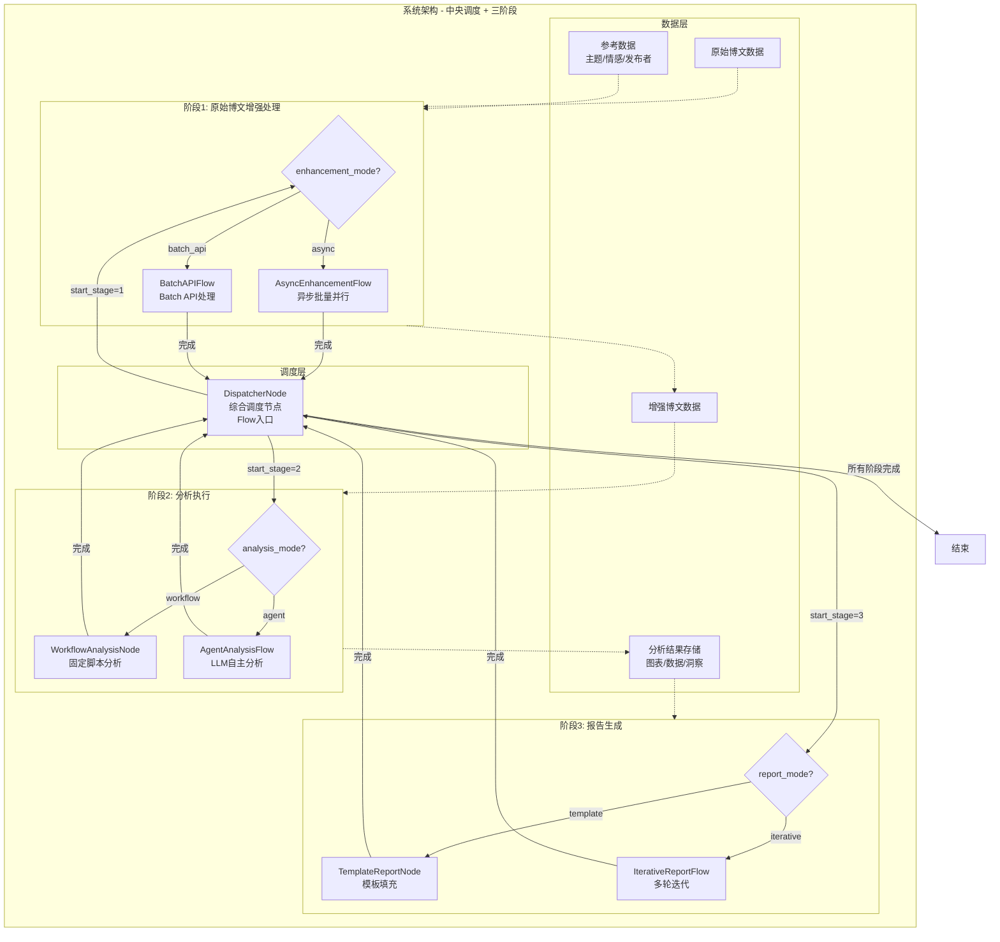
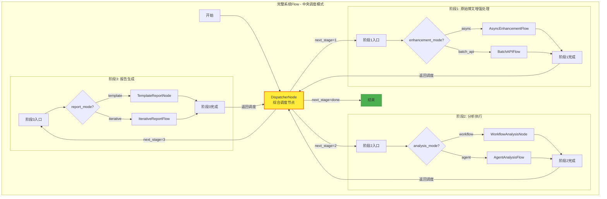
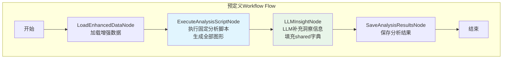
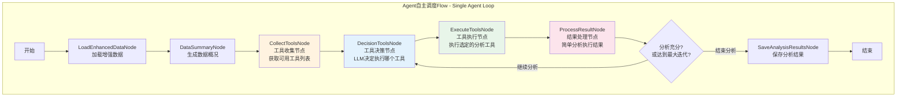
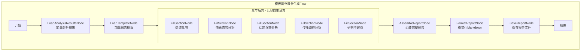
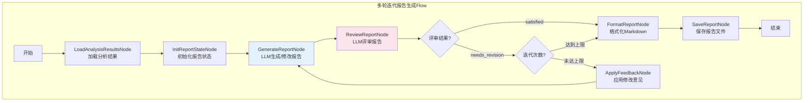

# 舆情分析智能体系统设计文档

> Please DON'T remove notes for AI


---

## 系统概述

### 项目背景
舆情分析智能体是一个基于PocketFlow框架的大规模博文数据分析系统，旨在通过多模态AI模型实现对社交媒体博文内容的深度分析和智能报告生成。

### 核心特性
- **三阶段解耦**：增强处理、分析执行、报告生成三阶段独立运行
- **多维度分析**：情感极性、情感属性、主题分类、发布者识别
- **多路径执行**：每阶段支持多种执行方式（异步/Batch API、Agent/Workflow、模板/迭代）
- **大规模处理**：支持3万条博文数据的批量处理
- **多模态支持**：文本与图像内容的综合分析

---

## 需求分析

> Notes for AI: Keep it simple and clear.
> If the requirements are abstract, write concrete user stories
> 需求按三阶段解耦架构组织，每个阶段独立运行并支持多种执行路径

### 核心需求 - 三阶段解耦架构

#### 阶段1: 原始博文增强处理
**功能描述**：为每个博文添加四个维度的分析信息，支持独立运行

**四维度分析**：
- **情感极性分析**：1-5档情感分级
  - 1-极度悲观，2-悲观，3-无明显极性，4-乐观，5-极度乐观
- **情感属性分析**：具体情感状态识别
  - 生气、支持、担忧、兴奋、失望、希望、恐惧、满意、惊讶等
- **两级主题分析**：从预定义的两层嵌套主题列表中选择合适主题
- **发布者对象分析**：识别发布者类型
  - 政府机构、官方新闻媒体、自媒体、企业账号、个人用户等

**执行路径**：
- **异步批量并行**：本地代码并发调用API，适合中小规模数据
- **Batch API并行**：一次性提交批量请求到API服务端，适合大规模数据

#### 阶段2: 分析执行
**功能描述**：基于增强数据执行深度分析，生成图表、表格和洞察，支持独立运行

**执行路径**：
- **预定义Workflow**（思路1）：执行固定的分析脚本
  - 流程：执行脚本生成全部图形 → LLM补充洞察信息 → 填充shared字典
  - 特点：可预测、高效、标准化
  - 适用：日常监控、常规分析、快速报告
- **Agent自主调度**（思路2）：Single Agent循环决策
  - 流程：工具收集 → 工具决策 → 工具执行 → 结果处理 → 返回决策（循环）
  - 终止条件：Agent判断分析已充分 或 达到最大迭代次数
  - 特点：灵活、智能、可探索隐藏模式
  - 适用：复杂分析、探索性研究、异常情况

**分析工具集**：四类核心分析工具集，每类包含若干工具函数

##### 2.1 情感趋势分析工具集
时间序列情感变化分析，包含以下工具函数：
- `sentiment_distribution_stats`：情感极性分布统计（各档位数量、占比）
- `sentiment_time_series`：情感时序趋势分析（按小时/天聚合）
- `sentiment_anomaly_detection`：情感异常点检测（突变、峰值识别）
- `sentiment_trend_chart`：情感趋势折线图/面积图生成
- `sentiment_pie_chart`：情感分布饼图生成

##### 2.2 主题演化分析工具集
主题热度变化和关联分析，包含以下工具函数：
- `topic_frequency_stats`：主题频次统计（父主题/子主题分布）
- `topic_time_evolution`：主题时序演化分析（热度变化趋势）
- `topic_cooccurrence_analysis`：主题共现关联分析（主题间关系）
- `topic_ranking_chart`：主题热度排行柱状图生成
- `topic_evolution_chart`：主题演化时序图生成
- `topic_network_chart`：主题关联网络图生成

##### 2.3 地理分布分析工具集
舆情地理分布和热点识别，包含以下工具函数：
- `geographic_distribution_stats`：地理分布统计（省份/城市级别）
- `geographic_hotspot_detection`：热点区域识别（高密度区域）
- `geographic_sentiment_analysis`：地区情感差异分析
- `geographic_heatmap`：地理热力图生成
- `geographic_bar_chart`：地区分布柱状图生成

##### 2.4 多维交互分析工具集
情感、主题、地理、发布者多维度交叉分析，包含以下工具函数：
- `publisher_distribution_stats`：发布者类型分布统计
- `cross_dimension_matrix`：多维交叉矩阵分析（如：发布者×情感、主题×地区）
- `influence_analysis`：影响力分析（互动量、传播力）
- `correlation_analysis`：维度相关性分析
- `interaction_heatmap`：交互热力图生成
- `publisher_bar_chart`：发布者分布柱状图生成

#### 阶段3: 报告生成
**功能描述**：综合分析结果，生成结构化的Markdown报告，支持独立运行

**执行路径**：
- **模板填充**：预定义大纲，LLM填充内容
  - 特点：效率高、格式一致、可控性强
  - 适用：格式要求固定的标准报告
- **多轮迭代**：生成-评审-修改循环
  - 特点：质量有保障、可自我完善
  - 适用：对报告质量要求极高的重要舆情事件

**数据输入**：
- **主要数据源**：阶段2输出的分析结果（图表、统计数据、洞察描述）
- **辅助数据源**：增强后博文数据的少量样本（用于典型案例引用、原文示例等）

#### 解耦架构设计
**设计理念**：三阶段顺序依赖（阶段1 → 阶段2 → 阶段3），但每个阶段可独立执行

**独立执行前提**：
- 每个阶段独立执行的前提是：**前序阶段已完成并将数据存储到指定位置**
- 阶段2独立执行：需要阶段1输出的增强数据（`data/enhanced_posts.json`）
- 阶段3独立执行：需要阶段2输出的分析结果（`report/` 目录下的图表和数据）

**运行模式**：
- **完整Flow**：阶段1 → 阶段2 → 阶段3（从原始数据到最终报告）
- **增强处理Flow**：仅运行阶段1（输出增强数据供后续使用）
- **分析执行Flow**：仅运行阶段2（需要已有增强数据）
- **报告生成Flow**：仅运行阶段3（需要已有分析结果）

#### 大规模处理能力
**处理能力**：支持3万条博文数据的高效处理

**实现方式**：通过在原始数据字典中附加新字段实现信息增强

### 数据格式规范

#### 输入数据格式
- **数据结构**：JSON对象数组结构，一次性加载到内存
- **博文结构**：
  ```json
  {
    "username": "string",
    "user_id": "string", 
    "content": "string",
    "publish_time": "string",
    "location": "string",
    "repost_count": "integer",
    "comment_count": "integer", 
    "like_count": "integer",
    "image_urls": ["string"]
  }
  ```
- **图片存储**：相对链接，存储在images/子文件夹
- **数据量**：控制在3万条博文以内

#### 输出数据格式
- **处理方式**：通过在原始博文对象中附加新的字段实现信息增强
- **增强后结构**：
  ```json
  {
    "username": "string",
    "user_id": "string",
    "content": "string", 
    "publish_time": "string",
    "location": "string",
    "repost_count": "integer",
    "comment_count": "integer",
    "like_count": "integer",
    "image_urls": ["string"],
    "sentiment_polarity": "dict",
    "sentiment_attribute": "dict", 
    "topics": "dict",
    "publisher": "dict"
  }
  ```

### 处理规则

#### 核心规则
- **三阶段顺序依赖**：阶段1 → 阶段2 → 阶段3，后序阶段依赖前序阶段输出
- **多路径执行**：每个阶段支持多种执行方式，通过shared字典中的参数控制
- **独立执行**：各阶段可独立运行，前提是前序阶段已完成并存储数据到指定位置
- **前置检查**：阶段2/3独立执行前需检查前序阶段输出文件是否存在
- **并行处理**：阶段1中四个分析维度完全并行，无先后顺序
- **模型调用**：所有分析通过多模态语言模型API调用进行
- **阶段数据隔离**：阶段3仅使用阶段2的分析结果和少量博文样本，不直接处理全量增强数据

#### 多路径执行架构
| 阶段 | 路径选项 | 控制参数 | 说明 |
|------|----------|----------|------|
| 阶段1: 增强处理 | 异步批量并行 | `enhancement_mode="async"` | 本地代码并发调用API |
| 阶段1: 增强处理 | Batch API并行 | `enhancement_mode="batch_api"` | 一次性提交批量请求到API服务端 |
| 阶段2: 分析执行 | 预定义Workflow | `analysis_mode="workflow"` | 执行固定脚本生成图形 → LLM补充信息 |
| 阶段2: 分析执行 | Agent自主调度 | `analysis_mode="agent"` | Single Agent循环决策执行工具 |
| 阶段3: 报告生成 | 模板填充 | `report_mode="template"` | 预定义大纲，LLM填充内容 |
| 阶段3: 报告生成 | 多轮迭代 | `report_mode="iterative"` | 生成-评审-修改循环 |

#### Agent工具调度方式
| 方式 | 控制参数 | 说明 |
|------|----------|------|
| MCP动态查询 | `tool_source="mcp"` | 通过Model Context Protocol动态获取工具列表 |
| 本地Function Calling | `tool_source="local"` | 返回本地注册的固定工具列表 |

#### 质量保证
- **结果验证**：所有分析结果必须通过预定义候选列表验证
- **错误处理**：提供完善的错误处理和重试机制
- **数据完整性**：确保增强数据的格式完整性和一致性
- **迭代控制**：多轮迭代报告生成设置最大迭代次数保障
- **前置验证**：阶段独立执行前验证前序输出文件存在且格式正确

## 架构设计

### 系统架构概览

舆情分析智能体采用**中央调度 + 三阶段顺序依赖架构**，基于PocketFlow框架构建。系统通过一个**综合调度节点（DispatcherNode）**作为入口和中央控制器，根据配置决定执行路径，每个阶段完成后返回调度节点决定下一步动作。



### 调度机制说明

**DispatcherNode（综合调度节点）**是整个系统的入口和中央控制器：

1. **启动阶段选择**：根据 `shared["config"]["start_stage"]` 决定从哪个阶段开始
2. **阶段内路径选择**：根据各阶段的配置参数选择具体执行路径
3. **阶段间流转**：每个阶段完成后返回调度节点，根据 `shared["config"]["run_stages"]` 决定是否继续下一阶段
4. **终止条件**：所有配置的阶段执行完毕后结束流程

| 阶段 | 配置参数 | 路径选项 | 执行形式 |
|------|----------|----------|----------|
| 阶段1 | `enhancement_mode` | `async` / `batch_api` | Flow |
| 阶段2 | `analysis_mode` | `workflow` / `agent` | Node / Flow |
| 阶段3 | `report_mode` | `template` / `iterative` | Node / Flow |

### 核心设计原则

#### 1. 中央调度架构
- **DispatcherNode**：作为系统入口和中央控制器
- **统一入口**：所有执行流程从DispatcherNode开始
- **阶段回调**：每个阶段完成后返回DispatcherNode，由调度节点决定下一步
- **灵活配置**：支持配置起始阶段和执行阶段列表

#### 2. 三阶段顺序依赖（与需求分析完全对应）
- **阶段1 - 原始博文增强处理**：为博文添加情感、主题、发布者等维度标注
  - 对应需求："阶段1: 原始博文增强处理 - 四维度分析"
  - 输出：`data/enhanced_posts.json`
- **阶段2 - 分析执行**：基于增强数据执行深度分析，生成图表、表格和洞察
  - 对应需求："阶段2: 分析执行 - 分析工具集"
  - 输出：`report/analysis_data.json`、`report/insights.json`、`report/images/`
- **阶段3 - 报告生成**：综合分析结果，生成结构化的Markdown报告
  - 对应需求："阶段3: 报告生成 - 报告输出"
  - 输入：阶段2输出 + 少量博文样本
  - 输出：`report/report.md`
- **顺序依赖**：阶段1 → 阶段2 → 阶段3
- **独立运行**：每个阶段可单独执行，前提是前序阶段已完成并存储数据到指定位置

#### 3. 多路径执行控制
- **统一控制机制**：所有执行路径通过shared字典中的参数控制
- **灵活切换**：运行时可动态选择执行路径
- **组合使用**：不同阶段可选择不同的执行路径组合

```python
# 调度控制参数示例
shared["dispatcher"]["start_stage"] = 1             # 起始阶段
shared["dispatcher"]["run_stages"] = [1, 2, 3]      # 执行阶段列表

# 路径控制参数示例
shared["config"]["enhancement_mode"] = "async"      # 或 "batch_api"
shared["config"]["analysis_mode"] = "agent"         # 或 "workflow"
shared["config"]["tool_source"] = "mcp"             # 或 "local"
shared["config"]["report_mode"] = "template"        # 或 "iterative"
```

#### 4. 模块化设计
- **独立模块**：每个功能模块都可以独立运行和测试
- **标准接口**：模块间通过标准化的数据接口通信
- **可插拔**：分析工具可以动态添加和替换（支持MCP动态发现）
- **版本兼容**：保持向后兼容性，支持平滑升级

#### 5. LLM调用解耦
- **统一接口**：所有LLM调用通过`call_llm`系列函数封装
- **模型可切换**：生成和评审可使用同一模型或不同模型
- **参数化配置**：模型选择、温度、token限制等通过配置控制


## Flow Design

> Notes for AI:
> 1. 系统采用三阶段解耦架构，与需求分析中定义的三阶段完全对应
> 2. 阶段1(增强处理)对应需求中的"四维度分析"
> 3. 阶段2(分析执行)对应需求中的"分析工具集"  
> 4. 阶段3(报告生成)对应需求中的"报告输出"
> 5. 每个阶段支持多种执行路径，通过shared["config"]参数控制
> 6. 所有流程图使用清晰的节点描述

### Applicable Design Pattern:

1. **Central Dispatcher Pattern**: 系统入口和中央调度
   - 综合调度节点作为Flow入口，统一管理三阶段的执行流程
   - 根据配置决定启动阶段、执行路径
   - 每个阶段完成后返回调度节点，决定下一步动作
   - 实现阶段间的解耦和灵活组合

2. **Batch Pattern**: 用于阶段1(增强处理)
   - 对应需求：四维度分析（情感极性、情感属性、主题、发布者）
   - 四个分析维度通过Batch节点独立处理
   - 支持异步批量并行(async)和Batch API并行(batch_api)两种方式

3. **Workflow Pattern**: 用于阶段2(分析执行)的预定义流程路径（思路1）
   - 对应需求：分析工具集的预定义Workflow执行路径
   - 流程：执行固定脚本生成全部图形 → LLM补充洞察信息 → 填充shared字典
   - 特点：可预测、高效

4. **Agent Loop Pattern**: 用于阶段2(分析执行)的智能体调度路径（思路2）
   - 对应需求：分析工具集的Agent自主调度执行路径
   - 流程：CollectTools → DecisionTools → ExecuteTools → ProcessResult → 返回Decision（循环）
   - 终止条件：Agent判断分析充分 或 达到最大迭代次数
   - 支持MCP动态查询和本地Function Calling两种工具来源

5. **Iterative Pattern**: 用于阶段3(报告生成)的多轮迭代路径
   - 对应需求：报告输出的多轮迭代执行路径
   - 生成 → 评审 → 修改循环，直到满意或达到最大迭代次数

### Flow high-level Design:

#### 完整系统Flow总览（中央调度模式）

系统采用中央调度模式，DispatcherNode作为入口和控制中心，根据配置决定执行路径，每个阶段完成后返回调度节点。



#### 调度逻辑说明

**DispatcherNode工作流程**：
1. 读取 `shared["config"]["start_stage"]` 确定起始阶段
2. 读取 `shared["config"]["run_stages"]` 确定需要执行的阶段列表
3. 根据当前阶段的配置参数选择具体执行路径（Flow或Node）
4. 阶段完成后更新 `shared["dispatcher"]["current_stage"]`，返回调度节点
5. 调度节点判断下一步：继续下一阶段 或 结束

**路径选择规则**：
| 阶段 | 配置参数 | 选项 | 执行形式 | 说明 |
|------|----------|------|----------|------|
| 阶段1 | `enhancement_mode` | `async` | Flow | 异步并行处理Flow |
| | | `batch_api` | Flow | Batch API处理Flow |
| 阶段2 | `analysis_mode` | `workflow` | Node | 固定脚本分析节点 |
| | | `agent` | Flow | LLM自主分析Flow |
| 阶段3 | `report_mode` | `template` | Node | 模板填充节点 |
| | | `iterative` | Flow | 多轮迭代Flow |

---

#### 阶段1详细设计: 原始博文增强处理Flow

##### 1.1 异步批量并行处理路径 (enhancement_mode="async")

```mermaid
flowchart TD
    subgraph AsyncEnhancementFlow[异步批量并行处理Flow]
        async_start[开始] --> async_load[DataLoadNode<br/>加载原始博文数据]
        async_load --> async_validate[DataValidationNode<br/>验证数据格式]
        async_validate --> async_parallel[AsyncParallelBatchFlow<br/>异步并行处理]
        
        subgraph async_parallel[AsyncParallelBatchFlow - 四维度并行]
            async_sentiment_polarity[AsyncSentimentPolarityBatchNode<br/>情感极性分析]
            async_sentiment_attribute[AsyncSentimentAttributeBatchNode<br/>情感属性分析]
            async_topic[AsyncTopicAnalysisBatchNode<br/>两级主题分析]
            async_publisher[AsyncPublisherAnalysisBatchNode<br/>发布者对象分析]
        end
        
        async_parallel --> async_merge[DataMergeNode<br/>合并增强结果]
        async_merge --> async_quality[QualityCheckNode<br/>质量检查]
        async_quality --> async_save[SaveEnhancedDataNode<br/>保存增强数据]
        async_save --> async_end[结束]
    end
```



##### 1.2 Batch API并行处理路径 (enhancement_mode="batch_api")

```mermaid
flowchart TD
    subgraph BatchAPIEnhancementFlow[Batch API并行处理Flow]
        batch_start[开始] --> batch_load[DataLoadNode<br/>加载原始博文数据]
        batch_load --> batch_validate[DataValidationNode<br/>验证数据格式]
        batch_validate --> batch_prepare[BatchRequestPrepareNode<br/>准备批量请求]
        
        subgraph batch_submit[Batch API提交 - 四维度]
            batch_sentiment_polarity[SubmitBatchJobNode<br/>情感极性批量任务]
            batch_sentiment_attribute[SubmitBatchJobNode<br/>情感属性批量任务]
            batch_topic[SubmitBatchJobNode<br/>主题分析批量任务]
            batch_publisher[SubmitBatchJobNode<br/>发布者分析批量任务]
        end
        
        batch_prepare --> batch_submit
        batch_submit --> batch_poll[BatchJobPollNode<br/>轮询任务状态]
        batch_poll --> batch_retrieve[BatchResultRetrieveNode<br/>获取批量结果]
        batch_retrieve --> batch_merge[DataMergeNode<br/>合并增强结果]
        batch_merge --> batch_quality[QualityCheckNode<br/>质量检查]
        batch_quality --> batch_save[SaveEnhancedDataNode<br/>保存增强数据]
        batch_save --> batch_end[结束]
    end
```



---

#### 阶段2详细设计: 分析执行Flow

> 阶段2提供两种执行思路：
> - **Workflow路径**：执行固定脚本生成全部图形，然后调用LLM补充信息填充shared字典
> - **Agent路径**：Single Agent自主决策，通过循环反复执行工具直到分析充分或达到最大迭代次数

##### 2.1 预定义Workflow路径 (analysis_mode="workflow")

执行固定的分析脚本，按顺序生成所有图形，然后通过LLM调用补充洞察信息。



##### 2.2 Agent自主调度路径 (analysis_mode="agent")

Single Agent通过循环自主决策执行哪些分析工具，直到认为分析充分或达到最大迭代次数。



---

#### 阶段3详细设计: 报告生成Flow

##### 3.1 模板填充路径 (report_mode="template")



##### 3.2 多轮迭代路径 (report_mode="iterative")



---

### Flow编排架构

#### 系统入口Flow

| Flow/Node名称 | 类型 | 用途 | 说明 |
|---------------|------|------|------|
| MainFlow | Flow | 系统入口 | 以DispatcherNode为起点，串联所有阶段 |
| DispatcherNode | Node | 综合调度 | 根据配置决定执行路径，阶段完成后返回此节点 |

#### 阶段Flow/Node说明

| Flow/Node名称 | 阶段 | 执行形式 | 用途 | 触发Action |
|---------------|------|----------|------|------------|
| AsyncEnhancementFlow | 阶段1 | Flow | 异步批量并行处理 | `stage1_async` |
| BatchAPIFlow | 阶段1 | Flow | Batch API并行处理 | `stage1_batch_api` |
| WorkflowAnalysisNode | 阶段2 | Node | 固定脚本分析 | `stage2_workflow` |
| AgentAnalysisFlow | 阶段2 | Flow | LLM自主分析 | `stage2_agent` |
| TemplateReportNode | 阶段3 | Node | 模板填充报告 | `stage3_template` |
| IterativeReportFlow | 阶段3 | Flow | 多轮迭代报告 | `stage3_iterative` |

#### Flow编排优势
- **中央调度**：DispatcherNode统一管理流程，每个阶段完成后返回调度节点
- **灵活启动**：可配置起始阶段和执行阶段列表，支持从任意阶段开始
- **动态路径**：通过shared配置动态选择每个阶段的具体执行路径
- **顺序依赖解耦**：阶段1→2→3顺序依赖，但每个阶段可独立运行
- **断点续传**：每个阶段输出持久化到指定位置，支持从中间阶段恢复

## 分析工具集设计

> Notes for AI: 
> - 分析工具集是阶段2（分析执行）的核心组件，对应需求分析中的"阶段2: 分析执行 - 分析工具集"
> - 工具集采用统一架构，每类工具集包含数据处理和可视化两类函数
> - 所有工具函数遵循统一的输入输出规范，便于Agent动态调用或Workflow固定流程调用

### 工具集概述

系统提供四类核心分析工具集（对应需求分析中的2.1-2.4），每类工具集包含若干工具函数：

| 工具集 | 功能定位 | 数据处理函数 | 可视化函数 |
|--------|----------|--------------|------------|
| 情感趋势分析 | 时间序列情感变化分析 | 分布统计、时序分析、异常检测 | 趋势图、饼图 |
| 主题演化分析 | 主题热度变化和关联分析 | 频次统计、演化分析、共现分析 | 排行图、演化图、网络图 |
| 地理分布分析 | 舆情地理分布和热点识别 | 分布统计、热点检测、地区情感 | 热力图、柱状图 |
| 多维交互分析 | 多维度交叉分析 | 发布者分布、交叉矩阵、影响力、相关性 | 热力图、柱状图 |

### 工具函数设计原则

1. **输入统一**：所有工具函数接收增强后的博文数据列表作为主要输入
2. **输出标准化**：返回包含 `data`、`summary`、`charts`（可选）的标准字典结构
3. **可视化自动存储**：可视化函数自动生成图表并存储到 `report/images/` 目录
4. **支持Agent调用**：工具函数通过统一注册表暴露，支持MCP和本地Function Calling两种调用方式

## Utility Functions

> Notes for AI: 基础工具函数按功能分类，详细实现参考 `utils/` 目录

### 工具函数分类

| 分类 | 文件位置 | 功能说明 |
|------|----------|----------|
| LLM调用 | `utils/call_llm.py` | 封装多种模型调用（纯文本、多模态、推理模式） |
| 数据加载 | `utils/data_loader.py` | 博文数据、参考数据的加载与保存 |
| 分析工具 | `utils/analysis_tools/` | 四类分析工具集的具体实现 |

## Node Design

### Shared Store

> Notes for AI: shared字典是节点间通信的核心，按中央调度+三阶段架构分区组织

```python
shared = {
    # === 数据管理（贯穿三阶段） ===
    "data": {
        "blog_data": [],              # 博文数据（原始或增强后）
        "topics_hierarchy": [],        # 主题层次结构（从data/topics.json加载）
        "sentiment_attributes": [],    # 情感属性列表（从data/sentiment_attributes.json加载）
        "publisher_objects": [],       # 发布者类型列表（从data/publisher_objects.json加载）
    },
    
    # === 调度控制（DispatcherNode使用） ===
    "dispatcher": {
        "start_stage": 1,              # 起始阶段：1 | 2 | 3
        "run_stages": [1, 2, 3],       # 需要执行的阶段列表
        "current_stage": 0,            # 当前执行到的阶段（0表示未开始）
        "completed_stages": [],        # 已完成的阶段列表
        "next_action": "stage1"        # 下一步动作：stage1 | stage2 | stage3 | done
    },
    
    # === 三阶段路径控制（对应需求分析中的三阶段架构） ===
    "config": {
        # 阶段1: 增强处理方式（对应需求：四维度分析）
        "enhancement_mode": "async",   # "async" | "batch_api"
        
        # 阶段2: 分析执行方式（对应需求：分析工具集）
        "analysis_mode": "workflow",   # "workflow" | "agent"
        "tool_source": "local",        # "local" | "mcp" (Agent模式下的工具来源)
        
        # 阶段3: 报告生成方式（对应需求：报告输出）
        "report_mode": "template",     # "template" | "iterative"
        
        # 阶段2 Agent配置
        "agent_config": {
            "max_iterations": 100
        },
        
        # 阶段3 迭代报告配置
        "iterative_report_config": {
            "max_iterations": 10,
        }
    },
    
    # === 阶段2运行时状态（Agent Loop模式） ===
    "agent": {
        "available_tools": [],         # 工具收集节点获取的可用工具列表
        "execution_history": [],       # 工具执行历史（每次循环记录）
        "current_iteration": 0,        # 当前循环迭代次数
        "max_iterations": 10,          # 最大迭代次数（防止无限循环）
        "is_finished": False           # Agent是否判断分析已充分
    },
    
    # === 阶段3报告生成状态 ===
    "report": {
        "iteration": 0,
        "current_draft": "",
        "revision_feedback": "",
        "review_history": []
    }
}
```

**阶段间数据传递**：
- **阶段1输出** → 阶段2输入：增强博文数据保存到 `data/enhanced_posts.json`
- **阶段2输出** → 阶段3输入：分析结果存储在 `report/` 目录
  - 图表文件：`report/images/`
  - 统计数据：`report/analysis_data.json`
  - 洞察描述：`report/insights.json`
- **阶段3输出**：最终报告 `report/report.md`

**独立执行说明**：
- 阶段2独立执行：需先检查 `data/enhanced_posts.json` 是否存在
- 阶段3独立执行：需先检查 `report/analysis_data.json` 和 `report/images/` 是否存在
- 阶段3仅从增强数据中读取少量博文样本用于典型案例引用

### Node Steps

> Notes for AI: 节点按中央调度+三阶段架构组织，DispatcherNode作为入口和中央控制器

---

## 系统入口节点

### DispatcherNode (综合调度节点)

**功能**：作为整个系统的入口和中央控制器，根据配置决定执行路径

**类型**：Regular Node（Flow入口）

**核心职责**：
1. 首次进入时，根据 `shared["dispatcher"]["start_stage"]` 确定起始阶段
2. 根据当前阶段的配置参数，决定进入哪个具体的Flow或Node
3. 阶段完成后返回时，更新状态并决定下一步动作
4. 所有阶段完成后，返回 `"done"` 结束流程

**实现步骤**：
- *prep*：读取调度配置和当前状态
  ```python
  dispatcher = shared.get("dispatcher", {})
  config = shared.get("config", {})
  return {
      "start_stage": dispatcher.get("start_stage", 1),
      "run_stages": dispatcher.get("run_stages", [1, 2, 3]),
      "current_stage": dispatcher.get("current_stage", 0),
      "completed_stages": dispatcher.get("completed_stages", []),
      "enhancement_mode": config.get("enhancement_mode", "async"),
      "analysis_mode": config.get("analysis_mode", "workflow"),
      "report_mode": config.get("report_mode", "template")
  }
  ```
- *exec*：计算下一步动作
  ```python
  # 确定下一个需要执行的阶段
  if current_stage == 0:
      next_stage = start_stage
  else:
      # 找到下一个在run_stages中且未完成的阶段
      next_stage = find_next_stage(run_stages, completed_stages, current_stage)
  
  if next_stage is None:
      return {"action": "done"}
  
  # 根据阶段确定具体路径
  if next_stage == 1:
      return {"action": f"stage1_{enhancement_mode}"}  # stage1_async 或 stage1_batch_api
  elif next_stage == 2:
      return {"action": f"stage2_{analysis_mode}"}     # stage2_workflow 或 stage2_agent
  elif next_stage == 3:
      return {"action": f"stage3_{report_mode}"}       # stage3_template 或 stage3_iterative
  ```
- *post*：更新调度状态，返回Action
  ```python
  shared["dispatcher"]["current_stage"] = next_stage
  shared["dispatcher"]["next_action"] = exec_res["action"]
  return exec_res["action"]  # 返回动作字符串作为Flow转移的Action
  ```

**返回的Action类型**：
| Action | 说明 | 目标 |
|--------|------|------|
| `stage1_async` | 阶段1异步处理 | AsyncEnhancementFlow |
| `stage1_batch_api` | 阶段1 Batch API处理 | BatchAPIFlow |
| `stage2_workflow` | 阶段2固定脚本分析 | WorkflowAnalysisNode |
| `stage2_agent` | 阶段2 LLM自主分析 | AgentAnalysisFlow |
| `stage3_template` | 阶段3模板填充 | TemplateReportNode |
| `stage3_iterative` | 阶段3多轮迭代 | IterativeReportFlow |
| `done` | 所有阶段完成 | 结束 |

**阶段完成后的回调**：
每个阶段的Flow/Node完成后，需要：
1. 更新 `shared["dispatcher"]["completed_stages"]` 添加当前阶段
2. 返回 `"dispatch"` Action，跳转回 DispatcherNode

---

## 阶段1节点: 原始博文增强处理（对应需求：四维度分析）

### 通用节点

**1. DataLoadNode (数据加载节点)**
- **功能**：加载原始博文数据
- **类型**：Regular Node
- **实现步骤**：
  - *prep*：读取数据文件路径配置
  - *exec*：加载JSON格式博文数据，验证数据格式完整性
  - *post*：将数据存储到 `shared["data"]["blog_data"]` 中

**2. DataValidationNode (数据验证节点)**
- **功能**：验证数据格式和完整性
- **类型**：Regular Node
- **实现步骤**：
  - *prep*：读取博文数据
  - *exec*：检查必需字段、数据类型、格式规范
  - *post*：记录验证结果，返回下一步Action

**3. DataMergeNode (数据合并节点)**
- **功能**：合并四个维度的增强结果
- **类型**：Regular Node
- **实现步骤**：
  - *prep*：读取四个维度的分析结果
  - *exec*：将结果合并到原始博文对象中
  - *post*：更新 `shared["data"]["blog_data"]`

**4. QualityCheckNode (质量检查节点)**
- **功能**：检查增强数据质量
- **类型**：Regular Node
- **实现步骤**：
  - *prep*：读取增强后的博文数据
  - *exec*：统计各字段填充率、验证候选列表匹配度
  - *post*：记录质量报告到 `shared["results"]["statistics"]`

**5. SaveEnhancedDataNode (保存增强数据节点)**
- **功能**：将增强数据持久化到文件
- **类型**：Regular Node
- **实现步骤**：
  - *prep*：读取增强数据和保存路径
  - *exec*：写入JSON文件
  - *post*：记录保存状态

### 异步批量并行路径节点 (enhancement_mode="async")

**6. AsyncSentimentPolarityBatchNode (异步情感极性分析节点)**
- **功能**：异步批量分析博文情感极性
- **类型**：AsyncParallelBatchNode
- **并发控制**：通过 `max_concurrent` 参数限制并发数
- **实现步骤**：
  - *prep_async*：返回博文数据列表
  - *exec_async*：对单条博文调用多模态LLM进行情感极性分析（1-5档）
  - *post_async*：将结果附加到博文对象的 `sentiment_polarity` 字段

**7. AsyncSentimentAttributeBatchNode (异步情感属性分析节点)**
- **功能**：异步批量分析博文情感属性
- **类型**：AsyncParallelBatchNode
- **实现步骤**：
  - *prep_async*：返回博文数据列表
  - *exec_async*：对单条博文调用LLM进行情感属性分析
  - *post_async*：将结果附加到 `sentiment_attribute` 字段

**8. AsyncTopicAnalysisBatchNode (异步主题分析节点)**
- **功能**：异步批量分析博文主题
- **类型**：AsyncParallelBatchNode
- **实现步骤**：
  - *prep_async*：返回博文数据列表
  - *exec_async*：对单条博文调用多模态LLM进行两级主题匹配
  - *post_async*：将结果附加到 `topics` 字段

**9. AsyncPublisherAnalysisBatchNode (异步发布者分析节点)**
- **功能**：异步批量识别发布者类型
- **类型**：AsyncParallelBatchNode
- **实现步骤**：
  - *prep_async*：返回博文数据列表
  - *exec_async*：对单条博文调用LLM进行发布者类型识别
  - *post_async*：将结果附加到 `publisher` 字段

### Batch API并行路径节点 (enhancement_mode="batch_api")

**10. BatchRequestPrepareNode (批量请求准备节点)**
- **功能**：将博文数据转换为Batch API请求格式
- **类型**：Regular Node
- **实现步骤**：
  - *prep*：读取博文数据和参考数据（主题列表、情感属性等）
  - *exec*：为四个维度分别构建批量请求JSONL文件
  - *post*：保存请求文件路径到 `shared["batch_api"]["request_files"]`

**11. SubmitBatchJobNode (提交批量任务节点)**
- **功能**：向API服务端提交批量任务
- **类型**：Regular Node
- **实现步骤**：
  - *prep*：读取请求文件路径
  - *exec*：调用Batch API接口提交任务，获取任务ID
  - *post*：保存任务ID到 `shared["batch_api"]["job_ids"]`

**12. BatchJobPollNode (任务状态轮询节点)**
- **功能**：轮询批量任务执行状态
- **类型**：Regular Node (with retry)
- **实现步骤**：
  - *prep*：读取任务ID列表
  - *exec*：查询各任务状态，等待全部完成
  - *post*：根据状态返回Action（"completed"/"polling"/"failed"）

**13. BatchResultRetrieveNode (批量结果获取节点)**
- **功能**：获取批量任务的执行结果
- **类型**：Regular Node
- **实现步骤**：
  - *prep*：读取已完成的任务ID
  - *exec*：下载并解析结果文件
  - *post*：将结果存入 `shared["batch_api"]["results"]`

---

## 阶段2节点: 分析执行（对应需求：分析工具集）

### 通用节点

**14. LoadEnhancedDataNode (加载增强数据节点)**
- **功能**：加载已完成增强处理的博文数据
- **类型**：Regular Node
- **前置检查**：验证阶段1输出文件是否存在（`data/enhanced_posts.json`）
- **实现步骤**：
  - *prep*：读取增强数据文件路径，检查前置条件
  - *exec*：加载JSON数据，验证增强字段完整性
  - *post*：存储到 `shared["data"]["blog_data"]`

**15. DataSummaryNode (数据概况生成节点)**
- **功能**：生成增强数据的统计概况
- **类型**：Regular Node
- **实现步骤**：
  - *prep*：读取增强数据
  - *exec*：计算各维度分布、时间跨度、总量等统计信息
  - *post*：存储到 `shared["results"]["agent_state"]["data_summary"]`

**16. SaveAnalysisResultsNode (保存分析结果节点)**
- **功能**：将分析结果持久化，供阶段3使用
- **类型**：Regular Node
- **输出位置**：
  - 统计数据：`report/analysis_data.json`
  - 洞察描述：`report/insights.json`
  - 图表文件：`report/images/`
- **实现步骤**：
  - *prep*：读取分析输出和图表列表
  - *exec*：保存JSON结果文件和图表
  - *post*：记录保存状态，供阶段3前置检查使用

### 预定义Workflow路径节点 (analysis_mode="workflow")

> 执行固定的分析脚本生成全部图形，然后通过LLM补充洞察信息

**17. ExecuteAnalysisScriptNode (执行分析脚本节点)**
- **功能**：执行固定的分析脚本，生成全部所需图形
- **类型**：Regular Node
- **实现步骤**：
  - *prep*：读取增强数据
  - *exec*：执行预定义的分析脚本，依次调用四类工具集的全部工具函数
    - 情感趋势分析工具集
    - 主题演化分析工具集
    - 地理分布分析工具集
    - 多维交互分析工具集
  - *post*：存储图形到 `report/images/`，记录生成的图表列表

**18. LLMInsightNode (LLM洞察补充节点)**
- **功能**：调用LLM为生成的图形补充洞察信息，填充shared字典
- **类型**：Regular Node (LLM Call)
- **实现步骤**：
  - *prep*：读取生成的图表列表和统计数据
  - *exec*：构建Prompt调用LLM，生成各维度的洞察描述
  - *post*：填充 `shared["results"]["insights"]`

**LLMInsightNode Prompt结构**：
```
你是一位资深舆情分析专家。根据以下分析数据，为每个维度生成洞察描述。

## 统计数据
{statistics_data}

## 生成的图表
{charts_list}

## 要求
为以下维度生成洞察：
1. 情感趋势洞察
2. 主题演化洞察
3. 地理分布洞察
4. 多维交互洞察

输出JSON格式：{"sentiment": "...", "topic": "...", "geographic": "...", "cross_dimension": "..."}
```

### Agent自主调度路径节点 (analysis_mode="agent")

> Single Agent通过循环自主决策，直到分析充分或达到最大迭代次数

**19. CollectToolsNode (工具收集节点)**
- **功能**：收集所有可用的分析工具列表
- **类型**：Regular Node
- **控制参数**：`shared["config"]["tool_source"]`
- **实现步骤**：
  - *prep*：读取 `tool_source` 配置
  - *exec*：
    - 若 `tool_source="mcp"`：调用MCP服务器查询可用工具
    - 若 `tool_source="local"`：返回本地注册的固定工具列表
  - *post*：将工具定义存储到 `shared["agent"]["available_tools"]`

**20. DecisionToolsNode (工具决策节点)**
- **功能**：LLM决定下一步执行哪个分析工具，或判断分析已充分
- **类型**：Regular Node (LLM Call)
- **循环入口**：Agent Loop的决策起点
- **实现步骤**：
  - *prep*：读取数据概况、可用工具、执行历史、当前迭代次数
  - *exec*：构建Prompt调用LLM，获取决策结果
  - *post*：解析决策，返回Action
    - `"execute"`: 执行选定的工具
    - `"finish"`: 分析已充分，结束循环

**DecisionToolsNode Prompt结构**：
```
你是一位资深舆情分析专家。根据当前数据概况和已执行的分析，决定下一步行动。

## 当前数据概况
{data_summary}

## 可用工具
{tool_definitions}

## 已执行的分析（迭代 {current_iteration}/{max_iterations}）
{execution_history}

## 决策要求
- 如需调用工具，输出：{"action": "execute", "tool_name": "...", "tool_params": {...}, "reason": "..."}
- 如分析已充分，输出：{"action": "finish", "reason": "..."}
```

**21. ExecuteToolsNode (工具执行节点)**
- **功能**：执行决策节点选定的分析工具
- **类型**：Regular Node
- **实现步骤**：
  - *prep*：读取决策结果中的工具名称和参数
  - *exec*：调用对应的工具函数
  - *post*：
    - 存储结果到 `shared["results"]["analysis_outputs"]`
    - 注册图表到 `shared["results"]["generated_charts"]`

**22. ProcessResultNode (结果处理节点)**
- **功能**：简单分析工具执行结果，更新执行历史，判断是否继续循环
- **类型**：Regular Node
- **循环控制**：根据分析结果和迭代次数决定是否返回决策节点
- **实现步骤**：
  - *prep*：读取工具执行结果和当前迭代次数
  - *exec*：格式化结果、提取关键发现、更新迭代计数
  - *post*：
    - 更新 `shared["agent"]["execution_history"]`
    - 增加迭代计数 `shared["agent"]["current_iteration"]` += 1
    - 检查是否达到最大迭代次数
    - 返回Action：`"continue"` 返回决策节点 或 `"finish"` 结束循环

---

## 阶段3节点: 报告生成（对应需求：报告输出）

### 通用节点

**25. LoadAnalysisResultsNode (加载分析结果节点)**
- **功能**：加载阶段2产生的分析结果
- **类型**：Regular Node
- **前置检查**：验证阶段2输出文件是否存在（`report/analysis_data.json`、`report/images/`）
- **数据来源**：
  - 主要：阶段2输出的分析结果（图表、统计数据、洞察描述）
  - 辅助：增强博文数据的少量样本（用于典型案例引用）
- **实现步骤**：
  - *prep*：读取分析结果文件路径，检查前置条件
  - *exec*：加载JSON数据和图表信息，抽取少量博文样本
  - *post*：存储到 `shared["results"]`

**26. FormatReportNode (报告格式化节点)**
- **功能**：格式化最终Markdown报告
- **类型**：Regular Node
- **实现步骤**：
  - *prep*：读取报告内容
  - *exec*：处理图片路径、修复格式问题、添加目录
  - *post*：更新 `shared["results"]["final_report_text"]`

**27. SaveReportNode (保存报告节点)**
- **功能**：保存最终报告到文件
- **类型**：Regular Node
- **实现步骤**：
  - *prep*：读取格式化后的报告
  - *exec*：写入Markdown文件
  - *post*：记录保存路径

### 模板填充路径节点 (report_mode="template")

**28. LoadTemplateNode (加载模板节点)**
- **功能**：加载预定义的报告模板
- **类型**：Regular Node
- **模板结构**：
```markdown
# 舆情深度分析报告

## 一、综述
{executive_summary}

## 二、情感态势分析
{sentiment_analysis}

## 三、话题演变深度解析
{topic_analysis}

## 四、传播路径与人群画像
{spread_analysis}

## 五、研判与建议
{recommendations}
```
- **实现步骤**：
  - *prep*：读取模板文件路径
  - *exec*：加载模板内容
  - *post*：存储到 `shared["report"]["template"]`

**29. FillSectionNode (章节填充节点)**
- **功能**：使用LLM填充单个章节内容
- **类型**：Regular Node (LLM Call)
- **实现步骤**：
  - *prep*：读取章节模板和相关分析结果
  - *exec*：构建章节填充Prompt，调用LLM生成内容
  - *post*：存储章节内容到 `shared["report"]["sections"][section_name]`

**30. AssembleReportNode (报告组装节点)**
- **功能**：将各章节组装成完整报告
- **类型**：Regular Node
- **实现步骤**：
  - *prep*：读取所有已填充的章节
  - *exec*：按模板顺序组装报告
  - *post*：存储到 `shared["results"]["final_report_text"]`

### 多轮迭代路径节点 (report_mode="iterative")

**31. InitReportStateNode (初始化报告状态节点)**
- **功能**：初始化迭代报告生成的状态
- **类型**：Regular Node
- **实现步骤**：
  - *prep*：读取分析结果和配置
  - *exec*：初始化迭代计数器、历史记录
  - *post*：设置 `shared["report"]["iteration"]` = 0, `shared["report"]["max_iterations"]`

**32. GenerateReportNode (报告生成节点)**
- **功能**：LLM生成或修改报告
- **类型**：Regular Node (LLM Call)
- **实现步骤**：
  - *prep*：读取分析结果、当前报告草稿、修改意见
  - *exec*：构建Prompt调用LLM生成/修改报告
  - *post*：存储报告草稿到 `shared["report"]["current_draft"]`

**GenerateReportNode Prompt结构**：
```
你是资深舆情分析专家，请撰写/修改舆情分析报告。

## 分析数据
{analysis_results_summary}

## 可用图表
{charts_list}

## 当前草稿（如有）
{current_draft}

## 修改意见（如有）
{revision_feedback}

## 要求
- 格式：Markdown
- 结构：综述、情感分析、话题分析、传播分析、建议
- 必须引用可用图表（使用Markdown图片语法）
- 基于数据进行深度解读
```

**33. ReviewReportNode (报告评审节点)**
- **功能**：LLM评审报告质量并提出修改意见
- **类型**：Regular Node (LLM Call)
- **实现步骤**：
  - *prep*：读取当前报告草稿
  - *exec*：构建评审Prompt，调用LLM评审
  - *post*：根据评审结果返回Action
    - `"satisfied"`: 报告质量合格
    - `"needs_revision"`: 需要修改

**ReviewReportNode Prompt结构**：
```
你是资深舆情报告评审专家，请评审以下报告。

## 报告内容
{current_draft}

## 评审标准
1. 结构完整性：是否包含所有必需章节
2. 数据支撑：结论是否有数据依据
3. 图表引用：是否正确引用了分析图表
4. 逻辑连贯：各章节是否逻辑通顺
5. 建议可行性：应对建议是否具体可行

## 输出格式
{
    "verdict": "satisfied" 或 "needs_revision",
    "score": 0-100,
    "feedback": "具体修改意见（如需修改）"
}
```

**34. ApplyFeedbackNode (应用修改意见节点)**
- **功能**：处理评审意见，准备下一轮迭代
- **类型**：Regular Node
- **实现步骤**：
  - *prep*：读取评审意见
  - *exec*：格式化修改意见
  - *post*：
    - 增加迭代计数 `shared["report"]["iteration"]` += 1
    - 存储修改意见到 `shared["report"]["revision_feedback"]`
    - 检查是否达到最大迭代次数，返回相应Action

## 文件存储结构

> Notes for AI: 基于实际项目结构，明确各阶段的输入输出文件位置

```
project_root/
├── data/                           # 数据文件
│   ├── posts.json                  # [输入] 原始博文数据
│   ├── enhanced_posts.json         # [阶段1输出] 增强后博文数据
│   ├── topics.json                 # 主题层次结构
│   ├── sentiment_attributes.json   # 情感属性列表
│   └── publisher_objects.json      # 发布者类型列表
├── batch/                          # Batch API处理模块
│   ├── generate_jsonl.py           # 生成批量请求文件
│   ├── upload_and_start.py         # 上传并启动任务
│   ├── download_results.py         # 下载结果
│   └── parse_and_integrate.py      # 解析并整合结果
├── report/                         # 分析结果与报告输出
│   ├── images/                     # [阶段2输出] 可视化图表存储
│   ├── analysis_data.json          # [阶段2输出] 分析统计数据
│   ├── insights.json               # [阶段2输出] 洞察描述
│   ├── template.md                 # 报告模板
│   └── report.md                   # [阶段3输出] 最终生成的报告
├── utils/                          # 工具函数
│   ├── call_llm.py                 # LLM调用封装
│   └── data_loader.py              # 数据加载与保存
├── doc/                            # 文档
│   └── design.md                   # 设计文档
├── tests/                          # 测试
├── nodes.py                        # 节点定义
├── flow.py                         # 流程编排
├── EnhancementFlow.py              # 增强处理流程
└── main.py                         # 入口文件
```

### 阶段间数据传递约定

| 阶段 | 输入文件 | 输出文件 | 前置检查 |
|------|----------|----------|----------|
| 阶段1 | `data/posts.json` | `data/enhanced_posts.json` | 无 |
| 阶段2 | `data/enhanced_posts.json` | `report/analysis_data.json`<br>`report/insights.json`<br>`report/images/*` | 检查增强数据是否存在 |
| 阶段3 | `report/analysis_data.json`<br>`report/insights.json`<br>`report/images/*`<br>`data/enhanced_posts.json`(少量样本) | `report/report.md` | 检查分析结果是否存在 |

### 输出约定

- **阶段1输出**：增强博文数据存储到 `data/enhanced_posts.json`
- **阶段2输出**：分析结果存储在 `report/` 目录
  - 可视化图表：`report/images/`，命名格式 `{type}_{timestamp}.png`
  - 统计数据：`report/analysis_data.json`
  - 洞察描述：`report/insights.json`
- **阶段3输出**：最终报告 `report/report.md`

## 路径选择指南

### 设计理念

系统采用**三阶段顺序依赖 + 多路径执行**架构：
- **顺序依赖**：阶段1 → 阶段2 → 阶段3，后序阶段依赖前序阶段的输出
- **独立执行**：每个阶段可独立运行，前提是前序阶段已完成并存储数据到指定位置

| 阶段 | 对应需求 | 路径选项 | 权衡点 | 前置条件 |
|------|----------|----------|--------|----------|
| 阶段1: 增强处理 | 四维度分析 | 异步并行 / Batch API | 处理效率 vs API成本 | 无 |
| 阶段2: 分析执行 | 分析工具集 | Workflow(思路1) / Agent Loop(思路2) | 可预测性 vs 灵活性 | 阶段1输出存在 |
| 阶段3: 报告生成 | 报告输出 | 模板填充 / 多轮迭代 | 效率 vs 质量 | 阶段2输出存在 |

### 阶段1: 增强处理路径选择

#### 异步批量并行 (enhancement_mode="async")
- **适用场景**：中小规模数据（<5000条）、需要实时反馈
- **优势**：可控制并发数、支持实时进度监控、易于调试
- **劣势**：受本地资源限制、大规模时效率下降

#### Batch API并行 (enhancement_mode="batch_api")
- **适用场景**：大规模数据（>5000条）、对时效要求不高
- **优势**：服务端处理无本地资源限制、成本更低
- **劣势**：需要轮询等待、无法实时查看进度

### 阶段2: 分析执行路径选择

#### 预定义Workflow (analysis_mode="workflow") - 思路1
- **执行流程**：执行固定脚本生成全部图形 → LLM补充洞察信息 → 填充shared字典
- **适用场景**：
  - 标准化的日常舆情监控
  - 对分析路径有明确要求
  - 计算资源和时间有限
- **优势**：可预测性强、效率高、成本可控、易于调试
- **劣势**：灵活性不足、可能遗漏非预定义洞察

#### Agent自主调度 (analysis_mode="agent") - 思路2
- **执行流程**：工具收集 → 工具决策 → 工具执行 → 结果处理 → 返回决策（循环）
- **终止条件**：Agent判断分析已充分 或 达到最大迭代次数
- **适用场景**：
  - 复杂的多维度舆情分析
  - 数据特征不明确或异常情况
  - 需要探索性分析的舆情事件
- **工具来源选择**：
  - `tool_source="mcp"`: 动态发现工具，适合工具集频繁变化的场景
  - `tool_source="local"`: 固定工具列表，适合稳定的分析需求
- **优势**：灵活性高、能发现隐藏模式、自适应能力强
- **挑战**：结果不确定、成本较高、需要精心设计Prompt

### 阶段3: 报告生成路径选择

#### 模板填充 (report_mode="template")
- **适用场景**：
  - 格式要求固定的标准报告
  - 需要快速生成报告
  - 对报告结构有明确规范
- **模板结构**：预定义章节大纲（综述、情感分析、话题分析、传播分析、建议）
- **优势**：效率高、格式一致、可控性强
- **劣势**：灵活性受限于模板结构

#### 多轮迭代 (report_mode="iterative")
- **适用场景**：
  - 对报告质量要求极高
  - 需要深度解读和精细打磨
  - 重要的舆情事件报告
- **迭代机制**：
  - 生成 → 评审 → 修改 → 再评审
  - 最大迭代次数限制（默认5次）
  - 满意度阈值控制（默认80分）
- **优势**：质量有保障、可以自我完善
- **挑战**：时间成本高、需要更多API调用

## 阶段1增强处理实现要点

> 对应需求分析中的"阶段1: 原始博文增强处理"

### 异步批量并行 (enhancement_mode="async")

- 基于PocketFlow的 `AsyncParallelBatchNode` 实现
- 通过 `max_concurrent` 参数控制并发数，使用 `asyncio.Semaphore` 进行限流
- 四个分析维度（情感极性、情感属性、主题、发布者）可并行执行
- 支持异步重试和优雅降级
- 适用场景：中小规模数据（<5000条）、需要实时反馈

### Batch API并行 (enhancement_mode="batch_api")

- 将博文数据转换为JSONL请求文件
- 通过智谱Batch API一次性提交批量任务
- 轮询任务状态直到完成
- 下载并解析结果文件，整合到增强数据中
- 详细实现参考 `batch/` 目录
- 适用场景：大规模数据（>5000条）、对时效要求不高

## 技术考虑

### 性能优化
- **三阶段解耦**：各阶段独立运行，可针对性优化
- **阶段1批量处理**：使用BatchFlow实现四个分析维度的批量处理
- **阶段1并行执行**：四个BatchNode可以并行运行，提高处理效率
- **异步处理**：通过AsyncParallelBatchNode实现真正的并发处理，支持可配置的并发控制
- **结果缓存**：避免重复分析相同内容
- **分批加载**：大数据集分批处理避免内存溢出
- **并发控制**：使用信号量机制精确控制API调用频率，避免触发限流

### 可靠性设计
- **节点重试**：处理API调用失败和网络异常
- **降级策略**：关键模型不可用时的备用方案
- **数据验证**：严格的数据格式和完整性检查
- **异常处理**：完善的错误处理和恢复机制
- **前置检查**：各阶段独立执行前验证前序阶段输出文件是否存在
- **断点续传**：三阶段解耦支持从任意阶段恢复执行（需满足前置条件）

### 扩展性设计
- **三阶段独立扩展**：各阶段可独立添加新的执行路径
- **模块化架构**：便于添加新的分析维度和工具
- **插件化设计**：阶段2分析工具可插拔，易于扩展
- **配置化管理**：通过shared["config"]灵活调整系统行为
- **接口标准化**：统一的数据接口和工具调用规范


