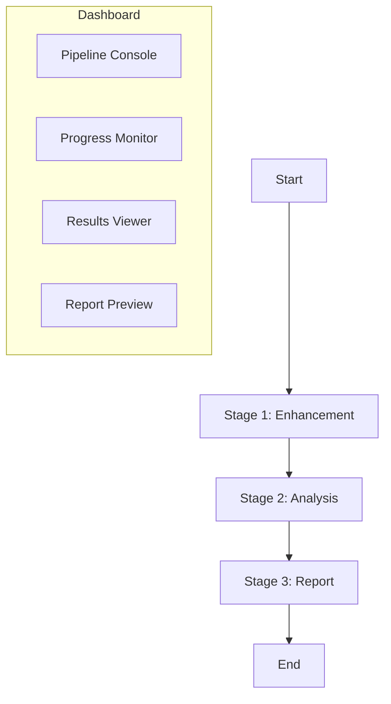

# Design Doc: AnalysisPosts v1.0 (Phase 1–3)

> Please DON'T remove notes for AI
> Last Updated: 2026-02-19

## Requirements

> Notes for AI: Keep it simple and clear. If the requirements are abstract, write concrete user stories.

- As an analyst, I can run a full pipeline (Stage 1–3) and get a report with charts and data-backed insights.
- As an operator, I can configure the pipeline visually and monitor progress in a web dashboard.
- As a developer, I can rely on tests to safely refactor nodes and tools (TDD-first).
- As a data user, I can export reports in Markdown.
- As a maintainer, I can extend analysis tools without editing core workflow code.

## Flow Design

> Notes for AI:
> 1. Consider the design patterns of agent, map-reduce, rag, and workflow. Apply them if they fit.
> 2. Present a concise, high-level description of the workflow.

### Applicable Design Pattern

1. **Workflow**: Stage 1 → Stage 2 → Stage 3 is a deterministic pipeline.
2. **Agent**: Stage 2 uses an agent loop for tool discovery and execution.

### Flow High-Level Design

1. **Stage 1 (Enhancement)**: Load raw posts → enrich with LLM + local NLP → save enhanced data.
2. **Stage 2 (Analysis)**: Load enhanced data → execute analysis tools (dynamic registry) → analyze charts → save results + trace.（Track A 第 3 项已提供 `utils/web_search.py`，供后续 QuerySearchFlow 接入）
3. **Stage 3 (Report)**: Load analysis results → generate report → format → save Markdown.
4. **Dashboard (Streamlit)**: Provide configuration, progress monitor, results viewer, report preview. DataFrame 等全宽展示统一使用 `width="stretch"`（内容宽度用 `width="content"`）。
   - A shared lock file at `report/.pipeline_running.lock` is used for concurrency control, created/cleared by both CLI and dashboard runs.
   - Status file reliability: reads fall back to an empty status when the file is missing/empty/invalid; writes use atomic replace to avoid partial files.

### Stage 2 Chart Coverage & MCP Migration

- **Chart coverage policy**: Stage 2 must generate at least one chart per dimension (sentiment/topic/geographic/interaction/NLP).
- **Coverage enforcement**: If the agent decides to finish but any dimension is missing, the system injects a chart tool to close the gap.
- **Coverage fallback**: After the agent loop, a dedicated fallback node attempts to generate missing charts.
- **MCP tool migration**: Every tool in `utils/analysis_tools/tool_registry.py` must be exposed in the MCP server with a canonical name, plus backward-compatible aliases for legacy MCP names.
- **Tool audit**: Mapping table lives in `mcp_tool_audit.md`.
- **Preflight + Fail Fast**: 如果 MCP 工具发现返回空列表，立即报错并输出依赖自检信息，避免进入后续节点产生误导性错误。
- **MCP Auto-Enable + Parsing**: MCP 客户端在 tool_source=mcp 时自动启用；解析优先级为 `content.data` > `content.text`，避免图表结构丢失。
- **Chart Missing Policy**: `stage2.chart_missing_policy` 控制图表覆盖不足时行为（`warn` 继续 / `fail` 终止）。

### Stage 3 Report Image Fallback

- If the generated report has **zero image references** but analysis charts exist, append a **Chart Appendix** listing all charts with `` paths.
- All image paths are normalized to `./images/` to keep reports portable.



## Utility Functions

> Notes for AI:
> 1. Include only the necessary utility functions, based on nodes in the flow.

1. **LLM Callers** (`utils/call_llm.py`)
   - Input: prompt (str), optional images
   - Output: response (str)
   - Used by Stage 1/2/3 nodes

2. **LLM Retry Decorator** (`utils/llm_retry.py`)
   - Input: function
   - Output: wrapped function with retry logic
   - Used by all LLM call utilities

3. **NLP Pipeline** (`utils/nlp/*`)
   - Input: text (str)
   - Output: tokens/keywords/entities/lexicon sentiment/cluster id
   - Used by Stage 1

4. **Path Manager** (`utils/path_manager.py`)
   - Input: chart id/title
   - Output: normalized file paths
   - Used by chart tools and report formatter

5. **JSON Data Source** (`utils/data_sources/json_source.py`)
   - Input: file path + query
   - Output: list of posts
   - Used by Stage 1 DataLoadNode

6. **MCP Client** (`utils/mcp_client/mcp_client.py`)
   - Input: server script path (and tool name + args for calls)
   - Output: tool list or tool result payload
   - Used by Stage 2 Agent nodes for tool discovery/execution

7. **Trace Manager** (`utils/trace_manager.py`)
   - Input: shared state + decision/execution/insight evidence payload
   - Output: trace mutation + serialized `report/trace.json`
   - Used by Stage 2 nodes and result save node

8. **Web Search Wrapper** (`utils/web_search.py`)
   - Input: query / queries + provider + API key + limits
   - Output: normalized search payload (`title/url/snippet/date/source`)
   - Used by upcoming Stage 2 QuerySearchFlow (Track A 第 3 项基础设施已就绪)

## Node Design

### Shared Store

```
shared = {
  "data": {...},
  "config": {...},
  "stage1_results": {...},
  "stage2_results": {...},
  "stage3_results": {...},
  "trace": {"decisions": [], "executions": [], "reflections": [], "insight_provenance": {}},
  "monitor": {...}
}
```

### Node Steps (High-Level)

1. **NLPEnrichmentNode**
   - Type: Regular
   - prep: read blog_data
   - exec: run text cleaner → tokenizer → keyword/NER/lexicon/similarity
   - post: write NLP fields back to shared

2. **CollectToolsNode (Agent)**
   - Type: Regular
   - prep: read config (tool_source=mcp)
   - exec: discover tools via MCP
   - post: write available_tools to shared

3. **DecisionToolsNode (Agent)**
   - Type: Regular
   - prep: read data summary + execution history
   - exec: decide next tool
   - post: write next_tool to shared

4. **Report Save Node**
   - Type: Regular
   - prep: read final report
   - exec: save Markdown
   - post: record output path
