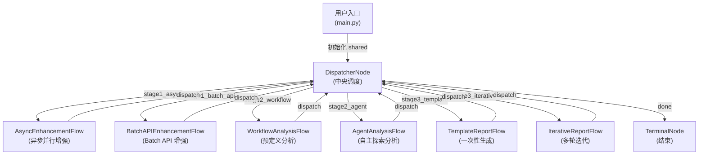
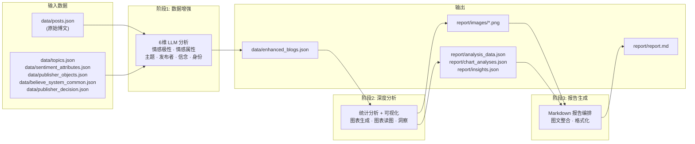
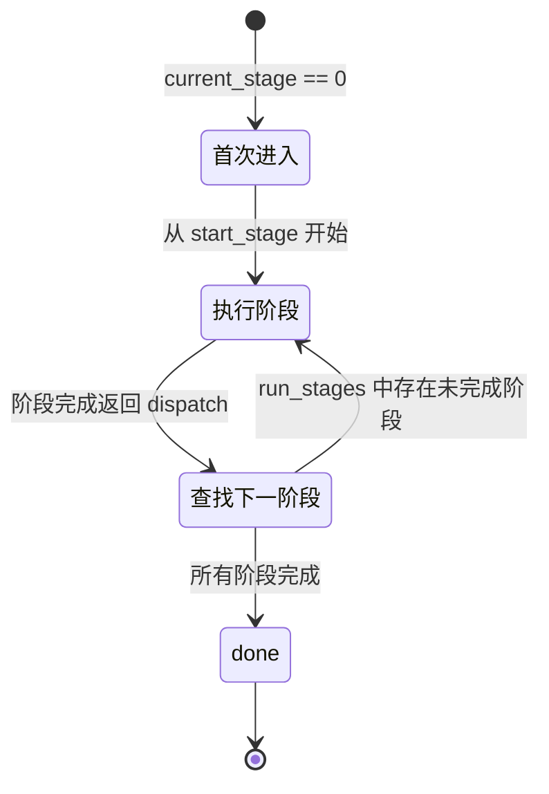

# 舆情分析智能体 — 系统设计总览

> **文档状态**: 2026-02-10 重构  
> **适用版本**: v0.1.0  
> **类型**: 核心设计文档（全景地图）

本文档是项目的**核心设计参考**，提供系统级的架构、数据流与配置概览。各子系统的**代码级实现细节**请参阅对应的分支文档（见 [§8 文档索引](#8-文档索引)）。

---

## 1. 项目概述

### 1.1 定位

本项目是一套**自动化舆情分析系统**（Intelligence Analysis Agent），面向社交媒体博文数据，实现从原始数据清洗到专业分析报告输出的全流程自动化。

### 1.2 技术选型

| 维度 | 选型 | 说明 |
|:---|:---|:---|
| 编排框架 | **PocketFlow** | 轻量级异步工作流引擎，`Node → Flow` 抽象 |
| LLM 能力 | **智谱 GLM 系列** | 4 个模型分别覆盖文本分析、视觉理解、深度推理 |
| 工具协议 | **MCP (Model Context Protocol)** | Agent 模式下的工具发现与调用 |
| 可视化 | **Matplotlib** | 生成 PNG 格式分析图表 |
| 数据处理 | **Pandas + NumPy** | DataFrame 统计、矩阵运算 |

### 1.3 设计理念

1. **中央调度 + 阶段解耦**：`DispatcherNode` 统一管理三阶段的执行顺序，各阶段封装为独立 Flow，互不依赖。
2. **多模式可切换**：每个阶段提供 2 种执行模式（如 async/batch_api），在 `main.py` 中通过配置参数切换。
3. **单一数据源 (`shared`)**：所有节点通过共享字典 `shared` 通信，无隐式状态。
4. **容错与断点续传**：阶段 1 的长时间批处理支持 Checkpoint 机制，中断后可恢复。

---

## 2. 系统架构

### 2.1 核心架构图



### 2.2 数据流全景



### 2.3 PocketFlow 节点类型

项目使用 PocketFlow 提供的 4 种基础节点类型：

| 类型 | 基类 | 用途 | 项目中的典型节点 |
|:---|:---|:---|:---|
| 同步节点 | `Node` | 简单的串行处理 | `DataLoadNode`、`SaveEnhancedDataNode` |
| 批处理节点 | `BatchNode` | 一次处理多条数据 | — |
| 异步节点 | `AsyncNode` | 异步 I/O（LLM 调用） | — |
| 异步批处理节点 | `AsyncNode + BatchNode` | 并发批量处理 | `AsyncParallelBatchNode`（自定义基类） |

所有节点遵循统一的 **`prep → exec → post`** 三阶段生命周期：
- **`prep(shared)`**：从 `shared` 读取本节点需要的数据
- **`exec(prep_res)`**：执行核心逻辑（纯函数，不操作 `shared`）
- **`post(shared, prep_res, exec_res)`**：将结果写回 `shared`，返回 Action 字符串决定下一跳

---

## 3. 中央调度器 — `DispatcherNode`

`DispatcherNode` 是整个系统的**唯一入口节点**和**路由中心**，实现了一个简单的状态机。

### 3.1 状态机逻辑



### 3.2 Action 路由表

| Action 字符串 | 目标 Flow | 触发条件 |
|:---|:---|:---|
| `stage1_async` | `AsyncEnhancementFlow` | `next_stage == 1` 且 `enhancement_mode == "async"` |
| `stage1_batch_api` | `BatchAPIEnhancementFlow` | `next_stage == 1` 且 `enhancement_mode == "batch_api"` |
| `stage2_workflow` | `WorkflowAnalysisFlow` | `next_stage == 2` 且 `analysis_mode == "workflow"` |
| `stage2_agent` | `AgentAnalysisFlow` | `next_stage == 2` 且 `analysis_mode == "agent"` |
| `stage3_template` | `TemplateReportFlow` | `next_stage == 3` 且 `report_mode == "template"` |
| `stage3_iterative` | `IterativeReportFlow` | `next_stage == 3` 且 `report_mode == "iterative"` |
| `done` | `TerminalNode` | 所有计划阶段已完成 |

### 3.3 `prep → exec → post` 实现

- **`prep`**：读取 `shared["dispatcher"]` 和 `shared["config"]`，提取 `start_stage`、`run_stages`、`current_stage`、`completed_stages` 及三个模式配置
- **`exec`**：计算下一个未完成的阶段编号，拼接 `stage{N}_{mode}` 形式的 Action 字符串
- **`post`**：更新 `shared["dispatcher"]["current_stage"]`，返回 Action

各阶段的 CompletionNode 在执行完毕后会将阶段编号追加到 `shared["dispatcher"]["completed_stages"]`，然后返回 `"dispatch"` 跳回 DispatcherNode。

---

## 4. Flow 编排 (`flow.py`)

`flow.py` 定义了 **6 个子 Flow** 和 **1 个主 Flow**。所有 Flow 由 `create_main_flow()` 统一注册到 DispatcherNode 的 Action 路由中。

### 4.1 Flow 清单

| 函数 | 类型 | 节点链路 |
|:---|:---|:---|
| `_create_async_enhancement_flow` | `AsyncFlow` | DataLoad → SentimentPolarity → SentimentAttribute → Topic → Publisher → Belief → PublisherDecision → Save → Validate → Complete |
| `_create_batch_api_enhancement_flow` | `Flow` | DataLoad → BatchAPI → Validate → Complete |
| `_create_workflow_analysis_flow` | `Flow` | LoadEnhanced → Summary → ExecuteScript → ChartAnalysis → LLMInsight → SaveResults → Complete |
| `_create_agent_analysis_flow` | `AsyncFlow` | LoadEnhanced → Summary → CollectTools → Decision ⇄ Execute ⇄ Process → ChartAnalysis → LLMInsight → SaveResults → Complete |
| `_create_template_report_flow` | `Flow` | LoadResults → GenerateFullReport → Format → Save → Complete |
| `_create_iterative_report_flow` | `AsyncFlow` | LoadResults → InitState → Generate ⇄ Review ⇄ ApplyFeedback → Format → Save → Complete |

> 注：`⇄` 表示存在循环路径

### 4.2 主 Flow `create_main_flow()`

```python
create_main_flow(
    concurrent_num: int = 60,   # 异步最大并发数
    max_retries: int = 3,       # 节点最大重试次数
    wait_time: int = 8          # 重试等待时间（秒）
) -> AsyncFlow
```

此函数创建 DispatcherNode + TerminalNode，实例化 6 个子 Flow，并通过 PocketFlow 的 `>>` 操作符连接 Action 路由：

```python
dispatcher - "stage1_async" >> async_enhancement_flow
async_enhancement_flow - "dispatch" >> dispatcher
# ... 其余 5 个子 Flow 同理
dispatcher - "done" >> terminal
```

### 4.3 独立运行入口

为方便调试，`flow.py` 还提供了两个独立运行函数：
- `create_stage2_only_flow(analysis_mode)` — 跳过阶段 1，直接运行阶段 2
- `create_stage3_only_flow(report_mode)` — 跳过阶段 1 和 2，直接运行阶段 3

---

## 5. 核心数据结构 `shared`

`shared` 字典是所有节点间通信的**唯一数据总线**，由 `main.py` 的 `init_shared()` 函数初始化。

### 5.1 顶级结构

| 键 | 类型 | 说明 | 填充时机 |
|:---|:---|:---|:---|
| `data` | Dict | 博文数据 + 参考数据 + 数据路径 | `init_shared` 初始化 → `DataLoadNode` 填充数据 |
| `dispatcher` | Dict | 调度器状态控制 | `init_shared` 初始化 → `DispatcherNode` 读写 |
| `config` | Dict | 全局配置（模式、路径、阈值） | `init_shared` 初始化（只读） |
| `agent` | Dict | Stage 2 Agent 循环运行时状态 | `init_shared` 初始化 → Agent 节点读写 |
| `report` | Dict | Stage 3 报告迭代状态 | `init_shared` 初始化 → 报告节点读写 |
| `stage1_results` | Dict | 阶段 1 统计与保存状态 | 阶段 1 节点填充 |
| `stage2_results` | Dict | 阶段 2 图表、洞察产出 | 阶段 2 节点填充 |
| `stage3_results` | Dict | 阶段 3 最终报告路径和元数据 | 阶段 3 节点填充 |
| `monitor` | Dict | 系统监控日志 | 各阶段节点追加 |
| `thinking` | Dict | LLM 思考过程记录 | Stage 2/3 LLM 节点填充 |

### 5.2 `config` 子结构详情

`config` 是运行时只读的配置字典，结构如下：

```
config
├── enhancement_mode         "async" | "batch_api"
├── analysis_mode            "workflow" | "agent"
├── report_mode              "template" | "iterative"
├── tool_source              "local" | "mcp"
├── stage1_checkpoint
│   ├── enabled              bool (默认 True)
│   ├── save_every           int  (默认 100，每 N 条保存一次)
│   └── min_interval_seconds float (默认 20 秒)
├── agent_config
│   └── max_iterations       int  (默认 10)
├── iterative_report_config
│   ├── max_iterations       int  (默认 5)
│   ├── satisfaction_threshold int (默认 80)
│   ├── enable_review        bool
│   └── quality_check        bool
├── data_source
│   ├── type                 "original" | "enhanced"
│   ├── resume_if_exists     bool (默认 True)
│   └── enhanced_data_path   str
└── batch_api_config
    ├── script_path           str
    ├── input_path            str
    ├── output_path           str
    └── wait_for_completion   bool
```

### 5.3 `data` 子结构详情

```
data
├── blog_data[]              博文数组（原始 → 增强后覆盖写回）
│   ├── content              str   博文正文
│   ├── publish_time         str   发布时间
│   ├── user_id              str   用户ID
│   ├── username             str   用户名
│   ├── repost_count         int   转发数
│   ├── comment_count        int   评论数
│   ├── like_count           int   点赞数
│   ├── images[]             list  图片URL列表
│   ├── ip_location          str   IP归属地
│   │   ── [增强字段] ──
│   ├── sentiment_polarity   int   情感极性 (1-5)
│   ├── sentiment_attribute  list  情感属性标签
│   ├── topics[]             list  [{parent, sub}] 二级主题
│   ├── publisher            str   发布者类型
│   ├── belief_signals       list  信念体系信号
│   └── publisher_decision   str   事件关联身份
├── topics_hierarchy[]       主题层次结构（参考数据）
├── sentiment_attributes[]   情感属性列表（参考数据）
├── publisher_objects[]      发布者类型列表（参考数据）
├── belief_system[]          信念体系分类（参考数据）
├── publisher_decisions[]    事件身份列表（参考数据）
└── data_paths{}             各文件路径映射
```

### 5.4 `stage2_results` 子结构详情

```
stage2_results
├── charts[]                 图表列表
│   ├── id                   str  图表标识符
│   ├── title                str  图表标题
│   ├── file_path            str  PNG 文件路径
│   ├── source_tool          str  生成该图表的工具名
│   └── analysis             str  GLM-4.5V 读图分析文本
├── tables[]                 数据表格列表
├── insights{}               LLM 生成的分析洞察
│   ├── sentiment_insight    str  情感趋势洞察
│   ├── topic_insight        str  主题演化洞察
│   ├── geographic_insight   str  地理分布洞察
│   ├── cross_dimension_insight str 多维交互洞察
│   └── summary_insight      str  综合洞察摘要
├── execution_log{}          执行记录
└── output_files{}           输出文件路径
```

---

## 6. 入口配置 (`main.py`)

### 6.1 `init_shared()` 参数

| 参数 | 类型 | 默认值 | 说明 |
|:---|:---|:---|:---|
| `input_data_path` | str | `"data/beijing_rainstorm_posts.json"` | 输入博文文件 |
| `output_data_path` | str | `"data/enhanced_blogs.json"` | 增强数据输出路径 |
| `topics_path` | str | `"data/topics.json"` | 主题层次结构 |
| `sentiment_attributes_path` | str | `"data/sentiment_attributes.json"` | 情感属性列表 |
| `publisher_objects_path` | str | `"data/publisher_objects.json"` | 发布者类型列表 |
| `belief_system_path` | str | `"data/believe_system_common.json"` | 信念体系分类 |
| `publisher_decision_path` | str | `"data/publisher_decision.json"` | 事件关联身份 |
| `start_stage` | int | `1` | 起始阶段 |
| `run_stages` | List[int] | `[1]` | 执行哪些阶段 |
| `enhancement_mode` | str | `"async"` | 阶段 1 模式 |
| `analysis_mode` | str | `"workflow"` | 阶段 2 模式 |
| `tool_source` | str | `"local"` | Agent 工具来源 |
| `agent_max_iterations` | int | `10` | Agent 最大迭代 |
| `report_mode` | str | `"template"` | 阶段 3 模式 |
| `report_max_iterations` | int | `5` | 报告最大迭代 |
| `report_min_score` | int | `80` | 报告满意度阈值 |
| `data_source_type` | str | `"original"` | 数据源类型 |

### 6.2 `run()` 运行时参数

| 参数 | 默认值 | 说明 |
|:---|:---|:---|
| `concurrent_num` | `60` | 异步处理最大并发数 |
| `max_retries` | `3` | 节点级重试次数 |
| `wait_time` | `8` | 重试间隔（秒） |

运行时会创建 `concurrent_num + 20` 个线程的线程池，用于异步调用同步 LLM 函数。

### 6.3 典型运行配置示例

```python
# 完整流程：阶段 1 → 2 → 3
RUN_STAGES = [1, 2, 3]
ENHANCEMENT_MODE = "async"
ANALYSIS_MODE = "workflow"
REPORT_MODE = "template"

# 仅运行阶段 2 + 3（阶段 1 已完成）
RUN_STAGES = [2, 3]
start_stage = 2
data_source_type = "enhanced"

# Agent 模式分析
ANALYSIS_MODE = "agent"
TOOL_SOURCE = "mcp"
AGENT_MAX_ITERATIONS = 40
```

### 6.4 前置条件检查

`main()` 函数根据 `RUN_STAGES` 自动检查：
- `[2]` 或 `[2,3]`：检查增强数据文件是否存在
- `[3]`：检查 `report/analysis_data.json`、`report/chart_analyses.json`、`report/insights.json` 是否存在
- Agent + MCP 模式：通过环境变量 `ENHANCED_DATA_PATH` 告知 MCP Server 增强数据路径

---

## 7. 三阶段概览

> 以下为各阶段的概要说明。详细的节点实现、Prompt 构建、算法逻辑请参阅分支文档。

### 7.1 阶段 1：数据增强

将原始博文增强为六维结构化数据。

| 模式 | Flow | 特点 |
|:---|:---|:---|
| `async` | `AsyncEnhancementFlow` | 异步并行调用 LLM，支持并发控制与 Checkpoint |
| `batch_api` | `BatchAPIEnhancementFlow` | 调用智谱 Batch API，低成本大规模处理 |

**六个增强维度**：情感极性 · 情感属性 · 二级主题 · 发布者类型 · 信念体系 · 事件关联身份

→ 详见 [阶段 1：数据增强子系统](stage1_enhancement.md)

### 7.2 阶段 2：深度分析

对增强数据进行统计分析、可视化生成和 LLM 洞察。

| 模式 | Flow | 特点 |
|:---|:---|:---|
| `workflow` | `WorkflowAnalysisFlow` | 预定义分析脚本，稳定高效 |
| `agent` | `AgentAnalysisFlow` | LLM 自主决策分析，探索性强 |

→ 详见 [阶段 2：深度分析子系统](stage2_analysis.md)

### 7.3 阶段 3：报告生成

将分析结果编排为 Markdown 格式的分析报告。

| 模式 | Flow | 特点 |
|:---|:---|:---|
| `template` | `TemplateReportFlow` | 一次性长文本生成（推荐） |
| `iterative` | `IterativeReportFlow` | 生成 → 评审 → 修改的多轮循环 |

→ 详见 [阶段 3：报告生成子系统](stage3_report.md)

---

## 8. 文档索引

| 文档 | 说明 |
|:---|:---|
| **本文档 `design.md`** | 系统全景地图：架构、数据流、配置 |
| [阶段 1：数据增强子系统](stage1_enhancement.md) | 六维分析节点、Checkpoint、Prompt 策略 |
| [阶段 2：深度分析子系统](stage2_analysis.md) | Workflow/Agent 模式、决策循环、图表分析 |
| [阶段 3：报告生成子系统](stage3_report.md) | Template/Iterative 模式、图片路径处理 |
| [分析工具库](analysis_tools.md) | 5 类工具模块、算法实现、注册表 |
| [工具函数文档](utils.md) | LLM 调用层、数据加载、路径处理 |
| [MCP 协议集成](mcp_integration.md) | MCP Server/Client、双模式工具分发 |
| [Batch API 批处理](batch_processing.md) | JSONL 格式、批量工作流、错误恢复 |
| [测试工作流](testing_workflow.md) | 测试架构、Mock 策略、运行指南 |

---

## 9. 开发环境与依赖

本项目使用 `uv` 进行依赖管理。

### 环境设置

```bash
pip install uv    # 安装 uv
uv venv           # 创建虚拟环境
uv sync           # 同步依赖
```

### 核心依赖 (`pyproject.toml`)

| 包 | 版本要求 | 用途 |
|:---|:---|:---|
| `pocketflow` | ≥ 0.0.3 | 核心编排框架 |
| `zai-sdk` | ≥ 0.0.4.2 | 智谱 AI 模型调用（GLM 系列） |
| `matplotlib` | ≥ 3.10.7 | 数据可视化 |
| `pandas` | ≥ 2.2.0 | DataFrame 数据处理 |
| `numpy` | ≥ 2.3.5 | 数值计算 |
| `mcp[cli]` | ≥ 1.22.0 | MCP 协议核心 |
| `fastmcp` | ≥ 2.13.0 | MCP 服务端框架 |
| `pydantic` | ≥ 2.0.0 | 数据验证 |
| `requests` | ≥ 2.32.5 | HTTP 客户端 |
