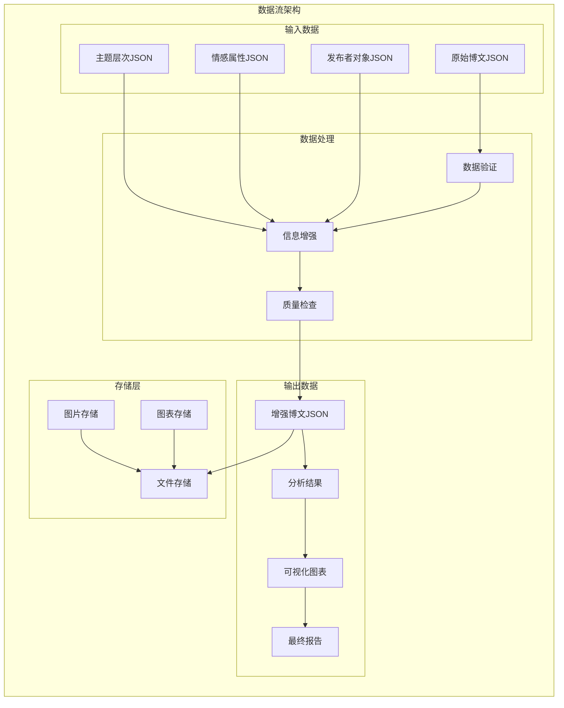
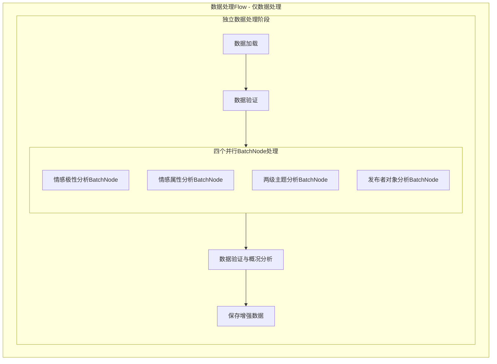
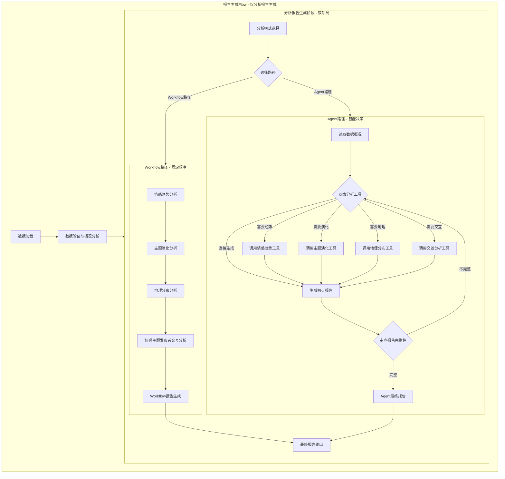

# 舆情分析智能体系统设计文档

> Please DON'T remove notes for AI

## 目录

1. [系统概述](#系统概述)
2. [需求分析](#需求分析)
3. [架构设计](#架构设计)
4. [数据模型](#数据模型)
5. [核心模块](#核心模块)
6. [工具函数](#工具函数)
7. [节点设计](#节点设计)
8. [实现规范](#实现规范)
9. [技术考虑](#技术考虑)
10. [部署指南](#部署指南)

---

## 系统概述

### 项目背景
舆情分析智能体是一个基于PocketFlow框架的大规模博文数据分析系统，旨在通过多模态AI模型实现对社交媒体博文内容的深度分析和智能报告生成。

### 核心特性
- **多维度分析**：情感极性、情感属性、主题分类、发布者识别
- **双轨制报告**：Workflow标准化路径 + Agent智能化路径
- **大规模处理**：支持3万条博文数据的批量处理
- **模块化架构**：数据处理与报告生成完全解耦
- **多模态支持**：文本与图像内容的综合分析

---

## 需求分析

> Notes for AI: Keep it simple and clear.
> If the requirements are abstract, write concrete user stories

### 核心需求

#### 1. 原始博文数据处理模块
**功能描述**：为每个博文并行添加四个维度的分析信息，支持独立运行

**具体需求**：
- **情感极性分析**：1-5档情感分级
  - 1-极度悲观，2-悲观，3-无明显极性，4-乐观，5-极度乐观
- **情感属性分析**：具体情感状态识别
  - 生气、支持、担忧、兴奋、失望、希望、恐惧、满意、惊讶等
- **两级主题分析**：从预定义的两层嵌套主题列表中选择合适主题
- **发布者对象分析**：识别发布者类型
  - 政府机构、官方新闻媒体、自媒体、企业账号、个人用户等

#### 2. 分析报告生成模块
**功能描述**：双轨制报告生成架构，支持独立运行

**双轨制架构**：
- **Workflow路径**：按预定义工作流顺序运行分析模块
  - 特点：可预测、高效、标准化
  - 适用：日常监控、常规分析、快速报告
- **Agent路径**：智能体自主决策调用工具并循环完善报告
  - 特点：灵活、智能、深度洞察
  - 适用：复杂分析、探索性研究、深度报告

**数据源兼容**：
- 支持读取原始博文数据
- 支持已处理的增强数据

#### 3. 分析工具集
**功能描述**：四个核心分析工具，支撑深度分析需求

**工具列表**：
- 情感趋势分析工具：时间序列情感变化分析
- 主题演化分析工具：主题热度变化和关联分析
- 地理分布分析工具：舆情地理分布和热点识别
- 情感主题发布者交互分析工具：多维度交叉分析

#### 4. 解耦合架构
**设计理念**：数据处理与分析报告生成完全独立，通过Flow编排支持多种运行模式

**运行模式**：
- **完整Flow**：数据处理 + 分析报告生成
- **数据处理Flow**：只运行数据处理模块
- **报告生成Flow**：跳过数据处理，直接对已有增强数据进行分析报告生成

#### 5. 大规模处理能力
**处理能力**：支持3万条博文数据的高效处理

**实现方式**：通过在原始数据字典中附加新字段实现信息增强

### 数据格式规范

#### 输入数据格式
- **数据结构**：JSON对象数组结构，一次性加载到内存
- **博文结构**：
  ```json
  {
    "username": "string",
    "user_id": "string", 
    "content": "string",
    "publish_time": "string",
    "location": "string",
    "repost_count": "integer",
    "comment_count": "integer", 
    "like_count": "integer",
    "image_urls": ["string"]
  }
  ```
- **图片存储**：相对链接，存储在images/子文件夹
- **数据量**：控制在3万条博文以内

#### 输出数据格式
- **处理方式**：通过在原始博文对象中附加新的字段实现信息增强
- **增强后结构**：
  ```json
  {
    "username": "string",
    "user_id": "string",
    "content": "string", 
    "publish_time": "string",
    "location": "string",
    "repost_count": "integer",
    "comment_count": "integer",
    "like_count": "integer",
    "image_urls": ["string"],
    "sentiment_polarity": "dict",
    "sentiment_attribute": "dict", 
    "topics": "dict",
    "publisher": "dict"
  }
  ```

### 处理规则

#### 核心规则
- **并行处理**：原始博文数据的四个分析维度完全并行，无先后顺序
- **模型调用**：所有分析通过多模态语言模型API调用进行
- **信息附加**：分析结果直接附加到原始博文数据字典中
- **双轨制**：报告生成支持Workflow和Agent两种路径

#### 质量保证
- **结果验证**：所有分析结果必须通过预定义候选列表验证
- **错误处理**：提供完善的错误处理和重试机制
- **数据完整性**：确保增强数据的格式完整性和一致性

## 架构设计

### 系统架构概览

舆情分析智能体采用分层模块化架构，基于PocketFlow框架构建，实现数据处理与分析报告生成的完全解耦。

```mermaid
flowchart TB
    subgraph SystemArchitecture[系统架构]
        subgraph DataLayer[数据层]
            raw_data[原始博文数据]
            enhanced_data[增强博文数据]
            reference_data[参考数据<br/>主题/情感/发布者]
        end
        
        subgraph ProcessingLayer[处理层]
            subgraph DataProcessing[数据处理模块]
                sentiment_polarity[情感极性分析]
                sentiment_attribute[情感属性分析]
                topic_analysis[两级主题分析]
                publisher_analysis[发布者对象分析]
            end
            
            subgraph AnalysisTools[分析工具集]
                trend_tool[情感趋势分析]
                evolution_tool[主题演化分析]
                geo_tool[地理分布分析]
                interaction_tool[交互分析工具]
            end
        end
        
        subgraph OrchestrationLayer[编排层]
            subgraph FlowEngine[Flow引擎]
                data_processing_flow[数据处理Flow]
                report_generation_flow[报告生成Flow]
                complete_flow[完整Flow]
            end
            
            subgraph ReportEngine[报告引擎]
                workflow_path[Workflow路径]
                agent_path[Agent路径]
                report_generator[报告生成器]
            end
        end
        
        subgraph UtilityLayer[工具层]
            llm_service[LLM调用服务]
            data_service[数据加载服务]
            viz_service[可视化服务]
            storage_service[存储服务]
        end
    end
    
    raw_data --> DataProcessing
    reference_data --> DataProcessing
    DataProcessing --> enhanced_data
    enhanced_data --> AnalysisTools
    AnalysisTools --> ReportEngine
    ReportEngine --> FlowEngine
    FlowEngine --> UtilityLayer
    UtilityLayer --> DataLayer
```



### 核心设计原则

#### 1. 分层解耦
- **数据层**：负责数据存储和管理，与业务逻辑完全分离
- **处理层**：包含数据处理和分析工具，专注于业务逻辑
- **编排层**：Flow引擎和报告引擎，负责流程控制和决策
- **工具层**：基础服务层，提供LLM调用、数据管理等通用能力

#### 2. 模块化设计
- **独立模块**：每个功能模块都可以独立运行和测试
- **标准接口**：模块间通过标准化的数据接口通信
- **可插拔**：分析工具可以动态添加和替换
- **版本兼容**：保持向后兼容性，支持平滑升级

#### 3. 双轨制架构
- **Workflow路径**：预定义的标准化分析流程
- **Agent路径**：智能体自主决策的探索性分析
- **混合模式**：支持两种路径的组合使用
- **动态切换**：根据数据特征和需求自动选择最优路径

### 技术架构选型

#### PocketFlow框架优势
- **轻量级**：100行核心代码，零依赖，无厂商锁定
- **表达力强**：支持Agent、Workflow、RAG、MapReduce等模式
- **易扩展**：节点和Flow可以灵活组合和嵌套
- **异步支持**：原生支持异步处理和并发控制

#### 多模态AI集成
- **GLM-4.5-air**：纯文本处理，适用于情感属性和发布者分析
- **GLM4V-plus**：视觉分析，适用于情感极性和主题分析
- **GLM4.5v-thinking**：思考模式，适用于Agent视觉理解
- **GLM4.6**：推理模式，适用于复杂决策和多模态推理

## 数据模型

### 数据流架构



### 核心数据结构

#### 1. 原始博文数据模型
```python
class RawBlogPost:
    """原始博文数据模型"""
    username: str          # 用户名
    user_id: str          # 用户ID
    content: str           # 博文内容
    publish_time: str     # 发布时间
    location: str          # 地理位置
    repost_count: int      # 转发数
    comment_count: int     # 评论数
    like_count: int        # 点赞数
    image_urls: List[str]  # 图片URL列表
```

#### 2. 增强博文数据模型
```python
class EnhancedBlogPost(RawBlogPost):
    """增强博文数据模型"""
    sentiment_polarity: Optional[int]           # 情感极性 (1-5)
    sentiment_attribute: Optional[List[str]]     # 情感属性列表
    topics: Optional[List[Dict]]              # 主题分析结果
    publisher: Optional[str]                   # 发布者类型
    processing_metadata: Optional[Dict]         # 处理元数据
```

#### 3. 分析结果数据模型
```python
class AnalysisResult:
    """分析结果数据模型"""
    tool_name: str                    # 工具名称
    analysis_type: str                 # 分析类型
    timestamp: str                    # 分析时间戳
    result_data: Dict                 # 分析结果数据
    charts: List[ChartInfo]          # 生成的图表信息
    insights: List[str]               # 关键洞察
    confidence: Optional[float]         # 结果置信度
```

#### 4. 图表信息数据模型
```python
class ChartInfo:
    """图表信息数据模型"""
    title: str                        # 图表标题
    file_path: str                     # 文件路径
    description: str                   # 图表描述
    chart_type: str                    # 图表类型
    metadata: Dict                     # 图表元数据
    created_at: str                    # 创建时间
```

### 数据质量保证

#### 1. 数据验证规则
- **格式验证**：严格检查JSON格式和数据类型
- **完整性验证**：确保必需字段存在且非空
- **一致性验证**：检查数据间的逻辑一致性
- **范围验证**：验证数值字段在合理范围内

#### 2. 数据清洗策略
- **重复数据去除**：基于内容哈希去除重复博文
- **无效数据处理**：处理空内容、异常字符等
- **标准化处理**：统一时间格式、地理位置等
- **异常值处理**：识别和处理异常的数值数据

#### 3. 数据增强质量控制
- **候选列表验证**：确保分析结果在预定义候选列表中
- **置信度阈值**：设置最低置信度要求
- **多轮验证**：关键分析结果进行多轮验证
- **人工抽样验证**：定期人工验证分析结果质量

## Flow Design

> Notes for AI:
> 1. Consider the design patterns of agent, map-reduce, rag, and workflow. Apply them if they fit.
> 2. Present a concise, high-level description of the workflow.

### Applicable Design Pattern:

1. **Batch Pattern**: 用于原始博文数据处理的四个分析维度
   - 四个分析维度通过Batch节点独立处理，无依赖关系
   - 使用BatchNode实现批量处理，每个维度独立处理所有博文数据

2. **Agent Pattern**: 用于报告生成的智能体路径
   - Context: 结构化数据和统计概况
   - Action: 动态调用分析工具，生成深度洞察

3. **Workflow Pattern**: 用于报告生成的预定义路径
   - 固定顺序调用分析工具，生成标准化分析结果

4. **Dual-Track Architecture**: 报告生成的双轨制设计
   - Workflow路径：可预测、高效的标准化分析
   - Agent路径：灵活、智能的探索性分析

### Flow high-level Design:

#### 1. CompleteFlow（完整流程 - 数据处理+分析报告生成）

```mermaid
flowchart TD
    subgraph CompleteFlow[完整Flow - 数据处理+分析报告生成]
        subgraph data_processing_stage[原始博文数据处理阶段 - 并行信息增强]
            data_load[数据加载] --> data_validation[数据验证]
            data_validation --> parallel_analysis[四个并行BatchNode]
            
            subgraph parallel_analysis[四个并行BatchNode处理]
                sentiment_polarity[情感极性分析BatchNode<br/>原地增强sentiment_polarity字段]
                sentiment_attribute[情感属性分析BatchNode<br/>原地增强sentiment_attribute字段]
                topic_analysis[两级主题分析BatchNode<br/>原地增强topics字段]
                publisher_analysis[发布者对象分析BatchNode<br/>原地增强publisher字段]
            end
            
            parallel_analysis --> final_validation[数据验证节点]
            final_validation --> enhanced_data[增强数据输出]
        end
        
        subgraph report_generation_stage[分析报告生成阶段 - 双轨制]
            analysis_mode_selection[分析模式选择] --> workflow_path{选择路径}
            
            workflow_path -->|Workflow路径| predefined_workflow[预定义工作流]
            workflow_path -->|Agent路径| intelligent_agent[智能体自主分析]
            
            subgraph predefined_workflow[Workflow路径 - 固定顺序]
                trend_analysis[情感趋势分析] --> evolution_analysis[主题演化分析]
                evolution_analysis --> geographic_analysis[地理分布分析]
                geographic_analysis --> interaction_analysis[情感主题发布者交互分析]
                interaction_analysis --> workflow_report[Workflow报告生成]
            end
            
            subgraph intelligent_agent[Agent路径 - 智能决策]
                agent_initial[读取数据概况] --> agent_decision{决策分析工具}
                agent_decision -->|需要趋势| agent_trend[调用情感趋势工具]
                agent_decision -->|需要演化| agent_evolution[调用主题演化工具]
                agent_decision -->|需要地理| agent_geographic[调用地理分布工具]
                agent_decision -->|需要交互| agent_interaction[调用交互分析工具]
                agent_decision -->|直接生成| agent_generate[生成初步报告]
                
                agent_trend --> agent_generate
                agent_evolution --> agent_generate
                agent_geographic --> agent_generate
                agent_interaction --> agent_generate
                
                agent_generate --> agent_review{审查报告完整性}
                agent_review -->|不完整| agent_decision
                agent_review -->|完整| agent_report[Agent最终报告]
            end
            
            workflow_report --> final_output[最终报告输出]
            agent_report --> final_output
        end
        
        enhanced_data --> analysis_mode_selection
    end
```



#### 2. DataProcessingFlow（数据处理Flow - 仅数据处理）



#### 3. ReportGenerationFlow（报告生成Flow - 仅分析报告生成）



### Flow编排架构

#### 1. CompleteFlow（完整流程）
- **组成**: DataProcessingFlow + ReportGenerationFlow
- **用途**: 从原始数据到最终报告的完整处理流程
- **数据流**: 原始博文 → 增强数据 → 分析报告

#### 2. DataProcessingFlow（数据处理流程）
- **组成**: 仅包含数据处理阶段的节点
- **用途**: 独立运行数据处理，生成增强数据
- **数据流**: 原始博文 → 增强数据 → 保存文件

#### 3. ReportGenerationFlow（报告生成流程）
- **组成**: 仅包含报告生成阶段的节点
- **用途**: 对已有增强数据进行分析报告生成
- **数据流**: 增强数据 → 分析报告

#### Flow编排优势
- **模块化**: 每个Flow都是独立的功能模块
- **可复用**: 节点可以在不同Flow中复用
- **灵活性**: 根据需求选择合适的Flow运行
- **易维护**: 独立的Flow便于调试和维护

## Tool Definitions (Refined for Visualization)

> Notes for AI: The tool output schema now explicitly includes 'charts'. We updated tool definitions to clearly inform Agent that calling these tools not only returns data, but also generates visualization files.

```json
{
  "tools": [
    {
      "name": "analyze_sentiment_trend",
      "description": "分析情感趋势并生成折线图/面积图。",
      "parameters": {
        "type": "object",
        "properties": {
          "time_granularity": {
            "type": "string",
            "enum": ["hour", "day"],
            "description": "时间聚合粒度，默认为'day'，突发事件建议用'hour'。",
            "default": "day"
          },
          "focus_sentiment": {
            "type": "string",
            "description": "特定关注的情感极性（如'1'表示极度悲观），不填则分析整体。",
            "default": null
          }
        },
        "required": []
      },
      "returns": {
        "summary": "趋势的文本摘要",
        "data_points": "关键数据点，用于LLM理解趋势",
        "charts": [
          {
            "title": "情感变化趋势图",
            "path": "outputs/images/sentiment_trend_{timestamp}.png",
            "description": "展示了正负面情感在7天内的波动情况，X轴为时间，Y轴为情感热度。"
          }
        ]
      }
    },
    {
      "name": "analyze_topic_evolution",
      "description": "分析话题演化并生成网络图/时间序列图。",
      "parameters": {
        "type": "object",
        "properties": {
          "top_k": {
            "type": "integer",
            "description": "返回热度最高的主题数量。",
            "default": 10
          },
          "evolution_phase": {
            "type": "string",
            "enum": ["all", "start", "peak", "end"],
            "description": "重点分析的阶段，'all'为全周期。",
            "default": "all"
          }
        },
        "required": []
      },
      "returns": {
        "hot_topics": "热门主题列表",
        "rising_topics": "上升趋势主题",
        "topic_network": "主题共现关系",
        "charts": [
          {
            "title": "话题演化网络图",
            "path": "outputs/images/topic_evolution_{timestamp}.png",
            "description": "展示了话题之间的关联关系和演化路径。"
          }
        ]
      }
    },
    {
      "name": "analyze_geographic_distribution",
      "description": "分析地理分布并生成热力地图。",
      "parameters": {
        "type": "object",
        "properties": {
          "map_level": {
            "type": "string",
            "enum": ["province", "city"],
            "description": "地理分析的行政级别。",
            "default": "province"
          },
          "min_post_count": {
            "type": "integer",
            "description": "过滤掉博文数量少于该值的地区。",
            "default": 10
          }
        },
        "required": []
      },
      "returns": {
        "hotspots": "热点地区列表",
        "charts": [
          {
            "title": "全国舆情热力分布",
            "path": "outputs/images/geo_map_{timestamp}.png",
            "description": "中国地图热力图，颜色越深代表讨论量越大。"
          }
        ]
      }
    },
    {
      "name": "analyze_publisher_interaction",
      "description": "分析发布者交互并生成交互矩阵图。",
      "parameters": {
        "type": "object",
        "properties": {
          "target_publisher_type": {
            "type": "string",
            "description": "特定关注的发布者类型（如'官方新闻媒体'），不填则分析所有。",
            "default": null
          },
          "cross_analysis_dimension": {
            "type": "string",
            "enum": ["sentiment", "topic"],
            "description": "与发布者进行交叉分析的维度。",
            "default": "topic"
          }
        },
        "required": ["cross_analysis_dimension"]
      },
      "returns": {
        "interaction_matrix": "交互矩阵",
        "publisher_influence": "各类发布者影响力分析",
        "charts": [
          {
            "title": "发布者类型交互热力图",
            "path": "outputs/images/publisher_interaction_{timestamp}.png",
            "description": "展示了不同发布者类型与话题/情感的交互强度。"
          }
        ]
      }
    }
  ]
}
```

## Utility Functions

> Notes for AI:
> 1. Understand the utility function definition thoroughly by reviewing the doc.
> 2. Include only the necessary utility functions, based on nodes in the flow.

### 基础工具函数

1. **glm-4.5-air纯文本模型调用** (`utils/call_llm.py` → `call_glm_45_air`)
   - *Input*: prompt (str), temperature (float), max_tokens (int)
   - *Output*: response (str)
   - 用于基础文本处理任务，不开启推理模式
   - 适用于情感属性分析和发布者对象分析

2. **glm4v-plus视觉分析模型调用** (`utils/call_llm.py` → `call_glm4v_plus`)
   - *Input*: prompt (str), image_paths (list), image_data (list), temperature (float), max_tokens (int)
   - *Output*: response (str)
   - 用于图像分析任务，不开启推理模式，支持JPEG和PNG格式
   - 适用于情感极性分析和两级主题分析

3. **glm4.5v思考模式模型调用** (`utils/call_llm.py` → `call_glm45v_thinking`)
   - *Input*: prompt (str),image_paths (list) , temperature (float), max_tokens (int), enable_thinking (bool)
   - *Output*: response (str)
   - 用于报告分析智能体的视觉理解任务，开启思考模式
   - 支持图像理解，与glm4.6组合使用

4. **glm4.6智能体推理模型调用** (`utils/call_llm.py` → `call_glm46`)
   - *Input*: prompt (str), temperature (float), max_tokens (int), enable_reasoning (bool)
   - *Output*: response (str)
   - 用于复杂推理任务，纯文本，开启推理模式
   - 与glm4.5v组合使用实现多模态推理

4. **加载博文数据** (`utils/data_loader.py` → `load_blog_data`)
   - *Input*: data_file_path (str)
   - *Output*: blog_data_list (list)
   - 一次性加载JSON格式博文数据到内存，支持3万条博文以内的数据处理

5. **加载主题数据** (`utils/data_loader.py` → `load_topics`)
   - *Input*: topics_file_path (str)
   - *Output*: topics_hierarchy (dict)
   - 从外部JSON文件加载两层嵌套的主题结构（10个父主题，约100个子主题）

6. **加载情感属性数据** (`utils/data_loader.py` → `load_sentiment_attributes`)
   - *Input*: sentiment_attributes_file_path (str)
   - *Output*: sentiment_attributes (dict)
   - 从外部JSON文件加载预定义的情感属性列表和分类

7. **加载发布者对象数据** (`utils/data_loader.py` → `load_publisher_objects`)
   - *Input*: publisher_objects_file_path (str)
   - *Output*: publisher_objects (dict)
   - 从外部JSON文件加载预定义的发布者对象类型和特征

8. **保存增强数据** (`utils/data_loader.py` → `save_enhanced_blog_data`)
   - *Input*: enhanced_blog_data (list), output_path (str)
   - *Output*: success (bool)
   - 将分析结果写入原始博文JSON文件，添加新的字段

9. **加载增强数据** (`utils/data_loader.py` → `load_enhanced_blog_data`)
   - *Input*: enhanced_data_path (str)
   - *Output*: enhanced_blog_data (list)
   - 加载已处理的增强数据，支持跳过数据处理阶段

10. **数据格式验证** (`utils/data_loader.py` → `validate_enhanced_data_format`)
   - *Input*: blog_data (list)
   - *Output*: validation_result (dict)
   - 验证增强数据格式的完整性，检查必需字段是否存在，并生成数据统计概况

### Agent分析工具函数

5. **情感趋势分析工具** (`utils/sentiment_trend_analysis.py`)
   - *Input*: enhanced_blog_data (list), time_range (str)
   - *Output*: trend_analysis_result (dict)
   - 预先设计的固定分析函数，分析情感随时间的变化趋势、拐点、异常模式
   - 返回格式：{"trend": str, "key_points": list, "anomalies": list, "insights": list}

6. **主题演化分析工具** (`utils/topic_evolution_analysis.py`)
   - *Input*: enhanced_blog_data (list), analysis_depth (str)
   - *Output*: evolution_analysis_result (dict)
   - 预先设计的固定分析函数，分析主题热度变化、新兴主题、衰退主题、主题关联
   - 返回格式：{"emerging_topics": list, "declining_topics": list, "topic_correlations": dict, "evolution_patterns": list}

7. **地理分布分析工具** (`utils/geographic_distribution_analysis.py`)
   - *Input*: enhanced_blog_data (list), analysis_type (str)
   - *Output*: geographic_analysis_result (dict)
   - 预先设计的固定分析函数，分析地区差异、热点区域、传播模式、地理聚类
   - 返回格式：{"hotspots": list, "regional_differences": dict, "spread_patterns": list, "geographic_insights": list}

8. **情感主题发布者交互分析工具** (`utils/sentiment_topic_publisher_interaction.py`)
   - *Input*: enhanced_blog_data (list), interaction_type (str)
   - *Output*: interaction_analysis_result (dict)
   - 预先设计的固定分析函数，分析情感、主题、发布者三者之间的交互关系和模式
   - 返回格式：{"interaction_patterns": dict, "correlations": dict, "insights": list, "recommendations": list}

## Node Design

### Shared Store

> Notes for AI: Try to minimize data redundancy

```python
shared = {
    # === 数据管理 ===
    "data": {
        # 博文数据：统一存储，原地增强
        # 原始数据格式：[{username: str, user_id: str, content: str, publish_time: str, location: str, repost_count: int, comment_count: int, like_count: int, image_urls: [str]}, ...]
        # 增强后格式：[{username: str, user_id: str, content: str, publish_time: str, location: str, repost_count: int, comment_count: int, like_count: int, image_urls: [str], sentiment_polarity: int, sentiment_attribute: [str], topics: [dict], publisher: str}, ...]
        "blog_data": [],  # 统一存储所有博文数据，通过原地添加字段实现信息增强
        
        # 主题层次结构：两层嵌套结构，外层数组包含多个字典，每个字典包含父主题和子主题列表
        # 数据格式：[{"parent_topic": str, "sub_topics": [str, str, ...]}, ...]
        # 示例：[{"parent_topic": "自然灾害", "sub_topics": ["暴雨", "洪水", "台风", ...]}, ...]
        "topics_hierarchy": [],  # 从data/topics.json加载，包含10个父主题和约100个子主题
        
        # 情感属性列表：预定义的情感状态词汇列表
        # 数据格式：[str, str, str, ...]
        # 示例：["生气", "支持", "担忧", "兴奋", "失望", "希望", "恐惧", "满意", "惊讶", ...]
        "sentiment_attributes": [],  # 从data/sentiment_attributes.json加载，包含约45个情感属性词汇
        
        # 发布者对象列表：预定义的发布者类型和职业列表
        # 数据格式：[str, str, str, ...]
        # 示例：["政府机构", "官方新闻媒体", "自媒体", "企业账号", "个人用户", "事业单位", ...]
        "publisher_objects": [],  # 从data/publisher_objects.json加载，包含约100个发布者类型
        
        # 数据文件路径配置
        "data_paths": {
            "blog_data_path": "data/beijing_rainstorm_posts.json",  # 原始博文数据文件路径
            "topics_path": "data/topics.json",  # 主题层次结构文件路径
            "sentiment_attributes_path": "data/sentiment_attributes.json",  # 情感属性文件路径
            "publisher_objects_path": "data/publisher_objects.json"  # 发布者对象文件路径
        }
    },
    
    # === 配置管理 ===
    "config": {
        "sentiment_levels": [1, 2, 3, 4, 5],  # 1-极度悲观，2-悲观，3-无明显极性，4-乐观，5-极度乐观
        "batch_size": 100,
        "processing": {
            "max_images_per_blog": 10,
            "retry_attempts": 3,
            "timeout": 30
        },
        "run_mode": "complete",  # 运行模式: complete, data_processing_only, analysis_only
        "data_source": {
            "type": "original",  # 数据源类型: original, enhanced
            "auto_detect": True,  # 自动检测数据源类型
            "enhanced_data_path": "data/enhanced_blogs.json"  # 增强数据文件路径
        },
        "analysis_mode": "workflow",
        "agent_config": {
            "max_iterations": 10,
            "auto_decision": True,
            "exploration_depth": "deep"
        }
    },
    
    # === 分析结果与中间状态 ===
    "results": {
        # 工具执行产生的结构化数据结果存储于此
        "analysis_outputs": {
            "sentiment_trend": None,
            "topic_evolution": None,
            "geographic_distribution": None,
            "publisher_interaction": None
        },
        
        # [新增] 可视化资源注册表（供Agent引用图片）
        # 这是一个列表，记录了所有已生成的图片及其元数据
        "generated_charts": [
            # 示例
            # {
            #   "tool_source": "analyze_sentiment_trend",
            #   "file_path": "outputs/images/trend_20231025.png",
            #   "title": "7日情感走势图",
            #   "content_summary": "10月24日出现负面峰值..."
            # }
        ],
        
        # Agent运行时的状态记录
        "agent_state": {
            "history": [], # 保存Agent的思考过程：[{"step": 1, "thought": "...", "action": "...", "observation": "..."}, ...]
            "current_iteration": 0,
            "plan_completed": False,
            "data_summary": {} # 数据概况，用于Prompt上下文
        },
        
        # 最终报告文本
        "final_report_text": "",
        
        # 兼容性字段（保持向后兼容）
        "analysis": {
            "sentiment_trend": {},
            "topic_evolution": {},
            "geographic_distribution": {},
            "interaction_analysis": {}
        },
        "report": {
            "final_report": "",
            "preliminary_report": "",
            "analysis_iterations": 0,
            "tools_used": []
        },
        "statistics": {
            "total_blogs": 0,
            "processed_blogs": 0,
            "sentiment_distribution": {},
            "topic_distribution": {},
            "publisher_distribution": {},
            "geographic_distribution": {},
            "engagement_statistics": {
                "total_reposts": 0,
                "total_comments": 0,
                "total_likes": 0,
                "avg_reposts": 0,
                "avg_comments": 0,
                "avg_likes": 0
            },
            "user_statistics": {
                "unique_users": 0,
                "top_active_users": [],
                "user_type_distribution": {}
            },
            "content_statistics": {
                "total_images": 0,
                "blogs_with_images": 0,
                "avg_content_length": 0,
                "time_distribution": {}
            },
            "empty_fields": {
                "sentiment_polarity_empty": 0,
                "sentiment_attribute_empty": 0,
                "topics_empty": 0,
                "publisher_empty": 0
            }
        }
    },

}
```

### Node Steps

> Notes for AI: Carefully decide whether to use Batch/Async Node/Flow.

#### 数据处理模块节点

#### 数据处理模块节点

**1. 数据加载节点 (DataLoadNode)**
- **功能**：加载原始博文数据或增强数据
- **类型**：Regular Node
- **实现步骤**：
  - *prep*：读取数据文件路径和配置参数，根据配置判断加载原始数据还是增强数据
  - *exec*：加载JSON格式博文数据，验证数据格式完整性
  - *post*：将数据存储到shared["data"]["blog_data"]中

**2. 情感极性分析BatchNode (SentimentPolarityAnalysisBatchNode)**
- **功能**：批量分析博文的情感极性（1-5档数字分级）
- **类型**：BatchNode
- **实现步骤**：
  - *prep*：返回博文数据列表，每条博文作为独立处理单元
  - *exec*：对单条博文调用多模态LLM进行情感极性分析，验证结果是否在预定义的1-5档数字列表中
  - *post*：将分析结果（数字1-5）附加到对应博文对象的sentiment_polarity字段中，如果不在候选列表中则留空

**3. 情感属性分析BatchNode (SentimentAttributeAnalysisBatchNode)**
- **功能**：批量分析博文的具体情感状态和强度
- **类型**：BatchNode
- **实现步骤**：
  - *prep*：返回博文数据列表，每条博文作为独立处理单元
  - *exec*：对单条博文调用单模态LLM进行情感属性分析，验证结果是否在预定义的情感属性列表中
  - *post*：将分析结果附加到对应博文对象的sentiment_attribute字段中，如果不在候选列表中则留空

**4. 两级主题分析BatchNode (TwoLevelTopicAnalysisBatchNode)**
- **功能**：批量从预定义主题列表中选择合适主题
- **类型**：BatchNode
- **实现步骤**：
  - *prep*：返回博文数据列表，每条博文作为独立处理单元
  - *exec*：对单条博文调用多模态LLM进行主题匹配和选择，验证结果是否在预定义的主题层次结构中
  - *post*：将分析结果附加到对应博文对象的topics字段中，如果不在候选列表中则留空

**5. 发布者对象分析BatchNode (PublisherObjectAnalysisBatchNode)**
- **功能**：批量识别发布者类型和特征
- **类型**：BatchNode
- **实现步骤**：
  - *prep*：返回博文数据列表，每条博文作为独立处理单元
  - *exec*：对单条博文调用单模态LLM进行发布者类型识别，验证结果是否在预定义的发布者对象列表中
  - *post*：将分析结果附加到对应博文对象的publisher字段中，如果不在候选列表中则留空

**6. 数据验证与概况分析节点 (DataValidationAndOverviewNode)**
- **功能**：验证增强数据的完整性并生成数据统计概况
- **类型**：Regular Node
- **实现步骤**：
  - *prep*：读取增强后的博文数据
  - *exec*：验证必需字段（sentiment_polarity, sentiment_attribute, topics, publisher）是否存在，统计留空字段数量，生成数据统计概况，包括：
    - 基础统计：总博文数、处理成功数
    - 参与度统计：总转发数、总评论数、总点赞数、平均转发/评论/点赞数
    - 用户统计：独立用户数、活跃用户排行、用户类型分布
    - 内容统计：总图片数、包含图片的博文数、平均内容长度、时间分布
    - 地理分布统计：各地区博文数量分布
    - 情感分布统计：各情感极性和属性的分布情况
    - 主题分布统计：各主题的分布情况
    - 发布者分布统计：各发布者类型的分布情况
  - *post*：更新验证结果和统计信息，为后续分析提供数据概况

**7. 数据保存节点 (SaveEnhancedDataNode)**
- **功能**：将增强后的博文数据保存到指定文件路径
- **类型**：Regular Node
- **实现步骤**：
  - *prep*：读取增强后的博文数据和保存路径配置
  - *exec*：调用数据保存工具函数，将增强数据写入文件
  - *post*：验证保存结果，更新保存状态信息

#### 报告生成模块节点

**7. 分析模式选择节点 (AnalysisModeSelectionNode)**
- **功能**：根据配置选择报告生成路径
- **类型**：Regular Node
- **实现步骤**：
  - *prep*：读取分析模式配置和增强数据概况
  - *exec*：根据配置决定使用Workflow还是Agent路径
  - *post*：根据选择结果跳转到相应路径

**8. 预定义工作流 (PredefinedWorkflow)**
- **功能**：按固定顺序执行分析工具
- **类型**：Workflow
- **实现步骤**：
  - *prep*：读取增强数据和工作流配置
  - *exec*：按顺序调用四个分析工具
  - *post*：将所有分析结果传递给报告生成节点

**9. 智能体自主分析节点 (IntelligentAgentAnalysisNode)**
- **功能**：智能体自主决策调用分析工具，此节点不仅仅是一个简单的调用，而是一个循环决策引擎。它不直接生成最终报告，而是负责填充 shared["results"]["analysis_outputs"] 和 shared["results"]["generated_charts"]
- **类型**：Agent Node (Loop)
- **输入**：shared["results"]["agent_state"]["data_summary"], Tool Definitions
- **输出**：Updates to shared["results"]["analysis_outputs"], shared["results"]["generated_charts"] and shared["results"]["agent_state"]["history"]
- **逻辑流程**：

**初始化**：检查 data_summary 是否存在，若不存在则生成一份简要统计（总数、时间跨度、主要极性）

**上下文构建**：构建Prompt，包含：
- Role: 高级舆情分析师
- Goal: 全面分析当前舆情数据，为最终报告提供详尽的支撑材料
- Data Context: 当前的数据概况
- Tool Definitions: 上述JSON Schema（包含charts字段）
- History: 已执行的步骤和获得的关键发现（Observation摘要）
- Constraint: 必须基于数据说话，若数据不足需调用工具。当认为信息足够撰写全面报告时，输出 FINISH

**LLM决策**：调用 glm-4.6（推理模式）决定下一步行动

**输出格式**：JSON {"thought": "...", "tool_name": "...", "tool_params": {...}} OR {"thought": "...", "action": "FINISH"}

**动作执行**：
- 解析LLM输出
- 若是调用工具：
  - 映射 tool_name 到具体的Python工具函数（如 utils.sentiment_trend_analysis）
  - 传入 tool_params 和 enhanced_blog_data
  - 获取工具返回的 result_dict
  - State Update: 将 result_dict 存入 shared["results"]["analysis_outputs"][tool_name]
  - Charts Registration: 提取 result_dict 中的 charts 字段，将每个图表信息注册到 shared["results"]["generated_charts"] 中
  - History Update: 将关键发现摘要存入 history
- 若是 FINISH：退出循环

**循环控制**：检查迭代次数 current_iteration，若超过 max_iterations (10次），强制退出

#### 分析工具节点 (Workflow Wrapper Nodes)

**10. 情感趋势分析节点 (SentimentTrendAnalysisNode)**
- **功能**：分析情感随时间的变化趋势
- **类型**：Regular Node
- **实现步骤**：
  - *prep*：读取增强数据中的情感和时间信息
  - *exec*：调用情感趋势分析工具
  - *post*：存储趋势分析结果

**11. 主题演化分析节点 (TopicEvolutionAnalysisNode)**
- **功能**：分析主题随时间的演化模式
- **类型**：Regular Node
- **实现步骤**：
  - *prep*：读取增强数据中的主题和时间信息
  - *exec*：调用主题演化分析工具
  - *post*：存储演化分析结果

**12. 地理分布分析节点 (GeographicDistributionAnalysisNode)**
- **功能**：分析舆情的地理分布特征
- **类型**：Regular Node
- **实现步骤**：
  - *prep*：读取增强数据中的地理位置信息
  - *exec*：调用地理分布分析工具
  - *post*：存储地理分析结果

**13. 情感主题发布者交互分析节点 (SentimentTopicPublisherInteractionAnalysisNode)**
- **功能**：分析情感、主题、发布者三者的交互关系
- **类型**：Regular Node
- **实现步骤**：
  - *prep*：读取增强数据中的情感、主题、发布者信息
  - *exec*：调用交互分析工具
  - *post*：存储交互分析结果

**14. 报告生成节点 (ReportGenerationNode)**
- **功能**：将所有已生成的分析结果（无论是来自Workflow还是Agent）整合成一篇连贯的Markdown报告
- **类型**：Regular Node (LLM Call)
- **输入**：shared["results"]["analysis_outputs"], shared["data"]["topics_hierarchy"]
- **输出**：shared["results"]["final_report_text"]
- **实现步骤**：

**上下文准备**：
- 收集 analysis_outputs 中所有非空的数据
- 将复杂的JSON数据转换为适合Prompt阅读的文本摘要（例如，将时间序列数组转换为"呈上升趋势，峰值出现在X日"的描述）
- 读取 analysis_mode，如果是Agent模式，附加上Agent的思考历史 history 作为分析思路参考

**提示词构建**：
- Role: 资深政府/企业舆情分析专家
- Task: 撰写《舆情深度分析报告》
- Source Material: 注入上述准备好的分析结果摘要
- Output Format Requirements: Markdown格式，包含以下章节：
  - 综述 (Executive Summary)：核心观点、舆情等级、关键建议
  - 情感态势分析：情感占比、趋势变化、主要矛盾点
  - 话题演变深度解析：核心话题、衍生话题、话题间的关联
  - 传播路径与人群画像：谁在传播、在哪里传播、意见领袖是谁
  - 研判与建议：针对性的应对策略

**LLM生成**：调用 call_glm45v_thinking (开启思考模式) 或 call_glm46
- Note: 开启Thinking模式有助于LLM整合碎片化的工具输出，构建更严密的逻辑链条

**审查与优化（可选）**：
- 简单检查生成的报告是否包含"NaN"或"undefined"等错误占位符
- 将报告保存至文件系统

**Workflow模式下的分析工具节点**：
在Workflow模式下，这些节点按顺序直接调用工具函数，不经过Agent决策。

**通用逻辑**：
- *prep*：从shared读取全量数据
- *exec*：使用默认参数（或Config中配置的参数）调用对应的工具函数
- *post*：将结果存入 shared["results"]["analysis_outputs"][对应的key]

## 工具函数接口规范

为了支持上述JSON Schema，工具函数的Python实现应遵循统一规范：

```python
# utils/analysis_tools.py

def analyze_sentiment_trend(blog_data: list, time_granularity: str = "day", focus_sentiment: str = None) -> dict:
    """
    实现情感趋势分析逻辑。
    Args:
        blog_data: 增强后的博文列表
        time_granularity: 'hour' or 'day'
        focus_sentiment: Optional filter
    Returns:
        dict: 符合JSON Schema中returns描述的字典
    """
    # 1. Data Aggregation using Pandas
    # 2. Anomaly Detection (e.g., simple threshold or z-score)
    # 3. Generate summary text based on stats
    pass

def analyze_topic_evolution(blog_data: list, top_k: int = 10, evolution_phase: str = "all") -> dict:
    """
    实现主题演化分析逻辑。
    Args:
        blog_data: 增强后的博文列表
        top_k: 返回热度最高的主题数量
        evolution_phase: 重点分析的阶段
    Returns:
        dict: 符合JSON Schema中returns描述的字典
    """
    # Implementation...
    pass

def analyze_geographic_distribution(blog_data: list, map_level: str = "province", min_post_count: int = 10) -> dict:
    """
    实现地理分布分析逻辑。
    Args:
        blog_data: 增强后的博文列表
        map_level: 地理分析的行政级别
        min_post_count: 过滤掉博文数量少于该值的地区
    Returns:
        dict: 符合JSON Schema中returns描述的字典
    """
    # Implementation...
    pass

def analyze_publisher_interaction(blog_data: list, target_publisher_type: str = None, cross_analysis_dimension: str = "topic") -> dict:
    """
    实现发布者交互分析逻辑。
    Args:
        blog_data: 增强后的博文列表
        target_publisher_type: 特定关注的发布者类型
        cross_analysis_dimension: 与发布者进行交叉分析的维度
    Returns:
        dict: 符合JSON Schema中returns描述的字典
    """
    # Implementation...
    pass
```

## Agent Prompt 模板

```python
AGENT_SYSTEM_PROMPT = """
你是一个能够熟练使用数据分析工具的舆情分析专家智能体。
你的任务是根据给定的数据概况，自主规划并调用工具，以获取足够的信息来撰写一份深度的舆情报告。

你可以使用的工具定义如下：
{tool_definitions}

当前数据概况：
{data_summary}

已执行的历史操作：
{history}

请思考当前还需要分析什么维度才能得出全面结论？
- 如果需要分析趋势，请调用 analyze_sentiment_trend
- 如果需要分析话题，请调用 analyze_topic_evolution
- 如果需要分析地理分布，请调用 analyze_geographic_distribution
- 如果需要分析交互，请调用 analyze_publisher_interaction
- ...

请以JSON格式输出你的决策：
{{
    "thought": "我需要先看整体的情感走势，特别是负面情绪何时爆发",
    "tool_name": "analyze_sentiment_trend",
    "tool_params": {{
        "time_granularity": "hour",
        "focus_sentiment": "1"
    }}
}}

如果你认为现有信息已经足够撰写报告，请输出：
{{
    "thought": "我已经掌握了趋势、话题和人群分布，可以生成报告了",
    "action": "FINISH"
}}
"""
```

## 文件存储结构

### 项目目录结构

```
project_root/
├── data/                  # 原始与增强数据
│   ├── posts.json
│   ├── enhanced_blogs.json
│   ├── topics.json
│   ├── sentiment_attributes.json
│   └── publisher_objects.json
├── utils/                 # 工具函数
│   ├── call_llm.py
│   ├── data_loader.py
│   ├── sentiment_trend_analysis.py
│   ├── topic_evolution_analysis.py
│   ├── geographic_distribution_analysis.py
│   └── sentiment_topic_publisher_interaction.py
├── outputs/
│   ├── images/            # [新增] 存放分析节点生成的所有可视化图表
│   │   ├── sentiment_trend_20231027_1001.png
│   │   ├── geo_distribution_province.png
│   │   └── ...
│   └── report.md          # 最终生成的包含图片链接的Markdown报告
└── ...
```

### 可视化资源命名规范

- **文件名格式**：`{analysis_type}_{timestamp}.png`
- **时间戳格式**：`YYYYMMDD_HHMM`（如：20231027_1430）
- **示例文件名**：
  - `sentiment_trend_20231027_1430.png`
  - `topic_evolution_20231027_1445.png`
  - `geo_distribution_province_20231027_1500.png`
  - `publisher_interaction_20231027_1515.png`

### 图片存储管理

- **自动创建目录**：系统运行时自动创建 `outputs/images/` 目录
- **文件唯一性**：使用时间戳确保文件名唯一
- **路径管理**：所有图片路径相对于项目根目录，便于报告引用
- **清理策略**：可配置自动清理过期图片，避免磁盘空间占用

## Report Generation Prompt 模板 (Updated for Visualization)

```python
REPORT_GENERATION_PROMPT = """
你是一位资深政府/企业舆情分析专家。请基于提供的分析数据和可用图表资源，撰写一份图文并茂的《舆情深度分析报告》。

【输入资源】
1. 统计数据摘要：
{analysis_data_json}

2. 可用图表列表（必须在报告中引用）：
{charts_list_string}

【撰写要求】
1. **格式**：Markdown格式。
2. **图文结合**：
   - 在分析对应的章节，必须插入相关的图表。
   - 使用标准Markdown语法插入图片：``。
   - **严禁虚构图片路径**，只能使用【可用图表列表】中提供的 Path。
3. **深度解读**：
   - 插入图片后，紧接着需要对图片内容进行解读。
   - 结合【统计数据摘要】中的具体数字，解释图表反映了什么趋势、什么问题。
   - 例如："如下图所示（插入trend.png），舆情在24日达到峰值..."

【报告大纲】
1. **综述** (Executive Summary)
   - 核心观点、舆情等级、关键建议
   
2. **情感态势分析**
   - 在此处插入情感趋势图并分析
   - 情感占比、趋势变化、主要矛盾点
   
3. **话题演变深度解析**
   - 在此处插入话题图谱并分析
   - 核心话题、衍生话题、话题间的关联
   
4. **传播路径与人群画像**
   - 在此处插入地理分布图并分析
   - 谁在传播、在哪里传播、意见领袖是谁
   
5. **研判与建议**
   - 在此处插入发布者交互图并分析
   - 针对性的应对策略

请生成完整的Markdown格式报告。
"""
```

## 代码实现示例 (Python)

### 1. 修改工具函数返回值

```python
# utils/sentiment_trend_analysis.py
import matplotlib.pyplot as plt
import pandas as pd
import time
import os

def analyze_sentiment_trend(blog_data, time_granularity="day", focus_sentiment=None):
    """
    实现情感趋势分析逻辑。
    Args:
        blog_data: 增强后的博文列表
        time_granularity: 'hour' or 'day'
        focus_sentiment: Optional filter
    Returns:
        dict: 符合JSON Schema中returns描述的字典，包含charts字段
    """
    # 1. 数据处理
    df = pd.DataFrame(blog_data)
    # ... 计算逻辑 ...
    
    # 2. 生成图表
    plt.figure(figsize=(10, 6))
    plt.plot(df['time'], df['sentiment_score'])
    plt.title("Sentiment Trend")
    
    # 3. 保存图片
    timestamp = int(time.time())
    file_name = f"sentiment_trend_{timestamp}.png"
    
    # 确保目录存在
    os.makedirs("outputs/images", exist_ok=True)
    file_path = f"outputs/images/{file_name}"
    plt.savefig(file_path)
    plt.close()
    
    # 4. 返回带图片路径的结果
    return {
        "summary": "舆情在10月24日达到负面峰值，随后回落。",
        "key_points": {"2023-10-24": -0.8, "2023-10-25": -0.2},
        "charts": [
            {
                "title": "情感趋势全景图",
                "path": file_path, # 相对路径
                "description": "展示了全周期内的情感极性波动"
            }
        ]
    }
```

### 2. 修改报告生成节点逻辑

```python
# nodes/report_generation_node.py

def generate_report(shared_context):
    analysis_outputs = shared_context["results"]["analysis_outputs"]
    generated_charts = shared_context["results"]["generated_charts"]
    
    # 格式化图表清单
    charts_str = ""
    for idx, chart in enumerate(generated_charts):
        charts_str += f"- Chart {idx+1}: {chart['title']}\n"
        charts_str += f"  Path: {chart['path']}\n"
        charts_str += f"  Context: {chart['description']}\n\n"
        
    # 构建Prompt
    prompt = REPORT_GENERATION_PROMPT.format(
        analysis_data_json=json.dumps(analysis_outputs, indent=2, ensure_ascii=False),
        charts_list_string=charts_str
    )
    
    # 调用LLM
    report_content = call_glm46(prompt)
    
    # 保存报告
    os.makedirs("outputs", exist_ok=True)
    with open("outputs/report.md", "w", encoding="utf-8") as f:
        f.write(report_content)
        
    return report_content
```

通过以上设计，我们确保了：

1. **自动化绘图**：分析节点负责产生素材
2. **有据可依**：LLM拿到的是真实存在的图片路径，不会产生幻觉链接
3. **图文并茂**：报告生成Prompt强制要求LLM将图片嵌入到Markdown中，并基于数据进行解读
4. **资源管理**：统一的文件存储结构和命名规范，便于管理和引用

## 双轨制报告生成设计

### 设计理念
为了平衡灵活性和可靠性，本系统采用双轨制报告生成架构：
- **Workflow路径**：可预测、高效的标准化分析流程
- **Agent路径**：灵活、智能的探索性分析流程

### 路径选择策略

#### Workflow路径适用场景
- 标准化的日常舆情监控
- 已知类型的常规分析需求
- 对分析路径有明确要求的场景
- 需要快速生成标准化报告的情况
- 计算资源和时间有限的情况

#### Agent路径适用场景
- 复杂的多维度舆情分析
- 需要深度洞察和关联分析
- 数据特征不明确或异常情况
- 需要探索性分析的舆情事件
- 对分析深度要求较高的场景

#### 混合模式策略
- **Workflow优先**：先执行Workflow路径，再由Agent进行补充分析
- **智能切换**：基于数据复杂度自动选择最适合的路径
- **用户指定**：允许用户根据具体需求手动选择路径

### Workflow路径特点

#### 优势
- **可预测性**：分析路径和结果高度可控
- **高效性**：固定流程，执行效率高
- **成本可控**：分析工具调用次数固定，成本可预测
- **一致性**：相同输入产生一致的分析结果
- **易于调试**：固定流程便于问题定位和优化

#### 限制
- **灵活性不足**：无法适应数据特征的变化
- **深度有限**：可能遗漏预定义路径外的洞察
- **适应性差**：对异常情况处理能力有限

### Agent路径特点

#### 优势
- **高度灵活性**：根据数据特征动态调整分析策略
- **深度洞察**：能够发现隐藏的关联和模式
- **自适应能力**：根据分析结果调整后续分析方向
- **创新性**：可能发现预定义流程无法覆盖的洞察

#### 挑战
- **不确定性**：分析路径和结果可能难以预测
- **计算成本**：可能调用更多分析工具，成本较高
- **时间开销**：自主决策和循环审查需要更多时间
- **质量控制**：需要精心设计提示词确保分析质量

## Async实现详解

### AsyncParallelBatchNode设计

我们实现了`AsyncParallelBatchNode`类，它结合了`AsyncNode`和`BatchNode`的特性，支持并发控制的异步批处理。该类通过`max_concurrent`参数控制并发执行数量，使用`asyncio.Semaphore`实现精确的并发控制。

### Async分析节点实现

为四个核心分析维度都实现了对应的Async版本：

1. **AsyncSentimentPolarityAnalysisBatchNode**：异步批量分析博文情感极性
2. **AsyncSentimentAttributeAnalysisBatchNode**：异步批量分析博文情感属性  
3. **AsyncTwoLevelTopicAnalysisBatchNode**：异步批量分析两级主题结构
4. **AsyncPublisherObjectAnalysisBatchNode**：异步批量识别发布者类型

所有Async节点都使用`asyncio.to_thread`将同步LLM调用转为异步执行，支持多模态模型调用，并包含完整的异步重试和回退机制。

### AsyncFlow编排

提供了完整的异步流程编排示例，支持可配置的并发控制：

```python
# 创建异步批处理节点，设置并发限制
sentiment_polarity_node = AsyncSentimentPolarityAnalysisBatchNode(
    max_retries=3, wait=10, max_concurrent=3
)
# 创建异步流程
async_flow = AsyncFlow(start=data_load_node)
```

### 使用场景和配置建议

- **小规模数据处理**（<1000条）：使用较高并发数（max_concurrent=10）快速处理
- **中等规模数据处理**（1000-10000条）：使用平衡配置（max_concurrent=5）  
- **大规模数据处理**（>10000条）：使用保守配置（max_concurrent=3）确保稳定性

### Async实现优势

1. **性能提升**：多个博文可以同时进行LLM分析，显著提升处理速度
2. **资源控制**：通过信号量控制并发数，避免触发API限流
3. **可靠性增强**：支持异步重试机制和优雅降级，提高系统稳定性

## 技术考虑

### 性能优化
- **批量处理**：使用BatchFlow实现四个分析维度的批量处理
- **并行执行**：四个BatchNode可以并行运行，提高处理效率
- **异步处理**：通过AsyncParallelBatchNode实现真正的并发处理，支持可配置的并发控制
- **结果缓存**：避免重复分析相同内容
- **分批加载**：大数据集分批处理避免内存溢出
- **并发控制**：使用信号量机制精确控制API调用频率，避免触发限流

### 可靠性设计
- **节点重试**：处理API调用失败和网络异常
- **降级策略**：关键模型不可用时的备用方案
- **数据验证**：严格的数据格式和完整性检查
- **异常处理**：完善的错误处理和恢复机制
- **进度保存**：支持断点续传，避免重复处理

### 扩展性设计
- **模块化架构**：便于添加新的分析维度和工具
- **插件化设计**：分析工具可插拔，易于扩展
- **配置化管理**：通过配置文件灵活调整系统行为
- **接口标准化**：统一的数据接口和工具调用规范

## 实现优先级和部署考虑

### 实现阶段规划

#### 第一阶段：核心数据处理功能
1. **基础工具函数开发**
   - 实现Call VLM函数（支持多模态输入）
   - 实现四个数据处理工具函数
   - 实现数据加载和保存函数

2. **数据处理模块开发**
   - DataLoadNode：数据加载和验证
   - 四个批量分析节点：情感极性、情感属性、两级主题、发布者对象
   - BatchAnalysisFlow：批量处理流程
   - DataEnhancementIntegrationNode：数据整合

3. **基础测试和验证**
   - 小规模数据集测试（100-1000条博文）
   - 并行处理性能测试
   - 数据增强结果验证

#### 第二阶段：报告生成功能
1. **分析工具开发**
   - 四个Agent分析工具函数
   - 工具接口标准化
   - 结果格式统一

2. **报告生成模块开发**
   - AnalysisModeSelectionNode：模式选择
   - PredefinedWorkflow：预定义工作流
   - IntelligentAgentAnalysis：智能体分析
   - ReportGenerationNode：报告生成

3. **双轨制集成测试**
   - Workflow路径完整性测试
   - Agent路径智能决策测试
   - 混合模式切换测试

#### 第三阶段：优化和完善
1. **性能优化**
   - 并行处理优化
   - 内存使用优化
   - API调用优化
   - 缓存机制实现

2. **用户体验优化**
   - 详细的日志系统
   - 进度监控和可视化
   - 错误处理和用户反馈
   - 配置管理界面

3. **部署和运维**
   - 容器化部署
   - 监控和告警系统
   - 性能调优和压力测试
   - 文档和使用指南

### 部署架构建议

#### 开发环境
- **本地开发**：使用小规模数据集进行原型验证
- **模型选择**：使用开源模型或低成本API
- **存储方案**：本地文件系统存储
- **监控工具**：基础日志和性能监控

#### 测试环境
- **中等规模**：使用1万条博文进行功能测试
- **模型验证**：对比不同模型的分析效果
- **性能测试**：并行处理和内存使用测试
- **集成测试**：端到端流程验证

#### 生产环境
- **计算资源**：支持GPU加速的高性能服务器
- **模型部署**：
  - VLM模型：专用API服务或本地部署
  - LLM模型：云服务API（OpenAI、Claude等）
  - 分析模型：针对特定任务优化的模型
- **存储方案**：
  - 原始数据：分布式文件系统
  - 处理结果：数据库存储
  - 缓存：Redis集群
- **监控系统**：
  - 实时任务进度监控
  - 模型API调用监控
  - 系统性能和资源监控
  - 错误率和成功率监控

### 成本控制策略

#### API调用优化
- **批量处理**：合并多个小请求减少API调用次数
- **结果缓存**：相同内容避免重复分析
- **智能降级**：高成本模型仅在必要时使用
- **调用频率控制**：避免触发API限流

#### 资源调度优化
- **并行处理**：充分利用多核CPU和GPU资源
- **负载均衡**：多实例并行处理提高吞吐量
- **弹性扩缩容**：根据负载动态调整资源
- **内存管理**：及时释放不需要的数据

#### 模型选择策略
- **成本效益分析**：平衡分析质量和成本
- **模型组合**：不同任务使用最适合的模型
- **本地vs云端**：根据使用频率选择部署方式
- **模型版本管理**：支持模型升级和回滚

### 质量保证措施

#### 数据质量保证
- **输入验证**：严格的数据格式检查
- **异常处理**：缺失或错误数据的处理策略
- **数据清洗**：去除重复和无效数据
- **一致性检查**：确保数据逻辑一致性

#### 分析质量保证
- **结果验证**：抽样人工验证分析结果
- **一致性检查**：确保分析逻辑的一致性
- **阈值调优**：基于实际效果调整参数阈值
- **A/B测试**：对比不同分析方法的效果

#### 系统质量保证
- **错误恢复**：节点失败时的重试和降级机制
- **数据备份**：重要数据的定期备份
- **版本管理**：模型和代码的版本控制
- **安全防护**：数据安全和隐私保护措施
