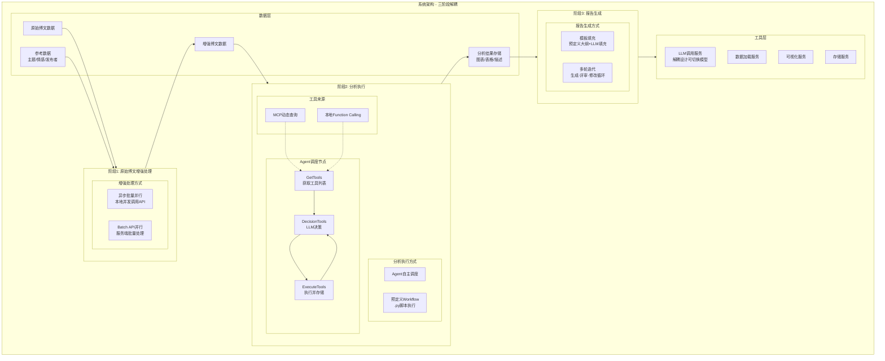
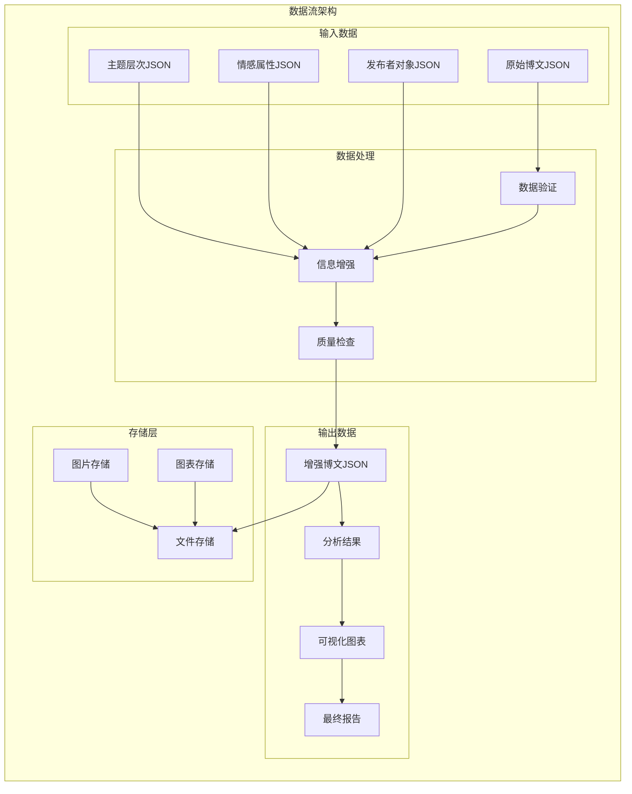
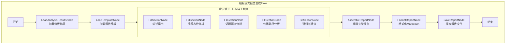
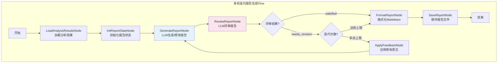

# 舆情分析智能体系统设计文档

> Please DON'T remove notes for AI


---

## 系统概述

### 项目背景
舆情分析智能体是一个基于PocketFlow框架的大规模博文数据分析系统，旨在通过多模态AI模型实现对社交媒体博文内容的深度分析和智能报告生成。

### 核心特性
- **多维度分析**：情感极性、情感属性、主题分类、发布者识别
- **双轨制报告**：Workflow标准化路径 + Agent智能化路径
- **大规模处理**：支持3万条博文数据的批量处理
- **模块化架构**：数据处理与报告生成完全解耦
- **多模态支持**：文本与图像内容的综合分析

---

## 需求分析

> Notes for AI: Keep it simple and clear.
> If the requirements are abstract, write concrete user stories

### 核心需求

#### 1. 原始博文数据处理模块
**功能描述**：为每个博文并行添加四个维度的分析信息，支持独立运行

**具体需求**：
- **情感极性分析**：1-5档情感分级
  - 1-极度悲观，2-悲观，3-无明显极性，4-乐观，5-极度乐观
- **情感属性分析**：具体情感状态识别
  - 生气、支持、担忧、兴奋、失望、希望、恐惧、满意、惊讶等
- **两级主题分析**：从预定义的两层嵌套主题列表中选择合适主题
- **发布者对象分析**：识别发布者类型
  - 政府机构、官方新闻媒体、自媒体、企业账号、个人用户等

#### 2. 分析报告生成模块
**功能描述**：双轨制报告生成架构，支持独立运行

**双轨制架构**：
- **Workflow路径**：按预定义工作流顺序运行分析模块
  - 特点：可预测、高效、标准化
  - 适用：日常监控、常规分析、快速报告
- **Agent路径**：智能体自主决策调用工具并循环完善报告
  - 特点：灵活、智能、深度洞察
  - 适用：复杂分析、探索性研究、深度报告

**数据源兼容**：
- 支持读取原始博文数据
- 支持已处理的增强数据

#### 3. 分析工具集
**功能描述**：四类核心分析工具集，每类包含若干工具函数，支撑深度分析和可视化需求

**工具集架构**：

##### 3.1 情感趋势分析工具集
时间序列情感变化分析，包含以下工具函数：
- `sentiment_distribution_stats`：情感极性分布统计（各档位数量、占比）
- `sentiment_time_series`：情感时序趋势分析（按小时/天聚合）
- `sentiment_anomaly_detection`：情感异常点检测（突变、峰值识别）
- `sentiment_trend_chart`：情感趋势折线图/面积图生成
- `sentiment_pie_chart`：情感分布饼图生成

##### 3.2 主题演化分析工具集
主题热度变化和关联分析，包含以下工具函数：
- `topic_frequency_stats`：主题频次统计（父主题/子主题分布）
- `topic_time_evolution`：主题时序演化分析（热度变化趋势）
- `topic_cooccurrence_analysis`：主题共现关联分析（主题间关系）
- `topic_ranking_chart`：主题热度排行柱状图生成
- `topic_evolution_chart`：主题演化时序图生成
- `topic_network_chart`：主题关联网络图生成

##### 3.3 地理分布分析工具集
舆情地理分布和热点识别，包含以下工具函数：
- `geographic_distribution_stats`：地理分布统计（省份/城市级别）
- `geographic_hotspot_detection`：热点区域识别（高密度区域）
- `geographic_sentiment_analysis`：地区情感差异分析
- `geographic_heatmap`：地理热力图生成
- `geographic_bar_chart`：地区分布柱状图生成

##### 3.4 多维交互分析工具集
情感、主题、地理、发布者多维度交叉分析，包含以下工具函数：
- `publisher_distribution_stats`：发布者类型分布统计
- `cross_dimension_matrix`：多维交叉矩阵分析（如：发布者×情感、主题×地区）
- `influence_analysis`：影响力分析（互动量、传播力）
- `correlation_analysis`：维度相关性分析
- `interaction_heatmap`：交互热力图生成
- `publisher_bar_chart`：发布者分布柱状图生成

#### 4. 解耦合架构
**设计理念**：数据处理与分析报告生成完全独立，通过Flow编排支持多种运行模式

**运行模式**：
- **完整Flow**：数据处理 + 分析报告生成
- **数据处理Flow**：只运行数据处理模块
- **报告生成Flow**：跳过数据处理，直接对已有增强数据进行分析报告生成

#### 5. 大规模处理能力
**处理能力**：支持3万条博文数据的高效处理

**实现方式**：通过在原始数据字典中附加新字段实现信息增强

### 数据格式规范

#### 输入数据格式
- **数据结构**：JSON对象数组结构，一次性加载到内存
- **博文结构**：
  ```json
  {
    "username": "string",
    "user_id": "string", 
    "content": "string",
    "publish_time": "string",
    "location": "string",
    "repost_count": "integer",
    "comment_count": "integer", 
    "like_count": "integer",
    "image_urls": ["string"]
  }
  ```
- **图片存储**：相对链接，存储在images/子文件夹
- **数据量**：控制在3万条博文以内

#### 输出数据格式
- **处理方式**：通过在原始博文对象中附加新的字段实现信息增强
- **增强后结构**：
  ```json
  {
    "username": "string",
    "user_id": "string",
    "content": "string", 
    "publish_time": "string",
    "location": "string",
    "repost_count": "integer",
    "comment_count": "integer",
    "like_count": "integer",
    "image_urls": ["string"],
    "sentiment_polarity": "dict",
    "sentiment_attribute": "dict", 
    "topics": "dict",
    "publisher": "dict"
  }
  ```

### 处理规则

#### 核心规则
- **三阶段解耦**：原始博文增强处理、分析执行、报告生成三个阶段完全独立
- **多路径执行**：每个阶段支持多种执行方式，通过shared字典中的参数控制
- **并行处理**：原始博文数据的四个分析维度完全并行，无先后顺序
- **模型调用**：所有分析通过多模态语言模型API调用进行
- **信息附加**：分析结果直接附加到原始博文数据字典中

#### 多路径执行架构
| 阶段 | 路径选项 | 控制参数 | 说明 |
|------|----------|----------|------|
| 原始博文增强处理 | 异步批量并行 | `enhancement_mode="async"` | 本地代码并发调用API |
| 原始博文增强处理 | Batch API并行 | `enhancement_mode="batch_api"` | 一次性提交批量请求到API服务端 |
| 分析执行 | Agent自主调度 | `analysis_mode="agent"` | LLM动态决策工具调用 |
| 分析执行 | 预定义Workflow | `analysis_mode="workflow"` | 执行.py脚本的固定流程 |
| 报告生成 | 模板填充 | `report_mode="template"` | 预定义大纲，LLM填充内容 |
| 报告生成 | 多轮迭代 | `report_mode="iterative"` | 生成-评审-修改循环 |

#### Agent工具调度方式
| 方式 | 控制参数 | 说明 |
|------|----------|------|
| MCP动态查询 | `tool_source="mcp"` | 通过Model Context Protocol动态获取工具列表 |
| 本地Function Calling | `tool_source="local"` | 返回本地注册的固定工具列表 |

#### 质量保证
- **结果验证**：所有分析结果必须通过预定义候选列表验证
- **错误处理**：提供完善的错误处理和重试机制
- **数据完整性**：确保增强数据的格式完整性和一致性
- **迭代控制**：多轮迭代报告生成设置最大迭代次数保障

## 架构设计

### 系统架构概览

舆情分析智能体采用**三阶段解耦架构**，基于PocketFlow框架构建，每个阶段独立运行并支持多种执行路径。



### 核心设计原则

#### 1. 三阶段解耦
- **阶段1 - 原始博文增强处理**：为博文添加情感、主题、发布者等维度标注
- **阶段2 - 分析执行**：基于增强数据执行深度分析，生成图表、表格和洞察
- **阶段3 - 报告生成**：综合分析结果，生成结构化的Markdown报告
- **独立运行**：每个阶段可单独执行，支持断点续传和结果复用

#### 2. 多路径执行控制
- **统一控制机制**：所有执行路径通过shared字典中的参数控制
- **灵活切换**：运行时可动态选择执行路径
- **组合使用**：不同阶段可选择不同的执行路径组合

```python
# 路径控制参数示例
shared["config"]["enhancement_mode"] = "async"      # 或 "batch_api"
shared["config"]["analysis_mode"] = "agent"         # 或 "workflow"
shared["config"]["tool_source"] = "mcp"             # 或 "local"
shared["config"]["report_mode"] = "template"        # 或 "iterative"
```

#### 3. 模块化设计
- **独立模块**：每个功能模块都可以独立运行和测试
- **标准接口**：模块间通过标准化的数据接口通信
- **可插拔**：分析工具可以动态添加和替换（支持MCP动态发现）
- **版本兼容**：保持向后兼容性，支持平滑升级

#### 4. LLM调用解耦
- **统一接口**：所有LLM调用通过`call_llm`系列函数封装
- **模型可切换**：生成和评审可使用同一模型或不同模型
- **参数化配置**：模型选择、温度、token限制等通过配置控制


## 数据模型

### 数据流架构




### 数据质量保证

#### 1. 数据验证规则
- **格式验证**：严格检查JSON格式和数据类型
- **完整性验证**：确保必需字段存在且非空
- **一致性验证**：检查数据间的逻辑一致性
- **范围验证**：验证数值字段在合理范围内

#### 2. 数据清洗策略
- **重复数据去除**：基于内容哈希去除重复博文
- **无效数据处理**：处理空内容、异常字符等
- **标准化处理**：统一时间格式、地理位置等
- **异常值处理**：识别和处理异常的数值数据

#### 3. 数据增强质量控制
- **候选列表验证**：确保分析结果在预定义候选列表中
- **置信度阈值**：设置最低置信度要求
- **多轮验证**：关键分析结果进行多轮验证
- **人工抽样验证**：定期人工验证分析结果质量

## Flow Design

> Notes for AI:
> 1. 系统采用三阶段解耦架构，每个阶段独立运行
> 2. 每个阶段支持多种执行路径，通过shared字典参数控制
> 3. 所有流程图使用清晰的节点描述

### Applicable Design Pattern:

1. **Batch Pattern**: 用于原始博文增强处理
   - 四个分析维度通过Batch节点独立处理
   - 支持异步批量并行和Batch API并行两种方式

2. **Agent Pattern**: 用于分析执行的智能体调度
   - GetTools → DecisionTools → ExecuteTools 三节点循环
   - 支持MCP动态查询和本地Function Calling两种工具来源

3. **Workflow Pattern**: 用于分析执行的预定义流程
   - 直接执行.py脚本，按固定顺序调用工具

4. **Iterative Pattern**: 用于报告生成的多轮迭代
   - 生成 → 评审 → 修改循环，直到满意或达到最大迭代次数

### Flow high-level Design:

#### 完整系统Flow总览

```mermaid
flowchart TB
    subgraph CompleteSystemFlow[完整系统Flow - 三阶段解耦]
        
        subgraph Stage1[阶段1: 原始博文增强处理Flow]
            load_data[DataLoadNode<br/>加载原始数据] --> validate_data[DataValidationNode<br/>数据验证]
            validate_data --> enhancement_mode{enhancement_mode?}
            
            enhancement_mode -->|async| async_enhancement[AsyncEnhancementFlow<br/>异步批量并行处理]
            enhancement_mode -->|batch_api| batch_api_enhancement[BatchAPIEnhancementFlow<br/>Batch API并行处理]
            
            async_enhancement --> save_enhanced[SaveEnhancedDataNode<br/>保存增强数据]
            batch_api_enhancement --> save_enhanced
        end
        
        subgraph Stage2[阶段2: 分析执行Flow]
            load_enhanced[LoadEnhancedDataNode<br/>加载增强数据] --> analysis_mode{analysis_mode?}
            
            analysis_mode -->|agent| agent_analysis[AgentAnalysisFlow<br/>Agent自主调度]
            analysis_mode -->|workflow| workflow_analysis[WorkflowAnalysisFlow<br/>预定义Workflow]
            
            agent_analysis --> save_analysis[SaveAnalysisResultsNode<br/>保存分析结果]
            workflow_analysis --> save_analysis
        end
        
        subgraph Stage3[阶段3: 报告生成Flow]
            load_analysis[LoadAnalysisResultsNode<br/>加载分析结果] --> report_mode{report_mode?}
            
            report_mode -->|template| template_report[TemplateReportFlow<br/>模板填充方式]
            report_mode -->|iterative| iterative_report[IterativeReportFlow<br/>多轮迭代方式]
            
            template_report --> save_report[SaveReportNode<br/>保存最终报告]
            iterative_report --> save_report
        end
        
        save_enhanced --> load_enhanced
        save_analysis --> load_analysis
    end
```



---

#### 阶段1详细设计: 原始博文增强处理Flow

##### 1.1 异步批量并行处理路径 (enhancement_mode="async")

```mermaid
flowchart TD
    subgraph AsyncEnhancementFlow[异步批量并行处理Flow]
        async_start[开始] --> async_load[DataLoadNode<br/>加载原始博文数据]
        async_load --> async_validate[DataValidationNode<br/>验证数据格式]
        async_validate --> async_parallel[AsyncParallelBatchFlow<br/>异步并行处理]
        
        subgraph async_parallel[AsyncParallelBatchFlow - 四维度并行]
            async_sentiment_polarity[AsyncSentimentPolarityBatchNode<br/>情感极性分析]
            async_sentiment_attribute[AsyncSentimentAttributeBatchNode<br/>情感属性分析]
            async_topic[AsyncTopicAnalysisBatchNode<br/>两级主题分析]
            async_publisher[AsyncPublisherAnalysisBatchNode<br/>发布者对象分析]
        end
        
        async_parallel --> async_merge[DataMergeNode<br/>合并增强结果]
        async_merge --> async_quality[QualityCheckNode<br/>质量检查]
        async_quality --> async_save[SaveEnhancedDataNode<br/>保存增强数据]
        async_save --> async_end[结束]
    end
```



##### 1.2 Batch API并行处理路径 (enhancement_mode="batch_api")

```mermaid
flowchart TD
    subgraph BatchAPIEnhancementFlow[Batch API并行处理Flow]
        batch_start[开始] --> batch_load[DataLoadNode<br/>加载原始博文数据]
        batch_load --> batch_validate[DataValidationNode<br/>验证数据格式]
        batch_validate --> batch_prepare[BatchRequestPrepareNode<br/>准备批量请求]
        
        subgraph batch_submit[Batch API提交 - 四维度]
            batch_sentiment_polarity[SubmitBatchJobNode<br/>情感极性批量任务]
            batch_sentiment_attribute[SubmitBatchJobNode<br/>情感属性批量任务]
            batch_topic[SubmitBatchJobNode<br/>主题分析批量任务]
            batch_publisher[SubmitBatchJobNode<br/>发布者分析批量任务]
        end
        
        batch_prepare --> batch_submit
        batch_submit --> batch_poll[BatchJobPollNode<br/>轮询任务状态]
        batch_poll --> batch_retrieve[BatchResultRetrieveNode<br/>获取批量结果]
        batch_retrieve --> batch_merge[DataMergeNode<br/>合并增强结果]
        batch_merge --> batch_quality[QualityCheckNode<br/>质量检查]
        batch_quality --> batch_save[SaveEnhancedDataNode<br/>保存增强数据]
        batch_save --> batch_end[结束]
    end
```



---

#### 阶段2详细设计: 分析执行Flow

##### 2.1 Agent自主调度路径 (analysis_mode="agent")

```mermaid
flowchart TD
    subgraph AgentAnalysisFlow[Agent自主调度Flow]
        agent_start[开始] --> agent_load[LoadEnhancedDataNode<br/>加载增强数据]
        agent_load --> agent_summary[DataSummaryNode<br/>生成数据概况]
        agent_summary --> get_tools[GetToolsNode<br/>获取工具列表]
        
        get_tools --> tool_source{tool_source?}
        tool_source -->|mcp| mcp_query[MCPQueryNode<br/>MCP动态查询工具]
        tool_source -->|local| local_registry[LocalRegistryNode<br/>本地工具注册表]
        
        mcp_query --> decision_tools
        local_registry --> decision_tools
        
        decision_tools[DecisionToolsNode<br/>LLM决策下一步] --> decision_result{决策结果?}
        
        decision_result -->|call_tool| execute_tools[ExecuteToolsNode<br/>执行工具函数]
        decision_result -->|finish| agent_save[SaveAnalysisResultsNode<br/>保存分析结果]
        
        execute_tools --> store_result[StoreToolResultNode<br/>存储工具结果]
        store_result --> iteration_check{迭代次数检查}
        iteration_check -->|未超限| decision_tools
        iteration_check -->|超限| agent_save
        
        agent_save --> agent_end[结束]
    end
```



##### 2.2 预定义Workflow路径 (analysis_mode="workflow")

```mermaid
flowchart TD
    subgraph WorkflowAnalysisFlow[预定义Workflow Flow]
        wf_start[开始] --> wf_load[LoadEnhancedDataNode<br/>加载增强数据]
        wf_load --> wf_summary[DataSummaryNode<br/>生成数据概况]
        
        wf_summary --> wf_sentiment[SentimentTrendAnalysisNode<br/>情感趋势分析工具集]
        wf_sentiment --> wf_topic[TopicEvolutionAnalysisNode<br/>主题演化分析工具集]
        wf_topic --> wf_geo[GeographicAnalysisNode<br/>地理分布分析工具集]
        wf_geo --> wf_cross[CrossDimensionAnalysisNode<br/>多维交互分析工具集]
        
        wf_cross --> wf_save[SaveAnalysisResultsNode<br/>保存分析结果]
        wf_save --> wf_end[结束]
    end
    
    style wf_sentiment fill:#e1f5fe
    style wf_topic fill:#e8f5e9
    style wf_geo fill:#fff3e0
    style wf_cross fill:#fce4ec
```



---

#### 阶段3详细设计: 报告生成Flow

##### 3.1 模板填充路径 (report_mode="template")



##### 3.2 多轮迭代路径 (report_mode="iterative")



---

### Flow编排架构

#### 独立Flow说明

| Flow名称 | 阶段 | 用途 | 输入 | 输出 |
|----------|------|------|------|------|
| EnhancementFlow | 阶段1 | 原始博文增强处理 | 原始博文JSON | 增强博文JSON |
| AnalysisFlow | 阶段2 | 分析执行 | 增强博文JSON | 分析结果（图/表/描述） |
| ReportFlow | 阶段3 | 报告生成 | 分析结果 | Markdown报告 |
| CompleteFlow | 全部 | 完整流程 | 原始博文JSON | Markdown报告 |

#### Flow编排优势
- **三阶段解耦**：每个阶段可独立运行、调试和优化
- **多路径灵活**：通过shared参数动态切换执行路径
- **断点续传**：每个阶段输出持久化，支持从中间阶段恢复
- **可组合性**：不同阶段的路径可自由组合

## 分析工具集设计

> Notes for AI: 工具集采用统一架构，每类工具集包含数据处理和可视化两类函数。所有工具函数遵循统一的输入输出规范，便于Agent动态调用。

### 工具集概述

系统提供四类核心分析工具集，每类工具集包含若干工具函数：

| 工具集 | 功能定位 | 数据处理函数 | 可视化函数 |
|--------|----------|--------------|------------|
| 情感趋势分析 | 时间序列情感变化分析 | 分布统计、时序分析、异常检测 | 趋势图、饼图 |
| 主题演化分析 | 主题热度变化和关联分析 | 频次统计、演化分析、共现分析 | 排行图、演化图、网络图 |
| 地理分布分析 | 舆情地理分布和热点识别 | 分布统计、热点检测、地区情感 | 热力图、柱状图 |
| 多维交互分析 | 多维度交叉分析 | 发布者分布、交叉矩阵、影响力、相关性 | 热力图、柱状图 |

### 工具函数设计原则

1. **输入统一**：所有工具函数接收增强后的博文数据列表作为主要输入
2. **输出标准化**：返回包含 `data`、`summary`、`charts`（可选）的标准字典结构
3. **可视化自动存储**：可视化函数自动生成图表并存储到 `report/images/` 目录
4. **支持Agent调用**：工具函数通过统一注册表暴露，支持MCP和本地Function Calling两种调用方式

## Utility Functions

> Notes for AI: 基础工具函数按功能分类，详细实现参考 `utils/` 目录

### 工具函数分类

| 分类 | 文件位置 | 功能说明 |
|------|----------|----------|
| LLM调用 | `utils/call_llm.py` | 封装多种模型调用（纯文本、多模态、推理模式） |
| 数据加载 | `utils/data_loader.py` | 博文数据、参考数据的加载与保存 |
| 分析工具 | `utils/analysis_tools/` | 四类分析工具集的具体实现 |

## Node Design

### Shared Store

> Notes for AI: shared字典是节点间通信的核心，按功能分区组织

```python
shared = {
    # === 数据管理 ===
    "data": {
        "blog_data": [],              # 博文数据（原始或增强后）
        "topics_hierarchy": [],        # 主题层次结构（从data/topics.json加载）
        "sentiment_attributes": [],    # 情感属性列表（从data/sentiment_attributes.json加载）
        "publisher_objects": [],       # 发布者类型列表（从data/publisher_objects.json加载）
    },
    
    # === 三阶段路径控制 ===
    "config": {
        # 阶段1: 增强处理方式
        "enhancement_mode": "async",   # "async" | "batch_api"
        
        # 阶段2: 分析执行方式
        "analysis_mode": "workflow",   # "workflow" | "agent"
        "tool_source": "local",        # "local" | "mcp" (Agent模式下的工具来源)
        
        # 阶段3: 报告生成方式
        "report_mode": "template",     # "template" | "iterative"
        
        # Agent配置
        "agent_config": {
            "max_iterations": 10
        },
        
        # 迭代报告配置
        "iterative_report_config": {
            "max_iterations": 5,
            "min_score_threshold": 80
        }
    },
    
    # === 运行时状态 ===
    "agent": {
        "available_tools": [],         # 可用工具列表
        "execution_history": [],       # 工具执行历史
        "current_iteration": 0,
        "is_finished": False
    },
    
    # === 报告生成状态 ===
    "report": {
        "iteration": 0,
        "current_draft": "",
        "revision_feedback": "",
        "review_history": []
    }
}
```

**说明**：
- 分析结果（图表、数据、描述）存储在 `report/` 文件夹中，不在shared字典中保存
- 最终报告输出到 `report/report.md`
- 可视化图表存储在 `report/images/` 目录

### Node Steps

> Notes for AI: 节点按三阶段组织，每个阶段的多种执行路径通过shared参数控制

---

## 阶段1节点: 原始博文增强处理

### 通用节点

**1. DataLoadNode (数据加载节点)**
- **功能**：加载原始博文数据
- **类型**：Regular Node
- **实现步骤**：
  - *prep*：读取数据文件路径配置
  - *exec*：加载JSON格式博文数据，验证数据格式完整性
  - *post*：将数据存储到 `shared["data"]["blog_data"]` 中

**2. DataValidationNode (数据验证节点)**
- **功能**：验证数据格式和完整性
- **类型**：Regular Node
- **实现步骤**：
  - *prep*：读取博文数据
  - *exec*：检查必需字段、数据类型、格式规范
  - *post*：记录验证结果，返回下一步Action

**3. DataMergeNode (数据合并节点)**
- **功能**：合并四个维度的增强结果
- **类型**：Regular Node
- **实现步骤**：
  - *prep*：读取四个维度的分析结果
  - *exec*：将结果合并到原始博文对象中
  - *post*：更新 `shared["data"]["blog_data"]`

**4. QualityCheckNode (质量检查节点)**
- **功能**：检查增强数据质量
- **类型**：Regular Node
- **实现步骤**：
  - *prep*：读取增强后的博文数据
  - *exec*：统计各字段填充率、验证候选列表匹配度
  - *post*：记录质量报告到 `shared["results"]["statistics"]`

**5. SaveEnhancedDataNode (保存增强数据节点)**
- **功能**：将增强数据持久化到文件
- **类型**：Regular Node
- **实现步骤**：
  - *prep*：读取增强数据和保存路径
  - *exec*：写入JSON文件
  - *post*：记录保存状态

### 异步批量并行路径节点 (enhancement_mode="async")

**6. AsyncSentimentPolarityBatchNode (异步情感极性分析节点)**
- **功能**：异步批量分析博文情感极性
- **类型**：AsyncParallelBatchNode
- **并发控制**：通过 `max_concurrent` 参数限制并发数
- **实现步骤**：
  - *prep_async*：返回博文数据列表
  - *exec_async*：对单条博文调用多模态LLM进行情感极性分析（1-5档）
  - *post_async*：将结果附加到博文对象的 `sentiment_polarity` 字段

**7. AsyncSentimentAttributeBatchNode (异步情感属性分析节点)**
- **功能**：异步批量分析博文情感属性
- **类型**：AsyncParallelBatchNode
- **实现步骤**：
  - *prep_async*：返回博文数据列表
  - *exec_async*：对单条博文调用LLM进行情感属性分析
  - *post_async*：将结果附加到 `sentiment_attribute` 字段

**8. AsyncTopicAnalysisBatchNode (异步主题分析节点)**
- **功能**：异步批量分析博文主题
- **类型**：AsyncParallelBatchNode
- **实现步骤**：
  - *prep_async*：返回博文数据列表
  - *exec_async*：对单条博文调用多模态LLM进行两级主题匹配
  - *post_async*：将结果附加到 `topics` 字段

**9. AsyncPublisherAnalysisBatchNode (异步发布者分析节点)**
- **功能**：异步批量识别发布者类型
- **类型**：AsyncParallelBatchNode
- **实现步骤**：
  - *prep_async*：返回博文数据列表
  - *exec_async*：对单条博文调用LLM进行发布者类型识别
  - *post_async*：将结果附加到 `publisher` 字段

### Batch API并行路径节点 (enhancement_mode="batch_api")

**10. BatchRequestPrepareNode (批量请求准备节点)**
- **功能**：将博文数据转换为Batch API请求格式
- **类型**：Regular Node
- **实现步骤**：
  - *prep*：读取博文数据和参考数据（主题列表、情感属性等）
  - *exec*：为四个维度分别构建批量请求JSONL文件
  - *post*：保存请求文件路径到 `shared["batch_api"]["request_files"]`

**11. SubmitBatchJobNode (提交批量任务节点)**
- **功能**：向API服务端提交批量任务
- **类型**：Regular Node
- **实现步骤**：
  - *prep*：读取请求文件路径
  - *exec*：调用Batch API接口提交任务，获取任务ID
  - *post*：保存任务ID到 `shared["batch_api"]["job_ids"]`

**12. BatchJobPollNode (任务状态轮询节点)**
- **功能**：轮询批量任务执行状态
- **类型**：Regular Node (with retry)
- **实现步骤**：
  - *prep*：读取任务ID列表
  - *exec*：查询各任务状态，等待全部完成
  - *post*：根据状态返回Action（"completed"/"polling"/"failed"）

**13. BatchResultRetrieveNode (批量结果获取节点)**
- **功能**：获取批量任务的执行结果
- **类型**：Regular Node
- **实现步骤**：
  - *prep*：读取已完成的任务ID
  - *exec*：下载并解析结果文件
  - *post*：将结果存入 `shared["batch_api"]["results"]`

---

## 阶段2节点: 分析执行

### 通用节点

**14. LoadEnhancedDataNode (加载增强数据节点)**
- **功能**：加载已完成增强处理的博文数据
- **类型**：Regular Node
- **实现步骤**：
  - *prep*：读取增强数据文件路径
  - *exec*：加载JSON数据
  - *post*：存储到 `shared["data"]["blog_data"]`

**15. DataSummaryNode (数据概况生成节点)**
- **功能**：生成增强数据的统计概况
- **类型**：Regular Node
- **实现步骤**：
  - *prep*：读取增强数据
  - *exec*：计算各维度分布、时间跨度、总量等统计信息
  - *post*：存储到 `shared["results"]["agent_state"]["data_summary"]`

**16. SaveAnalysisResultsNode (保存分析结果节点)**
- **功能**：将分析结果持久化
- **类型**：Regular Node
- **实现步骤**：
  - *prep*：读取分析输出和图表列表
  - *exec*：保存JSON结果文件
  - *post*：记录保存状态

### Agent自主调度路径节点 (analysis_mode="agent")

**17. GetToolsNode (获取工具列表节点)**
- **功能**：根据配置获取可用工具列表
- **类型**：Regular Node
- **控制参数**：`shared["config"]["tool_source"]`
- **实现步骤**：
  - *prep*：读取 `tool_source` 配置
  - *exec*：
    - 若 `tool_source="mcp"`：调用MCP服务器查询可用工具
    - 若 `tool_source="local"`：返回本地注册的固定工具列表
  - *post*：将工具定义存储到 `shared["agent"]["available_tools"]`

**18. DecisionToolsNode (工具决策节点)**
- **功能**：LLM决定下一步调用哪个工具或结束
- **类型**：Regular Node (LLM Call)
- **实现步骤**：
  - *prep*：读取数据概况、可用工具、执行历史
  - *exec*：构建Prompt调用LLM，获取决策结果
  - *post*：解析决策，返回Action
    - `"call_tool"`: 需要执行工具
    - `"finish"`: 分析完成

**DecisionToolsNode Prompt结构**：
```
你是一位资深舆情分析专家。根据当前数据概况和已执行的分析，决定下一步行动。

## 当前数据概况
{data_summary}

## 可用工具
{tool_definitions}

## 已执行的分析
{execution_history}

## 决策要求
- 如需调用工具，输出：{"action": "call_tool", "tool_name": "...", "tool_params": {...}, "reason": "..."}
- 如分析充分，输出：{"action": "finish", "reason": "..."}
```

**19. ExecuteToolsNode (工具执行节点)**
- **功能**：执行指定的工具函数
- **类型**：Regular Node
- **实现步骤**：
  - *prep*：读取决策结果中的工具名称和参数
  - *exec*：调用对应的工具函数（本地或MCP）
  - *post*：
    - 存储结果到 `shared["results"]["analysis_outputs"]`
    - 注册图表到 `shared["results"]["generated_charts"]`
    - 记录执行历史到 `shared["agent"]["execution_history"]`
    - 返回 `"continue"` 继续循环

**20. StoreToolResultNode (工具结果存储节点)**
- **功能**：存储工具执行结果并更新状态
- **类型**：Regular Node
- **实现步骤**：
  - *prep*：读取工具执行结果
  - *exec*：格式化结果、提取关键发现
  - *post*：更新 `shared["results"]` 和 `shared["agent"]["execution_history"]`

### 预定义Workflow路径节点 (analysis_mode="workflow")

> 这些节点按固定顺序执行，每个节点调用对应工具集的全部工具

**21. SentimentTrendAnalysisNode (情感趋势分析节点)**
- **功能**：执行情感趋势分析工具集
- **类型**：Regular Node
- **调用工具**：`sentiment_distribution_stats`, `sentiment_time_series`, `sentiment_anomaly_detection`, `sentiment_trend_chart`, `sentiment_pie_chart`
- **实现步骤**：
  - *prep*：读取增强数据
  - *exec*：依次调用工具集中的全部函数
  - *post*：存储结果到 `shared["results"]["analysis_outputs"]["sentiment_trend"]`

**22. TopicEvolutionAnalysisNode (主题演化分析节点)**
- **功能**：执行主题演化分析工具集
- **类型**：Regular Node
- **调用工具**：`topic_frequency_stats`, `topic_time_evolution`, `topic_cooccurrence_analysis`, `topic_ranking_chart`, `topic_evolution_chart`, `topic_network_chart`

**23. GeographicAnalysisNode (地理分布分析节点)**
- **功能**：执行地理分布分析工具集
- **类型**：Regular Node
- **调用工具**：`geographic_distribution_stats`, `geographic_hotspot_detection`, `geographic_sentiment_analysis`, `geographic_heatmap`, `geographic_bar_chart`

**24. CrossDimensionAnalysisNode (多维交互分析节点)**
- **功能**：执行多维交互分析工具集
- **类型**：Regular Node
- **调用工具**：`publisher_distribution_stats`, `cross_dimension_matrix`, `influence_analysis`, `correlation_analysis`, `interaction_heatmap`, `publisher_bar_chart`

---

## 阶段3节点: 报告生成

### 通用节点

**25. LoadAnalysisResultsNode (加载分析结果节点)**
- **功能**：加载阶段2产生的分析结果
- **类型**：Regular Node
- **实现步骤**：
  - *prep*：读取分析结果文件路径
  - *exec*：加载JSON数据和图表信息
  - *post*：存储到 `shared["results"]`

**26. FormatReportNode (报告格式化节点)**
- **功能**：格式化最终Markdown报告
- **类型**：Regular Node
- **实现步骤**：
  - *prep*：读取报告内容
  - *exec*：处理图片路径、修复格式问题、添加目录
  - *post*：更新 `shared["results"]["final_report_text"]`

**27. SaveReportNode (保存报告节点)**
- **功能**：保存最终报告到文件
- **类型**：Regular Node
- **实现步骤**：
  - *prep*：读取格式化后的报告
  - *exec*：写入Markdown文件
  - *post*：记录保存路径

### 模板填充路径节点 (report_mode="template")

**28. LoadTemplateNode (加载模板节点)**
- **功能**：加载预定义的报告模板
- **类型**：Regular Node
- **模板结构**：
```markdown
# 舆情深度分析报告

## 一、综述
{executive_summary}

## 二、情感态势分析
{sentiment_analysis}

## 三、话题演变深度解析
{topic_analysis}

## 四、传播路径与人群画像
{spread_analysis}

## 五、研判与建议
{recommendations}
```
- **实现步骤**：
  - *prep*：读取模板文件路径
  - *exec*：加载模板内容
  - *post*：存储到 `shared["report"]["template"]`

**29. FillSectionNode (章节填充节点)**
- **功能**：使用LLM填充单个章节内容
- **类型**：Regular Node (LLM Call)
- **实现步骤**：
  - *prep*：读取章节模板和相关分析结果
  - *exec*：构建章节填充Prompt，调用LLM生成内容
  - *post*：存储章节内容到 `shared["report"]["sections"][section_name]`

**30. AssembleReportNode (报告组装节点)**
- **功能**：将各章节组装成完整报告
- **类型**：Regular Node
- **实现步骤**：
  - *prep*：读取所有已填充的章节
  - *exec*：按模板顺序组装报告
  - *post*：存储到 `shared["results"]["final_report_text"]`

### 多轮迭代路径节点 (report_mode="iterative")

**31. InitReportStateNode (初始化报告状态节点)**
- **功能**：初始化迭代报告生成的状态
- **类型**：Regular Node
- **实现步骤**：
  - *prep*：读取分析结果和配置
  - *exec*：初始化迭代计数器、历史记录
  - *post*：设置 `shared["report"]["iteration"]` = 0, `shared["report"]["max_iterations"]`

**32. GenerateReportNode (报告生成节点)**
- **功能**：LLM生成或修改报告
- **类型**：Regular Node (LLM Call)
- **实现步骤**：
  - *prep*：读取分析结果、当前报告草稿、修改意见
  - *exec*：构建Prompt调用LLM生成/修改报告
  - *post*：存储报告草稿到 `shared["report"]["current_draft"]`

**GenerateReportNode Prompt结构**：
```
你是资深舆情分析专家，请撰写/修改舆情分析报告。

## 分析数据
{analysis_results_summary}

## 可用图表
{charts_list}

## 当前草稿（如有）
{current_draft}

## 修改意见（如有）
{revision_feedback}

## 要求
- 格式：Markdown
- 结构：综述、情感分析、话题分析、传播分析、建议
- 必须引用可用图表（使用Markdown图片语法）
- 基于数据进行深度解读
```

**33. ReviewReportNode (报告评审节点)**
- **功能**：LLM评审报告质量并提出修改意见
- **类型**：Regular Node (LLM Call)
- **实现步骤**：
  - *prep*：读取当前报告草稿
  - *exec*：构建评审Prompt，调用LLM评审
  - *post*：根据评审结果返回Action
    - `"satisfied"`: 报告质量合格
    - `"needs_revision"`: 需要修改

**ReviewReportNode Prompt结构**：
```
你是资深舆情报告评审专家，请评审以下报告。

## 报告内容
{current_draft}

## 评审标准
1. 结构完整性：是否包含所有必需章节
2. 数据支撑：结论是否有数据依据
3. 图表引用：是否正确引用了分析图表
4. 逻辑连贯：各章节是否逻辑通顺
5. 建议可行性：应对建议是否具体可行

## 输出格式
{
    "verdict": "satisfied" 或 "needs_revision",
    "score": 0-100,
    "feedback": "具体修改意见（如需修改）"
}
```

**34. ApplyFeedbackNode (应用修改意见节点)**
- **功能**：处理评审意见，准备下一轮迭代
- **类型**：Regular Node
- **实现步骤**：
  - *prep*：读取评审意见
  - *exec*：格式化修改意见
  - *post*：
    - 增加迭代计数 `shared["report"]["iteration"]` += 1
    - 存储修改意见到 `shared["report"]["revision_feedback"]`
    - 检查是否达到最大迭代次数，返回相应Action

## 文件存储结构

> Notes for AI: 基于实际项目结构

```
project_root/
├── data/                           # 数据文件
│   ├── posts.json                  # 原始博文数据
│   ├── topics.json                 # 主题层次结构
│   ├── sentiment_attributes.json   # 情感属性列表
│   └── publisher_objects.json      # 发布者类型列表
├── batch/                          # Batch API处理模块
│   ├── generate_jsonl.py           # 生成批量请求文件
│   ├── upload_and_start.py         # 上传并启动任务
│   ├── download_results.py         # 下载结果
│   └── parse_and_integrate.py      # 解析并整合结果
├── report/                         # 分析结果与报告输出
│   ├── images/                     # 可视化图表存储
│   ├── template.md                 # 报告模板
│   └── report.md                   # 最终生成的报告
├── utils/                          # 工具函数
│   ├── call_llm.py                 # LLM调用封装
│   └── data_loader.py              # 数据加载与保存
├── doc/                            # 文档
│   └── design.md                   # 设计文档
├── tests/                          # 测试
├── nodes.py                        # 节点定义
├── flow.py                         # 流程编排
├── EnhancementFlow.py              # 增强处理流程
└── main.py                         # 入口文件
```

### 输出约定

- **分析结果**：存储在 `report/` 目录
- **可视化图表**：存储在 `report/images/`，命名格式 `{type}_{timestamp}.png`
- **最终报告**：输出到 `report/report.md`

## 路径选择指南

### 设计理念

系统采用**三阶段解耦 + 多路径执行**架构，每个阶段独立运行，各自支持多种执行方式：

| 阶段 | 路径选项 | 特点 |
|------|----------|------|
| 阶段1: 增强处理 | 异步并行 / Batch API | 处理效率 vs API成本 |
| 阶段2: 分析执行 | Agent调度 / Workflow | 灵活性 vs 可预测性 |
| 阶段3: 报告生成 | 模板填充 / 多轮迭代 | 效率 vs 质量 |

### 阶段1: 增强处理路径选择

#### 异步批量并行 (enhancement_mode="async")
- **适用场景**：中小规模数据（<5000条）、需要实时反馈
- **优势**：可控制并发数、支持实时进度监控、易于调试
- **劣势**：受本地资源限制、大规模时效率下降

#### Batch API并行 (enhancement_mode="batch_api")
- **适用场景**：大规模数据（>5000条）、对时效要求不高
- **优势**：服务端处理无本地资源限制、成本更低
- **劣势**：需要轮询等待、无法实时查看进度

### 阶段2: 分析执行路径选择

#### Agent自主调度 (analysis_mode="agent")
- **适用场景**：
  - 复杂的多维度舆情分析
  - 数据特征不明确或异常情况
  - 需要探索性分析的舆情事件
- **工具来源选择**：
  - `tool_source="mcp"`: 动态发现工具，适合工具集频繁变化的场景
  - `tool_source="local"`: 固定工具列表，适合稳定的分析需求
- **优势**：灵活性高、能发现隐藏模式、自适应能力强
- **挑战**：结果不确定、成本较高、需要精心设计Prompt

#### 预定义Workflow (analysis_mode="workflow")
- **适用场景**：
  - 标准化的日常舆情监控
  - 对分析路径有明确要求
  - 计算资源和时间有限
- **优势**：可预测性强、效率高、成本可控、易于调试
- **劣势**：灵活性不足、可能遗漏非预定义洞察

### 阶段3: 报告生成路径选择

#### 模板填充 (report_mode="template")
- **适用场景**：
  - 格式要求固定的标准报告
  - 需要快速生成报告
  - 对报告结构有明确规范
- **模板结构**：预定义章节大纲（综述、情感分析、话题分析、传播分析、建议）
- **优势**：效率高、格式一致、可控性强
- **劣势**：灵活性受限于模板结构

#### 多轮迭代 (report_mode="iterative")
- **适用场景**：
  - 对报告质量要求极高
  - 需要深度解读和精细打磨
  - 重要的舆情事件报告
- **迭代机制**：
  - 生成 → 评审 → 修改 → 再评审
  - 最大迭代次数限制（默认5次）
  - 满意度阈值控制（默认80分）
- **优势**：质量有保障、可以自我完善
- **挑战**：时间成本高、需要更多API调用

## 增强处理实现要点

### 异步批量并行 (enhancement_mode="async")

- 基于PocketFlow的 `AsyncParallelBatchNode` 实现
- 通过 `max_concurrent` 参数控制并发数，使用 `asyncio.Semaphore` 进行限流
- 四个分析维度（情感极性、情感属性、主题、发布者）可并行执行
- 支持异步重试和优雅降级

### Batch API并行 (enhancement_mode="batch_api")

- 将博文数据转换为JSONL请求文件
- 通过智谱Batch API一次性提交批量任务
- 轮询任务状态直到完成
- 下载并解析结果文件，整合到增强数据中
- 详细实现参考 `batch/` 目录

## 技术考虑

### 性能优化
- **批量处理**：使用BatchFlow实现四个分析维度的批量处理
- **并行执行**：四个BatchNode可以并行运行，提高处理效率
- **异步处理**：通过AsyncParallelBatchNode实现真正的并发处理，支持可配置的并发控制
- **结果缓存**：避免重复分析相同内容
- **分批加载**：大数据集分批处理避免内存溢出
- **并发控制**：使用信号量机制精确控制API调用频率，避免触发限流

### 可靠性设计
- **节点重试**：处理API调用失败和网络异常
- **降级策略**：关键模型不可用时的备用方案
- **数据验证**：严格的数据格式和完整性检查
- **异常处理**：完善的错误处理和恢复机制
- **进度保存**：支持断点续传，避免重复处理

### 扩展性设计
- **模块化架构**：便于添加新的分析维度和工具
- **插件化设计**：分析工具可插拔，易于扩展
- **配置化管理**：通过配置文件灵活调整系统行为
- **接口标准化**：统一的数据接口和工具调用规范


