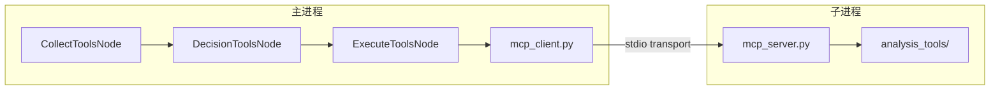
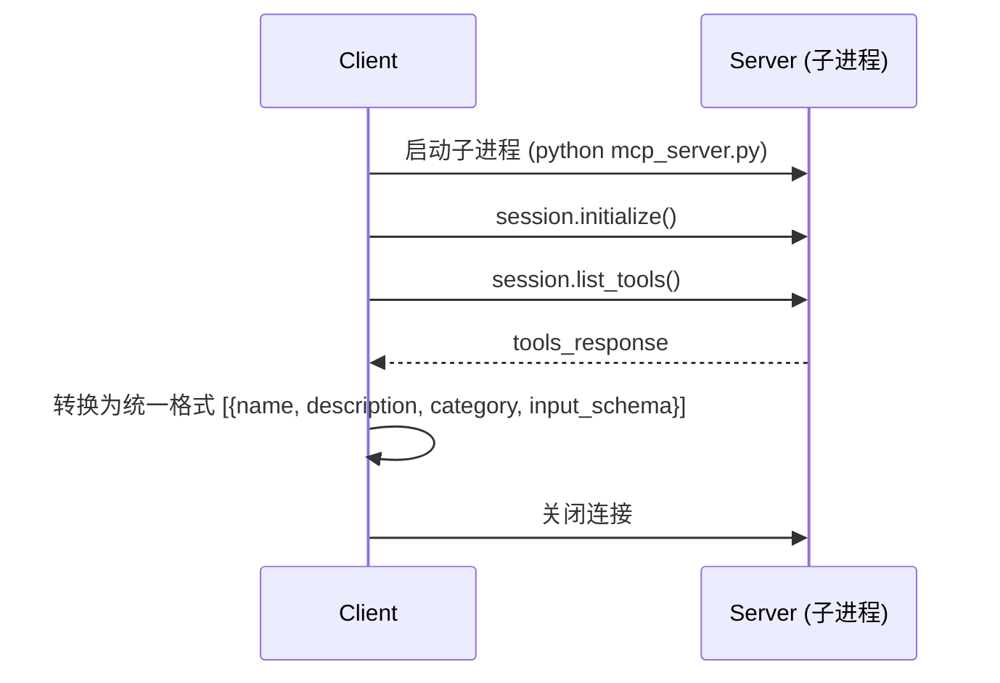
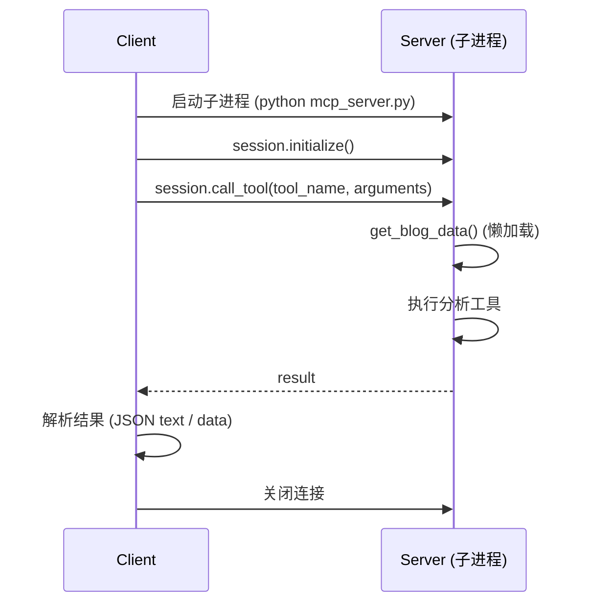

# MCP 协议集成文档

> **文档状态**: 2026-02-10 创建  
> **关联源码**: `utils/mcp_server.py`, `utils/mcp_client/mcp_client.py`  
> **上级文档**: [系统设计总览](design.md)

---

## 1. 概述

### 1.1 MCP 是什么

**Model Context Protocol (MCP)** 是一种标准化的工具调用协议，允许 LLM Agent 通过统一接口发现和调用外部工具。本项目在阶段 2 的 Agent 模式中使用 MCP 实现动态工具发现与执行。

### 1.2 为什么引入 MCP

| 对比维度 | 直接函数调用 | MCP 模式 |
|:---|:---|:---|
| 工具发现 | 硬编码工具列表 | 运行时动态获取 |
| 进程隔离 | 同进程 | 子进程隔离，互不影响 |
| 可扩展性 | 需改代码 | 新增 `@mcp.tool()` 即可 |
| 调试便利性 | 较高 | 需处理 IPC |
| 性能开销 | 低 | 每次调用启动子进程 |

### 1.3 架构总览



---

## 2. MCP 服务端 `mcp_server.py`

### 2.1 基本信息

| 项目 | 值 |
|:---|:---|
| **框架** | `FastMCP`（from `fastmcp`） |
| **服务器名称** | `"Opinion Analysis Server"` |
| **启动方式** | `python utils/mcp_server.py`（作为子进程） |
| **通信协议** | stdio transport（标准输入/输出） |

### 2.2 数据加载策略

```python
blog_data = None  # 全局缓存

def get_blog_data():
    global blog_data
    if blog_data is not None:
        return blog_data
    
    # 从 ENHANCED_DATA_PATH 环境变量获取数据路径
    env_path = os.getenv("ENHANCED_DATA_PATH")
    blog_data = load_enhanced_blog_data(env_path)
    return blog_data
```

- **懒加载**：首次调用时从文件加载数据，后续复用全局缓存
- **路径配置**：通过 `ENHANCED_DATA_PATH` 环境变量传入，由客户端在启动子进程前设置
- **容错**：加载失败时返回空列表，不阻塞服务器启动

### 2.3 工具注册方式

使用 `@mcp.tool()` 装饰器将函数注册为 MCP 工具：

```python
@mcp.tool()
def sentiment_distribution() -> Dict[str, Any]:
    """获取情感分布统计数据"""
    blog_data = get_blog_data()
    result = sentiment_distribution_stats(blog_data)
    return result
```

每个 MCP 工具函数的模式：
1. 调用 `get_blog_data()` 获取数据
2. 调用对应的 `analysis_tools` 函数
3. 返回结果

### 2.4 已注册的 MCP 工具

共 **35 个 MCP 工具**，按类别组织：

**情感分析（9 个）**：

| MCP 工具名 | 映射到 | 额外参数 |
|:---|:---|:---|
| `sentiment_distribution` | `sentiment_distribution_stats` | — |
| `sentiment_timeseries` | `sentiment_time_series` | `granularity="hour"` |
| `sentiment_anomaly` | `sentiment_anomaly_detection` | — |
| `generate_sentiment_trend_chart` | `sentiment_trend_chart` | — |
| `generate_sentiment_pie_chart` | `sentiment_pie_chart` | — |
| `generate_sentiment_bucket_trend_chart` | `sentiment_bucket_trend_chart` | `granularity` |
| `generate_sentiment_attribute_trend_chart` | `sentiment_attribute_trend_chart` | `granularity`, `top_n` |
| `generate_sentiment_focus_window_chart` | `sentiment_focus_window_chart` | `window_days` |
| `generate_sentiment_focus_publisher_chart` | `sentiment_focus_publisher_chart` | `window_days`, `top_n` |

**主题分析（7 个）**：

| MCP 工具名 | 映射到 | 额外参数 |
|:---|:---|:---|
| `topic_frequency` | `topic_frequency_stats` | — |
| `topic_evolution` | `topic_time_evolution` | `granularity="day"`, `top_n=5` |
| `topic_cooccurrence` | `topic_cooccurrence_analysis` | — |
| `topic_focus_evolution` | `topic_focus_evolution_chart` | — |
| `topic_keyword_trend` | `topic_keyword_trend_chart` | — |
| `topic_focus_distribution` | `topic_focus_distribution_chart` | `window_days`, `top_n` |
| `generate_topic_ranking_chart` | `topic_ranking_chart` | `top_n` |

**图表生成（5 个）**：

| MCP 工具名 | 映射到 |
|:---|:---|
| `generate_topic_evolution_chart` | `topic_evolution_chart` |
| `generate_topic_network_chart` | `topic_network_chart` |
| `generate_geographic_heatmap` | `geographic_heatmap` |
| `generate_geographic_bar_chart` | `geographic_bar_chart` |
| `generate_interaction_heatmap` | `interaction_heatmap` |

**地理分析（6 个）**：

| MCP 工具名 | 映射到 | 额外参数 |
|:---|:---|:---|
| `geographic_distribution` | `geographic_distribution_stats` | — |
| `geographic_hotspot` | `geographic_hotspot_detection` | — |
| `geographic_sentiment` | `geographic_sentiment_analysis` | — |
| `geographic_sentiment_bar` | `geographic_sentiment_bar_chart` | `top_n` |
| `geographic_topic_heatmap_tool` | `geographic_topic_heatmap` | `top_regions`, `top_topics` |
| `geographic_temporal_heatmap_tool` | `geographic_temporal_heatmap` | `granularity`, `top_regions` |

**多维交互分析（7 个）**：

| MCP 工具名 | 映射到 | 额外参数 |
|:---|:---|:---|
| `publisher_distribution` | `publisher_distribution_stats` | — |
| `cross_matrix` | `cross_dimension_matrix` | `dim1`, `dim2` |
| `influence_analysis` | `influence_analysis_tool` | `top_n` |
| `correlation_analysis` | `correlation_analysis_tool` | — |
| `publisher_sentiment_bucket` | `publisher_sentiment_bucket_chart` | `top_n` |
| `publisher_topic_distribution` | `publisher_topic_distribution_chart` | `top_publishers`, `top_topics` |
| `participant_trend` | `participant_trend_chart` | `granularity` |

**其他（1 个）**：

| MCP 工具名 | 映射到 | 额外参数 |
|:---|:---|:---|
| `belief_network_chart` | `belief_network_chart_tool` | `event_name` |

> **命名冲突处理**：部分 `analysis_tools` 函数名与 MCP 工具名冲突（如 `influence_analysis`），在导入时使用别名（`as influence_analysis_tool`）。

---

## 3. MCP 客户端 `mcp_client/mcp_client.py`

### 3.1 模式开关

```python
USE_MCP = False  # 全局标志

def set_mcp_mode(use_mcp: bool):
    global USE_MCP
    USE_MCP = use_mcp
```

- `CollectToolsNode` 在初始化时根据 `config.tool_source` 调用 `set_mcp_mode(True/False)`
- 后续所有工具操作通过统一接口 `get_tools()` / `call_tool()` 自动路由

### 3.2 统一接口

| 函数 | 说明 |
|:---|:---|
| `get_tools(server_script_path)` | 获取可用工具列表 |
| `call_tool(server_script_path, tool_name, arguments)` | 调用指定工具 |

**路由逻辑**：
- `USE_MCP == True` → 调用 `mcp_get_tools()` / `mcp_call_tool()`
- `USE_MCP == False` → 当前实现直接返回空/报错（本地模式由 `ExecuteAnalysisScriptNode` 直接处理）

### 3.3 MCP 通信流程

**`mcp_get_tools()` — 获取工具列表**：



**`mcp_call_tool()` — 调用工具**：



### 3.4 子进程参数配置

```python
server_params = StdioServerParameters(
    command="python",
    args=[server_script_path],
    env=_build_mcp_env()  # 注入 ENHANCED_DATA_PATH
)
```

**`_build_mcp_env()`**：
- 获取 MCP SDK 的默认安全环境变量
- 追加 `ENHANCED_DATA_PATH`（从当前进程的环境变量读取）
- 确保子进程能正确加载增强数据

### 3.5 事件循环兼容

客户端需要处理"已有事件循环运行中"的场景（PocketFlow 的 AsyncFlow 已经启动了事件循环）：

```python
try:
    loop = asyncio.get_running_loop()
    # 如果已在事件循环中 → 用 ThreadPoolExecutor 在新线程中运行
    with concurrent.futures.ThreadPoolExecutor() as executor:
        future = executor.submit(asyncio.run, mcp_call_tool(...))
        return future.result()
except RuntimeError:
    # 没有运行中的循环 → 直接 asyncio.run()
    return asyncio.run(mcp_call_tool(...))
```

### 3.6 工具类别推断 `_get_tool_category()`

根据工具名称中的关键词自动推断类别：

| 关键词 | 推断类别 |
|:---|:---|
| `sentiment` | 情感分析 |
| `topic` | 主题分析 |
| `geographic` / `geo` | 地理分析 |
| `publisher` / `interaction` / `cross` / `influence` / `correlation` | 多维交互分析 |
| `comprehensive` | 综合分析 |
| 其他 | 其他 |

### 3.7 结果解析

MCP 返回的结果有多种格式，客户端按以下优先级解析：

1. `result.content[0].text` → 尝试 `json.loads()`
2. `result.content[0].text` 解析失败 → 包装为 `{"result": text}`
3. `result.content[0].data` → 直接返回
4. 其他 → 包装为 `{"result": result}`

---

## 4. 配置与使用

### 4.1 在 `main.py` 中配置

```python
shared = init_shared(
    analysis_mode="agent",     # 启用 Agent 模式
    tool_source="mcp",         # 使用 MCP（可选 "local"）
    ...
)
```

### 4.2 环境变量

| 变量 | 说明 | 设置方 |
|:---|:---|:---|
| `ENHANCED_DATA_PATH` | 增强数据文件的绝对路径 | `ExecuteToolsNode.exec()` 在调用前设置 |

### 4.3 依赖

| 包 | 用途 |
|:---|:---|
| `fastmcp` | MCP 服务端框架 |
| `mcp` | MCP 协议 SDK（客户端） |
| `mcp.client.stdio` | stdio transport 实现 |
