# 阶段 3：报告生成子系统

> **文档状态**: 2026-02-20 更新  
> **关联源码**: `nodes/stage3/*`, `flow.py`, `config.py`  
> **上级文档**: [系统设计总览](design.md)

---

## 1. 概述

### 1.1 目标

将阶段 2 产出的图表、表格、洞察与 trace 追溯信息，统一生成为可交付报告产物：

- `report/report.md`（主报告）
- `report/report.html`（交互式 HTML）
- `report/trace.json`（追溯数据快照）

### 1.2 输入/输出

| 项目 | 说明 |
|:---|:---|
| 输入（内存优先） | `shared["stage2_results"]` + `shared["trace"]` |
| 输入（文件回退） | `report/analysis_data.json`, `report/chart_analyses.json`, `report/insights.json`, `report/trace.json`, `report/images/` |
| 输出 | `report/report.md`, `report/report.html`, `report/trace.json` |

---

## 2. 统一 Flow 拓扑

```mermaid
flowchart LR
    CL[ClearStage3Outputs] --> LR[LoadAnalysisResults]
    LR --> PO[PlanOutline]
    PO --> GC[GenerateChaptersBatch]
    GC --> RC[ReviewChapters]
    RC -- needs_revision --> GC
    RC -- satisfied --> IT[InjectTrace]
    IT --> MA[MethodologyAppendix]
    MA --> FR[FormatReport]
    FR --> RH[RenderHTML]
    RH --> SR[SaveReport]
    SR --> SC[Stage3Completion]
```



### 2.1 节点职责

| 节点 | 职责 |
|:---|:---|
| `ClearStage3OutputsNode` | 清理 `report.md/report.html`，保留 Stage2 产物、`images/` 与 `status.json` |
| `LoadAnalysisResultsNode` | 内存优先读取 Stage2 结果，文件回退加载 JSON 与 trace |
| `PlanOutlineNode` | LLM 规划报告大纲（失败时回退默认大纲） |
| `GenerateChaptersBatchNode` | 并行逐章生成内容（支持反馈驱动重生成） |
| `ReviewChaptersNode` | 章节级评审循环，输出 `needs_revision/satisfied` 路由 |
| `InjectTraceNode` | 注入 `<details>` 证据追溯块 |
| `MethodologyAppendixNode` | 追加方法论附录（工具调用、循环状态、局限性） |
| `FormatReportNode` | 执行摘要注入、目录生成、图片路径归一化、图表附录兜底 |
| `RenderHTMLNode` | Markdown 渲染为交互 HTML（图片放大预览 + `<details>` 保留） |
| `SaveReportNode` | 保存 MD/HTML/trace 三类产物 |

---

## 3. 配置契约

`config.yaml` 中 Stage3 配置：

```yaml
stage3:
  max_iterations: 5
  min_score: 80
  chapter_review_max_rounds: 2
```

运行时映射到 `shared["config"]["stage3_review"]`：

- `chapter_review_max_rounds`
- `min_score`

说明：

- `chapter_review_max_rounds` 控制 `ReviewChaptersNode` 的循环上限。
- `min_score` 是章节评审通过阈值。

---

## 4. Shared 契约（Stage3 关键字段）

### 4.1 `shared["stage3_data"]`

由 `LoadAnalysisResultsNode` 写入：

- `analysis_data`
- `chart_analyses`
- `insights`
- `trace`
- `sample_blogs`
- `images_dir`

### 4.2 `shared["stage3_results"]`

统一流程写入：

- `outline`
- `chapters`
- `review_round`
- `chapter_review_history`
- `chapter_feedback`
- `reviewed_report_text`
- `report_text`
- `final_report_text`
- `final_report_html`
- `output_files`（`report_md/report_html/trace_file`）
- `report_file`
- `generation_mode="unified"`

### 4.3 `shared["trace"]["loop_status"]["stage3_chapter_review"]`

记录章节评审循环状态：

- `current`
- `max`
- `termination_reason`（`sufficient` / `max_iterations_reached` / `continue`）
- `scores`

---

## 5. 报告内容增强规则

### 5.1 执行摘要注入

`FormatReportNode` 在正文前注入“运行执行摘要”，显示各循环的 `current/max/termination_reason`。

### 5.2 图片路径与附录

- 所有图片路径统一标准化为 `./images/...`。
- 若正文无图片引用但存在图表数据，自动追加“图表附录”。

### 5.3 Trace 追溯块

`InjectTraceNode` 将 `trace.insight_provenance` 以 `<details>` 折叠块形式注入报告。

---

## 6. 产物落盘

`SaveReportNode` 固定保存：

- `report/report.md`
- `report/report.html`
- `report/trace.json`

并将路径写回：

```python
shared["stage3_results"]["output_files"] = {
    "report_md": "report/report.md",
    "report_html": "report/report.html",
    "trace_file": "report/trace.json",
}
```

---

## 7. 阶段完成

`Stage3CompletionNode`：

- 将 `3` 追加到 `shared["pipeline_state"]["completed_stages"]`
- 更新 `shared["pipeline_state"]["current_stage"] = 3`
- 返回 `"default"`，在线性主链中继续进入 `TerminalNode`
