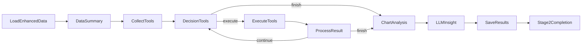

# 阶段 2：深度分析子系统

> **文档状态**: 2026-02-10 创建  
> **关联源码**: `nodes.py` L1712-3347, `flow.py` L156-237  
> **上级文档**: [系统设计总览](design.md)

---

## 1. 概述

### 1.1 目标

对阶段 1 产出的增强数据进行**统计分析与可视化**，生成图表、数据表格和 LLM 洞察，供阶段 3 报告生成使用。

### 1.2 输入/输出

| 项目 | 说明 |
|:---|:---|
| **输入** | `data/enhanced_blogs.json` — 阶段 1 增强后的博文数据 |
| **输出** | `report/analysis_data.json` — 图表与表格元数据 |
| | `report/chart_analyses.json` — GLM-4.5V 图表分析结果 |
| | `report/insights.json` — LLM 洞察摘要 |
| | `report/images/*.png` — 可视化图表文件 |

### 1.3 两种执行模式

| 模式 | 配置值 | Flow 类型 | 特点 |
|:---|:---|:---|:---|
| Workflow | `analysis_mode = "workflow"` | `Flow` | 预定义分析脚本，一次性执行所有工具，稳定高效 |
| Agent | `analysis_mode = "agent"` | `AsyncFlow` | GLM-4.6 自主决策工具调用，探索性分析 |

---

## 2. 通用节点

以下节点在 Workflow 和 Agent 两种模式中**共享使用**。

### 2.1 `LoadEnhancedDataNode`

| 属性 | 值 |
|:---|:---|
| **类型** | `Node` |
| **数据来源** | `config.data_source.enhanced_data_path` |

**执行逻辑**：
1. **prep**：读取增强数据路径，检查文件是否存在（不存在则抛出 `FileNotFoundError`）
2. **exec**：加载 JSON 数据，验证 4 个核心增强字段（`sentiment_polarity`、`sentiment_attribute`、`topics`、`publisher`）的完整率
3. **post**：将数据存入 `shared["data"]["blog_data"]`，打印完整增强率

### 2.2 `DataSummaryNode`

| 属性 | 值 |
|:---|:---|
| **类型** | `Node` |
| **输出位置** | `shared["agent"]["data_summary"]` + `shared["agent"]["data_statistics"]` |

**统计维度**：

| 统计项 | 数据来源 |
|:---|:---|
| 总博文数 | `len(blog_data)` |
| 情感分布 | `Counter(sentiment_polarity)` |
| 发布者分布 | `Counter(publisher)` |
| 主题分布 Top10 | `Counter(parent_topic)` |
| 地理分布 Top10 | `Counter(location)` |
| 时间范围 | `min/max(publish_time)` + 跨度（小时） |
| 互动量汇总 | 转发/评论/点赞总量 |

**输出格式**：生成人类可读的文本摘要 `summary_text`，用于 Agent 模式的决策参考。

### 2.3 `SaveAnalysisResultsNode`

**输出文件**：

| 文件 | 内容 |
|:---|:---|
| `report/analysis_data.json` | `charts[]` + `tables[]` + `execution_log{}` |
| `report/chart_analyses.json` | `{chart_id: analysis_result}` 字典 |
| `report/insights.json` | LLM 生成的洞察摘要 |

### 2.4 `Stage2CompletionNode`

将 `2` 追加到 `shared["dispatcher"]["completed_stages"]`，返回 `"dispatch"` 跳回调度器。

---

## 3. Workflow 模式（预定义流程）

### 3.1 Flow 节点链路


### 3.2 `ExecuteAnalysisScriptNode`

| 属性 | 值 |
|:---|:---|
| **类型** | `Node` |
| **功能** | 一次性调用所有预定义分析工具，生成全部图表和数据表格 |

#### 调用的工具列表

按四大类别组织，共计 **~35 个工具函数**：

**情感趋势分析**（9 个）：

| 工具 | 输出类型 | 说明 |
|:---|:---|:---|
| `sentiment_distribution_stats` | Table | 情感极性分布统计 |
| `sentiment_time_series` | Table | 情感时序趋势 + 峰值/拐点 |
| `sentiment_anomaly_detection` | Table | 情感异常点检测 |
| `sentiment_trend_chart` | Chart | 情感趋势折线图 |
| `sentiment_pie_chart` | Chart | 情感极性饼图 |
| `sentiment_bucket_trend_chart` | Chart | 情感桶趋势对比图 |
| `sentiment_attribute_trend_chart` | Chart | 情感属性时序趋势（天粒度） |
| `sentiment_focus_window_chart` | Chart + Table | 焦点窗口情感趋势 |
| `sentiment_focus_publisher_chart` | Chart + Table | 焦点窗口发布者情感均值 |

**主题演化分析**（9 个）：

| 工具 | 输出类型 | 说明 |
|:---|:---|:---|
| `topic_frequency_stats` | Table | 主题频次统计 |
| `topic_time_evolution` | Table | 主题时间演化（天粒度，Top 5） |
| `topic_cooccurrence_analysis` | Table | 主题共现关系 |
| `topic_ranking_chart` | Chart | 主题频次排行图（Top 10） |
| `topic_evolution_chart` | Chart | 主题时间演化图 |
| `topic_focus_evolution_chart` | Chart | 焦点窗口主题演化 |
| `topic_focus_distribution_chart` | Chart + Table | 焦点窗口主题发布趋势 |
| `topic_keyword_trend_chart` | Chart | 关键词趋势图 |
| `topic_network_chart` | Chart | 主题共现网络图 |

**地理分布分析**（8 个）：

| 工具 | 输出类型 | 说明 |
|:---|:---|:---|
| `geographic_distribution_stats` | Table | 地理分布统计 |
| `geographic_hotspot_detection` | Table | 热点区域识别 |
| `geographic_sentiment_analysis` | Table | 地区情感分析 |
| `geographic_heatmap` | Chart | 地理热力图（矩阵代替） |
| `geographic_bar_chart` | Chart | 地区分布柱状图 |
| `geographic_sentiment_bar_chart` | Chart | 地区正负面情感对比图 |
| `geographic_topic_heatmap` | Chart | 地区×主题热力图 |
| `geographic_temporal_heatmap` | Chart | 地区×时间热力图（天粒度） |

**多维交互分析**（10 个）：

| 工具 | 输出类型 | 说明 |
|:---|:---|:---|
| `publisher_distribution_stats` | Table | 发布者分布统计 |
| `cross_dimension_matrix` | Table | 发布者×情感交叉矩阵 |
| `influence_analysis` | Table | 影响力分析（Top 20） |
| `correlation_analysis` | Table | 维度相关性分析 |
| `interaction_heatmap` | Chart | 交互热力图 |
| `publisher_bar_chart` | Chart | 发布者分布柱状图 |
| `publisher_sentiment_bucket_chart` | Chart | 发布者情绪桶对比图 |
| `publisher_topic_distribution_chart` | Chart | 发布者话题偏好图 |
| `participant_trend_chart` | Chart | 参与人数趋势图（天粒度） |
| `publisher_focus_distribution_chart` | Chart + Table | 焦点窗口发布者类型趋势 |
| `belief_network_chart` | Chart + Table | 信念系统共现网络图 |

#### 工具补齐机制

执行完上述预定义工具列表后，节点会自动检查 `TOOL_REGISTRY`，补齐未执行的注册工具：

```python
from utils.analysis_tools.tool_registry import TOOL_REGISTRY
for tool_name, tool_def in TOOL_REGISTRY.items():
    if tool_name not in executed_set:
        # 自动填充参数（blog_data + 默认值），执行工具
        result = tool_def["function"](**params)
```

### 3.3 `ChartAnalysisNode`

| 属性 | 值 |
|:---|:---|
| **类型** | `Node`（同步顺序处理） |
| **LLM 模型** | `call_glm45v_thinking`（GLM-4.5V + 思考模式） |
| **Temperature** | 0.7 |
| **Max Tokens** | 2000 |
| **启用思考** | `enable_thinking=True` |

**作用**：对每张生成的图表进行**视觉理解分析**，提取微观数据和宏观洞察。

**Prompt 结构**：
1. 角色设定：专业舆情数据分析师
2. 图表信息：ID、标题、类型
3. 分析要求：
   - 图表基础描述（类型、坐标轴、图例）
   - 数据细节（具体数值、最高/低值、分布特征）
   - 宏观洞察（模式、趋势、转折点、业务发现）

**图片路径获取**：兼容多种字段名 — `path` / `file_path` / `chart_path` / `image_path`

**输出格式**：

```json
{
    "chart_id": "...",
    "chart_title": "...",
    "chart_path": "...",
    "analysis_content": "自然语言分析文本",
    "analysis_timestamp": 1234567890.0,
    "analysis_status": "success" | "failed"
}
```

**存储位置**：`shared["stage2_results"]["chart_analyses"]` — `{chart_id: analysis_result}` 字典

### 3.4 `LLMInsightNode`

| 属性 | 值 |
|:---|:---|
| **类型** | `Node` |
| **首选模型** | `call_glm46`（GLM-4.6 + 推理模式） |
| **回退模型** | `call_glm_45_air`（GLM-4.5-air，并发限制时自动切换） |
| **Temperature** | 0.7 |

**作用**：基于 ChartAnalysis 的结果和统计数据，生成五维综合洞察。

**输入数据构建**：
1. **图表分析摘要**：遍历 `chart_analyses`，取每个成功分析的前 500 字符
2. **统计数据摘要**：遍历 `tables`，提取各表格的 `summary` 字段
3. **基础数据概况**：来自 `DataSummaryNode` 的 `data_summary`

**Prompt 策略**：
- 明确要求"仅基于提供的数据"，禁止推测和外部知识
- 要求"数据索引"，每个结论必须有数据支撑
- 输出格式为严格 JSON，五个维度

**输出结构**：

```json
{
    "sentiment_summary": "情感态势总结",
    "topic_distribution": "主题分布特征",
    "geographic_distribution": "地域分布特点",
    "publisher_behavior": "发布者行为特征",
    "overall_summary": "综合数据概览"
}
```

**模型回退逻辑**：
- 首先尝试 GLM-4.6 + 推理模式
- 如遇 429/并发限制/rate limit 等可恢复错误 → 自动回退到 GLM-4.5-air
- 非并发类错误 → 直接抛出
- JSON 解析失败 → 使用预定义的通用洞察作为降级结果

---

## 4. Agent 模式（自主探索）

### 4.1 Flow 节点链路



核心特征是 **Decision → Execute → Process** 的**循环结构**，由 GLM-4.6 自主决定何时结束。

### 4.2 `CollectToolsNode`

| 属性 | 值 |
|:---|:---|
| **类型** | `Node` |
| **工具来源** | `config.tool_source`（`"mcp"` 或 `"local"`） |

**执行逻辑**：
1. 根据 `tool_source` 配置，调用 `set_mcp_mode(True/False)`
2. MCP 模式：通过 `get_tools('utils/mcp_server')` 从 MCP Server 获取工具列表
3. 初始化 Agent 状态：`available_tools`、`execution_history`（空）、`current_iteration`（0）、`is_finished`（False）

**输出**：按类别分组打印所有收集到的工具。

### 4.3 `DecisionToolsNode`

| 属性 | 值 |
|:---|:---|
| **类型** | `Node`（LLM 调用） |
| **LLM 模型** | `call_glm46`（GLM-4.6 + 推理模式） |
| **Temperature** | 0.6 |

**Prompt 构建**（超长上下文，包含完整的决策框架）：

1. **数据概况**：`data_summary` 文本
2. **可用工具列表**：名称 + 类别 + 描述
3. **完整执行历史**：每条记录含状态图标（✅/❌）、图表/数据标识（📊/📋）
4. **执行状态总览**：已执行工具清单、覆盖率 `n/total`
5. **推理决策要求**：
   - 执行历史分析（避免重复）
   - 四维度覆盖检查（情感/主题/地理/交互）
   - 工具价值评估（数据价值 > 可视化 > 互补性）
   - 执行策略（统计先行 → 可视化 → 综合）

**输出格式**：

```json
{
    "thinking": "推理过程",
    "action": "execute" | "finish",
    "tool_name": "未执行的工具名",
    "reason": "选择理由"
}
```

**Action 路由**：
- `"finish"` → 设置 `is_finished=True`，返回 `"finish"` 跳出循环
- `"execute"` → 将 `tool_name` 写入 `shared["agent"]["next_tool"]`，返回 `"execute"` 进入执行

### 4.4 `ExecuteToolsNode`

| 属性 | 值 |
|:---|:---|
| **类型** | `Node` |
| **调用方式** | MCP 客户端 — `call_tool('utils/mcp_server', tool_name, {})` |

**MCP 调用流程**：

1. 设置 `ENHANCED_DATA_PATH` 环境变量（MCP Server 子进程需要此路径加载数据）
2. 调用 `call_tool()` — 内部启动 MCP Server 子进程，通过 stdio transport 通信
3. 结果规范化：
   - 兼容多种图表路径字段（`path`/`file_path`/`chart_path`/`image_path`）
   - 每个 chart 对象标准化为 `{id, title, path, file_path, type, description, source_tool}`
4. 根据工具名推断类别（`_get_tool_category`）

**Post 处理**：
- 图表注册到 `shared["stage2_results"]["charts"]`
- 数据表格注册到 `shared["stage2_results"]["tables"]`
- 执行记录写入 `shared["agent"]["last_tool_result"]`

### 4.5 `ProcessResultNode`

| 属性 | 值 |
|:---|:---|
| **类型** | `Node` |
| **循环控制** | 根据是否满足终止条件决定 Action |

**终止条件**（满足任一即终止循环）：
1. `is_finished == True`：Agent（DecisionToolsNode）已判断分析充分
2. `new_iteration >= max_iterations`：达到最大迭代次数

**Action 路由**：
- `"continue"` → 返回 `DecisionToolsNode` 继续循环
- `"finish"` → 进入 `ChartAnalysisNode` 开始图表分析

---

## 5. 分析工具详情

所有分析工具的实现细节、算法逻辑、可视化风格请参阅 → [分析工具库文档](analysis_tools.md)

工具注册表和执行分发机制请参阅 → [分析工具库文档 § 工具注册表](analysis_tools.md)
