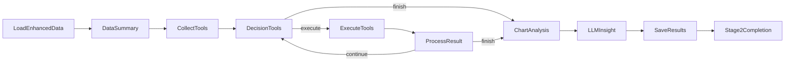

# 阶段 2：深度分析子系统

> **文档状态**: 2026-02-11 更新  
> **关联源码**: `nodes/stage2/*`, `flow.py`  
> **上级文档**: [系统设计总览](design.md)

---

## 1. 概述

### 1.1 目标

对阶段 1 产出的增强数据进行**统计分析与可视化**，生成图表、数据表格和 LLM 洞察，供阶段 3 报告生成使用。

### 1.2 输入/输出

| 项目 | 说明 |
|:---|:---|
| **输入** | `data/enhanced_blogs.json` — 阶段 1 增强后的博文数据 |
| **输出** | `report/analysis_data.json` — 图表与表格元数据 |
| | `report/chart_analyses.json` — GLM-4.5V 图表分析结果 |
| | `report/insights.json` — LLM 洞察摘要 |
| | `report/images/*.png` — 可视化图表文件 |

### 1.3 执行模式

Stage2 仅保留 **Agent 模式**，通过 MCP 进行工具发现与调用。

| 模式 | 配置值 | Flow 类型 | 特点 |
|:---|:---|:---|:---|
| Agent | `analysis_mode = "agent"` | `AsyncFlow` | GLM-4.6 自主决策工具调用，探索性分析 |

---

## 2. 通用节点

以下节点在 Stage2 中**共享使用**。

### 2.1 `LoadEnhancedDataNode`

| 属性 | 值 |
|:---|:---|
| **类型** | `Node` |
| **数据来源** | `config.data_source.enhanced_data_path` |

**执行逻辑**：
1. **prep**：读取增强数据路径，检查文件是否存在（不存在则抛出 `FileNotFoundError`）
2. **exec**：加载 JSON 数据，验证 4 个核心增强字段（`sentiment_polarity`、`sentiment_attribute`、`topics`、`publisher`）的完整率
3. **post**：将数据存入 `shared["data"]["blog_data"]`，打印完整增强率

### 2.2 `DataSummaryNode`

| 属性 | 值 |
|:---|:---|
| **类型** | `Node` |
| **输出位置** | `shared["agent"]["data_summary"]` + `shared["agent"]["data_statistics"]` |

**统计维度**：

| 统计项 | 数据来源 |
|:---|:---|
| 总博文数 | `len(blog_data)` |
| 情感分布 | `Counter(sentiment_polarity)` |
| 发布者分布 | `Counter(publisher)` |
| 主题分布 Top10 | `Counter(parent_topic)` |
| 地理分布 Top10 | `Counter(location)` |
| 时间范围 | `min/max(publish_time)` + 跨度（小时） |
| 互动量汇总 | 转发/评论/点赞总量 |

**输出格式**：生成人类可读的文本摘要 `summary_text`，用于 Agent 模式的决策参考。

### 2.3 `SaveAnalysisResultsNode`

**输出文件**：

| 文件 | 内容 |
|:---|:---|
| `report/analysis_data.json` | `charts[]` + `tables[]` + `execution_log{}` |
| `report/chart_analyses.json` | `{chart_id: analysis_result}` 字典 |
| `report/insights.json` | LLM 生成的洞察摘要 |

### 2.4 `Stage2CompletionNode`

将 `2` 追加到 `shared["dispatcher"]["completed_stages"]`，返回 `"dispatch"` 跳回调度器。

---

## 3. Agent 模式（自主探索）

### 3.1 Flow 节点链路



核心特征是 **Decision → Execute → Process** 的**循环结构**，由 GLM-4.6 自主决定何时结束。

### 3.2 `CollectToolsNode`

| 属性 | 值 |
|:---|:---|
| **类型** | `Node` |
| **工具来源** | `config.tool_source`（`"mcp"`） |

**执行逻辑**：
1. 使用 `list_tools('utils/mcp_server')` 从 MCP Server 获取工具列表
2. 初始化 Agent 状态：`available_tools`、`execution_history`（空）、`current_iteration`（0）、`is_finished`（False）

**输出**：按类别分组打印所有收集到的工具。

### 3.3 `DecisionToolsNode`

| 属性 | 值 |
|:---|:---|
| **类型** | `Node`（LLM 调用） |
| **LLM 模型** | `call_glm46`（GLM-4.6 + 推理模式） |
| **Temperature** | 0.6 |

**Prompt 构建**（超长上下文，包含完整的决策框架）：

1. **数据概况**：`data_summary` 文本
2. **可用工具列表**：名称 + 类别 + 描述
3. **完整执行历史**：每条记录含状态图标（✅/❌）、图表/数据标识（📊/📋）
4. **执行状态总览**：已执行工具清单、覆盖率 `n/total`
5. **推理决策要求**：
   - 执行历史分析（避免重复）
   - 四维度覆盖检查（情感/主题/地理/交互）
   - 工具价值评估（数据价值 > 可视化 > 互补性）
   - 执行策略（统计先行 → 可视化 → 综合）

**输出格式**：

```json
{
    "thinking": "推理过程",
    "action": "execute" | "finish",
    "tool_name": "未执行的工具名",
    "reason": "选择理由"
}
```

**Action 路由**：
- `"finish"` → 设置 `is_finished=True`，返回 `"finish"` 跳出循环
- `"execute"` → 将 `tool_name` 写入 `shared["agent"]["next_tool"]`，返回 `"execute"` 进入执行

### 3.4 `ExecuteToolsNode`

| 属性 | 值 |
|:---|:---|
| **类型** | `Node` |
| **调用方式** | MCP 客户端 — `call_tool('utils/mcp_server', tool_name, {})` |

**MCP 调用流程**：

1. 设置 `ENHANCED_DATA_PATH` 环境变量（MCP Server 子进程需要此路径加载数据）
2. 调用 `call_tool()` — 内部启动 MCP Server 子进程，通过 stdio transport 通信
3. 结果规范化：
   - 兼容多种图表路径字段（`path`/`file_path`/`chart_path`/`image_path`）
   - 每个 chart 对象标准化为 `{id, title, path, file_path, type, description, source_tool}`
4. 根据工具名推断类别（`_get_tool_category`）

**Post 处理**：
- 图表注册到 `shared["stage2_results"]["charts"]`
- 数据表格注册到 `shared["stage2_results"]["tables"]`
- 执行记录写入 `shared["agent"]["last_tool_result"]`

### 3.5 `ProcessResultNode`

| 属性 | 值 |
|:---|:---|
| **类型** | `Node` |
| **循环控制** | 根据是否满足终止条件决定 Action |

**终止条件**（满足任一即终止循环）：
1. `is_finished == True`：Agent（DecisionToolsNode）已判断分析充分
2. `new_iteration >= max_iterations`：达到最大迭代次数

**Action 路由**：
- `"continue"` → 返回 `DecisionToolsNode` 继续循环
- `"finish"` → 进入 `ChartAnalysisNode` 开始图表分析

---

### 3.6 `ChartAnalysisNode`

| 属性 | 值 |
|:---|:---|
| **类型** | `Node`（同步顺序处理） |
| **LLM 模型** | `call_glm45v_thinking`（GLM-4.5V + 思考模式） |

**作用**：对 `shared["stage2_results"]["charts"]` 中的图表进行视觉理解分析，并写入 `shared["stage2_results"]["chart_analyses"]`。

### 3.7 `LLMInsightNode`

| 属性 | 值 |
|:---|:---|
| **类型** | `Node` |
| **首选模型** | `call_glm46`（GLM-4.6 + 推理模式） |
| **回退模型** | `call_glm_45_air` |

**作用**：基于图表分析结果 + 统计数据 + 数据概况，生成洞察摘要并写入 `shared["stage2_results"]["insights"]`。

---

## 5. 分析工具详情

所有分析工具的实现细节、算法逻辑、可视化风格请参阅 → [分析工具库文档](analysis_tools.md)

工具注册表和执行分发机制请参阅 → [分析工具库文档 § 工具注册表](analysis_tools.md)
