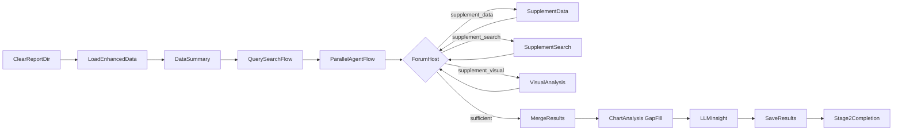

# 阶段 2：深度分析子系统

> **文档状态**: 2026-02-20 更新  
> **关联源码**: `nodes/stage2/*`, `flow.py`, `config.py`, `utils/web_search.py`  
> **上级文档**: [系统设计总览](design.md)

---

## 1. 概述

Stage2 将 Stage1 增强数据转换为可报告化分析产物，输出：

- `report/analysis_data.json`（图表/表格/执行日志/搜索上下文）
- `report/chart_analyses.json`（图表视觉分析，含论坛视觉复用 + 批量补漏）
- `report/insights.json`（LLM 洞察）
- `report/trace.json`（决策/执行/反思/循环状态）

当前已完成 **Track B 全量（B1~B9）**：双信源 + 动态论坛循环 + 实时补充 + 合并收敛 + 全链路 live API 验证。

---

## 2. 当前 Flow（B1~B9）



---

## 3. 关键能力

### 3.1 QuerySearchFlow（B1）

文件：`nodes/stage2/search.py`

- `ExtractQueriesNode`：基于 `data_summary` 与上一轮缺口提取查询词
- `WebSearchNode`：通过 `utils.web_search.batch_search` 调用 Tavily
- `SearchProcessNode`：去重/规整外部文档
- `SearchReflectionNode`：判断 `need_more/sufficient`
- `SearchSummaryNode`：生成 `shared["search_results"]`

循环治理：

- `stage2.search_reflection_max_rounds` 控制最大反思轮次
- 写入 `trace.search_reflections`
- 写入 `trace.loop_status.search_reflection = {current,max,termination_reason}`

### 3.2 双信源并行（B2~B4）

文件：`nodes/stage2/parallel.py`, `nodes/stage2/search_agent.py`

- `ParallelAgentFlow` 并行分支：
  - `data_agent`：复用 DataAgent 决策-执行循环
  - `search_agent`：对搜索摘要结构化分析
- 输出隔离写入 `shared["agent_results"]["data_agent|search_agent"]`
- DataAgent trace 回写主 shared（含 `loop_status.data_agent`）

### 3.3 Forum 动态循环（B5~B8）

文件：`nodes/stage2/forum.py`, `nodes/stage2/supplement.py`, `nodes/stage2/visual.py`, `nodes/stage2/merge.py`

- `ForumHostNode`：中央状态机，动作路由为：
  - `supplement_data`
  - `supplement_search`
  - `supplement_visual`
  - `sufficient`
- `SupplementDataNode`：按主持人 directive 调用指定 MCP 工具子集
- `SupplementSearchNode`：追加搜索并刷新 SearchAgent 结论
- `VisualAnalysisNode`：按需调用 GLM4.5V 解析图表
- `MergeResultsNode`：合并 Data/Search/Forum 产物，回填兼容 `stage2_results`

循环治理：

- `stage2.forum_max_rounds`
- `stage2.forum_min_rounds_for_sufficient`
- 写入 `trace.forum_rounds`
- 写入 `trace.loop_status.forum = {current,max,termination_reason}`

### 3.4 图表补漏分析（B8）

文件：`nodes/stage2/chart_analysis.py`

- 先复用 `forum.visual_analyses`（已分析图表不重复调用视觉模型）
- 对未覆盖图表执行批量分析
- 最终 `stage2_results.chart_analyses` 统一包含：
  - 论坛视觉分析结果
  - 批量补漏分析结果

### 3.5 洞察语义兼容（修复项）

文件：`nodes/stage2/insight.py`

- 洞察节点读取图表分析内容时，优先使用 `analysis_content`
- 同时兼容历史字段 `analysis`，避免旧数据结构导致洞察提示词丢失

---

## 4. Shared 契约（Stage2 新增/稳定字段）

```python
shared["config"]["stage2_loops"] = {
    "agent_max_iterations": int,
    "search_reflection_max_rounds": int,
    "forum_max_rounds": int,
    "forum_min_rounds_for_sufficient": int,
}

shared["forum"] = {
    "current_round": 0,
    "rounds": [],
    "current_directive": {},
    "visual_analyses": [],
}

shared["trace"]["loop_status"] = {
    "data_agent": {"current": int, "max": int, "termination_reason": str},
    "search_reflection": {"current": int, "max": int, "termination_reason": str},
    "forum": {"current": int, "max": int, "termination_reason": str},
}
```

`stage2_results` 继续向后兼容，核心字段不变，保留 `search_context` 并新增论坛综合上下文（如 `forum_conclusions`）。

---

## 5. 测试覆盖（B1~B9）

### 5.1 Unit

- `tests/unit/stage2/test_stage2_search_flow.py`
- `tests/unit/stage2/test_stage2_search_agent.py`
- `tests/unit/stage2/test_stage2_parallel_flow.py`
- `tests/unit/stage2/test_stage2_data_agent_trace.py`
- `tests/unit/stage2/test_stage2_forum.py`
- `tests/unit/stage2/test_stage2_supplement.py`
- `tests/unit/stage2/test_stage2_visual.py`
- `tests/unit/stage2/test_stage2_merge.py`
- `tests/unit/stage2/test_stage2_chart_analysis_gapfill.py`
- `tests/unit/stage2/test_stage2_insight.py`

### 5.2 Integration

- `tests/integration/pipeline/test_stage2_forum_pipeline_integration.py`

### 5.3 Live API E2E（B9）

- `tests/e2e/cli/test_cli_pipeline_e2e.py`
- `tests/e2e/cli/test_dashboard_pipeline_e2e.py`
- `tests/e2e/cli/test_tavily_live_api_e2e.py`

> E2E 运行态采用平衡档循环上限（`agent=3`, `search_reflection=2`, `forum=3`）以控制 API 成本与总耗时。
