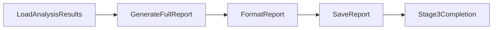
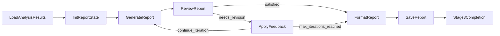

# 阶段 3：报告生成子系统

> **文档状态**: 2026-02-10 创建  
> **关联源码**: `nodes.py` L3349-4600, `flow.py` L306-378  
> **上级文档**: [系统设计总览](design.md)

---

## 1. 概述

### 1.1 目标

将阶段 2 产出的图表、数据表格和 LLM 洞察自动组装为一份**图文并茂的舆情分析报告**（Markdown 格式）。

### 1.2 输入/输出

| 项目 | 说明 |
|:---|:---|
| **输入** | `report/analysis_data.json` — 图表与表格元数据 |
| | `report/chart_analyses.json` — 图表分析结果 |
| | `report/insights.json` — LLM 洞察摘要 |
| | `report/images/*.png` — 可视化图表文件 |
| | `data/enhanced_blogs.json` — 博文样本（典型案例引用） |
| **输出** | `report/report.md` — 最终报告 |

### 1.3 两种执行模式

| 模式 | 配置值 | Flow 类型 | 特点 |
|:---|:---|:---|:---|
| 模板（一次性） | `report_mode = "template"` | `Flow` | 一次性生成完整报告，速度快 |
| 迭代 | `report_mode = "iterative"` | `AsyncFlow` | 生成 → 评审 → 修改循环，质量更高 |

---

## 2. 数据加载 `LoadAnalysisResultsNode`

### 2.1 双数据源策略

| 优先级 | 数据来源 | 条件 |
|:---|:---|:---|
| 高 | `shared["stage2_results"]`（内存） | 当阶段 2 刚在同一流程中完成时 |
| 低 | `report/*.json` 文件 | 独立运行阶段 3 时 |

**内存数据检测条件**：
1. `2 in completed_stages`
2. `stage2_results` 中至少存在 `charts`/`chart_analyses`/`tables`/`insights` 之一

### 2.2 额外数据

- 从增强数据文件中**随机抽取 10 条博文**作为典型案例样本（`sample_blogs`）
- 存储到 `shared["stage3_data"]`

### 2.3 前置检查

- 文件模式下缺少任何 JSON 文件 → 抛出 `FileNotFoundError`
- `report/images/` 目录不存在 → 抛出 `FileNotFoundError`

---

## 3. 模板模式（一次性生成）

### 3.1 Flow 节点链路



### 3.2 `GenerateFullReportNode`

| 属性 | 值 |
|:---|:---|
| **类型** | `Node` |
| **LLM 模型** | `call_glm46`（GLM-4.6 + 推理模式） |
| **Temperature** | 0.7 |

**输入数据准备**：

1. **图表资源字典** `available_charts`：
   - 遍历 `analysis_data.charts`，标准化路径为 `./images/{filename}`
   - 结构：`{chart_id: {title, file_path, description, type}}`

2. **表格资源字典** `available_tables`：
   - 结构：`{table_id: {title, data}}`

3. **分析摘要列表** `detailed_analysis_summary`：
   - 从 `chart_analyses` 中提取微观细节（`statistics`、`data_points`）
   - 从 `chart_analyses` 中提取宏观洞察（`key_findings`、`trend_analysis`）
   - 包含数据质量评分（`information_density`、`readability`）

**Prompt 结构**（约 11 章节要求）：

| 报告章节 | 内容要求 |
|:---|:---|
| 报告摘要 | 基于 insights 和关键图表 |
| 舆情事件发展脉络 | 时序趋势与转折点 |
| 舆情总体趋势分析 | 情感/主题总体演化 |
| 焦点窗口专项分析 | 窗口内情感、发布者、主题对比与预警 |
| 传播场景分析 | 地域与发布者分布、交互特征 |
| 舆论内容结构分析 | 主题网络、共现、排行 |
| 信念系统分析 | 信念节点激活与网络 |
| 区域与空间认知差异 | 区域情感与归因差异 |
| 舆情风险研判 | 结合多维度指标 |
| 应对建议 | 针对性措施 |
| 附录 | 数据范围与指标说明 |

**后处理**：
- 统一图片路径格式（Windows `\\` → `/`，`report/images/` → `./images/`）
- 调用 `_remap_report_images()` 修正 LLM 可能生成的错误图片路径

### 3.3 `FormatReportNode`

| 处理步骤 | 说明 |
|:---|:---|
| 路径修复 | 将各种格式（Windows、Unix、相对）统一为 `./images/` |
| 图片重映射 | 调用 `_remap_report_images()` 确保引用的图片存在 |
| 自动目录 | 使用正则提取所有标题，生成 `## 目录` 锚点链接 |
| 结尾换行 | 确保文件以 `\n` 结尾 |

**`_remap_report_images()` 机制**：

使用正则匹配 `` 格式的图片引用，通过以下策略修正路径：
1. 精确匹配：图片文件名 stem 直接在已有图表中查找
2. 别名匹配：检查 `_MANUAL_IMAGE_ALIAS` 手动映射表
3. 模糊匹配：stem 的包含关系匹配
4. 兜底：使用排序后的第一个可用图表路径

### 3.4 `SaveReportNode`

固定保存到 `report/report.md`，UTF-8 编码。

---

## 4. 迭代模式（生成-评审循环）

### 4.1 Flow 节点链路



### 4.2 `InitReportStateNode`

初始化迭代报告状态：

| 状态字段 | 初始值 | 说明 |
|:---|:---|:---|
| `max_iterations` | `config.iterative_report_config.max_iterations`（默认 5） | 最大迭代轮数 |
| `current_iteration` | `0` | 当前迭代次数 |
| `review_history` | `[]` | 评审历史列表 |
| `revision_feedback` | `""` | 当前修改意见 |
| `current_draft` | `""` | 当前报告草稿 |

### 4.3 `GenerateReportNode`

| 属性 | 值 |
|:---|:---|
| **类型** | `Node` |
| **LLM 模型** | `call_glm46`（GLM-4.6 + 推理模式） |
| **Temperature** | 0.7 |

**两种 Prompt 模式**：

| `iteration` | 行为 |
|:---|:---|
| `== 0` | **首次生成**：与 `GenerateFullReportNode` 的 Prompt 类似，传入完整图表/表格/洞察资源 |
| `> 0` | **修改模式**：传入当前草稿 + 评审修改意见 + 可用资源列表，要求保持图文并茂 |

**输出质量统计**：
- `image_refs`：图片引用计数（`![` 和 `.png` 出现次数）
- `table_refs`：表格引用计数（`|---` 出现次数）
- `data_citations`：数据引用计数（"图表"/"数据"/"如图" 出现次数）
- `visual_completeness`：`high`（≥3 图 + ≥2 表）/ `medium`（≥1 图）/ `low`

### 4.4 `ReviewReportNode`

| 属性 | 值 |
|:---|:---|
| **类型** | `Node`（LLM 评审） |
| **LLM 模型** | `call_glm46`（GLM-4.6 + 推理模式） |
| **Temperature** | 0.7 |
| **满意度阈值** | `config.iterative_report_config.satisfaction_threshold`（默认 80） |

**评审维度（五项，各 20 分，满分 100）**：

| 维度 | 评分范围 | 评审内容 |
|:---|:---|:---|
| 结构完整性 | 0-20 | 报告结构是否完整，逻辑是否清晰 |
| 数据支撑充分性 | 0-20 | 每个结论是否有足够的数据支撑 |
| 图表引用准确性 | 0-20 | 图表引用是否准确，分析是否到位 |
| 逻辑连贯性 | 0-20 | 分析逻辑是否连贯，推理是否合理 |
| 建议可行性 | 0-20 | 提出的建议是否具有可行性 |

**输出格式**：

```json
{
    "structure_score": 15,
    "data_support_score": 18,
    "chart_reference_score": 16,
    "logic_score": 17,
    "suggestion_score": 15,
    "total_score": 81,
    "unsupported_conclusions": ["..."],
    "chart_reference_issues": ["..."],
    "revision_feedback": "...",
    "needs_revision": true,
    "overall_assessment": "..."
}
```

**Action 路由**：

| 条件 | 返回 Action | 行为 |
|:---|:---|:---|
| `total_score >= satisfaction_threshold` | `"satisfied"` | 跳出循环，进入 FormatReport |
| `current_iteration >= max_iterations - 1` | `"satisfied"` | 强制结束，进入 FormatReport |
| 其他 | `"needs_revision"` | 进入 ApplyFeedback |

### 4.5 `ApplyFeedbackNode`

**处理逻辑**：
1. 读取 `last_review` 的 `revision_feedback`
2. 追加未支撑结论列表（最多 5 条）和图表引用问题列表（最多 5 条）
3. 递增 `shared["report"]["iteration"]`

**Action 路由**：

| 条件 | 返回 Action |
|:---|:---|
| `iteration >= max_iterations` | `"max_iterations_reached"` → FormatReport |
| 其他 | `"continue_iteration"` → GenerateReport（下一轮） |

---

## 5. 分章节生成模式（Legacy）

> 此模式在代码中保留但在当前 Flow 构建中**未使用**（`_create_template_report_flow` 已切换为 `GenerateFullReportNode`）。以下文档作为参考。

### 5.1 相关节点

| 节点 | 说明 |
|:---|:---|
| `LoadTemplateNode` | 加载 `report/template.md` 模板文件 |
| `FillSectionNode` | 逐章节调用 LLM 填充内容 |
| `AssembleReportNode` | 将各章节按预定义顺序组装 |

### 5.2 `FillSectionNode`

- 构造时传入 `section_name` 和 `section_title`
- 为不同章节生成定制化 Prompt（`_get_section_specific_prompt`）：

| section_name | 要点 |
|:---|:---|
| `summary` | 情感饼图 + 主题排行 + 地区分布 |
| `trend` | 情感趋势/桶/属性图 + 主题演化 + 峰值拐点表格 |
| `spread` | 发布者类型/地区分布/交叉分析 + 高峰时段 |
| `focus` | 焦点窗口时间范围 + 窗口内多维分析 + 预警 |
| `content` | 主题网络图 + 排行 + 共现 |
| `belief` | 信念系统网络图 + 节点/边数据 + 结构特征 |

### 5.3 `AssembleReportNode`

按固定顺序组装 11 个章节：

```
summary → development → trend → focus → spread →
content → belief → region → risk → suggestion → appendix
```

添加报告头部（生成时间、系统信息）和数据说明尾部。

---

## 6. 图片路径处理

### 6.1 路径标准化策略

报告中的图片路径需要统一为 `./images/{filename}` 格式（因为报告保存在 `report/` 目录下）。

**统一替换规则**：

| 原始格式 | 替换为 |
|:---|:---|
| `report\images\` | `./images/` |
| `report/images/` | `./images/` |
| `./report/images/` | `./images/` |
| `../report/images/` | `./images/` |

### 6.2 `_remap_report_images()` 函数

当 LLM 生成的图片文件名与实际文件不匹配时，此函数通过多级匹配策略修正：

```
精确匹配（stem） → 别名匹配（_MANUAL_IMAGE_ALIAS） → 
模糊匹配（包含关系） → 兜底（第一个可用图表）
```

### 6.3 `_load_analysis_charts()` 函数

从 `report/analysis_data.json` 加载图表列表，供路径重映射使用。

---

## 7. 阶段完成 `Stage3CompletionNode`

| 行为 | 说明 |
|:---|:---|
| 将 `3` 追加到 `shared["dispatcher"]["completed_stages"]` | 标记阶段 3 完成 |
| 记录生成模式和最终评分 | 供终端节点打印摘要 |
| 返回 `"dispatch"` | 跳转回 `DispatcherNode` → `TerminalNode` 结束 |
