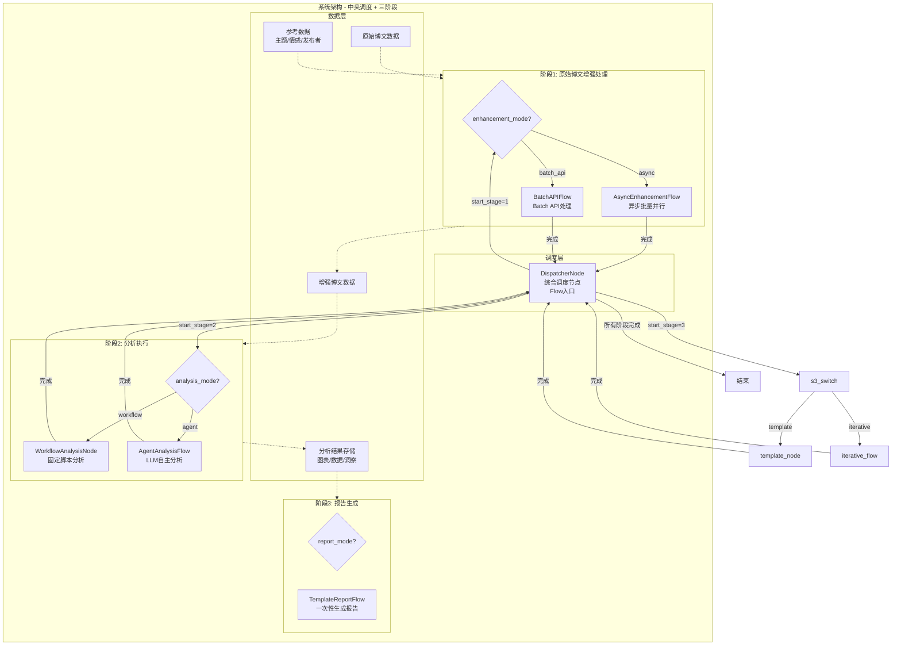
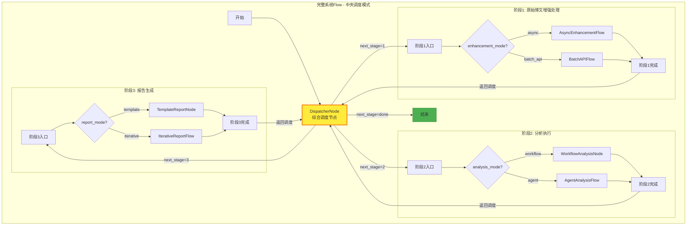
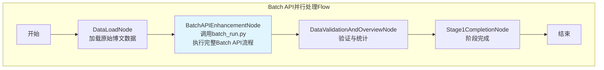
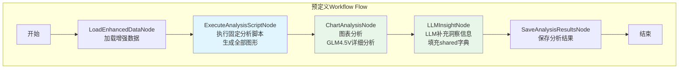
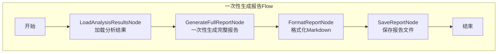

# 舆情分析智能体系统设计文档

> Please DON'T remove notes for AI


---

## 系统概述

### 项目背景
舆情分析智能体是一个基于PocketFlow框架的大规模博文数据分析系统，旨在通过多模态AI模型实现对社交媒体博文内容的深度分析和智能报告生成。

### 核心特性
- **三阶段解耦**：增强处理、分析执行、报告生成三阶段独立运行
- **多维度分析**：情感极性、情感属性、主题分类、发布者识别
- **多路径执行**：每阶段支持多种执行方式（异步/Batch API、Agent/Workflow、模板/迭代）
- **大规模处理**：支持3万条博文数据的批量处理
- **多模态支持**：文本与图像内容的综合分析
- **全流程监测**：实时输出系统运行状态，提供详细的执行日志和进度提示
- **思考过程记录**：记录LLM在工具调用决策和报告编排中的思考过程，支持终端实时提示和持久化存储
- **数据引用验证**：确保最终报告中的所有结论都有数据支撑，避免模型幻觉，生成详细的编排原因说明

### 监测与透明化设计

#### 1. 全流程终端监测
- **阶段转换提示**：进入/离开各个Stage时在终端输出清晰提示信息
- **重要节点提示**：进入关键Flow、重要节点工作完成后输出执行状态
- **实时进度反馈**：批量处理、Agent循环、迭代生成等过程中的进度提示
- **错误处理提示**：异常发生时的详细错误信息和恢复建议

#### 2. 思考过程透明化
- **终端简短提示**：每次LLM思考决策后在终端输出关键信息摘要
- **详细记录存储**：完整的思考过程保存到共享存储和文件系统
- **时间戳追踪**：记录思考过程的时间线，便于性能分析和调试
- **决策逻辑追溯**：记录工具选择、参数设置、决策依据等关键信息

#### 3. 结论可靠性保障
- **数据引用映射**：自动追踪报告中每个结论的数据来源
- **编排原因说明**：详细记录报告结构组织、内容选择的逻辑依据
- **幻觉检测机制**：通过数据引用验证识别潜在的模型幻觉
- **质量评估报告**：生成报告质量评分和改进建议

---

## 需求分析

> Notes for AI: Keep it simple and clear.
> If the requirements are abstract, write concrete user stories
> 需求按三阶段解耦架构组织，每个阶段独立运行并支持多种执行路径

### 核心需求 - 三阶段解耦架构

#### 阶段1: 原始博文增强处理
**功能描述**：为每个博文添加四个维度的分析信息，支持独立运行

**四维度分析**：
- **情感极性分析**：1-5档情感分级
  - 1-极度悲观，2-悲观，3-无明显极性，4-乐观，5-极度乐观
- **情感属性分析**：具体情感状态识别
  - 生气、支持、担忧、兴奋、失望、希望、恐惧、满意、惊讶等
- **两级主题分析**：从预定义的两层嵌套主题列表中选择合适主题
- **发布者对象分析**：识别发布者类型
  - 政府机构、官方新闻媒体、自媒体、企业账号、个人用户等

**执行路径**：
- **异步批量并行**：本地代码并发调用API，适合中小规模数据
- **Batch API并行**：一次性提交批量请求到API服务端，适合大规模数据

#### 阶段2: 分析执行
**功能描述**：基于增强数据执行深度分析，生成图表、表格和洞察，支持独立运行

**执行路径**：
- **预定义Workflow**（思路1）：执行固定的分析脚本
  - 流程：执行脚本生成全部图形 → LLM补充洞察信息 → 填充shared字典
  - 特点：可预测、高效、标准化
  - 适用：日常监控、常规分析、快速报告
- **Agent自主调度**（思路2）：Single Agent循环决策
  - 流程：工具收集 → 工具决策 → 工具执行 → 结果处理 → 返回决策（循环）
  - 终止条件：Agent判断分析已充分 或 达到最大迭代次数
  - 特点：灵活、智能、可探索隐藏模式
  - 适用：复杂分析、探索性研究、异常情况

**分析工具集**：四类核心分析工具集，每类包含若干工具函数

##### 2.1 情感趋势分析工具集
时间序列情感变化分析，包含以下工具函数：
- `sentiment_distribution_stats`：情感极性分布统计（各档位数量、占比）
- `sentiment_time_series`：情感时序趋势分析（按小时/天聚合）
- `sentiment_anomaly_detection`：情感异常点检测（突变、峰值识别）
- `sentiment_trend_chart`：情感趋势折线图/面积图生成
- `sentiment_pie_chart`：情感分布饼图生成

##### 2.2 主题演化分析工具集
主题热度变化和关联分析，包含以下工具函数：
- `topic_frequency_stats`：主题频次统计（父主题/子主题分布）
- `topic_time_evolution`：主题时序演化分析（热度变化趋势）
- `topic_cooccurrence_analysis`：主题共现关联分析（主题间关系）
- `topic_ranking_chart`：主题热度排行柱状图生成
- `topic_evolution_chart`：主题演化时序图生成
- `topic_network_chart`：主题关联网络图生成

##### 2.3 地理分布分析工具集
舆情地理分布和热点识别，包含以下工具函数：
- `geographic_distribution_stats`：地理分布统计（省份/城市级别）
- `geographic_hotspot_detection`：热点区域识别（高密度区域）
- `geographic_sentiment_analysis`：地区情感差异分析
- `geographic_heatmap`：地理热力图生成
- `geographic_bar_chart`：地区分布柱状图生成

##### 2.4 多维交互分析工具集
情感、主题、地理、发布者多维度交叉分析，包含以下工具函数：
- `publisher_distribution_stats`：发布者类型分布统计
- `cross_dimension_matrix`：多维交叉矩阵分析（如：发布者×情感、主题×地区）
- `influence_analysis`：影响力分析（互动量、传播力）
- `correlation_analysis`：维度相关性分析
- `interaction_heatmap`：交互热力图生成
- `publisher_bar_chart`：发布者分布柱状图生成

#### 阶段3: 报告生成
**功能描述**：综合分析结果，生成结构化的Markdown报告，支持独立运行

**执行路径**：
- **模板填充**：预定义大纲，LLM填充内容
  - 特点：效率高、格式一致、可控性强
  - 适用：格式要求固定的标准报告
- **多轮迭代**：生成-评审-修改循环
  - 特点：质量有保障、可自我完善
  - 适用：对报告质量要求极高的重要舆情事件

**数据输入**：
- **主要数据源**：阶段2输出的分析结果（图表、统计数据、洞察描述）
- **辅助数据源**：增强后博文数据的少量样本（用于典型案例引用、原文示例等）

#### 解耦架构设计
**设计理念**：三阶段顺序依赖（阶段1 → 阶段2 → 阶段3），但每个阶段可独立执行

**独立执行前提**：
- 每个阶段独立执行的前提是：**前序阶段已完成并将数据存储到指定位置**
- 阶段2独立执行：需要阶段1输出的增强数据（`data/enhanced_posts.json`）
- 阶段3独立执行：需要阶段2输出的分析结果（`report/` 目录下的图表和数据）

**运行模式**：
- **完整Flow**：阶段1 → 阶段2 → 阶段3（从原始数据到最终报告）
- **增强处理Flow**：仅运行阶段1（输出增强数据供后续使用）
- **分析执行Flow**：仅运行阶段2（需要已有增强数据）
- **报告生成Flow**：仅运行阶段3（需要已有分析结果）

#### 大规模处理能力
**处理能力**：支持3万条博文数据的高效处理

**实现方式**：通过在原始数据字典中附加新字段实现信息增强

### 处理规则

#### 核心规则
- **三阶段顺序依赖**：阶段1 → 阶段2 → 阶段3，后序阶段依赖前序阶段输出
- **多路径执行**：每个阶段支持多种执行方式，通过shared字典中的参数控制
- **独立执行**：各阶段可独立运行，前提是前序阶段已完成并存储数据到指定位置
- **前置检查**：阶段2/3独立执行前需检查前序阶段输出文件是否存在
- **并行处理**：阶段1中四个分析维度完全并行，无先后顺序
- **模型调用**：所有分析通过多模态语言模型API调用进行
- **阶段数据隔离**：阶段3仅使用阶段2的分析结果和少量博文样本，不直接处理全量增强数据

#### 多路径执行架构
| 阶段 | 路径选项 | 控制参数 | 说明 |
|------|----------|----------|------|
| 阶段1: 增强处理 | 异步批量并行 | `enhancement_mode="async"` | 本地代码并发调用API |
| 阶段1: 增强处理 | Batch API并行 | `enhancement_mode="batch_api"` | 一次性提交批量请求到API服务端 |
| 阶段2: 分析执行 | 预定义Workflow | `analysis_mode="workflow"` | 执行固定脚本生成图形 → LLM补充信息 |
| 阶段2: 分析执行 | Agent自主调度 | `analysis_mode="agent"` | Single Agent循环决策执行工具 |
| 阶段3: 报告生成 | 模板填充 | `report_mode="template"` | 预定义大纲，LLM填充内容 |
| 阶段3: 报告生成 | 多轮迭代 | `report_mode="iterative"` | 生成-评审-修改循环 |

#### Agent工具调度方式
| 方式 | 控制参数 | 说明 |
|------|----------|------|
| MCP动态查询 | `tool_source="mcp"` | 通过Model Context Protocol动态获取工具列表 (唯一实现方式) |

#### 质量保证
- **结果验证**：所有分析结果必须通过预定义候选列表验证
- **错误处理**：提供完善的错误处理和重试机制
- **数据完整性**：确保增强数据的格式完整性和一致性
- **迭代控制**：多轮迭代报告生成设置最大迭代次数保障
- **前置验证**：阶段独立执行前验证前序输出文件存在且格式正确
- **全流程监测**：系统运行过程中实时输出执行状态和进度信息
  - 阶段进入/离开提示：`📍 [阶段名称] 开始/完成`
  - 重要节点提示：`🔄 [节点名称] 执行中/已完成`
  - 进度反馈：批量处理、Agent循环、迭代生成的实时进度
  - 错误提示：异常发生时的详细信息和建议
- **思考过程透明化**：记录并显示LLM在关键决策点的思考过程
  - 终端简短提示：每次思考决策后的关键信息摘要
  - 详细记录存储：完整思考过程保存到共享存储和文件
  - 时间戳追踪：思考过程的时间线记录
  - 决策逻辑追溯：工具选择、参数设置、决策依据记录
- **数据引用完整性**：最终报告必须确保所有结论都有对应的数据支撑
  - 数据引用映射：自动追踪结论的数据来源
  - 编排原因说明：报告结构和内容选择的逻辑依据
  - 幻觉检测机制：识别和标记潜在的模型幻觉
  - 质量评估报告：生成报告质量评分和改进建议

## 架构设计

### 系统架构概览

舆情分析智能体采用**中央调度 + 三阶段顺序依赖架构**，基于PocketFlow框架构建。系统通过一个**综合调度节点（DispatcherNode）**作为入口和中央控制器，根据配置决定执行路径，每个阶段完成后返回调度节点决定下一步动作。



### 调度机制说明

**DispatcherNode（综合调度节点）**是整个系统的入口和中央控制器：

1. **启动阶段选择**：根据 `shared["config"]["start_stage"]` 决定从哪个阶段开始
2. **阶段内路径选择**：根据各阶段的配置参数选择具体执行路径
3. **阶段间流转**：每个阶段完成后返回调度节点，根据 `shared["config"]["run_stages"]` 决定是否继续下一阶段
4. **终止条件**：所有配置的阶段执行完毕后结束流程

| 阶段 | 配置参数 | 路径选项 | 执行形式 |
|------|----------|----------|----------|
| 阶段1 | `enhancement_mode` | `async` / `batch_api` | Flow |
| 阶段2 | `analysis_mode` | `workflow` / `agent` | Node / Flow |
| 阶段3 | `report_mode` | `template` / `iterative` | Node / Flow |

### 核心设计原则

#### 1. 中央调度架构
- **DispatcherNode**：作为系统入口和中央控制器
- **统一入口**：所有执行流程从DispatcherNode开始
- **阶段回调**：每个阶段完成后返回DispatcherNode，由调度节点决定下一步
- **灵活配置**：支持配置起始阶段和执行阶段列表

#### 2. 三阶段顺序依赖（与需求分析完全对应）
- **阶段1 - 原始博文增强处理**：为博文添加情感、主题、发布者等维度标注
  - 对应需求："阶段1: 原始博文增强处理 - 四维度分析"
  - 输出：`data/enhanced_posts.json`
- **阶段2 - 分析执行**：基于增强数据执行深度分析，生成图表、表格和洞察
  - 对应需求："阶段2: 分析执行 - 分析工具集"
  - 输出：`report/analysis_data.json`、`report/insights.json`、`report/images/`
- **阶段3 - 报告生成**：综合分析结果，生成结构化的Markdown报告
  - 对应需求："阶段3: 报告生成 - 报告输出"
  - 输入：阶段2输出 + 少量博文样本
  - 输出：`report/report.md`
- **顺序依赖**：阶段1 → 阶段2 → 阶段3
- **独立运行**：每个阶段可单独执行，前提是前序阶段已完成并存储数据到指定位置

#### 3. 多路径执行控制
- **统一控制机制**：所有执行路径通过shared字典中的参数控制
- **灵活切换**：运行时可动态选择执行路径
- **组合使用**：不同阶段可选择不同的执行路径组合

**调度控制参数**：
- `shared["dispatcher"]["start_stage"]`：起始阶段（1/2/3）
- `shared["dispatcher"]["run_stages"]`：执行阶段列表

**路径控制参数**：
- `shared["config"]["enhancement_mode"]`：`"async"` 或 `"batch_api"`
- `shared["config"]["analysis_mode"]`：`"workflow"` 或 `"agent"`
- `shared["config"]["tool_source"]`：`"mcp"`（Agent模式下的唯一工具来源）
- `shared["config"]["report_mode"]`：`"template"` 或 `"iterative"`

#### 4. 模块化设计
- **独立模块**：每个功能模块都可以独立运行和测试
- **标准接口**：模块间通过标准化的数据接口通信
- **可插拔**：分析工具可以动态添加和替换（支持MCP动态发现）
- **版本兼容**：保持向后兼容性，支持平滑升级

#### 5. LLM调用解耦
- **统一接口**：所有LLM调用通过`call_llm`系列函数封装
- **模型可切换**：生成和评审可使用同一模型或不同模型
- **参数化配置**：模型选择、温度、token限制等通过配置控制


## Flow Design

> Notes for AI:
> 1. 系统采用三阶段解耦架构，与需求分析中定义的三阶段完全对应
> 2. 阶段1(增强处理)对应需求中的"四维度分析"
> 3. 阶段2(分析执行)对应需求中的"分析工具集"  
> 4. 阶段3(报告生成)对应需求中的"报告输出"
> 5. 每个阶段支持多种执行路径，通过shared["config"]参数控制
> 6. 所有流程图使用清晰的节点描述

### Flow high-level Design:

#### 完整系统Flow总览（中央调度模式）

系统采用中央调度模式，DispatcherNode作为入口和控制中心，根据配置决定执行路径，每个阶段完成后返回调度节点。



#### 调度逻辑说明

**DispatcherNode工作流程**：
1. 读取 `shared["config"]["start_stage"]` 确定起始阶段
2. 读取 `shared["config"]["run_stages"]` 确定需要执行的阶段列表
3. 根据当前阶段的配置参数选择具体执行路径（Flow或Node）
4. 阶段完成后更新 `shared["dispatcher"]["current_stage"]`，返回调度节点
5. 调度节点判断下一步：继续下一阶段 或 结束

**路径选择规则**：
| 阶段 | 配置参数 | 选项 | 执行形式 | 说明 |
|------|----------|------|----------|------|
| 阶段1 | `enhancement_mode` | `async` | Flow | 异步并行处理Flow |
| | | `batch_api` | Flow | Batch API处理Flow |
| 阶段2 | `analysis_mode` | `workflow` | Node | 固定脚本分析节点 |
| | | `agent` | Flow | LLM自主分析Flow |
| 阶段3 | `report_mode` | `template` | Node | 模板填充节点 |
| | | `iterative` | Flow | 多轮迭代Flow |

---

#### 阶段1详细设计: 原始博文增强处理Flow

##### 1.1 异步批量并行处理路径 (enhancement_mode="async")

```mermaid
flowchart TD
    subgraph AsyncEnhancementFlow[异步批量并行处理Flow]
        async_start[开始] --> async_load[DataLoadNode<br/>加载原始博文数据]
        async_load --> async_sentiment_polarity[AsyncSentimentPolarityAnalysisBatchNode<br/>情感极性分析]
        async_sentiment_polarity --> async_sentiment_attribute[AsyncSentimentAttributeAnalysisBatchNode<br/>情感属性分析]
        async_sentiment_attribute --> async_topic[AsyncTwoLevelTopicAnalysisBatchNode<br/>两级主题分析]
        async_topic --> async_publisher[AsyncPublisherObjectAnalysisBatchNode<br/>发布者对象分析]
        async_publisher --> async_save[SaveEnhancedDataNode<br/>保存增强数据]
        async_save --> async_validate[DataValidationAndOverviewNode<br/>验证与统计]
        async_validate --> async_complete[Stage1CompletionNode<br/>阶段完成]
        async_complete --> async_end[结束]
    end
    
    style async_sentiment_polarity fill:#e3f2fd
    style async_sentiment_attribute fill:#e3f2fd
    style async_topic fill:#e3f2fd
    style async_publisher fill:#e3f2fd
```



> **说明**：四个异步分析节点顺序执行，每个节点内部使用 `AsyncParallelBatchNode` 实现批量并发处理。各节点的 `post_async` 方法直接将分析结果写入博文对象，无需单独的合并节点。

##### 1.2 Batch API并行处理路径 (enhancement_mode="batch_api")



> **说明**：`BatchAPIEnhancementNode` 内部调用 `batch/batch_run.py` 脚本，该脚本依次执行：生成JSONL请求 → 上传并启动任务 → 下载结果 → 解析并整合数据。所有子流程封装在脚本内部，对Flow层透明。

---

#### 阶段2详细设计: 分析执行Flow

> 阶段2提供两种执行思路：
> - **Workflow路径**：执行固定脚本生成全部图形，然后调用LLM补充信息填充shared字典
> - **Agent路径**：Single Agent自主决策，通过循环反复执行工具直到分析充分或达到最大迭代次数

##### 2.1 预定义Workflow路径 (analysis_mode="workflow")

执行固定的分析脚本，按顺序生成所有图形，然后通过LLM调用补充洞察信息。



##### 2.2 Agent自主调度路径 (analysis_mode="agent")

Single Agent通过循环自主决策执行哪些分析工具，直到认为分析充分或达到最大迭代次数。

```mermaid
flowchart TD
    subgraph AgentAnalysisFlow[Agent自主调度Flow - Single Agent Loop]
        agent_start[开始] --> agent_load[LoadEnhancedDataNode<br/>加载增强数据]
        agent_load --> agent_summary[DataSummaryNode<br/>生成数据概况]
        
        agent_summary --> collect_tools[CollectToolsNode<br/>工具收集节点<br/>获取可用工具列表]
        
        collect_tools --> decision_node[DecisionToolsNode<br/>工具决策节点<br/>GLM4.6智能体推理]
        
        decision_node --> execute_node[ExecuteToolsNode<br/>工具执行节点<br/>执行选定的分析工具]

        execute_node --> agent_chart[ChartAnalysisNode<br/>图表分析节点<br/>GLM4.5V详细分析]
        agent_chart --> process_result[ProcessResultNode<br/>结果处理节点<br/>分析工具和图表结果]
        
        process_result --> check_finish{分析充分?<br/>或达到最大迭代?}
        
        check_finish -->|继续分析| decision_node
        check_finish -->|结束分析| agent_save[SaveAnalysisResultsNode<br/>保存分析结果]
        
        agent_save --> agent_end[结束]
    end

    style collect_tools fill:#fff3e0
    style decision_node fill:#e3f2fd
    style execute_node fill:#e8f5e9
    style agent_chart fill:#e8f5e9
    style process_result fill:#fce4ec
```



---

#### 阶段3详细设计: 报告生成Flow

##### 3.1 一次性生成报告路径 (report_mode="template")



**设计说明（2025-12-01更新）**：
- **一次性生成**：采用单次LLM调用生成完整报告，确保报告的整体一致性和连贯性
- **严格数据驱动**：基于Stage2输出的JSON分析结果生成所有内容，禁止模型自由发挥
- **相对路径引用**：使用`./images/`相对路径确保图片引用正确
- **简化架构**：移除了原有的分章节生成和多轮迭代模式，统一采用高效的一次性生成模式

---

### Flow编排架构

#### 系统入口Flow

| Flow/Node名称 | 类型 | 用途 | 说明 |
|---------------|------|------|------|
| MainFlow | Flow | 系统入口 | 以DispatcherNode为起点，串联所有阶段 |
| DispatcherNode | Node | 综合调度 | 根据配置决定执行路径，阶段完成后返回此节点 |

#### 阶段Flow/Node说明

| Flow/Node名称 | 阶段 | 执行形式 | 用途 | 触发Action |
|---------------|------|----------|------|------------|
| AsyncEnhancementFlow | 阶段1 | Flow | 异步批量并行处理 | `stage1_async` |
| BatchAPIFlow | 阶段1 | Flow | Batch API并行处理 | `stage1_batch_api` |
| WorkflowAnalysisNode | 阶段2 | Node | 固定脚本分析 | `stage2_workflow` |
| AgentAnalysisFlow | 阶段2 | Flow | LLM自主分析 | `stage2_agent` |
| TemplateReportNode | 阶段3 | Node | 模板填充报告 | `stage3_template` |
| IterativeReportFlow | 阶段3 | Flow | 多轮迭代报告 | `stage3_iterative` |

#### Flow编排优势
- **中央调度**：DispatcherNode统一管理流程，每个阶段完成后返回调度节点
- **灵活启动**：可配置起始阶段和执行阶段列表，支持从任意阶段开始
- **动态路径**：通过shared配置动态选择每个阶段的具体执行路径
- **顺序依赖解耦**：阶段1→2→3顺序依赖，但每个阶段可独立运行
- **断点续传**：每个阶段输出持久化到指定位置，支持从中间阶段恢复

## 分析工具集设计

> Notes for AI: 
> - 分析工具集是阶段2（分析执行）的核心组件，对应需求分析中的"阶段2: 分析执行 - 分析工具集"
> - 工具集采用统一架构，每类工具集包含数据处理和可视化两类函数
> - 所有工具函数遵循统一的输入输出规范，便于Agent动态调用或Workflow固定流程调用

### 工具集概述

系统提供四类核心分析工具集（对应需求分析中的2.1-2.4），每类工具集包含若干工具函数：

| 工具集 | 功能定位 | 数据处理函数 | 可视化函数 |
|--------|----------|--------------|------------|
| 情感趋势分析 | 时间序列情感变化分析 | 分布统计、时序分析、异常检测 | 趋势图、饼图 |
| 主题演化分析 | 主题热度变化和关联分析 | 频次统计、演化分析、共现分析 | 排行图、演化图、网络图 |
| 地理分布分析 | 舆情地理分布和热点识别 | 分布统计、热点检测、地区情感 | 热力图、柱状图 |
| 多维交互分析 | 多维度交叉分析 | 发布者分布、交叉矩阵、影响力、相关性 | 热力图、柱状图 |

### 工具函数设计原则

1. **输入统一**：所有工具函数接收增强后的博文数据列表作为主要输入
2. **输出标准化**：返回包含 `data`、`summary`、`charts`（可选）的标准字典结构
3. **可视化自动存储**：可视化函数自动生成图表并存储到 `report/images/` 目录
4. **支持Agent调用**：工具函数通过MCP服务器暴露，支持动态工具发现和调用

## Utility Functions

> Notes for AI: 基础工具函数按功能分类，详细实现参考 `utils/` 目录

### 工具函数分类

| 分类 | 文件位置 | 功能说明 |
|------|----------|----------|
| LLM调用 | `utils/call_llm.py` | 封装多种模型调用（GLM4.5V+思考模式用于图文综合分析、纯文本分析等） |
| 数据加载 | `utils/data_loader.py` | 博文数据、参考数据的加载与保存 |
| 分析工具 | `utils/analysis_tools/` | 四类分析工具集的具体实现（通过MCP服务器暴露） |
| MCP客户端 | `utils/mcp_client.py` | MCP协议客户端，用于工具发现和调用 |
| 系统监测 | `utils/monitor.py` | 系统运行状态监测和日志输出 |
| 思考记录 | `utils/thinking_logger.py` | LLM思考过程记录和终端提示 |

## Node Design

### Shared Store

> Notes for AI: shared字典是节点间通信的核心，按中央调度+三阶段架构分区组织

```python
shared = {
    # === 数据管理（贯穿三阶段） ===
    "data": {
        "blog_data": [],              # 博文数据（原始或增强后）
        "topics_hierarchy": [],        # 主题层次结构（从data/topics.json加载）
        "sentiment_attributes": [],    # 情感属性列表（从data/sentiment_attributes.json加载）
        "publisher_objects": [],       # 发布者类型列表（从data/publisher_objects.json加载）
    },
    
    # === 调度控制（DispatcherNode使用） ===
    "dispatcher": {
        "start_stage": 1,              # 起始阶段：1 | 2 | 3
        "run_stages": [1, 2, 3],       # 需要执行的阶段列表
        "current_stage": 0,            # 当前执行到的阶段（0表示未开始）
        "completed_stages": [],        # 已完成的阶段列表
        "next_action": "stage1"        # 下一步动作：stage1 | stage2 | stage3 | done
    },
    
    # === 三阶段路径控制（对应需求分析中的三阶段架构） ===
    "config": {
        # 阶段1: 增强处理方式（对应需求：四维度分析）
        "enhancement_mode": "async",   # "async" | "batch_api"
        
        # 阶段2: 分析执行方式（对应需求：分析工具集）
        "analysis_mode": "workflow",   # "workflow" | "agent"
        "tool_source": "mcp",          # "mcp" (Agent模式下的唯一工具来源)
        
        # 阶段3: 报告生成方式（对应需求：报告输出）
        "report_mode": "template",     # "template" | "iterative"
        
        # 阶段2 Agent配置
        "agent_config": {
            "max_iterations": 100
        },
        
        # 阶段3 迭代报告配置
        "iterative_report_config": {
            "max_iterations": 10,
        }
    },
    
    # === 阶段2运行时状态（Agent Loop模式） ===
    "agent": {
        "available_tools": [],         # 工具收集节点获取的可用工具列表
        "execution_history": [],       # 工具执行历史（每次循环记录）
        "current_iteration": 0,        # 当前循环迭代次数
        "max_iterations": 10,          # 最大迭代次数（防止无限循环）
        "is_finished": False           # Agent是否判断分析已充分
    },
    
    # === 阶段3报告生成状态 ===
    "report": {
        "iteration": 0,
        "current_draft": "",
        "revision_feedback": "",
        "review_history": []
    },
    
    # === 阶段1执行结果（由阶段1节点填充） ===
    "stage1_results": {
        # 数据统计信息（DataValidationAndOverviewNode填充）
        "statistics": {
            "total_blogs": 0,               # 总博文数
            "processed_blogs": 0,           # 已处理博文数（含增强字段）
            "empty_fields": {               # 增强字段空值统计
                "sentiment_polarity_empty": 0,
                "sentiment_attribute_empty": 0,
                "topics_empty": 0,
                "publisher_empty": 0
            },
            "engagement_statistics": {      # 参与度统计
                "total_reposts": 0,
                "total_comments": 0,
                "total_likes": 0,
                "avg_reposts": 0.0,
                "avg_comments": 0.0,
                "avg_likes": 0.0
            },
            "user_statistics": {            # 用户统计
                "unique_users": 0,          # 独立用户数
                "top_active_users": [],     # 活跃用户Top10
                "user_type_distribution": {} # 发布者类型分布
            },
            "content_statistics": {         # 内容统计
                "total_images": 0,
                "blogs_with_images": 0,
                "avg_content_length": 0.0,
                "time_distribution": {}     # 按小时的发布时间分布
            },
            "geographic_distribution": {}   # 地理位置分布
        },
        # 数据保存状态（SaveEnhancedDataNode填充）
        "data_save": {
            "saved": False,
            "output_path": "",
            "data_count": 0
        },
        # Batch API处理状态（BatchAPIEnhancementNode填充）
        "batch_api": {
            "success": False,
            "data_count": 0,
            "error": ""
        }
    },
    
    # === 阶段2执行结果（由阶段2节点填充，存储到report/目录） ===
    "stage2_results": {
        # 生成的可视化图表列表
        "charts": [
            # {
            #     "id": "sentiment_trend_001",        # 图表唯一标识
            #     "type": "line_chart",               # 图表类型
            #     "title": "情感趋势变化图",           # 图表标题
            #     "file_path": "report/images/xxx.png", # 图表文件路径
            #     "source_tool": "sentiment_time_series", # 生成该图表的工具函数
            #     "description": "展示情感极性随时间的变化趋势" # 简要描述
            # }
        ],
        # 生成的数据表格列表
        "tables": [
            # {
            #     "id": "topic_frequency_001",        # 表格唯一标识
            #     "title": "主题频次统计表",           # 表格标题
            #     "data": {},                         # 表格数据（JSON格式）
            #     "source_tool": "topic_frequency_stats", # 生成该表格的工具函数
            #     "description": "统计各主题出现的频次和占比"
            # }
        ],
        # 图表分析结果（每张图表的GLM4.5V详细分析）
        "chart_analyses": [
            # {
            #     "chart_id": "sentiment_trend_001",       # 对应的图表ID
            #     "chart_title": "情感趋势变化图",          # 图表标题
            #     "chart_description": "GLM4.5V生成的图表详细描述",
            #     "key_findings": [
            #         "关键发现1：趋势分析要点",
            #         "关键发现2：异常点识别"
            #     ],
            #     "insights": [
            #         "洞察1：趋势背后的原因分析",
            #         "洞察2：数据模式的业务含义"
            #     ],
            #     "recommendations": "基于图表分析的建议",
            #     "analysis_timestamp": "2024-07-20 15:30:00",
            #     "model_used": "GLM4.5V+思考模式"
            # }
        ],
        # LLM生成的深度洞察分析（基于图表分析结果的综合洞察）
        "insights": {
            "sentiment_insight": "",     # 情感趋势洞察
            "topic_insight": "",         # 主题演化洞察
            "geographic_insight": "",    # 地理分布洞察
            "cross_dimension_insight": "", # 多维交互洞察
            "summary_insight": ""        # 综合洞察摘要
        },
        # 分析执行记录
        "execution_log": {
            "tools_executed": [],        # 已执行的工具列表
            "total_charts": 0,           # 生成的图表总数
            "total_tables": 0,           # 生成的表格总数
            "execution_time": 0.0        # 执行耗时（秒）
        },
        # 阶段2输出文件路径（供阶段3加载）
        "output_files": {
            "charts_dir": "report/images/",                    # 图表存储目录
            "analysis_data": "report/analysis_data.json",     # 分析数据文件
            "chart_analyses": "report/chart_analyses.json",  # 图表分析结果文件
            "insights_file": "report/insights.json"         # 洞察描述文件
        }
    },
    
    # === 阶段3执行结果（由阶段3节点填充） ===
    "stage3_results": {
        "report_file": "report/report.md",  # 最终报告文件路径
        "generation_mode": "",              # 生成模式：template | iterative
        "iterations": 0,                    # 迭代次数（iterative模式）
        "final_score": 0,                   # 最终评分（iterative模式）
        "report_reasoning": "",             # 报告编排的原因和逻辑说明
        "data_citations": {},               # 数据引用映射，确保结论有数据支撑
        "hallucination_check": {}           # 幻觉检测结果
    },

    # === 系统运行监测（贯穿三阶段） ===
    "monitor": {
        "start_time": "",                   # 系统启动时间
        "current_stage": "",                # 当前执行阶段
        "current_node": "",                 # 当前执行节点
        "execution_log": [],                # 执行日志列表
        "progress_status": {},              # 进度状态信息
        "error_log": []                     # 错误日志列表
    },

    # === LLM思考过程记录（Stage2和Stage3） ===
    "thinking": {
        "stage2_tool_decisions": [          # Stage2工具调用决策思考
            # {
            #     "iteration": 1,
            #     "timestamp": "2024-07-20 14:30:00",
            #     "context": "当前数据概况和可用工具",
            #     "thinking_process": "详细的思考过程，包括为什么选择某个工具",
            #     "decision": "选择的工具名称和参数",
            #     "terminal_prompt": "思考完成，决策：[工具名称] - [简要原因]"
            # }
        ],
        "stage3_report_planning": [         # Stage3报告编排思考
            # {
            #     "iteration": 1,
            #     "timestamp": "2024-07-20 15:00:00",
            #     "planning_process": "报告整体结构设计的详细思考过程",
            #     "organization_logic": "章节顺序、数据选择逻辑",
            #     "terminal_prompt": "报告编排完成：[主要思路] - [数据引用策略]"
            # }
        ],
        "stage3_section_planning": {        # 各章节具体编排思考
            # "section_name": {
            #     "iteration": 1,
            #     "timestamp": "2024-07-20 15:10:00",
            #     "content_planning": "章节内容组织的详细思考",
            #     "data_selection": "选择数据的原因和逻辑",
            #     "terminal_prompt": "章节完成：[章节名] - [编排要点]"
            # }
        },
        "thinking_timestamps": [            # 思考过程时间戳
            # {
            #     "event": "stage2_decision",
            #     "timestamp": "2024-07-20 14:30:00",
            #     "duration_ms": 1500
            # }
        ],
        "terminal_history": []              # 终端输出历史记录
    },

    # === 数据引用验证（Stage3） ===
    "data_citations": {
        "conclusion_mapping": {             # 结论到数据的映射
            # "conclusion_id": {
            #     "conclusion_text": "结论文本",
            #     "data_sources": ["source1", "source2"],
            #     "chart_references": ["chart1.png"],
            #     "confidence_score": 0.95
            # }
        },
        "hallucination_check": {            # 幻觉检测结果
            "total_conclusions": 0,
            "supported_conclusions": 0,
            "unsupported_conclusions": 0,
            "suspicious_items": [
                # {
                #     "conclusion_text": "可疑结论",
                #     "issue": "缺乏数据支撑",
                #     "suggestion": "建议补充相关数据分析"
                # }
            ]
        },
        "citation_report": ""               # 数据引用验证报告
    }
}
```

**阶段间数据传递**：

| 阶段 | shared字典存储 | 文件持久化 | 说明 |
|------|---------------|-----------|------|
| 阶段1 | `shared["stage1_results"]` | `data/enhanced_posts.json` | 增强博文数据 + 统计信息 |
| 阶段2 | `shared["stage2_results"]` | `report/` 目录 | 图表、表格、洞察分析 |
| 阶段3 | `shared["stage3_results"]` | `report/report.md` | 最终分析报告 |

**阶段2输出文件结构**：
- `report/images/` - 可视化图表（PNG格式）
- `report/analysis_data.json` - 分析数据和表格
- `report/insights.json` - LLM生成的洞察描述

**独立执行说明**：
- 阶段2独立执行：需先检查 `data/enhanced_posts.json` 是否存在
- 阶段3独立执行：需先检查 `report/analysis_data.json` 和 `report/images/` 是否存在
- 阶段3从 `report/` 目录加载阶段2结果，仅从增强数据中读取少量博文样本用于典型案例引用

### 博文数据格式规范

#### 原始博文数据结构

```json
{
  "username": "string",           // 用户名
  "user_id": "string",            // 用户ID
  "content": "string",            // 博文正文内容
  "publish_time": "string",       // 发布时间，格式如 "2024-07-20 14:30:00"
  "location": "string",           // 发布位置
  "repost_count": 0,              // 转发数
  "comment_count": 0,             // 评论数
  "like_count": 0,                // 点赞数
  "image_urls": ["string"]        // 图片URL列表，相对路径存储在 images/ 子文件夹
}
```

#### 增强后博文数据结构

```json
{
  "username": "string",
  "user_id": "string",
  "content": "string",
  "publish_time": "string",
  "location": "string",
  "repost_count": 0,
  "comment_count": 0,
  "like_count": 0,
  "image_urls": ["string"],
  "sentiment_polarity": 3,        // int: 情感极性 1-5 (1=极度悲观, 3=中性, 5=极度乐观)
  "sentiment_attribute": ["string"], // List[str]: 情感属性列表，如 ["支持", "担忧"]
  "topics": [                     // List[Dict]: 主题列表
    {
      "parent_topic": "string",   // 父主题
      "sub_topic": "string"       // 子主题
    }
  ],
  "publisher": "string"           // str: 发布者类型，如 "个人用户"、"官方新闻媒体"
}
```

### Node Steps

> Notes for AI: 节点按中央调度+三阶段架构组织，DispatcherNode作为入口和中央控制器

---

## 系统入口节点

### DispatcherNode (综合调度节点)

**功能**：作为整个系统的入口和中央控制器，根据配置决定执行路径

**类型**：Regular Node（Flow入口）

**核心职责**：
1. 首次进入时，根据 `shared["dispatcher"]["start_stage"]` 确定起始阶段，并初始化监测系统
2. 根据当前阶段的配置参数，决定进入哪个具体的Flow或Node
3. 在阶段转换时输出详细的终端提示信息
4. 阶段完成后返回时，更新状态并决定下一步动作
5. 所有阶段完成后，返回 `"done"` 结束流程，并输出执行总结

**实现步骤**：
- *prep*：
  - 初始化监测系统，设置系统启动时间
  - 读取调度配置（起始阶段、执行阶段列表、当前状态）和各阶段路径配置
  - 更新 `shared["monitor"]["current_stage"]` 和 `shared["monitor"]["current_node"]`
- *exec*：
  - 根据当前状态计算下一步动作，确定进入哪个阶段的哪条路径
  - 在终端输出当前决策和下一步执行计划
- *post*：
  - 更新调度状态和监测信息
  - 输出阶段转换的详细提示信息
  - 记录执行日志到 `shared["monitor"]["execution_log"]`
  - 返回对应的 Action 字符串触发 Flow 转移

**返回的Action类型**：
| Action | 说明 | 目标 |
|--------|------|------|
| `stage1_async` | 阶段1异步处理 | AsyncEnhancementFlow |
| `stage1_batch_api` | 阶段1 Batch API处理 | BatchAPIFlow |
| `stage2_workflow` | 阶段2固定脚本分析 | WorkflowAnalysisNode |
| `stage2_agent` | 阶段2 LLM自主分析 | AgentAnalysisFlow |
| `stage3_template` | 阶段3模板填充 | TemplateReportNode |
| `stage3_iterative` | 阶段3多轮迭代 | IterativeReportFlow |
| `done` | 所有阶段完成 | 结束 |

**阶段完成后的回调**：
每个阶段的Flow/Node完成后，需要：
1. 更新 `shared["dispatcher"]["completed_stages"]` 添加当前阶段
2. 返回 `"dispatch"` Action，跳转回 DispatcherNode

---

## 阶段1节点: 原始博文增强处理（对应需求：四维度分析）

### 通用节点

**1. DataLoadNode (数据加载节点)**
- **功能**：加载原始博文数据
- **类型**：Regular Node
- **实现步骤**：
  - *prep*：读取数据文件路径配置
  - *exec*：加载JSON格式博文数据，验证数据格式完整性
  - *post*：将数据存储到 `shared["data"]["blog_data"]` 中

**2. SaveEnhancedDataNode (保存增强数据节点)**
- **功能**：将增强数据持久化到文件
- **类型**：Regular Node
- **实现步骤**：
  - *prep*：读取增强数据和保存路径
  - *exec*：写入JSON文件
  - *post*：记录保存状态

**3. DataValidationAndOverviewNode (数据验证与概况分析节点)**
- **功能**：验证增强数据的完整性并生成数据统计概况
- **类型**：Regular Node
- **设计目的**：合并数据验证和质量检查功能，统计各字段填充率、参与度、用户分布、地理分布等
- **实现步骤**：
  - *prep*：读取增强后的博文数据
  - *exec*：验证必需字段、统计空字段数量、生成数据概况
  - *post*：将统计信息存储到 `shared["results"]["statistics"]`

**4. Stage1CompletionNode (阶段1完成节点)**
- **功能**：标记阶段1完成，返回调度器
- **类型**：Regular Node
- **设计目的**：更新 `shared["dispatcher"]["completed_stages"]`，返回 `"dispatch"` Action 跳转回 DispatcherNode
- **实现步骤**：
  - *prep*：读取当前阶段状态
  - *exec*：确认阶段完成
  - *post*：更新已完成阶段列表，返回 `"dispatch"`

### 异步批量并行路径节点 (enhancement_mode="async")

**5. AsyncSentimentPolarityAnalysisBatchNode (异步情感极性分析节点)**
- **功能**：异步批量分析博文情感极性
- **类型**：AsyncParallelBatchNode
- **并发控制**：通过 `max_concurrent` 参数限制并发数
- **实现步骤**：
  - *prep_async*：返回博文数据列表
  - *exec_async*：对单条博文调用多模态LLM进行情感极性分析（1-5档）
  - *post_async*：将结果附加到博文对象的 `sentiment_polarity` 字段

**6. AsyncSentimentAttributeAnalysisBatchNode (异步情感属性分析节点)**
- **功能**：异步批量分析博文情感属性
- **类型**：AsyncParallelBatchNode
- **实现步骤**：
  - *prep_async*：返回博文数据列表
  - *exec_async*：对单条博文调用LLM进行情感属性分析
  - *post_async*：将结果附加到 `sentiment_attribute` 字段

**7. AsyncTwoLevelTopicAnalysisBatchNode (异步两级主题分析节点)**
- **功能**：异步批量分析博文主题
- **类型**：AsyncParallelBatchNode
- **实现步骤**：
  - *prep_async*：返回博文数据列表
  - *exec_async*：对单条博文调用多模态LLM进行两级主题匹配
  - *post_async*：将结果附加到 `topics` 字段

**8. AsyncPublisherObjectAnalysisBatchNode (异步发布者对象分析节点)**
- **功能**：异步批量识别发布者类型
- **类型**：AsyncParallelBatchNode
- **实现步骤**：
  - *prep_async*：返回博文数据列表
  - *exec_async*：对单条博文调用LLM进行发布者类型识别
  - *post_async*：将结果附加到 `publisher` 字段

### Batch API并行路径节点 (enhancement_mode="batch_api")

**9. BatchAPIEnhancementNode (Batch API增强处理节点)**
- **功能**：调用 `batch/` 目录下的脚本进行批量处理
- **类型**：Regular Node
- **处理流程**：调用 `batch/batch_run.py` 脚本执行完整的 Batch API 流程
- **Batch API 子流程**（由脚本内部处理）：
  - `generate_jsonl.py`: 生成批量请求文件
  - `upload_and_start.py`: 上传并启动任务
  - `download_results.py`: 下载结果
  - `parse_and_integrate.py`: 解析并整合结果
- **实现步骤**：
  - *prep*：读取配置参数（脚本路径、输入输出路径等）
  - *exec*：执行 `batch_run.py` 脚本，等待处理完成
  - *post*：加载处理后的增强数据到 `shared["data"]["blog_data"]`，更新 `shared["results"]["batch_api"]`

---

## 阶段2节点: 分析执行（对应需求：分析工具集）

### 通用节点

**10. LoadEnhancedDataNode (加载增强数据节点)**
- **功能**：加载已完成增强处理的博文数据
- **类型**：Regular Node
- **前置检查**：验证阶段1输出文件是否存在（`data/enhanced_posts.json`）
- **实现步骤**：
  - *prep*：读取增强数据文件路径，检查前置条件
  - *exec*：加载JSON数据，验证增强字段完整性
  - *post*：存储到 `shared["data"]["blog_data"]`

**11. DataSummaryNode (数据概况生成节点)**
- **功能**：生成增强数据的统计概况
- **类型**：Regular Node
- **实现步骤**：
  - *prep*：读取增强数据
  - *exec*：计算各维度分布、时间跨度、总量等统计信息
  - *post*：存储到 `shared["results"]["agent_state"]["data_summary"]`

**12. SaveAnalysisResultsNode (保存分析结果节点)**
- **功能**：将分析结果持久化，供阶段3使用
- **类型**：Regular Node
- **输出位置**：
  - 统计数据：`report/analysis_data.json`
  - 洞察描述：`report/insights.json`
  - 图表文件：`report/images/`
- **实现步骤**：
  - *prep*：读取分析输出和图表列表
  - *exec*：保存JSON结果文件和图表
  - *post*：记录保存状态，供阶段3前置检查使用

### 预定义Workflow路径节点 (analysis_mode="workflow")

> 执行固定的分析脚本生成全部图形，然后通过LLM补充洞察信息

**13. ExecuteAnalysisScriptNode (执行分析脚本节点)**
- **功能**：执行固定的分析脚本，生成全部所需图形
- **类型**：Regular Node
- **实现步骤**：
  - *prep*：读取增强数据
  - *exec*：执行预定义的分析脚本，依次调用四类工具集的全部工具函数
    - 情感趋势分析工具集
    - 主题演化分析工具集
    - 地理分布分析工具集
    - 多维交互分析工具集
  - *post*：存储图形到 `report/images/`，记录生成的图表列表

**14. ChartAnalysisNode (图表分析节点)**
- **功能**：对每张生成的图表使用GLM4.5V模型进行详细分析，生成图表内容和洞察
- **类型**：Regular Node (LLM Call)
- **模型配置**：GLM4.5V + 思考模式（图文综合分析）
- **设计目的**：为每张图表生成详细的分析内容，包括图表解读、关键发现、趋势洞察等
- **实现步骤**：
  - *prep*：读取生成的图表列表，准备图表文件路径和对应数据
  - *exec*：对每张图表调用GLM4.5V模型，启用思考模式，进行图文综合分析
    - 构建包含图表图像和对应数据的综合Prompt
    - 要求模型分析图表内容、识别关键模式、解释数据趋势
    - 生成结构化的分析结果（包含图表描述、关键发现、洞察分析）
  - *post*：
    - 将每张图表的分析结果存储到 `shared["stage2_results"]["chart_analyses"]`
    - 在终端输出格式化提示：`📊 图表分析完成：[图表名称] - [分析要点]`

**15. LLMInsightNode (LLM洞察补充节点)**
- **功能**：基于图表分析结果，调用LLM生成各维度的综合洞察描述，填充shared字典
- **类型**：Regular Node (LLM Call)
- **模型配置**：GLM4.5V + 思考模式（综合推理分析）
- **设计目的**：整合所有图表分析结果，生成各维度（情感趋势、主题演化、地理分布、多维交互）的综合洞察描述
- **实现步骤**：
  - *prep*：读取图表分析结果和统计数据
  - *exec*：构建Prompt调用GLM4.5V模型，基于图表分析生成综合洞察描述（输出JSON格式）
  - *post*：填充 `shared["results"]["insights"]`

### Agent自主调度路径节点 (analysis_mode="agent")

> Single Agent通过循环自主决策，直到分析充分或达到最大迭代次数

**16. CollectToolsNode (工具收集节点)**
- **功能**：通过MCP服务器收集所有可用的分析工具列表
- **类型**：Regular Node
- **实现步骤**：
  - *prep*：读取MCP服务器配置
  - *exec*：调用MCP服务器查询可用工具列表，获取工具定义和描述
  - *post*：将工具定义存储到 `shared["agent"]["available_tools"]`

**17. DecisionToolsNode (工具决策节点)**
- **功能**：GLM4.6智能体推理决定下一步执行哪个分析工具，或判断分析已充分，并记录思考过程
- **类型**：Regular Node (LLM Call)
- **模型配置**：GLM4.6 + 推理模式（智能体推理）
- **循环入口**：Agent Loop的决策起点
- **设计目的**：基于数据概况、可用工具列表和执行历史，利用GLM4.6的强推理能力自主决策下一步动作（执行工具或结束分析）
- **实现步骤**：
  - *prep*：读取数据概况、可用工具、执行历史、当前迭代次数
  - *exec*：
    - 构建Prompt调用GLM4.6模型，开启推理模式，要求LLM输出决策过程和最终决策
    - Prompt中要求LLM详细说明选择工具的原因、预期结果和下一步考虑
    - 利用GLM4.6的智能体推理能力进行更精准的工具选择和执行时机判断
  - *post*：
    - 解析决策，返回Action（`"execute"`: 执行选定的工具, `"finish"`: 分析已充分）
    - 将GLM4.6的思考过程记录到 `shared["thinking"]["stage2_tool_decisions"]`
    - 在终端输出简短的思考提示："GLM4.6思考完成，决策：[工具名称] - [简要原因]"
    - 记录决策时间戳到 `shared["thinking"]["thinking_timestamps"]`

**18. ExecuteToolsNode (工具执行节点)**
- **功能**：通过MCP服务器执行决策节点选定的分析工具
- **类型**：Regular Node
- **实现步骤**：
  - *prep*：读取决策结果中的工具名称和参数
  - *exec*：通过MCP协议调用对应的分析工具
  - *post*：
    - 存储结果到 `shared["results"]["analysis_outputs"]`
    - 注册图表到 `shared["results"]["generated_charts"]`

**19. ChartAnalysisNode (图表分析节点)**
- **功能**：对Agent执行的每张生成图表使用GLM4.5V模型进行详细分析
- **类型**：Regular Node (LLM Call)
- **模型配置**：GLM4.5V + 思考模式（图文综合分析）
- **设计目的**：为Agent生成的每张图表生成详细的分析内容，包括图表解读、关键发现、趋势洞察等
- **实现步骤**：
  - *prep*：读取新生成的图表列表，准备图表文件路径和对应数据
  - *exec*：对新生成的图表调用GLM4.5V模型，启用思考模式，进行图文综合分析
    - 构建包含图表图像和对应数据的综合Prompt
    - 要求模型分析图表内容、识别关键模式、解释数据趋势
    - 生成结构化的分析结果（包含图表描述、关键发现、洞察分析）
  - *post*：
    - 将图表分析结果合并到 `shared["stage2_results"]["chart_analyses"]`
    - 在终端输出格式化提示：`📊 Agent图表分析完成：[图表名称] - [分析要点]`

**20. ProcessResultNode (结果处理节点)**
- **功能**：分析工具执行结果和图表分析结果，更新执行历史，判断是否继续循环
- **类型**：Regular Node
- **循环控制**：根据分析结果和迭代次数决定是否返回决策节点
- **实现步骤**：
  - *prep*：读取工具执行结果、图表分析结果和当前迭代次数
  - *exec*：格式化结果、提取关键发现、更新迭代计数
  - *post*：
    - 更新 `shared["agent"]["execution_history"]`
    - 增加迭代计数 `shared["agent"]["current_iteration"]` += 1
    - 检查是否达到最大迭代次数
    - 返回Action：`"continue"` 返回决策节点 或 `"finish"` 结束循环

---

## 阶段3节点: 报告生成（对应需求：报告输出）

### 通用节点

**21. LoadAnalysisResultsNode (加载分析结果节点)**
- **功能**：加载阶段2产生的分析结果
- **类型**：Regular Node
- **前置检查**：验证阶段2输出文件是否存在（`report/analysis_data.json`、`report/images/`）
- **数据来源**：
  - 主要：阶段2输出的分析结果（图表、统计数据、洞察描述）
  - 辅助：增强博文数据的少量样本（用于典型案例引用）
- **实现步骤**：
  - *prep*：读取分析结果文件路径，检查前置条件
  - *exec*：加载JSON数据和图表信息，抽取少量博文样本
  - *post*：存储到 `shared["results"]`

**22. FormatReportNode (报告格式化节点)**
- **功能**：格式化最终Markdown报告，处理图片路径、修复格式问题、添加目录
- **类型**：Regular Node
- **设计改进（2025-12-01）**：优先读取一次性生成的完整报告内容
- **实现步骤**：
  - *prep*：优先读取`shared["report"]["full_content"]`，否则读取当前草稿
  - *exec*：修复图片路径为相对格式、添加目录、优化Markdown格式
  - *post*：更新 `shared["results"]["final_report_text"]`

**23. SaveReportNode (保存报告节点)**
- **功能**：保存最终报告到文件
- **类型**：Regular Node
- **实现步骤**：
  - *prep*：读取格式化后的报告
  - *exec*：写入Markdown文件
  - *post*：记录保存路径


### 模板填充路径节点 (report_mode="template")

**24. GenerateFullReportNode (一次性完整报告生成节点)**
- **功能**：基于模板和分析结果，一次性生成完整的舆情分析报告
- **类型**：Regular Node (LLM Call)
- **设计目的**：替代原有的分章节生成模式，确保报告的一致性和数据引用的准确性
- **设计改进（2025-12-01）**：
  - 严格数据驱动：确保所有内容基于Stage2输出的JSON分析结果，禁止自由发挥
  - 相对路径引用：修正图片路径问题，使用`./images/`相对路径
  - 一次性生成：避免多次LLM调用导致的不一致性
- **实现步骤**：
  - *prep*：读取分析结果、图表数据、模板内容
  - *exec*：
    - 严格基于Stage2输出的JSON分析结果（analysis_data.json、chart_analyses.json、insights.json）
    - 构建一次性生成的提示词，要求所有结论必须有数据支撑
    - 确保图片路径使用相对格式（`./images/文件名.png`）
    - 禁止LLM自由发挥，所有数字和分析结果都要有明确索引
  - *post*：
    - 存储完整报告到 `shared["report"]["full_content"]`
    - 设置生成模式为 `shared["report"]["generation_mode"] = "one_shot"`
    - 统计并输出图片引用数量

### 多轮迭代路径节点 (report_mode="iterative")

**25. InitReportStateNode (初始化报告状态节点)**
- **功能**：初始化迭代报告生成的状态
- **类型**：Regular Node
- **实现步骤**：
  - *prep*：读取分析结果和配置
  - *exec*：初始化迭代计数器、历史记录
  - *post*：设置 `shared["report"]["iteration"]` = 0, `shared["report"]["max_iterations"]`

**26. GenerateReportNode (报告生成节点)**
- **功能**：LLM生成或修改报告，确保数据引用和减少幻觉
- **类型**：Regular Node (LLM Call)
- **设计目的**：基于分析数据和可用图表，生成结构化的Markdown报告；支持根据修改意见迭代优化
- **实现步骤**：
  - *prep*：读取分析结果、可视化图表数据、当前报告草稿、修改意见
  - *exec*：
    - 构建Prompt调用LLM，严格要求基于实际数据生成内容
    - 强制要求每个结论都必须引用具体的图表或数据来源
    - 要求LLM在报告中明确标注数据支撑点（如：图表引用、数据统计等）
    - 禁止LLM生成无数据支撑的推测性内容
    - 要求LLM识别并标注任何缺乏数据支撑的内容
  - *post*：
    - 存储报告草稿到 `shared["report"]["current_draft"]`
    - 将编排思考过程记录到 `shared["thinking"]["stage3_report_planning"]`
    - 在终端输出："报告生成完成：包含数据引用[数量]个，识别无支撑内容[数量]个"
    - 记录时间戳到 `shared["thinking"]["thinking_timestamps"]`

**27. ReviewReportNode (报告评审节点)**
- **功能**：LLM评审报告质量，重点核查数据支撑和减少幻觉
- **类型**：Regular Node (LLM Call)
- **设计目的**：按评审标准（结构完整性、数据支撑充分性、图表引用准确性、逻辑连贯性、建议可行性、幻觉检测）评估报告质量，给出评分和修改意见
- **实现步骤**：
  - *prep*：读取当前报告草稿、分析结果数据、可视化图表信息
  - *exec*：
    - 构建评审Prompt，调用LLM进行深度评审
    - 重点核查每个结论是否有足够的数据支撑
    - 验证图表引用的准确性和完整性
    - 识别潜在的幻觉内容和无数据支撑的推测
    - 评估数据与结论的逻辑一致性
    - 统计有数据支撑的结论比例
  - *post*：
    - 根据评审结果返回Action
    - `"satisfied"`：报告质量合格，数据支撑充分
    - `"needs_revision"`：需要修改（缺乏数据支撑或存在幻觉）
    - 在终端输出："评审完成 - 数据支撑率：[百分比]，发现问题：[数量]个"

**28. ApplyFeedbackNode (应用修改意见节点)**
- **功能**：处理评审意见，准备下一轮迭代
- **类型**：Regular Node
- **实现步骤**：
  - *prep*：读取评审意见
  - *exec*：格式化修改意见
  - *post*：
    - 增加迭代计数 `shared["report"]["iteration"]` += 1
    - 存储修改意见到 `shared["report"]["revision_feedback"]`
    - 检查是否达到最大迭代次数，返回相应Action

## 文件存储结构

> Notes for AI: 基于实际项目结构，明确各阶段的输入输出文件位置

```
project_root/
├── data/                           # 数据文件
│   ├── posts.json                  # [输入] 原始博文数据
│   ├── enhanced_posts.json         # [阶段1输出] 增强后博文数据
│   ├── topics.json                 # 主题层次结构
│   ├── sentiment_attributes.json   # 情感属性列表
│   └── publisher_objects.json      # 发布者类型列表
├── batch/                          # Batch API处理模块
│   ├── generate_jsonl.py           # 生成批量请求文件
│   ├── upload_and_start.py         # 上传并启动任务
│   ├── download_results.py         # 下载结果
│   └── parse_and_integrate.py      # 解析并整合结果
├── report/                         # 分析结果与报告输出
│   ├── images/                     # [阶段2输出] 可视化图表存储
│   ├── analysis_data.json          # [阶段2输出] 分析统计数据
│   ├── chart_analyses.json         # [阶段2输出] 图表分析结果（GLM4.5V详细分析）
│   ├── insights.json               # [阶段2输出] 洞察描述
│   ├── thinking_log.json            # [阶段2-3输出] LLM思考过程记录
│   ├── report_reasoning.md          # [阶段3输出] 报告编排原因说明
│   ├── data_citations.json          # [阶段3输出] 数据引用验证结果
│   ├── template.md                 # 报告模板
│   └── report.md                   # [阶段3输出] 最终生成的报告
├── utils/                          # 工具函数
│   ├── call_llm.py                 # LLM调用封装
│   └── data_loader.py              # 数据加载与保存
├── doc/                            # 文档
│   └── design.md                   # 设计文档
├── tests/                          # 测试
├── nodes.py                        # 节点定义
├── flow.py                         # 流程编排
├── EnhancementFlow.py              # 增强处理流程
└── main.py                         # 入口文件
```

### 阶段间数据传递约定

| 阶段 | 输入文件 | 输出文件 | 前置检查 |
|------|----------|----------|----------|
| 阶段1 | `data/posts.json` | `data/enhanced_posts.json` | 无 |
| 阶段2 | `data/enhanced_posts.json` | `report/analysis_data.json`<br>`report/chart_analyses.json`<br>`report/insights.json`<br>`report/images/*` | 检查增强数据是否存在 |
| 阶段3 | `report/analysis_data.json`<br>`report/chart_analyses.json`<br>`report/insights.json`<br>`report/images/*`<br>`data/enhanced_posts.json`(少量样本) | `report/report.md` | 检查分析结果是否存在 |

### 输出约定

- **阶段1输出**：增强博文数据存储到 `data/enhanced_posts.json`
- **阶段2输出**：分析结果存储在 `report/` 目录
  - 可视化图表：`report/images/`，命名格式 `{type}_{timestamp}.png`
  - 统计数据：`report/analysis_data.json`
  - 图表分析结果：`report/chart_analyses.json`（每张图表的GLM4.5V详细分析）
  - 洞察描述：`report/insights.json`（基于图表分析的综合洞察）
  - 思考记录：`report/thinking_log.json`（包含Stage2工具调用决策思考过程）

- **阶段3输出**：
  - 最终报告：`report/report.md`
  - 报告编排原因说明：`report/report_reasoning.md`
  - 数据引用验证结果：`report/data_citations.json`
  - 完整思考记录：`report/thinking_log.json`（包含Stage3报告编排思考过程）

## 路径选择指南

### 设计理念

系统采用**三阶段顺序依赖 + 多路径执行**架构：
- **顺序依赖**：阶段1 → 阶段2 → 阶段3，后序阶段依赖前序阶段的输出
- **独立执行**：每个阶段可独立运行，前提是前序阶段已完成并存储数据到指定位置

| 阶段 | 对应需求 | 路径选项 | 权衡点 | 前置条件 |
|------|----------|----------|--------|----------|
| 阶段1: 增强处理 | 四维度分析 | 异步并行 / Batch API | 处理效率 vs API成本 | 无 |
| 阶段2: 分析执行 | 分析工具集 | Workflow(思路1) / Agent Loop(思路2) | 可预测性 vs 灵活性 | 阶段1输出存在 |
| 阶段3: 报告生成 | 报告输出 | 模板填充 / 多轮迭代 | 效率 vs 质量 | 阶段2输出存在 |

### 阶段1: 增强处理路径选择

#### 异步批量并行 (enhancement_mode="async")
- **适用场景**：中小规模数据（<5000条）、需要实时反馈
- **优势**：可控制并发数、支持实时进度监控、易于调试
- **劣势**：受本地资源限制、大规模时效率下降

#### Batch API并行 (enhancement_mode="batch_api")
- **适用场景**：大规模数据（>5000条）、对时效要求不高
- **优势**：服务端处理无本地资源限制、成本更低
- **劣势**：需要轮询等待、无法实时查看进度

### 阶段2: 分析执行路径选择

#### 预定义Workflow (analysis_mode="workflow") - 思路1
- **执行流程**：执行固定脚本生成全部图形 → LLM补充洞察信息 → 填充shared字典
- **适用场景**：
  - 标准化的日常舆情监控
  - 对分析路径有明确要求
  - 计算资源和时间有限
- **优势**：可预测性强、效率高、成本可控、易于调试
- **劣势**：灵活性不足、可能遗漏非预定义洞察

#### Agent自主调度 (analysis_mode="agent") - 思路2
- **执行流程**：工具收集 → 工具决策 → 工具执行 → 结果处理 → 返回决策（循环）
- **终止条件**：Agent判断分析已充分 或 达到最大迭代次数
- **适用场景**：
  - 复杂的多维度舆情分析
  - 数据特征不明确或异常情况
  - 需要探索性分析的舆情事件
- **工具调用机制**：
  - 所有分析工具通过MCP服务器动态暴露
  - 支持工具的动态发现、版本管理和热更新
  - 适合工具集频繁变化和需要灵活扩展的场景
  - **智能体决策**：使用GLM4.6+推理模式进行工具选择和执行时机判断
  - **推理优化**：利用GLM4.6的强推理能力进行充分性评估、工具价值评估和执行顺序优化
- **优势**：灵活性高、能发现隐藏模式、自适应能力强
- **挑战**：结果不确定、成本较高、需要精心设计Prompt

### 阶段3: 报告生成路径选择

#### 模板填充 (report_mode="template")
- **适用场景**：
  - 格式要求固定的标准报告
  - 需要快速生成报告
  - 对报告结构有明确规范
- **模板结构**：预定义章节大纲（综述、情感分析、话题分析、传播分析、建议）
- **推理优化**：利用GLM4.6的强推理能力进行报告生成
- **优势**：效率高、格式一致、可控性强
- **劣势**：灵活性受限于模板结构

#### 多轮迭代 (report_mode="iterative")
- **适用场景**：
  - 对报告质量要求极高
  - 需要深度解读和精细打磨
  - 重要的舆情事件报告
- **迭代机制**：
  - 生成 → 评审 → 修改 → 再评审
  - 最大迭代次数限制（默认5次）
  - 满意度阈值控制（默认80分）
- **推理优化**：利用GLM4.6的强推理能力进行报告生成以及迭代的评审工作
- **优势**：质量有保障、可以自我完善
- **挑战**：时间成本高、需要更多API调用


## 技术考虑

### 性能优化
- **三阶段解耦**：各阶段独立运行，可针对性优化
- **阶段1批量处理**：使用BatchFlow实现四个分析维度的批量处理
- **阶段1并行执行**：四个BatchNode可以并行运行，提高处理效率
- **异步处理**：通过AsyncParallelBatchNode实现真正的并发处理，支持可配置的并发控制
- **结果缓存**：避免重复分析相同内容
- **分批加载**：大数据集分批处理避免内存溢出
- **并发控制**：使用信号量机制精确控制API调用频率，避免触发限流

### 可靠性设计
- **节点重试**：处理API调用失败和网络异常
- **降级策略**：关键模型不可用时的备用方案
- **数据验证**：严格的数据格式和完整性检查
- **异常处理**：完善的错误处理和恢复机制
- **前置检查**：各阶段独立执行前验证前序阶段输出文件是否存在
- **断点续传**：三阶段解耦支持从任意阶段恢复执行（需满足前置条件）

### 扩展性设计
- **三阶段独立扩展**：各阶段可独立添加新的执行路径
- **模块化架构**：便于添加新的分析维度和工具
- **插件化设计**：阶段2分析工具通过MCP服务器可插拔，支持热更新和动态扩展
- **配置化管理**：通过shared["config"]灵活调整系统行为
- **接口标准化**：基于MCP协议的标准化工具调用接口
- **工具解耦**：分析工具与系统核心解耦，便于独立开发和部署


